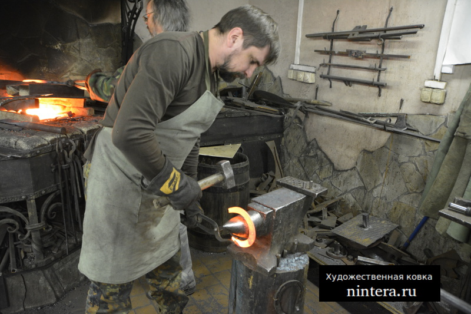

# Мастер-класс и обучение

Мы проводим мастер-классы художественной ковки и обучению кузнечному мастерству. За 3 часа в нашей кузнице вы сможете познакомиться с ремеслом наших прадедов и почувствовать себя брутальным кузнецом, понять металл, удивиться тому, что он бывает мягким и податливым, воплотить свои идеи, сковать свои изделия и забрать их домой!

Большой популярностью наша кузница пользуется у молодых пар, которые хотят вместе сковать подкову себе на счастье. Говорят, что подкова приносит удачу — наверняка так говорят не зря. Выкованая вместе подкова принесет не только удачу, но и укрепит ваши отношения, плюс вы проведете время с пользой и делом. Мы всегда рады вам и ждем вас на мастер-классы кузнечной ковки! Стоимость индивидуального мастер-класса 5000 рублей — это индивидуальный подход, с индивидуальными условиями. Посетив индивидуальный мастер-класс, вы вольны в выборе ковочной тематики, с мастером кузнецом Дегтяревым Глебом Александровичем сможете выбрать наиболее интересное для себя решение вашего будущего кованого изделия и сковать его!

Для любителей и ценителей ножей предлагаем Мастер-класс кованого ножа — индивидуальный мастер-класс по изготовлению ножа (в рамках законов РФ) на деревянной рукояти проходит в два занятия: на первом посещении вы занимаетесь клинком — ковка, проточка спусков, закалка; на втором посещении вы занимаетесь деревянной рукоятью и финишными работами, доводите нож до конца. Стоимость ножевого мастер-класса 10000 рублей. Очень популярен у парней!

Если вы хотите продолжительное обучение кузнечному ремеслу, хотите воплотить еще больше идей в металле, то мы предлагаем вам скидку на посещение нашей кузницы - 4 занятия по 3 часа работы с мастером кузнецом за 15000 рублей — индивидуальное время. Вы сможете воплотить любые свои идеи, «прокачивать» себя в кузнечном мастерстве.

Так же, мы проводим выездные мастер-классы кузнечного дела и ремесла, украсим ваш праздник, развлечем вас и ваших гостей, покажем всем как работают кузнецы! На выездных мастер-классах все желающие смогут поучаствовать и попробовать себя в роли кузнеца, выковать себе сувенир на память! Цена часа от 15000 рублей, более точная стоимость и условия проведения оговариваются отдельно, звоните.

## Обучение ковке

Наш мастер ковки Дегтярев Глеб Александрович проведет практические уроки и поможет вам оценить по достоинству ремесло кузнеца. Вы получите практический навык, а также в удовольствие поработаете своими руками, поверьте, это круче фитнеса!

Звоните и записывайтесь на обучающие уроки кузнечного мастерства.
