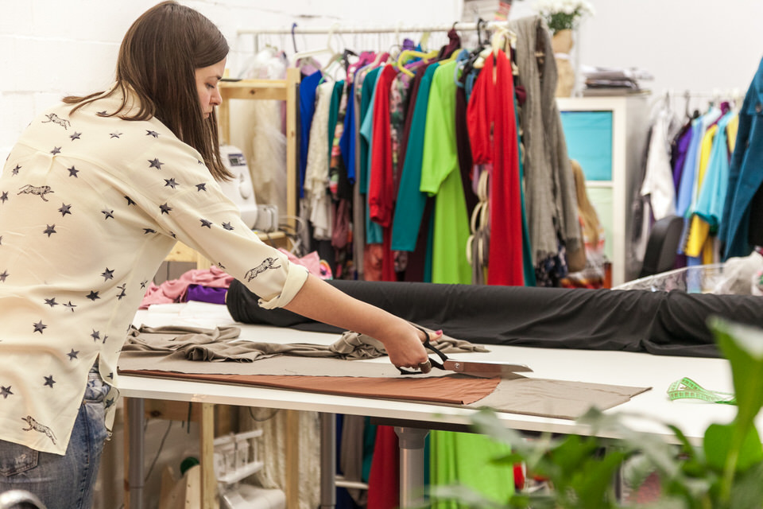

Московский воркплейс «Дом моды» расположился в просторном лофте недалеко от метро «Бауманская». Здесь дизайнеры, конструкторы и портные воплощают в коллекции свои идеи и встречаются с клиентами в уютных примерочных.

Дизайнеры московского воркплейса «Дом моды» создают новые модели, встречаются с клиентами и общаются с коллегами в просторном лофте «Большого Воркплейса». Мы постарались создать здесь уютную и комфортную для работы обстановку.

В «Доме моды» есть два больших раскройных стола и мощных парогенератора. Теперь не важно какой ширины ткань, ведь на таком столе кроить ее — одно удовольствие.

Рабочие зоны закрепляются за резидентами. Никто кроме вас не будет работать за вашим столом и пользоваться вашим оборудованием, если вы решитесь привезти в воркплейс свои машины. Кстати, так делают многие из наших резидентов, — освобождают дома место. Ведь дом должен быть домом!

В «Доме моды» есть статичные и раздвижные манекены разных размеров — найти нужные формы в разы проще, чем дома. Встречи с клиентами проходят в уютных примерочных. Набросать эскиз, снять мерки, пообщаться с глазу на глаз можно именно в примерочных.

В воркплейсе есть своя зона кофе с холодильником, микроволновкой, чайником у уютной атмосферой.

## Как стать резидентом

Воркплейс подойдет тем мастерам, кто решил работать на себя не дома, а в специально оборудованном для этого пространстве. Сюда можно перевезти свои вещи и оборудование, используя при этом, ресурсы всего пространства. Будущий резидент воркплейса заключает договор по паспорту и ежемесячно пополняет свой баланс.

**Абонемент за 11 600 р./месяц /** За эту сумму резидент получает закрепленное за собой рабочее место, возможность использования всей инфраструктуры воркплейса и безлимитный доступ в примерочную. Постоянный абонемент подойдет тем мастерам, кто решил работать на себя не дома, а в специально оборудованном для этого пространстве. Сюда можно перевезти свои вещи и оборудование, используя при этом ресурсы всего лофта. Помимо доступа в Воркплейс предоставляется рабочее место: кресло, стол, лампа, 4 ячейки хранения вещей, а также место для вещей на общем рейле. Пространство рассчитано на одного человека. **Абонемент за 16 900 р./месяц /** Вы можете находиться в воркплейсе с утра до вечера, принимать неограниченное количество клиентов в примерочных, привезти свое оборудование и хранить много материалов и вещей в стеллажах и на рейлах, которыми укомплектовано ваше рабочее место. Помимо доступа в Воркплейс предоставляется рабочее место: кресло, большой стол (можно заменить на малый стол и поставить свою пром.машину), две лампы, стеллаж на 8 ячеек для хранения вещей, реил. Пространство рассчитано на одного человека. **Расширенный абонемент на двоих — 24 900 р./месяц /** С этим абонементом вы получаете большое рабочее пространство, дополнительную вторую рабочую поверхность (или большой стол и ваша пром.машина), два кресла, 4 лампы, рейл, большую систему хранения на 16 ячеек. Абонемент рассчитан на работу двух человек. **Примерочная-шоурум — с 10:00 до 22:00 по 100 р./30 мин.** Пополняя баланс абонемента минимум на 3000 руб. вы получаете возможность использовать примерочную для встреч со своими клиентами. Время округляется до 30 минут в большую сторону с момента бронирования примерочной. Не важно сколько человек находится в примерочной, это — фиксированная сумма. **Хранение вещей на складе воркплейса — 250 р./короб или 5 плечиков в месяц** Изделия можно оставить в воркплейсе на хранение. Так не придется возить по городу тяжелые кофры с одеждой. Сумма за хранение списывается в начале месяца. Должны предупредить, что места на складе может не хватать. **А также для каждого резидента:** Две просторные примерочные, уборка рабочего места и всего пространства, интернет, раскройный стол, гладильная система, любое свободное швейное оборудование (швейные машины, оверлоки, распошивальная машина), ножницы, вспарыватели, сантиметровые ленты, линейки и доступ с 10 утра до 10 вечера каждый день круглый год.
