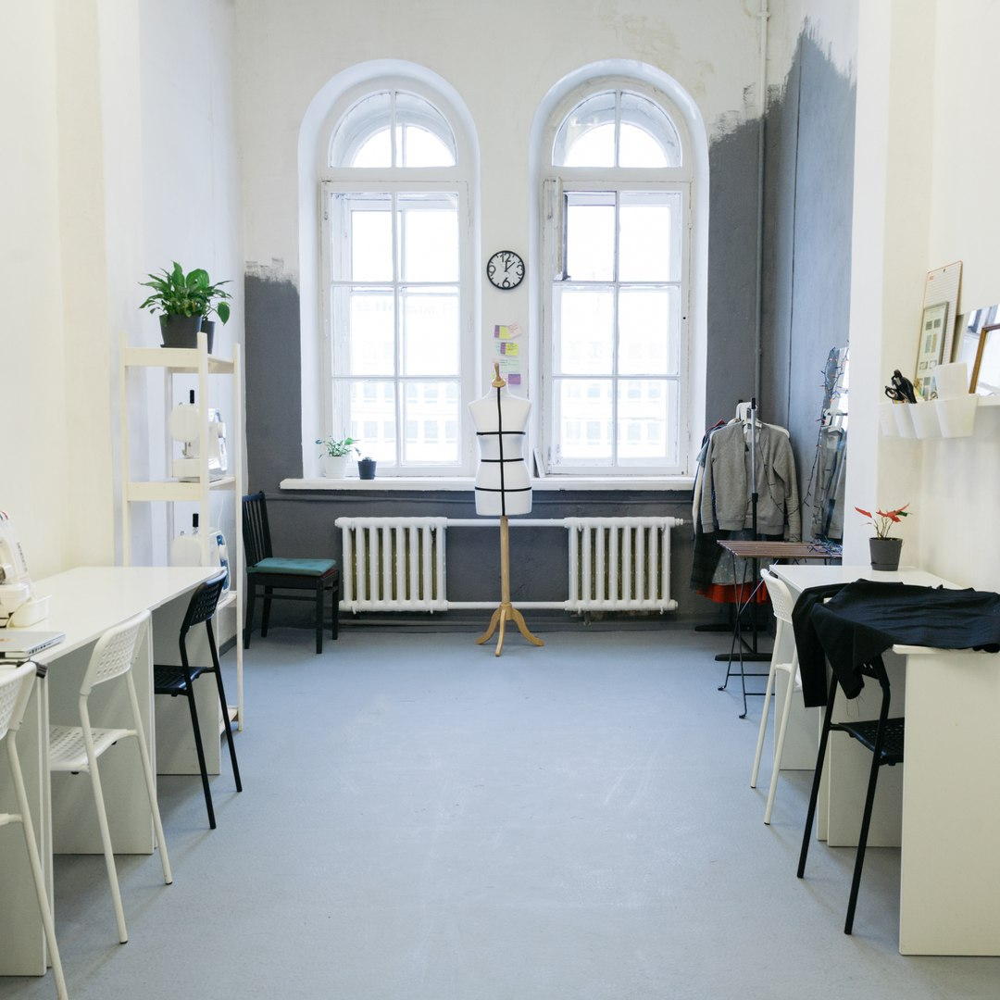

КЛАСС ШИТЬЯ - это 3 оборудованных швейных рабочих места с бытовыми швейными и оверлочными машинами, со всеми необходимыми для работы принадлежностями - от мела до утюга.

КЛАСС ШИТЬЯ - это возможность арендовать швейное место на любое время и воплотить свои задумки и мечты, не задумываясь о мелочах!

КЛАСС ШИТЬЯ - это возможность за 1 день самостоятельно сшить юбку или платье на еженедельных совместных пошивах и получить удивительный опыт и знания!

