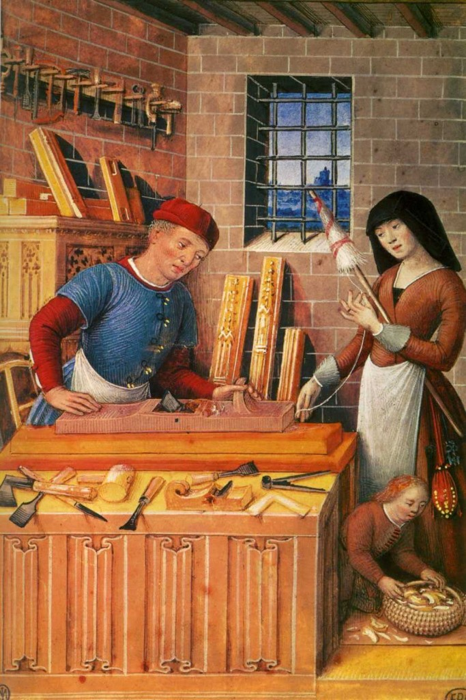
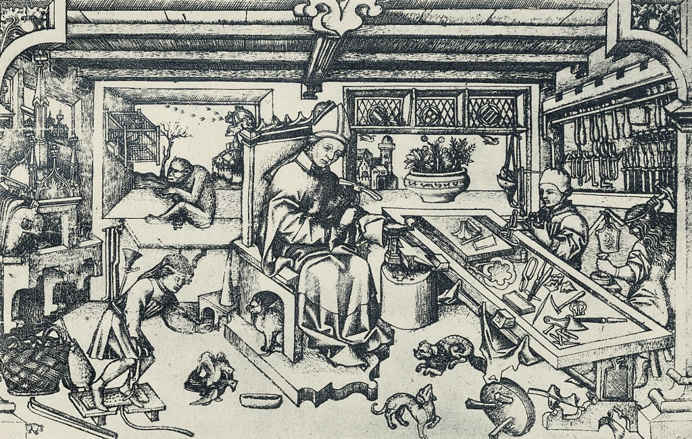
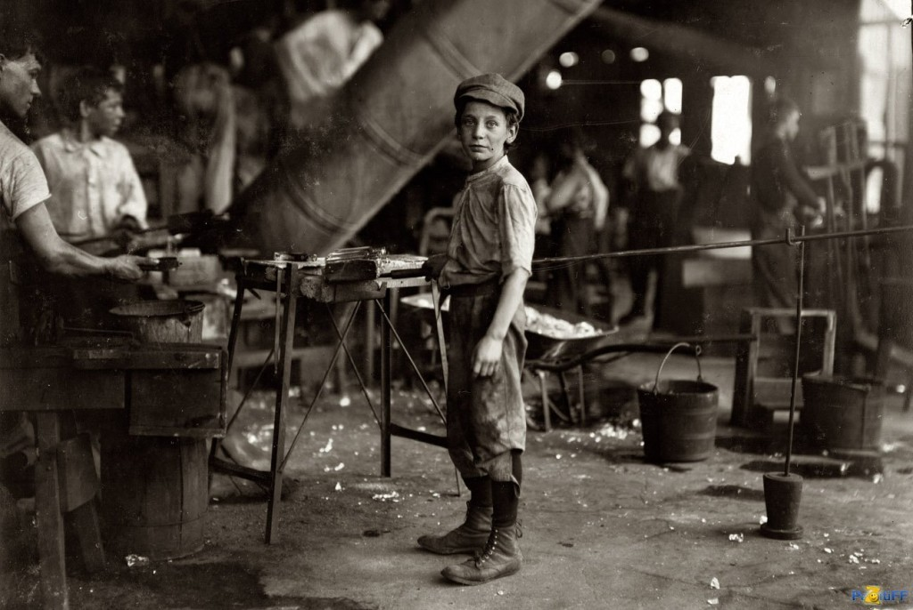
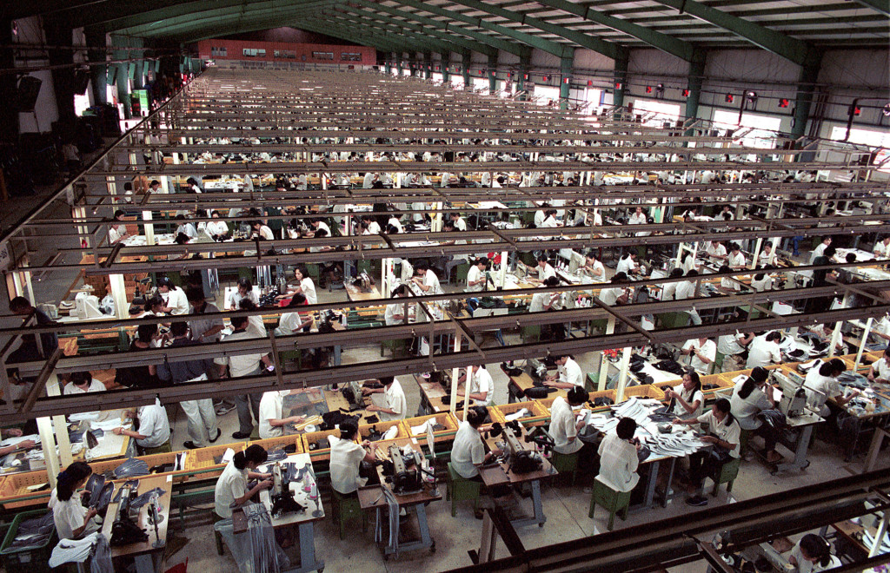
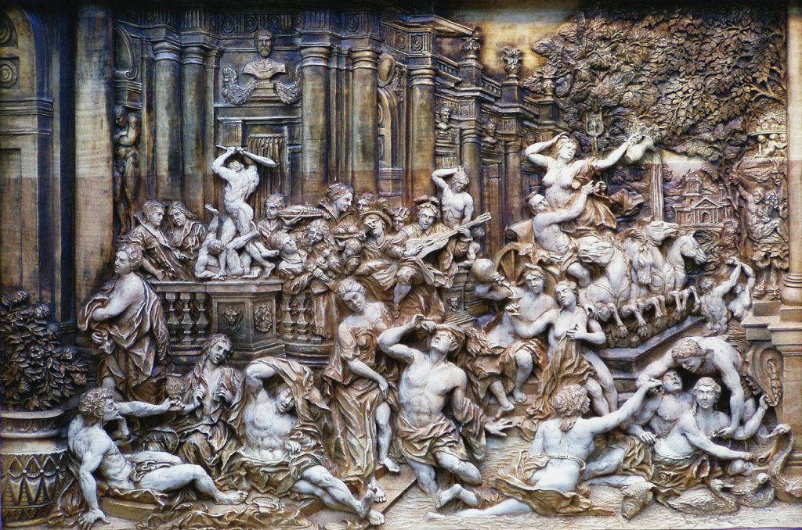
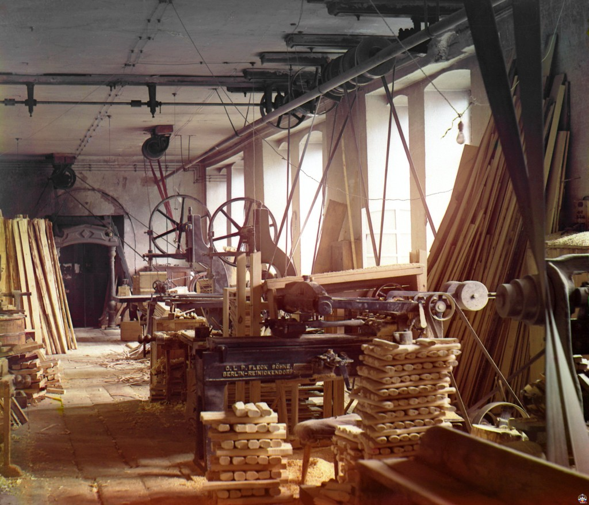

## Зарождение ремесел

Человек разумный и ремесло — ровесники. Именно по признакам сознательного практического освоения окружающей действительности и можем мы определить уровень развития сознания в тот или иной исторический период. Ремесло начиналось с камня, просуществовав в виде различных способов нахождения и раскалывания кусков породы около миллиона лет, пока к ним не присоединилась простейшая деревообработка в виде ломания и обработки палок и привязывания их к камням с помощью лозы. Так появились умельцы, делающие каменные топоры и копья. Из поколения в поколение передавались эти скудные технологические знания, иногда теряясь на века, иногда снова набирая силу. Пройдет еще 300 тысяч лет, пока человечество в лице некоторых продвинутых сообществ не изобретет, например, пошив одежды. До открытия земледелия в это время остается еще более 80 тысяч лет.

Конечно, объем знаний не ограничивается познаниями в той или иной технологии. Древнему человеку для выживания нужно было превосходно знать и понимать дикую среду его обитания. В наше время известны примеры достаточно подробно изученных отдельных затерянных племен, к моменту изучения не знакомых не только с обработкой металла или стеклом, но и с земледелием или даже не изобретших колеса. И каждый раз очевидно, что постепенно накапливающаяся культура группы, однажды придя к некоторому равновесию с относительно стабильной окружающей средой, способна передаваться и сохраняться веками и даже тысячелетиями.

Поначалу все знания передавались по наследству путём демонстрации и копирования. Набора нечленораздельных звуков и мимики хватало чтобы передать все передовые знания своего времени за считанные дни, даже учитывая невысокое интеллектуальное развитие тогдашних людей. Многое, наверняка, передавать не удавалось и многие открытия и идеи тех людей так и остались невыраженными за полным неимением средств для этого. Веками и тысячелетиями по крупицам различные сообщества накапливали примеры и знания, по разному встраивая их в свою картину мира. Постепенно накапливая опыт, обзаводясь средствами для его передачи и сохранения в виде звуков, рисунков и знаков, сообщества обзавелись своими неповторимыми культурными системами.

Культура как правило приобретает форму определенной традиции, задающей форму общественной и частной жизни людей. Именно с помощью традиций передается в веках накопленный опыт. Основным способом передавать практические технологические знания тысячелетиями остаётся непосредственная демонстрация с устными комментариями и работой над ошибками. Пока объем знаний остается сравнительно небольшим, почти каждый член общества может быть носителем всей совокупности традиций, культуры целиком.

Безусловно, специализация деятельности в примитивной форме существовала с самых ранних пор: очевидные различия между полами или возрастными группами привели к первичному разделению производственных ролей. Дальнейшее развитие разделения труда смогло произойти только через многие тысячи лет в результате развития технологии и следовавшего за этим усложнения культуры. Возникновение и разделение скотоводства и земледелия, выделение из земледелия и самостоятельное развитие различных ремёсел, появление новых форм умственного и физического труда наметило основные границы между различными сферами деятельности. Многие века просуществовав в виде домашней промышленности, ремёсла удовлетворяли внутренние потребности сообщества и носили преимущественно семейный характер. Только с появлением и развитием рыночных отношений стала возможной более узкая специализация и обособление отдельных профессий.

## Ремесленники как социальный слой

Несмотря на широкое использование рабского труда, уже в городах Древней Греции, Древнего Рима, стран Древнего Востока слой профессиональных ремесленников был довольно многочисленным. Последовавший за распадом Римской Империи культурный упадок лишь ненадолго отложил дальнейшее развитие и уже в Раннем Средневековье начинают выделяться кузнечное дело, плотничество, ткачество, появляются профессиональные строители и стекольщики. Тогдашние мастера были как правило универсалами и представляли каждый целую отрасль. В это время начинается разделение универсального вотчинного производства, целью которого было обеспечение внутренних нужд хозяйства, и товарного производства, ориентированного на рынок. Все большее распространение получает работа на заказ, а с развитием рыночной торговли активно развивается производство товаров на продажу. Появляются первые бродячие ремесленники, для которых их мастерство и личные инструменты становятся единственным способом прокормиться.

Расцветающие и набирающие силу города впитали огромные массы умельцев, состоявших не только из обезземеленных крестьян, становившихся преимущественно наемными работниками, но и из увлеченных производством состоятельных людей, сформировавших слой успешных мастеров и предпринимателей. Городские ремесленники надолго стали основным населением большинства городов.

Постепенно сложилась новая производственная ячейка — ремесленная мастерская, в которую входил сам мастер, несколько подмастерьев, а также несколько учеников. Мастера одной или схожих профессий объединялись в цеха, бравшие на себя множество различных функций от регламентирования количества и качества оборудования мастерских и их продукции, количества подмастерьев и учеников и определения продолжительности рабочего дня до отстаивания коллективных интересов отрасли и даже формирования городского военного ополчения. В случае роста конкуренции между мастерами, руководство цехов могло попросить часть мастеров переехать в другой город, но чаще всего они сами смело переселялись в новые места, где их мастерство оказывалось более востребованным. Цехи поддерживали и развивали престиж мастеров и их искусства. Всё больше людей уходили в ученики к мастерам, чтобы в течение нескольких лет достичь определенного уровня и получить возможность стать подмастерьем. В первое время чтобы стать полноценным мастером, членом цеха и получить право иметь свою мастерскую, подмастерью нужно было несколько, как правило семь, лет набираться опыта, а затем своими силами и на личные средства сделать «шедевр» — образец мастерства, представляемый перед мастерами цеха. Поначалу охотно принимавшие в свои ряды новых мастеров, цехи постепенно становились все более закрытыми организациями. Усложнялись правила приёма в цех, а разрыв между мастерами и подмастерьями всё увеличивался. Обремененные цеховыми тяготами подмастерья часто были вынуждены покидать города в поисках лучших условий. И также как в среде бродячих мастеров зародились цехи, среди недовольных своим положением подмастерьев рождались и их аналогичные союзы — компаньонажи. Добровольные объединения ремесленников — цехи, гильдии, артели — на протяжение многих веков составляли основу производства, однако стремительное развитие капитализма, сумевшего оседлать волну прогресса, привело к резким изменениям в этой сфере.

## Превращение ремесла в промышленность

Продолжающийся рост городов и накопление гражданами значительных капиталов привело к выделению класса городских буржуа — владельцев крупной собственности, живущих приносимыми её использованием доходами. Концентрируя в своих руках товары, помещения, территории и средства производства, этот класс приобретает все большее экономическое влияние. Не редкостью становится превращение ремесленных цехов и мастерских в капиталистические предприятия, а обладающих капиталами мастеров в предпринимателей, использующих в производстве исключительно наёмный труд.

Все большее распространение получает практика скупки, когда крупные купцы приобретали сразу большие объемы продукции и перепродавали её на местных и внешних рынках. Постепенно отдаляясь от рынка, ремесленник уже начал терять элементы своей независимости, а накопление купеческого капитала способствовало дальнейшему низведению мастеров до статуса простых наёмных работников. Сначала в виде раздачи сырья отдельным мастерам с последующей скупкой результатов, затем в форме рассеянных мануфактур, пользующихся низкой стоимостью работы деревенских ремесленников-кустарей на дому, капитализм привёл ко все нарастающей концентрации средств в руках влиятельного меньшинства, увеличивающейся специализации работников и большему имущественному расслоению населения. На первое место в производстве товаров выходят крупные производственные мануфактуры, эксплуатирующие труд наёмных работников, выполняющих всё более специализированные функции. Проникновение мануфактурного способа производства в различные ремёсла быстро разделяет их на отдельные составляющие действия и специализации, значительно повышая эффективность производства. Каждый работник мануфактуры представляет лишь небольшую часть производственной цепочки и хотя он всё лучше осваивает вверенный ему участок, повышая общую эффективность, он всё больше впадает в зависимость от хозяина предприятия и своей узкой специализации.

Оставаясь на протяжение нескольких столетий основной формой крупного производства, мануфактуры создали основу для последующей индустриализации. Изобретение прядильных машин и других станков способствовали стремительной механизации, а развитие капитализма создало предпосылки для укрупнения производства. Первоначально приводимые в движение водяными мельницами, машины существенно упрощали массовое производство, превращая работающие преимущественно на заказ мануфактуры в промышленные предприятия нового типа — фабрики. Фабричное производство способствовало еще большему имущественному и интеллектуальному расслоению, низводя труд рабочего до выполнения все более простых и строго регламентированных функций.

Начавшись во второй половине XVIII века промышленная революция всего за один век радикально изменила практически все сферы жизни человека. Изобретение паровой машины позволило переместить разбросанные по берегам рек фабрики в города и еще больше сконцентрировать и механизировать производство. Освоение новых способов получения и обработки металла не только расширило сферу его применения, но и способствовало значительному укрупнению металлургической и горнодобывающей промышленности. Этот период характеризуется взрывным ростом промышленного производства, происходящего на фоне все большего усугубления положения рабочего. Разорение деревни и мелких производств заставило переселиться в города огромное количество людей, поступавших на работу на фабрики для выполнения, как правило, низкоквалифицированного монотонного труда. И если до изобретения газового освещения рабочий день нормировался по продолжительности светлого времени суток, то с введением повсеместного газового, а затем и электрического освещения, продолжительность рабочего дня стала доходить [до 12-15 часов в сутки](http://www.webcitation.org/6DRu4noQY). Благодаря машинам для производства больше не требовалась значительная физическая сила, в промышленности начал активно использоваться женский и детский труд.

Конечно, рабочие не всегда мирились с такой эксплуатацией и на протяжение всей промышленной революции наблюдается множество случаев сначала спорадических уничтожений разгневанными людьми машин и фабрик, затем коллективных обращений и ультиматумов правительству, а в последствии и ряда полномасштабных восстаний и революций. В результате этой борьбы была резко сокращена продолжительность рабочего времени, практически прекращена практика использования детского труда, развилась система всеобщего образования.

Новые витки промышленной революции, основанные уже не на отдельных удачных изобретениях, а на целенаправленном процессе научного изучения, способствовали еще большему росту эффективности производства. К началу XX века наступил расцвет индустриальной эпохи. Механизация сменяется автоматизацией, производство приобретает потоковый характер. Несмотря на все еще преобладающий низкооплачиваемый труд низкоквалифицированных работников, все более востребованным становится профессия инженера и технолога. Наряду с профилированием образования происходит и развитие различных схем карьерного роста. Постепенно расширяется средний класс, составленный из наиболее высококвалифицированных рабочих и владельцев малого бизнеса. Индустриализация начинает сталкиваться с различными ограничениями дальнейшего роста, будь то ограниченность рынков сбыта и кризисы перепроизводства или растущая стоимость рабочей силы в наиболее промышленно развитых областях, делающее производство неконкурентоспособным в стремительно глобализующемся мире. Всплески промышленного производства нередко сменяются периодами глубоких социально-экономических кризисов. Все большее значение начинает играть доступ к начинающим истощаться природным ресурсам. XX век продемонстрировал всю мощь массового производства не только миллионами автомобилей и элементов быта, но также танками и артиллерийскими снарядами, оптовыми партиями поставлявшимися на поля ужасающих мировых войн.

## Условия современности

В тени огромной промышленной машины непросто разглядеть продолжающуюся историю ремесла. Можно заметить что практически любые новые виды производственной деятельности человека даже во времена тотальной индустриализации по прежнему первоначально проходят этап персонального ремесла, где единичные мастера осваивают и развивают новые технологические процессы. Только потом эти наработки разбиваются на отдельные элементы и шаги в форме напоминающей мануфактурное производство и лишь затем получают возможность превратиться в очередную отрасль промышленности. Так происходило не только с древними ремёслами ткачей и кузнецов, точно такой же процесс наблюдается повсеместно. Единичные мастера производили первые фотоаппараты и радиоприборы, поднимали в воздух первые самолеты и снимали первые кинофильмы. Даже первоначальное развитие компьютеров, сыгравших важнейшую роль в информационной революции конца XX века, происходило в рамках небольших групп взаимодействующих умельцев, кооперация которых во многом походила сначала на кооперацию мастеров в средневековых цехах, а затем на первые мануфактуры с относительно небольшой специализацией и разделением труда. Лишь в XXI веке такие сферы деятельности как программирование и компьютерная графика, прежде являвшиеся уделом немногих мастеров, приобретают характер массового производства.

Нетрудно заметить, что с древнейших времен развитие ремесла и технологии, даже несмотря на катаклизмы и кризисы, продолжается нарастающими темпами и если уже в XX веке скорость революционных изменений в образе жизни горожанина сравнялась со скоростью смены человеческих поколений, то в настоящее время процесс изменений и преобразований напоминает стремительный поток. Такая скорость трансформации всех условий жизни человека буквально сносит традиционные основы многих культур. Большинство культур, претендуя на универсальность, на поверку зачастую оказываются привязанными к определенному климату, к конкретной местности и её флоре и фауне, к имеющемуся уровню развития технологии и образованности населения, к исторически сложившимся стереотипам и догматическим утверждениям, принятым на веру без постоянной перепроверки. В таком бурном потоке уже трудно разглядеть очертания старых культур, но начинает активно складываться общее всемирное культурное поле, составленное из наиболее крепких осколков прошлых и вновь появляющихся традиций и общепринятых норм. Все более яркое и насыщенное событиями настоящее заставляет людей все чаще забывать о прошлом и выстраивать взаимоотношения с миром заново, сознательно или несознательно адаптируясь к новым условиям существования.

Безусловно, развитие технологии — процесс далеко не равномерный. Можно представить его как волны новых знаний и последствий их применения от точек возникновения изобретения до границ, максимально доступных для используемой формы производства. Автоматизированное поточное производство позволяет в кратчайшие сроки доставлять плоды технического прогресса огромному количеству людей, но и у этого способа есть очевидные границы, очерченные конечностью доступных природных ресурсов, емкостью рынка и платежеспособностью населения. Несмотря на уже более чем двухсотлетнюю историю освоения электричества, [более 1 млрд. человек по прежнему не имеет к нему доступа](http://global-off-grid-lighting-association.org/wp-content/uploads/2013/09/539ae24e-74f8-4ef2-a359-1c690a000075.pdf), а в век, казалось бы повсеместных, информационных технологий доступ к сети Интернет имеет менее половины населения планеты. Во многом основная технологическая и, связанная с ней, культурная инерции сохраняются в деревнях и небольших городах, в то время как мегаполисы мира все больше становятся похожими друг на друга, сливаясь в единое поле мировой массовой культуры, сложившейся к концу XX века в форме постиндустриальной экономики.

Экстенсивный рост производства всегда обнаруживает его возможные границы и такое обнаружение часто оказывается крайне болезненным. Например, исчерпание доступной для использования в качестве топлива для бронзового литья древесины в конце Бронзового века стало одной из причин катастрофы цивилизационного масштаба. Превратив в полупустыню некогда густые леса, покрывавшие всё Средиземноморье, первая попытка построения глобальной цивилизации не выдержала испытания потеплением и последовавшей сильнейшей засухой и голодом и была в кратчайшие сроки уничтожена практически до основания воинственными «народами моря». Более чем на 400 лет регион практически полностью лишился культуры: разрушились экономические связи, прекратили существование многие города и даже страны, полностью исчезла даже довольно развитая письменность. История знает немало подобных кризисов, пусть и не столь разрушительных. И каждый раз разрешение накопившихся противоречий требует от общества и культуры относительно быстрой реакции и концентрации больших усилий для интенсивной адаптации.

Внедрение принципов массового производства во все большем количестве отраслей и связанный этим стремительный рост объемов выпускаемой продукции первое время компенсировался экстенсивным ростом зоны рыночной торговли и транспортной доступности её удаленных уголков. Такое расширение уже во второй половине XX века достигло своих предельных ограничений — доступных ресурсов нашей планеты и численности её платежеспособного населения. Только усилия огромного количества специалистов смогли ослабить эти ограничения с помощью различных уловок вроде перехода от удовлетворения имеющихся к формированию новых потребностей или создания дополнительного платежеспособного спроса кредитованием. Формирование общества потребления стало в какой-то мере спасением, хотя в действительности лишь отсрочило необходимость более кардинальных изменений. Ограниченность ресурсов и связанная с этим ограниченность в количестве выпускаемого товара к концу XX века оказалась частично скомпенсирована превращением большой части экономики в информационную, связанную с производством интеллектуального продукта. В этом процессе в ускоренном виде также наблюдаются все стадии развития ремесла от мастерства отдельных инженеров и программистов до формирования потокового производства программ, кинофильмов, книг и других элементов культуры. Принеся колоссальные перемены в уровне жизни людей по всей планете, XX век оставил в наследство раскрученный маховик крупной государственно-капиталистической экономики, поглотившей практически все сферы жизни человека. Даже само изобретение новых продуктов и видов деятельности становится в некоторой степени массовым производством в форме всевозможных стартапов и краудфандинговых компаний, короткий период развития энтузиастами-основателями которых в случае успеха как правило заканчивается поглощением одной из крупных корпораций, либо превращением в новую корпорацию. Большинство же начинаний так и не достигает «успеха», не вписываясь в современную капиталистическую модель, что принято трактовать как полную несостоятельность.

На рубеже XX и XXI веков скорость изменений в образе жизни человека значительно превысила скорость смены поколений и если XX век не переставал удивлять радикально новыми научно-техническими открытиями, случавшимися почти каждое десятилетие и постепенно становившимися частью обыденной жизни, то сегодня этот разрыв между изобретением и его широким внедрением оказывается все короче и исчисляется годами и даже месяцами. Такое ускорение перемен оказалось беспрецедентным и человек еще только начал формировать адаптационные механизмы для существования в такой изменчивой среде. Стабильность условий жизни, привычность устоявшихся форм общественных взаимоотношений и сохраняющаяся во времени ценность однажды полученного знания грозят исчезнуть под натиском постоянно возникающих новых промышленных и социальных технологий. Каждый отдельный человек и общество в целом стоят перед необходимостью ускорения и интенсификации обучения, быстрого практического овладения новшествами. Такая изменчивость бросает вызов человеческой природе и получает естественный ответ, прорывающийся через века специализации и разделения труда. Идеал высокоспециализированного профессионала с высшим профильным образованием начинает терять привлекательность, на фоне все большего отставания образовательных стандартов от производственных реалий, а также стремительного изменения экономических условий профессиональной деятельности.

В настоящем мире человеку, если он хочет оставаться уверенным в своих силах и соответствии их постоянно меняющимся требованиям окружающего мира, необходимо сохранять остроту и открытость ума, готовность принимать и изучать всё новое и неизвестное. Теперь чтобы не потеряться в потоке нужно постоянно поддерживать и развивать свои познания и кругозор, совершенствовать и видоизменять свои навыки и умения. Глобальные информационные сети и культура обмена информацией в ней активно поддерживают этот процесс и в некоторой степени компенсируют отставание традиционных образовательных систем. В интернете накоплены огромные базы знаний как теоретических, так и практических и эти знания жаждут найти применение. Достаточно лишь желания и некоторого количества времени для того, чтобы самостоятельно освоить практически любой навык или умение, изучить какую-либо сферу знаний, только при помощи Сети. Постепенно развиваются не только способы подачи информации, но и способы взаимного обучения. Проведение онлайн-обучения удаленных групп учеников превращается в новый вид профессиональной деятельности.

## Ремёсла в современности

В условиях массового производства практически всего, что только можно произвести, ремесло, казалось бы, должно было окончательно исчезнуть, однако оно не только смогло сохраниться в отдельных областях, но и обретает все более широкие перспективы развития. Уже в XIX веке одухотворенность и индивидуальность ремесленных изделий активно противопоставлялась бездушным фабричным товарам массового производства и потребления. На протяжении всей Промышленной революции ремёсла сохранялись в отдаленных от промышленных центров уголках, в форме хобби, декоративно-прикладного и изобразительного искусства, народных художественных промыслов и штучного производства на заказ предметов роскоши. Новые изобретения и открытия даже проходя процесс индустриализации и превращаясь в массовый продукт всегда оставляют и некоторую долю мелких производителей, работающих независимо и самостоятельно. На фоне промышленного производства одежды продолжает существовать и развиваться дизайн и индивидуальный пошив одежды, на фоне киноиндустрии продолжает существовать независимое авторское кино, а несмотря на засилье интернет-корпораций открытые сообщества независимых программистов продолжают создавать шедевры компьютерного кода.

Ремёсла — не застывшие во времени остатки прошлых культур, а постоянно развивающиеся живые организмы, даже несмотря на порой неблагоприятные окружающие условия. Яростное противостояние ремесленника и машины на заре фабричного производства сменилось вдумчивым изучением и творческим применением самых передовых технологий и машин. Все новые технологические открытия и наработки промышленности активно усваиваются мастерами и ремесленный труд со временем становится все более современным и технически оснащенным. Современный плотник содержит в своей мастерской десятки станков и машин, облегчающих работу и ускоряющих производственный процесс, не лишая результаты такой работы индивидуальности и творческого посыла мастера. Прогресс наполнил и обогатил ремёсла, расширив возможности мастера, освободив его от монотонных и малоэффективных операций, расширяя простор для подлинного творчества. Массовое производство затронуло не только потребительские товары, но и всевозможные инструменты и станки, снизив их цену и сделав доступными многим. Уже начиная с середины XX века набирает силу DIY-движение (Do It Yourself, «Сделай сам»), которое несет идеи независимого самостоятельного производства, ремонта и модификации всевозможных вещей. Причем мотивация этого движения далеко не ограничивается восполнением недоступности тех или иных товаров на рынке, а связана с потребностью в самореализации и в расширении кругозора людей, а также в персонализации и одушевлении различных сторон жизни в мире обезличенной массовой культуры.

Культура потребления создала образ успешного человека, имеющего в собственности множество дорогих вещей, пользующегося дорогостоящими услугами и получающего от этого удовлетворение и наслаждение. Для многих этот идеал и по сей день остается главным ориентиром для направления приложения своих жизненных сил. Однако уже довольно многочисленны те, кто осознал всю ограниченность такого идеала и недостижимость через простое потребление высших состояний, доступных человеку. Никакие покупки не могут заменить человеку радости решения трудной задачи, уверенности в собственной самостоятельности и счастья творческой самореализации. Промышленность же может дать для этого инструменты, материалы, обеспечить энергией и необходимой информацией. Сегодня человеку нужно лишь отстраниться от заполнения жизни товарами массового производства и обнаружить всю широту своих возможностей окружить себя чем-то более теплым и настоящим. Те, кто уже осознал и ощутил счастье быть творцом в наш потребительский век, очень часто готовы делиться не только своей радостью и внутренней свободой, но и знаниями, умениями и навыками с другими, еще не познавшими этих возвышенных состояний. Также как на заре промышленной революции передовые знания эпохи передавались в виде стажировок у различных мастеров и собраний философских обществ и кружков, многие современные мастера проводят мастер-классы и публикуют инструкции по техникам своей работы в интернете. В обществе узких специалистов и стандартизованного труда потребность в расширении знаний и умений становится насущной для многих людей, в особенности горожан, занятых в сфере интеллектуального труда и фактически отрезанных от многих возможностей производительной деятельности. Отделенные от творческой самореализации стеной предубеждений индустриальной эпохи и неуверенности, порожденной отсутствием практики, современные горожане зачастую даже не осознают до конца всю важность творчества и самостоятельности, но раз вкусив это сладкое ощущение самореализации [уже не готовы от него отказаться](http://gorod-plus.tv/blog/257.html).

Являвшиеся уделом отдельных художников и дизайнеров творческие пространства и мастерские открываются для все большего количества людей. Крупные компании предоставляют доступ к мастерской в качестве социального пакета работникам. Творческие и производственные пространства создаются как центры изобретательства и проектирования продуктов массовой промышленности. Набирает популярность абонементная модель использования оборудованных мастерских, предоставляющих доступ к профессиональным инструментам и различными материалам практически каждому желающему. Да и сами инструменты любительского класса широко доступны и позволяют освоить почти любую сферу производства самостоятельно или небольшой группой. Даже сегодня не редки случаи совместной организации ремесленных мастерских и устройство их по принципам артели.

## Заключение

Ремёсла с самого момента своего возникновения стали вершиной технологической мысли и оставались основой производства многие тысячелетия. Несмотря на прохождение различных исторических этапов и происходившие в их ходе трансформации, ремесленный способ труда, опирающийся на личное мастерство работника или их небольших согласованных групп, всегда находит себе место в постоянно меняющемся мире. Вытесненное из производства товаров повседневности массовой промышленностью, ремесленный подход сместился выше в производственной цепочке и стал основой для проектирования и проведения исследований новых технологий и видов продукции. И если производство товаров народного потребления стало прерогативой крупных фабрик и заводов, то создание самих фабрик и заводов долгое время оставалось особым ремеслом — уделом немногих мастеров архитектурного и инженерного проектирования. Потоковое производство умеет быстро и качественно копировать уже готовые изделия, но их разработка и тестирование и сегодня часто представляет собой скорее мастерство ремесленников, чем налаженный потоковый изобретательский процесс. В сфере информационных технологий возникли и продолжают существовать множество всевозможных сфер деятельности, таких как программирование или веб-дизайн, блоггинг или поддержка сообществ в социальных сетях, зачастую сохраняющие ремесленные черты, не охотно превращаясь в формы массового производства.

Высокая частота смены технологических и культурных условий жизни в современном мире становится серьезным испытанием для многих культур и отдельных их представителей. Когда-то периоды серьезных перемен в общественной жизни представлялись отдельными кризисами и не без труда преодолевались с надеждой на установление в будущем более устойчивых к кризисам форм. И каждый раз эти формы точно также переживали новые кризисы в связи с новыми витками исторических изменений. Сегодня можно констатировать наступление перманентного кризиса, вход в состояние постоянных трансформаций как следствие адаптации к постоянным технологическим и социальным изменениям. Инерционная крупная промышленность не способна мгновенно реагировать на такие изменения, массовое производство с большим трудом справляется с ограничениями ресурсов и разрывами глобального рынка. Ремесленный подход может стать основой для сохранения и преумножения знаний и технологий, их практической реализации и поддержания устойчивости общества в непрекращающемся потоке перемен. Немало уже представителей класса новых ремесленников, заново открывших личное мастерство и радости творческой самореализации. Благодаря широкому распространению информационных сетей и облегчению доступа к необходимому оборудованию теперь почти каждый может стать мастером, причем не обязательно только в одной сфере, что становится особенно важно на фоне очевидной неспособности традиционных форм образования успеть за нарастающими темпами социально-экономических трансформаций. Кажущиеся утерянными в глуши потребительского общества и потоке глобализированного массового производства знания, умения и навыки сохраняются среди отдельных мастеров и умельцев, накапливаются в сети Интернет и могут стать основой для назревающей локализации и очеловечивания производственного процесса. Кто знает, может быть развитые формы мастер-классов станут основой для новой системы образования, а самостоятельное создание предметов окажется достойной альтернативой массовому производству и потреблению товаров. **Дадим ремеслу шанс!**
