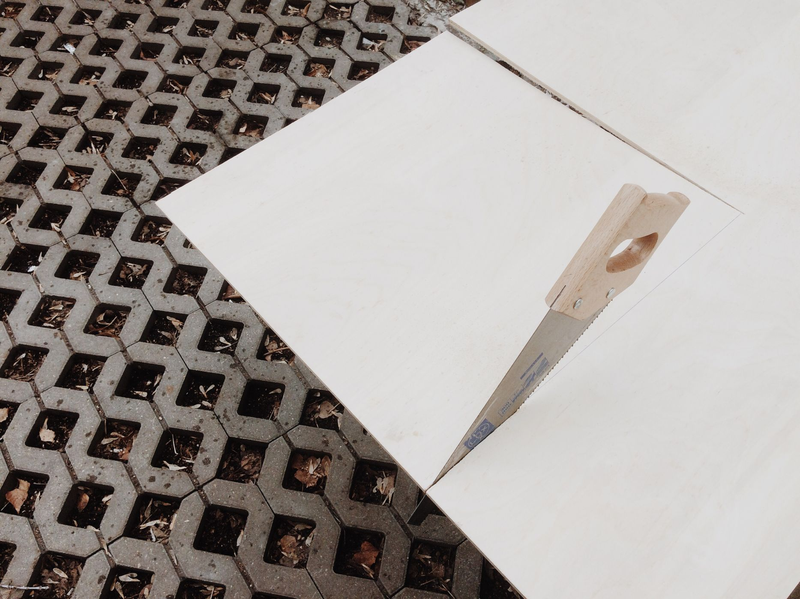
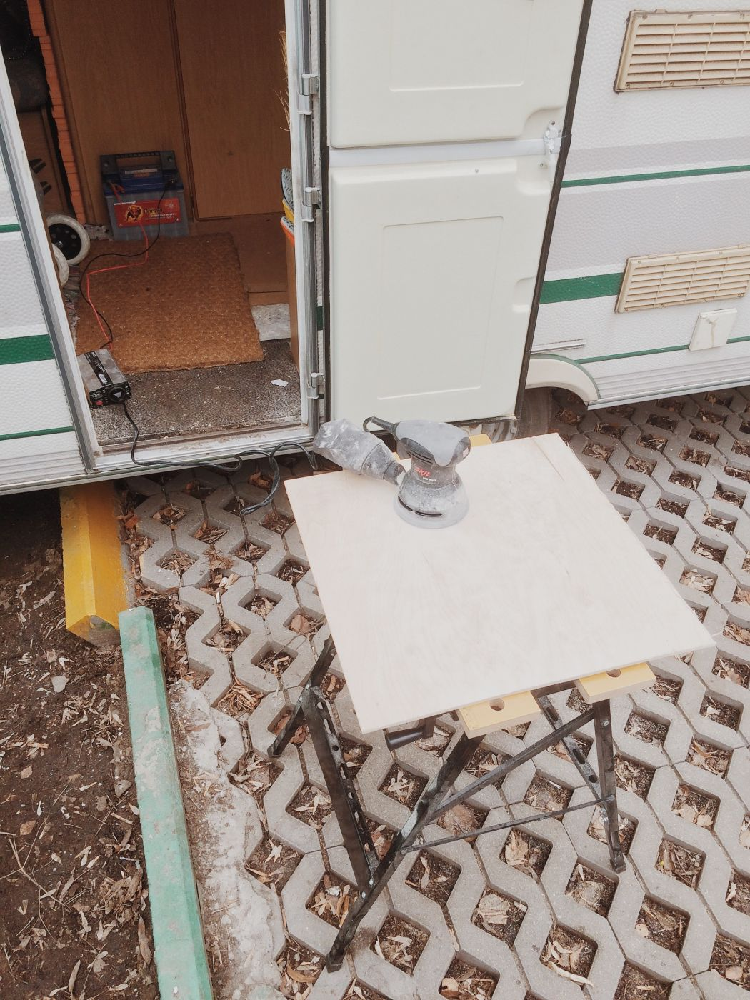

Прицеп-мастерская Ooley42 пережил еще одну зиму и постепенно начинает просыпаться от спячки. Удивительно, но аккумуляторы чувствуют себя прекрасно и нам удалось не только отпилить кусочек фанеры, но и отшлифовать её шлифмашинкой.

\[caption id="" align="aligncenter" width="768"\] Аккумулятор, инвертер, шлифмашинка\[/caption\]
