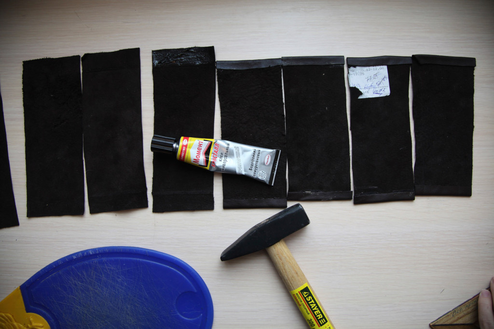

Мы увидели эту кампанию на Кикстартере…

http://www.youtube.com/embed/YadICbFV1eQ

… и не стали ждать её завершения. Поразмышляли, поскладывали бумажки по-всякому и поняли как сшить такой кошелек самим. Это оказалось вовсе нетрудно и мы решили поделиться этим навыком с вами. Попробуйте шить кошельки самостоятельно.

\[su_label type="success" class="class-time  fa fa-clock-o"\] 1—2 часа\[/su_label\]

_Время указано из расчета шитья 1—2 кошельков._

## Инструменты и материалы

Подойдет любая линейка, мягкий карандаш или ручка и ножницы, желательно поострее. Можно использовать и ножи, в том числе круговые.

### Материалы

Из расчета на один кошелек, вам понадобятся:

- кожа или кожзам (6х18 см/шт),
- широкая резинка ~6 см шириной (8 см/шт),
- двухсторонний скотч _(нужен для временной сборки перед шитьем),_
- нитка,
- клей для кожи или любой универсальный.

### Инструменты

Чтобы шитье не было пыткой, стоит подготовиться и иметь:

- карандаш или ручку,
- линейку,
- ножницы или острый нож,
- молоток,
- швейную машинку.

Все это есть в OOLEY42  и вы можете записаться и воспользоваться [возможностью пошить](http://ooley.ru/shit-v-pritsepe/ "Шить в прицепе") в [прицепе-мастерской OOLEY42](http://ooley.ru/places/ooley42/ "Прицеп OOLEY42").

## Размечаем и режем \[su_label type="success" class="step-time"\]10 минут\[/su_label\]

Эффективно используйте материал. Продумайте разметку и учтите ньюансы материала.

Размечаем прямоугольники 6 х 18 см. Никакого запаса или отступов не нужно, так что смело размечайте встык, например, если хотите сделать несколько кошельков.

## Проклеиваем края \[su_label type="warning" class="step-time"\]20 минут\[/su_label\]

Чтобы сделать аккуратным внешний край кармашка, его подвернем и проклеим.

Как вы уже могли догадаться, мы вырезали будущие кармашки, которые получатся сгибанием этих кусочков пополам. По длинным сторонам прямоугольники будут зашиты и остается две свободных стороны, будущее отверстие кармана.

Чтобы его немного облагородить, мы наносим клей с каждой из этих сторон шириной примерно 1,5 см. Далее, в соответствии с инструкцией к конкретному клею, выдерживаем некоторое время. Затем сгибаем пополам проклеенные участки, получая ровный загиб ~7 мм шириной.

Чтобы край был ровным и менее рыхлым, аккуратно пробиваем его молотком. Складываем кусок пополам и пробиваем молотком место сгиба будущего кармашка.  Советуем делать это на черновой поверхности вроде какой-нибудь доски. Молоток на удивление легко оставляет вмятины на многих покрытиях.

## Собираем \[su_label type="warning" class="step-time"\]25 минут\[/su_label\]

\[caption id="attachment_697" align="aligncenter" width="1024"\] Резинки могут быть самыми разными, какие найдете. Желательна ширина от 4 до 6 см, но есть простор для экспериментов.\[/caption\]

Нарезаем резинку на нужное количество отрезков чуть шире, чем ширина кармашков.  Казалось бы, можно уже садиться за машинку и сшивать кошельки, но сшить два слоя кожи с резинкой — не такая уж тривиальная задачка! Можно, конечно, наметать нашу конструкцию нитками, но тогда потом скорее всего в коже останутся дырочки от намёточного шва. Мы придумали другое решение, использовать секретный ингредиент!

\[caption id="attachment_678" align="aligncenter" width="1024"\] Секретный ингредиент — двухсторонний скотч\[/caption\]

Чтобы точно разместить и временно закрепить все элементы конструкции, мы используем полоски двухстороннего скотча шириной ~1 см и длиной ~6см.

Наклеиваем и открываем две полоски вдоль длинной стороны на будущей **внешней** стороне кармашка. Поперек этих линий кладем резинку, следя за перпендикулярностью и расстоянием от края и сгиба кармана. Затем клеим скотч на резинку в тех же местах и накрываем получившуюся конструкцию свободной стороной кармана.

\[su_slider source="media: 679,680,681,682,683" link="no" width="720" height="360" title="no" mousewheel="no" autoplay="5500"\]\[/su_slider\]

\[caption id="attachment_685" align="alignnone" width="300"\] Получается вот такой бутерброд\[/caption\]

## Прошиваем \[su_label type="warning" class="step-time"\]15 минут\[/su_label\]

Мы предусмотрели отступы по краям кармана

Теперь намечаем линии швов с отступом 3—4 мм, и можно садиться за швейную машинку.  Советуем убедиться заранее в том, чтобы машинка справлялась с используемыми материалами, сложенными слоями. Не используйте слишком толстую кожу, а то прийдется шить руками и с использованием специальных техник и инструментов.

Проверьте наличие верхней нитки в иголке и нижней нитки на шпульке, выставьте прямой шов средней длины (~2-3 мм). Начинаем шить от нижнего края кармана, стараясь не тянуть и не толкать наш бутерброд, а помогать машинке самой его проглотить и прошить край до самого верха. При приближении к концу кармана будьте внимательны: постарайтесь остановиться как можно ближе к краю,  а затем сделайте несколько шагов машинкой назад (на них бывает кнопка реверса, ну или крутите колесо в обратную сторону руками.), а затем еще раз вперед, тем самым закрепляя шов.

\[su_slider source="media: 687,689,690,691" link="no" width="720" height="360" title="no" mousewheel="no" autoplay="5500"\]\[/su_slider\]

Отрежьте нитки и  у вас в руках уже готовый кошелек. Осталось только его вывернуть.

## Выворачиваем \[su_label type="success" class="step-time"\]5 минут\[/su_label\]

\[caption id="attachment_692" align="alignnone" width="1024"\] Кошелек наизнанку\[/caption\]

Как вы уже, наверняка, догадались, мы сшивали кошелек с изнанки. Теперь вам нужно постараться вывернуть получившийся кожаный кармашек. Это может оказаться затруднительным если вы переборщили со скотчем или он получился у вас слишком узким, но у вас наверняка это получится.

\[caption id="attachment_693" align="aligncenter" width="1024"\] Осталось отклеить скотч\[/caption\]

Удалите остатки скотча и кошелек готов! Для улучшения формы стоит интенсивно пробить молотком верхний край кармашка и его сгиб.

### Готово!

У нас ушло около трех часов, чтобы сшить не один, а целых [десять кошельков с разными резинками](http://ooley.ru/koshelki/ "Ультракомпактные кожаные кошельки").

Если этот класс оказался для вас чем-то полезен — не молчите, пишите комментарии! Также пишите здесь если вам интересно было бы посетить мастер-класс по шитью кошельков, мы организуем!
