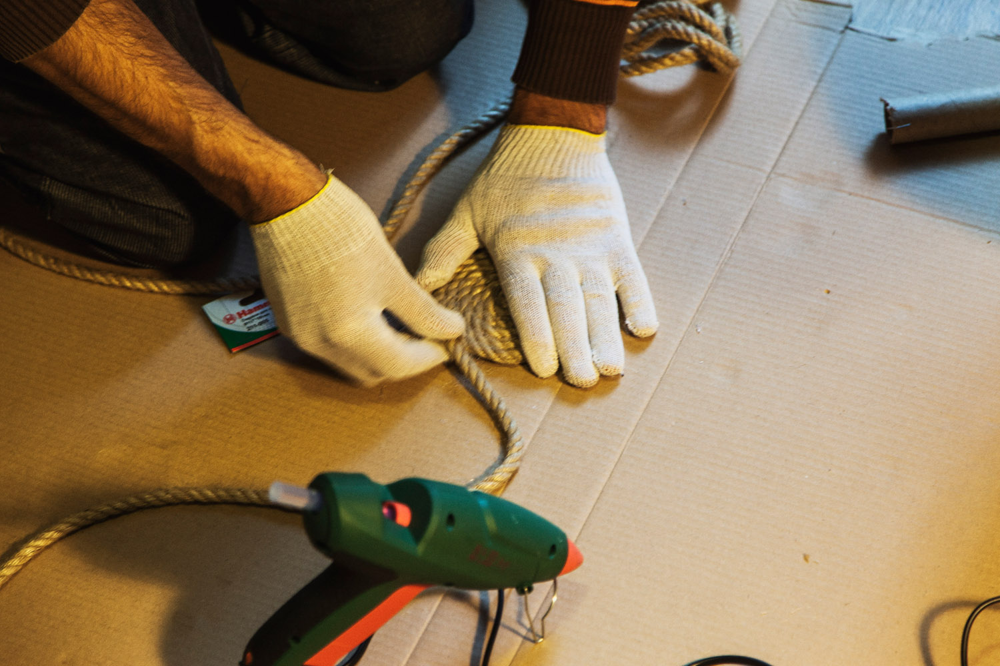
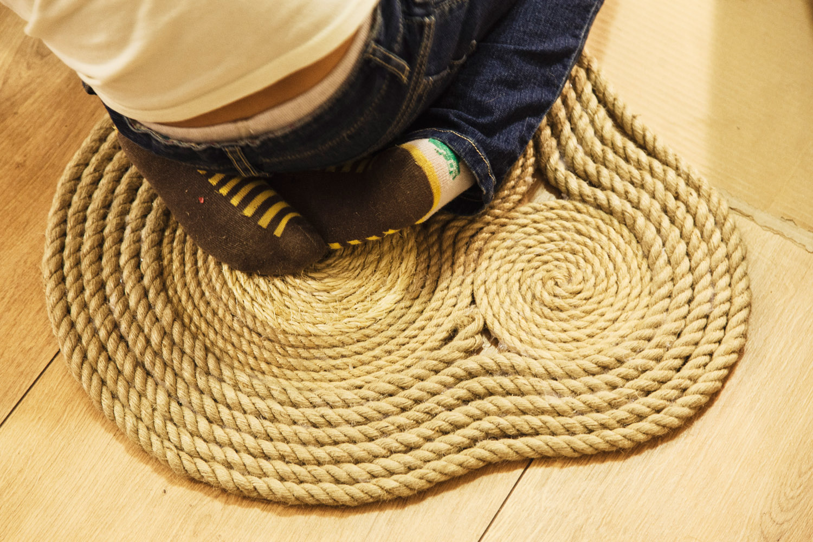

Сделать коврик или какую-нибудь подставку под вазу или горшок или что-то подобное — это простая и легкая задача, научиться вить веревку и склеивать её витки.

#### Инструменты:

- Клеевой пистолет любой марки.

#### Материалы:

- Веревка достаточной длины. Можно разных видов.
- Запас клея
- Перчатки

\[su_label type="success" class="class-time fa fa-clock-o"\] 1—1.5 часа\[/su_label\]

\[caption id="attachment_330" align="aligncenter" width="1500"\] Веревка, клеевые пистолеты и клей для них.\[/caption\]

Чтобы не испачкать рабочую поверхность клеем, накрываем её бумагой или картоном. Обязательно надеваем перчатки чтобы не обжечься и не склеить пальцы горячим клеем.

\[caption id="attachment_331" align="aligncenter" width="1500"\] Чтобы коврик был ровным, клеим его, прижимая каждый виток к плоскости\[/caption\]

Наносим на веревку ровную линию клея длиной в несколько сантиметров и формируем центр спирали. Постепенно продолжаем равномерно наносить клей на поверхность соприкосновения веревок и склеивать их, прижимая к рабочей плоскости.

\[caption id="attachment_332" align="aligncenter" width="1500"\] Стараемся не оставлять непроклеенных участков, но и не переборщить\[/caption\]

Пробуйте менять направления склейки, комбинировать виды веревок, экспериментируйте!

\[caption id="attachment_334" align="aligncenter" width="1500"\] Коврик будет готов через час!\[/caption\]
