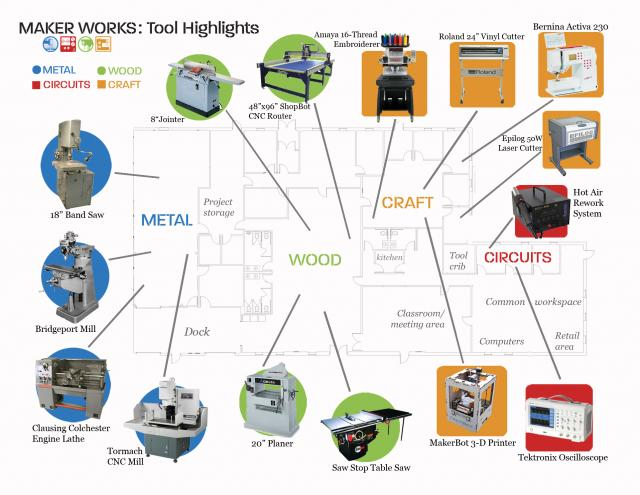

Изучая зарубежный опыт работы открытых мастерских, мы находим множество разнообразных полезных советов и документов, которые как кусочки пазла дополняют друг друга и помогают сложить максимально подробную и понятную картину. Уже скоро мы опубликуем нашу русскоязычную версию руководства, а пока предлагаем изучить найденные на [сайте американской мастерской Maker Works](http://maker-works.com/) справочники, которые выдаются всем участникам мастерской и содержат в себе все ключевые знания о работе в мастерской. Сама мастерская состоит из 4 отдельных зон, предназначенных для работы с металлом, деревом, электроникой и ремёсел вроде печати и вышивания.

### Справочник участника

\[pdf-embedder url="http://ooley.ru/wp-content/uploads/sites/13/2016/04/memberHandbookV8.pdf"\]

### Справочник резидента

\[pdf-embedder url="http://ooley.ru/wp-content/uploads/sites/13/2016/04/AllHoursHandbook.pdf"\]

### Справочник арендатора

\[pdf-embedder url="http://ooley.ru/wp-content/uploads/sites/13/2016/04/LicenseeHandbook.pdf"\]
