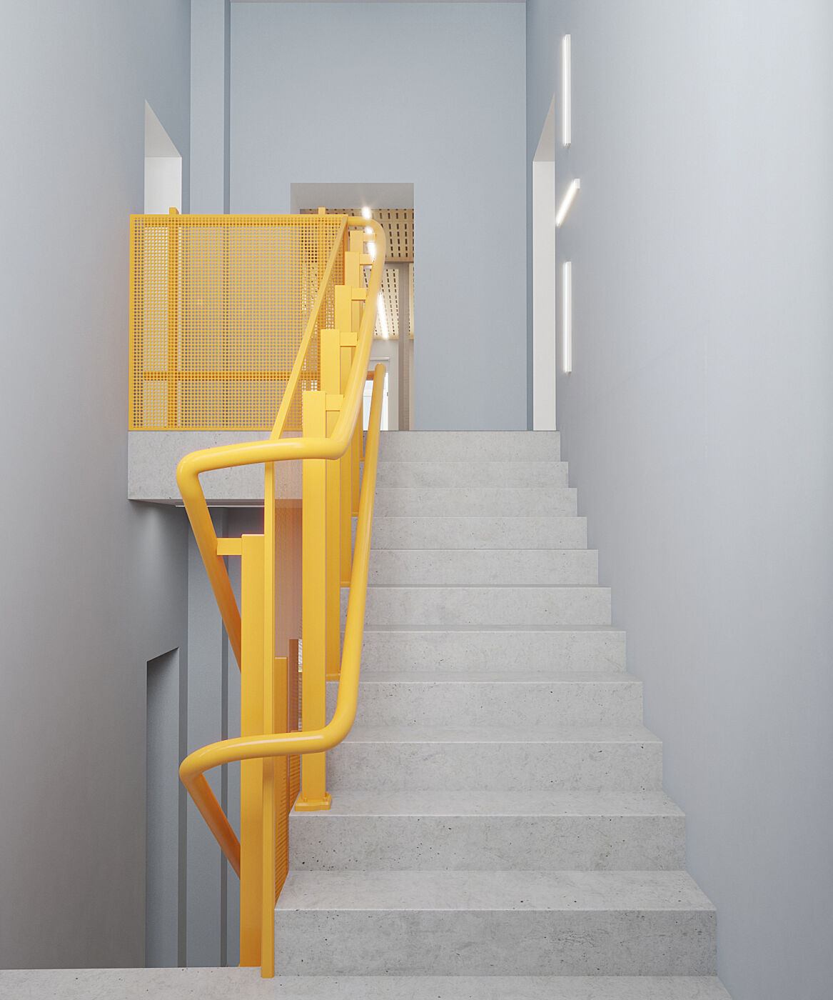

## 

Наш опыт многолетнего изучения открытых мастерских воплотился в новой форме. Представляем вашему вниманию яркую коллаборацию с [Дианой Орловой](https://www.instagram.com/dianaorl/), в рамках её дипломной работы для курса «Дизайн интерьера» Британской Высшей Школы Дизайна. При поддержке преподавателя [Саши Эрмана](https://www.facebook.com/profile.php?id=100000782906048) и куратора курса [Елены Бабкиной](https://britishdesign.ru/about/tutors/2556/?__cf_chl_captcha_tk__=674b73b8f87806dab65ff6360641d270300c813d-1599376843-0-AZMAhlV4pfGMXaNkqiFt0Z5gWlT3ll3wtnftclznxNef-2DZV5Y7VF4ClCNyuCk0XQAyibCsnBweSpKm-weWbGntcMJIfz25RE-UuZvU6VQS1tiAz-zZLG_knmzW1A491MvoQXi1e5QH2MYUPaw6UUvaQi6Yf3ko9RegtEpAAEeaTrTEOInXeMwMkSndTkMYDOcZjouacH6ZXRdTn_Tvnzw0X8_hLy1GpEB0oTVQymtozrwc7GmMZBafBeqtt_Naf3_LBg7yifoz7no8oOjrfsRAueR1OCJe1maRLw2cYPwK54myLeFRCY_CN46fY0UWgMRyImnIhfGtU_FjgRIf-Mc-LVascHUW9R9NAdYglTXOeFgxK843Nem7Ksc8JwY9GeOISMi5xf9HgjnDxIm8CFOV8LuwzY27Fgm42kxBUkLODxDSNeOlx-Ah2lusR2nsaRIYKpEBRnQL-yxK1_c6opKQ04y_6Dn1mEBunlaP0viuUXd7FtZ5FXmTPB_Y9ZB3Tg) был разработан и защищен блестящий проект дизайнерского переосмысления культурного наследия объединения ВХУТЕМАС в год его столетия.  [Мы провели и опубликовали большое исследование](https://ooley.ru/vhutemas-100/), в котором глубоко погрузились в историю возникновения дизайна в России, чтобы затем представить, как возникшие век назад революционные идеи могли бы проявиться в наше время.

## Повсеместный дизайн

Любые технологии на первом этапе осваиваются лишь небольшой группой наиболее заинтересованных людей. Затем их опыт и знания естественным образом распространяются и переосмысляются более широкими кругами. Теперь уже нет древних тайн, хранимых гильдиями прошлого, сегодня знания все более доступны каждому в сети. А проникновение информационных сетей в различные слои общества с каждым днем становится все более интенсивным. В разгар индустриализации небольшая группа архитекторов во главе с одним руководителем могла проектировать целые районы и города. Удачные дизайн-решения тиражировались во все возрастающих масштабах. Но и за этой эпохой упоения массовым промышленным производством приходят новые этапы развития цивилизации.

Теперь разрыв между малообразованным потребителем и продвинутым дизайнером-архитектором стремительно сокращается. Знания все более доступны, профессиональные инструменты — тоже. И новая волна распространения нового сетевого дизайна уже проявилась в тысячах лабораторий цифрового производства по всему миру, наполненных 3Д-принтерами и ЧПУ-станками. Взаимодействуя друг с другом, люди в разных уголках планеты используют дизайн для решения актуальных задач в конкретных локальных условиях.

Создать свою серию одежды, мебели, электроники  — все более доступные для человека возможности. Совместная разработка и реализация значимых проектов могут принести немало радости, интересного опыта и ценных результатов. Нам важно лишь научиться запускать и включаться в такие процессы. Такие способности, доступные небольшой группе, могут стать её неоспоримым конкурентным преимуществом. Но когда умение ясно формулировать и красиво представлять свои идеи усовершенствования мира распространится шире, мы можем стать свидетелями нового этапа творческого переосмысления человеком всей окружающей его среды.

В подростковом возрасте человек проходит через этап активного критического осмысления мира, когда он, отвергая чужие объяснения, стремится к формированию собственной целостной картины мира. Если снабдить его в этот момент инструментами рационального анализа и пониманием фундаментальных свойств физического и психического мира — эта энергия протеста может претвориться в форме новых решений старых проблем человечества. Школа дизайна, где ребенок может выразить и проверить свои идеи относительно проектирования и производства — среда воспитания внимательного и деятельного творца, способного находить и воплощать решения самых разных проблем современности.

## 

## Опытные мастерские

Но одной теории здесь недостаточно. Для развития дизайнера очень важен непосредственный контакт с предметностью мира. Например, чтобы спроектировать мебель важно не только знать измеряемые параметры материалов, но и по-настоящему чувствовать их. Не только моделировать и рендерить проекты, но пилить и склеивать дерево, шить и натягивать ткань, гнуть и паять пластик. Своими руками поработать с деталями и крепежом, самостоятельно пройти все этапы создания предмета. Получать собственный опыт практического воплощения идеи от ментального образа до финального изделия. Так формируется умение детально представлять процесс и результаты работы, четко передавать знания и опыт в форме понятных технологических инструкций.

Научиться этому ценно в любом возрасте. Но особенно ценно получить эти знания тогда, когда ещё только формируется собственная картина мира. Не перестраиваться, а естественно формироваться в поддерживающей среде. Современные фаблабы, мейкерспейсы и прочие открытые мастерские уже наработали большой опыт в создании правильной среды для успешной проектной работы. Дети в американских школах могут свободно посещать мастерские цифрового производства, где занимаются реализацией собственных проектов при поддержке опытных кураторов. Революционные взгляды конструктивистов на универсальность цветов, форм и конструкций за сто лет стали куда более ясными и лежат в основе любых дизайн-проектов. И передавать их все проще.

Из конструктивизма вырос модернизм, а затем каждый вновь открытый универсальный принцип прошел проверку постмодерном, очистившим содержание от любых рамок формы и наоборот. Грани между искусством, дизайном и инженерией размываются и творчество предстает перед нами в виде необъятного поля возможностей. Сориентироваться в этом пространстве помогут преподаватели, кураторы и интерактивные материалы и пособия. А проявить себя позволят оборудованные необходимым инструментарием мастерские.

Человек, который умеет проходить путь от идеи до её воплощения — хозяин мира. Важно лишь научиться быть бережным и внимательным к деталям и можно обнаружить себя в удивительном новом качестве не потребителя, а творца. Не застывшим результатом воспитания, а постоянно развивающимся процессом познания мира. Не только уникальным и самостоятельным, но и взаимосвязанным и сотрудничающим. Школа дизайна OOLEY призвана помочь молодым людям обрести этот опыт и научиться осознанно преображать мир.

## Программа школы

Занятия в школе дизайна добровольны и строятся вокруг проектов самих учащихся. Начиная с самых малых масштабов, они самостоятельно проходят путь от идеи до ее воплощения. По мере получения опыта реализации и представления результатов своей работы, ученики открывают доступ ко все более сложным технологиям в рамках выбранной дисциплины, а также к более сложным их сочетаниям. В школе дизайна нет оценок и рейтингов, а темп и структура обучения строятся вокруг интересов и способностей учеников.

## 

Общий курс занятий помогает на примере простых проектов изучить базовые понятия и принципы дизайна, обнаружить ценность проектирования вообще. Начиная с простейших задач и детально сформулированных требований, дети расширяют свои горизонты в усложняющихся процессах и более общих заданиях, требующих творческого осмысления. В результате такого общего курса человек может почувствовать наиболее понятный для него масштаб: работать с плоскостными изображениями или в объеме, с малыми формами или крупными массами. Так разделяются специализации — графический дизайн, предметный дизайн, архитектура. Таких специализаций может быть больше, но их всегда будет объединять общие принципы работы, технологии разработки и презентации идей, конструктивной координации усилий. Результатом обучения будет не столько диплом или сертификат, сколько полноценное портфолио реализованных и перспективных проектов, а также опыт их разработки и реализации.

## Пространство школы

## 

Здание ВХУТЕМАС в Бобровом переулке первоначально было одноэтажным и позволяло проводить лишь небольшое количество групповых занятий. В последствии оно было достроено вторым этажом, обрело двухсветный зал с большим окном. Сегодня это — памятник архитектуры, но о его настоящем использовании известно мало. Вместе с Дианой мы представили, какими могли бы стать современные открытые мастерские дизайна, расположенные в этом историческом здании. Мы постарались спроектировать максимально многофункциональное пространство, где каждый зал может трансформироваться для самых разнообразных задач. Так, например, светлый актовый зал используется как для общих лекций и презентаций, так и для занятий класса живописи: мольберты и художественные принадлежности хранятся в небольшом помещении под трибунами, а готовые картины в периоды выставок развешиваются на стенах.

#### 

### Первый этаж

На первом этаже расположилась приемная, где можно ознакомиться с полной программой обучения, задать секретарю все интересующие вопросы и записать ребенка на занятия. Кабинет директора школы в деталях рифмуется с интерьером кабинета основателя школы Баухауз Вальтера Гропиуса. Яркий ковер, оригинальные кресла и даже цвет стен отсылают нас на сто лет назад к эпохе удивительных открытий и преобразований в образовании. Теперь трансформации нужны для того, чтобы новое поколение дизайнеров, превосходно владея всем многообразием цифровых средств, оставалось в контакте с материалом, контекстом и владело всем многообразием производственных технологий.

Напротив входа в приемную — дверь в полиграфическую студию, где к компьютерам с программами для графического дизайна подключены печатные машины и инструменты для шелкографии, тампонноей и других видов печати. Сверстать и растиражировать плакат, брошюру, буклет. Собрать папку проекта или целое портфолио — здесь все это становится возможным.

Помимо входа в актовый/художественный зал и на первом этаже расположены два производственных класса, разделенных звукоизолирующей стеклянной перегородкой. Первый — современная столярная мастерская с ключевыми станками и инструментами для деревообработки. Ленточная пила, шлифовальный станок, множество аккумуляторных электроинструментов, а также станки для цифрового производства: лазерный и фрезерный ЧПУ-станки. Крепкие верстаки с тисками и ящиками для хранения заготовок. Здесь бывает шумно и пыльно, здесь ученики работают с опытными мастерами, получают ценный практический опыт и изготавливают детали для своих проектов. А необходимые для них материалы хранятся на небольшом складе с отдельным входом с улицы.

Сборкой макетов, прототипов и финальных изделий можно заниматься в соседнем зале. Там чище, есть большой стол для крупных работ, представлено обилие различного крепежа, клеев, красок и прочих отделочных материалов. При необходимости в этом зале можно оборудовать выставочное пространство для представления произведений учащихся. Гардероб, 2 санузла и все, место на первом этаже распределено. Остальные помещения нас ждут на втором, куда ведёт центральная лестница с автоматическим подъемником для посетителей с ограниченной мобильностью.

### Второй этаж

На втором этаже расположился просторный архитектурный класс с рабочими станциями и модульными столами, собирающимися в самых разнообразных конфигурациях. Здесь ученики знакомятся с формой и объемом, изучают литературу и справочники, разрабатывают и защищают свои проекты. Модели зданий и все остальные элементы макетов печатают и отливают в соседней макетной студии. Здесь есть 3Д-принтеры — как филаментные, так и фотополимерные, а также есть все необходимое для изготовления силиконовых форм и небольших отливок из гипса и эпоксидных смол. Для ребенка такие занятия могут стать логичным продолжением игры с конструкторами вроде Лего, но с полным высвобождением его творческого потенциала.

Небольшой класс «пропедевтики» предназначен для теоретических занятий и самостоятельного изучения основных предметов школы. Ученики объединяются здесь в небольшие группы, совместно работающие над общими или сходными проектами. Напротив расположены комнаты отдыха для детей и учителей, разделенные звукоизолирующей прозрачной стенкой с рулонными шторами. Дети могут провести здесь время между занятиями, перекусить, дождаться родителей. В учительской — большой стол для собраний, кресла и небольшая кухня. И общая на обе комнаты зеленая стена, оживляющая пространство. Уход за растениями — общая задача как для сотрудников, так и для учеников школы.

## 

## Цвета и фактуры

## 

Яркий светло-оранжевый цвет в оформлении — наша визитная карточка — активирует творческий настрой, помогает ученикам мыслить смелее и действовать сконцентрированнее. В частных пространствах преобладают более спокойные пастельные тона и живые растения. Цельностеклянные перегородки выполнены из двуслойного стеклопакета, собираемого на специальный клей. Благодаря им компактные помещения объединяются в общее светлое пространство, открытое для обозрения.В оформлении пространств используются недорогие материалы — фанера, МДФ, микроцемент, металлическая сетка, различные ткани. Для большой части мебели используется фанера, покрытая лаком, крашеная акриловой краской или ламинированная цветной пленкой. Большую часть внутренней обстановки школы можно произвести прямо здесь в столярной мастерской. Это значит, что пространство не только не застынет в своей форме после открытия, но будет постоянно обновляться и совершенствоваться силами как сотрудников школы, так и её учеников.

## Дизайн в эпоху цифрового производства

Художники и архитекторы начала ХХ века интуитивно пришли к синтезу искусства и производства, породив целую сферу промышленного дизайна. Сегодня мы видим как цифровые технологии стремительно трансформируют прежние модели, сформировавшиеся в период индустриализации. Сегодня напечатать можно не только пластиковую деталь, но даже металлический мост или бетонное здание. Лазеры режут и гравируют практически любые материалы, фрезеры получают все больше степеней свободы. Придумывать и смело проектировать кинетические фасады, энергосберегающие здания, необычные конструкции и сочетания материалов — все это под силу тем, кто в равной степени чувствует современные материалы и владеет современными способами их обработки. В этой области почти ежедневно происходят новые открытия и прорывы, а творческий гений дизайнеров всего мира порождает все новые способы их соединения. Открыть этот удивительный путь перед молодым поколением — шаг навстречу прекрасному будущему для всех нас.

Команда OOLEY открыта к сотрудничеству в дальнейшей разработке проекта школы дизайна. В этот раз мы выступили в качестве консультантов по оборудованию мастерских и наполнению программы занятий школы. Наш опыт в исследовании открытых мастерских в России и мире позволяет уверенно проектировать любые пространства для творчества. Опыт в организации образовательных событий помогает сформулировать насыщенную, но не перегруженную программу, а наработки в психологии творчества дают основу для разработки целой новой методологии проектного образования. Наша цель — всестороннее развитие свободного творчества и мы хотели бы, чтобы такие школы дизайна возникали в каждом городе и даже районе, чтобы не только подростки, но и взрослые имели неподалеку от дома место, где они могли бы превратиться из пассивных потребителей дизайн-продукции в активных творцов, переосмысляющих мир и преображающих его своими руками.

