Спасибо всем, кто принял участие в фестивале ЛОМ 2017. Благодаря вам мы поняли, что делаем большое и важное дело. Теперь мы знаем, что для настоящего погружения в творчество пары дней недостаточно и поэтому теперь ЛОМ — настоящий творческий лагерь для взрослых. Присоединяйтесь к нам!

ЛОМ — уникальная образовательная лаборатория, где каждый может попробовать свои силы в разнообразии творческих направлений. Это пять открытых мастерских с ежедневными мастер-классами и возможностью воплощать свои собственные проекты.

Открытая мастерская — это процесс совместного творчества и всё необходимое для него. Крыша над головой, инструменты, материалы и люди, готовые делиться своими знаниями и опытом. Мастера проведут авторские классы, администратор подскажет, где что лежит, а кураторы площадок помогут в освоении разнообразных ремёсел.

Мы разглядели в природе творчества пять стихий и будем изучать методы работы с каждой из них. Мы понимаем, что самое интересное всегда происходит на стыке, будь то вода и ветер, дерево и металл, творчество и йога, поэтому создаем условия для игры и сочетания всех творческих направлений.
С самого рождения каждый человек — творец. Мы впитываем в себя силы природы и превращаем их во что-то совершенно новое. Ещё не научившись говорить, дети находят способы для самовыражения, а затем смело реализуют свои идеи. Взрослые люди нередко забывают ту искренность и непосредственность, с которой сами когда-то лепили, рисовали, пели и придумывали новые игры. Однако стоит хоть ненадолго отвлечься от своих привычных ролей, как внутри вдруг снова просыпается любознательный ребёнок, готовый на практике исследовать мир и самого себя.

Каждый, кто хоть однажды открыл в себе заново этот неувядающий источник радости, знает пути обращения к нему. Кто-то рисует картины, а кто-то — электрические схемы. Одни лепят посуду из глины, другие вырезают узоры по дереву. Можно выражать себя в мелодиях и ритмах или высвобождать внутренний потенциал в движениях танца и асанах йоги. Главное здесь — не результат, а осознание процесса.

Свободное творчество — живой процесс раскрытия себя и своих возможностей. В нём человек осознанно выражает видение совершенства окружающего мира. Это доступная каждому человеку возможность почувствовать себя свободным.

**Механическая и химическая обработка органических материалов.**

Резьба по дереву Столярное дело Плотничество Конструирование Переработка

**Тихая кропотливая работа с тонкими материалами**

Рисование Роспись Окраска Декорирование Шитьё Вышивание Плетение

**Работа с электричеством, высокими температурами, металлами и механизмами**

Паяние Резка Сварка Литьё Гнутьё Чеканка

**Придание формы твердым и твердеющим массам**

Лепка из глины Литьё гипса Литьё бетона Формовка силикона Мозаика Фигуры из песка

**Взаимодействие со звуком и тело как инструмент**

Выступления Перформансы Джем-сессии Пение Танец Йога

Каждый сможет освоиться с несколькими стихиями и обнаружить бесконечный потенциал сочетания различных материалов, творческих техник и приёмов на стыке ремёсел.

Вдумчивое созерцание природы — неиссякаемый источник вдохновения, столь важного для свободного творчества. Но не менее важна осознанность действий и дисциплина ума. Помочь справиться с прокрастинацией и недостатком концентрации помогут занятия по хатха-йоге, а лекции по основам йоги помогут «распаковать» ваш внутренний потенциал. Начинаясь с телесности, йога восходит к практикам управления вниманием и умом, которые могут быть гармонично интегрированы как в работу в лесных открытых мастерских, так и в любые задачи повседневной жизни.

Летом хочется вырваться куда-нибудь на побережье, зарядиться чистыми вибрациями свободных стихий. Дышать лесным воздухом, впитывать лучи солнца, ощущать прохладу воды и вглядываться в бездонное небо. Вдохновиться изяществом природы.

В сосновом лесу на берегу Горьковского водохранилища мы проявим пространство, где каждый сможет раскрыть в себе творца. Обстановка - важная грань творческого процесса. Естественный ритм жизни, созерцание бесконечной игры стихий и вольный ветер, выдувающий суетливые мысли из головы, закладывают красивую основу для восприятия новых идей, дарят силы для плодотворной деятельности.

Нас приютит живописный песчаный берег широко разлившейся Волги в полутора часах езды от Нижнего Новгорода. Здесь у “моря” уже девятый сезон существует Сёрфлагерь — место, где расцветают люди. Гостеприимное пространство, где есть всё необходимое для гармоничной жизни на природе: домики с печками, просторный кемпинг для палаток, баня, душ и туалеты, щедрая и большая вегетарианская кухня, крытые беседки, сцены, площадки. Тут легко можно забыть о городе и ощутить себя жителем леса.

Каждый участник лесных открытых мастерских сможет по достоинству оценить то, какие ресурсы дарит работа на природе.

### Ищем мастеров и кураторов площадок

Приглашаем мастеров и умельцев принять участие в создании и проведении фестиваля. Предложите ваши услуги, авторские мастер-классы или экопродукцию на продажу на ярмарке. Волонтёрам гарантируется бесплатное проживание и питание в рабочие дни. Мы открыты к партнерству!

### Проживание

Размещение на одной из подготовленных площадок в лесу.

2, 3 и 4-хместные двуслойные палатки с ковриками и, при необходимости, со спальным мешком.

4 домика с 3 двуспальными местами, печкой, газовой плитой, умывальником.

**Кухня Сёрфлагеря готовит исключительно вегетарианские блюда. Трехразовое питание не входит в стоимость билета и оплачивается отдельно.**

**На территории Сёрфлагеря запрещёно употребление алкоголя, табака и других наркотиков.**

#### На общественном транспорте из Нижнего Новгорода

1. Доехать до Заволжья автобусом с автостанции "Канавинская" или электричкой с Московского вокзала.

2. С автостанции "Заволжье" доехать на такси (300—350 р.) или на автобусе до пансионата "Буревестник".

От "Буревестника" пешком 10-20 минут. Можно заплатить 100 рублей на входе в Буревестник, чтобы пройти напрямую, а не обходить через лес.

#### На машине

450 км от Москвы, 75 км от Нижнего Новгорода, 15 км от Городца. Ориентир — пансионат Буревестник. Прямо перед въездом на базу сворачиваем направо на лесную дорогу и едем по стрелкам на деревьях.

Точные координаты для навигаторов:

**N56°45,33' E43°21,31'**

Если у вас есть свободное место в автомобиле или вы хотели бы найти попутчиков в своем городе — [напишите об этом в обсуждении](https://vk.com/topic-150174855_35656036).

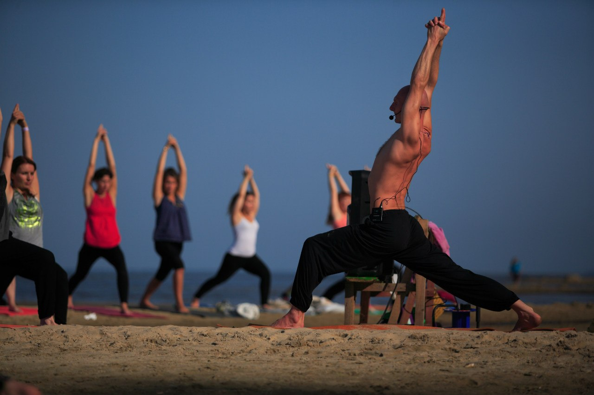

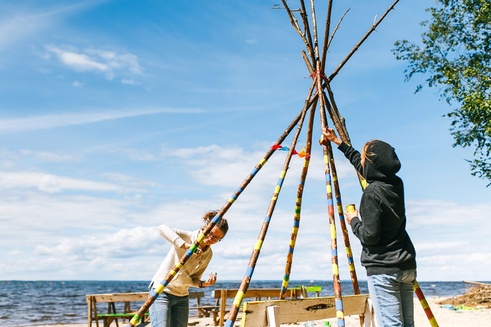
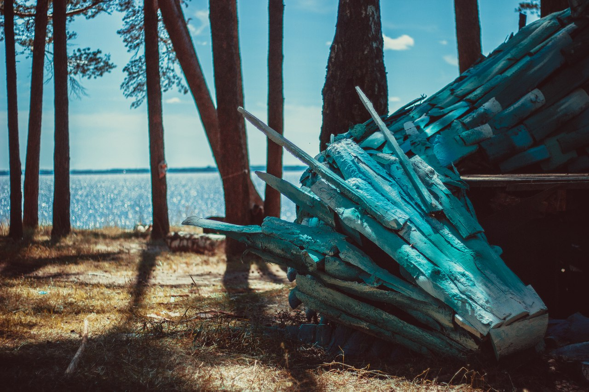

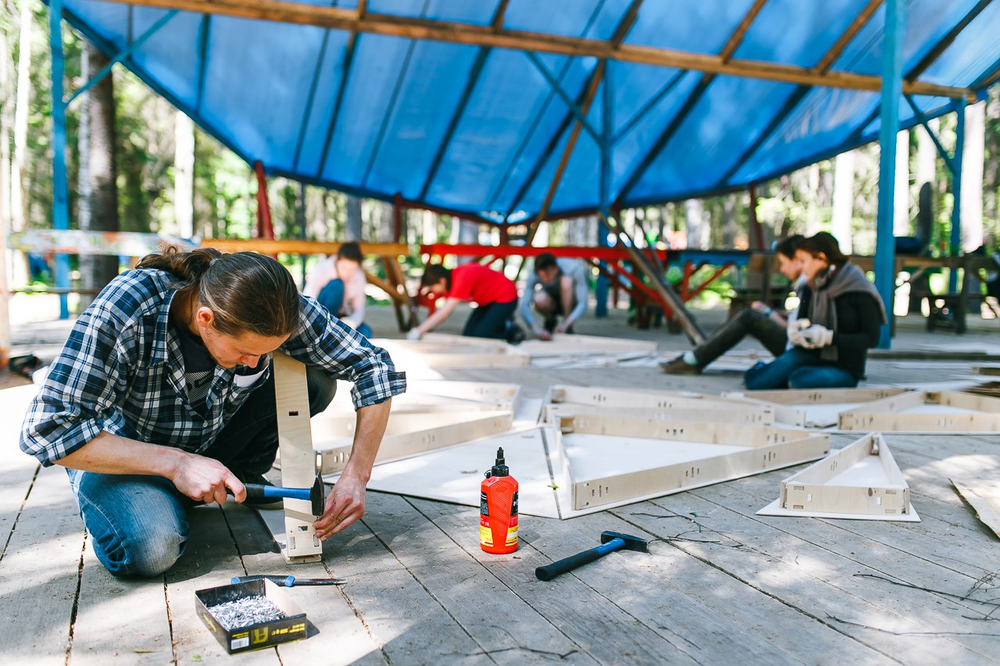

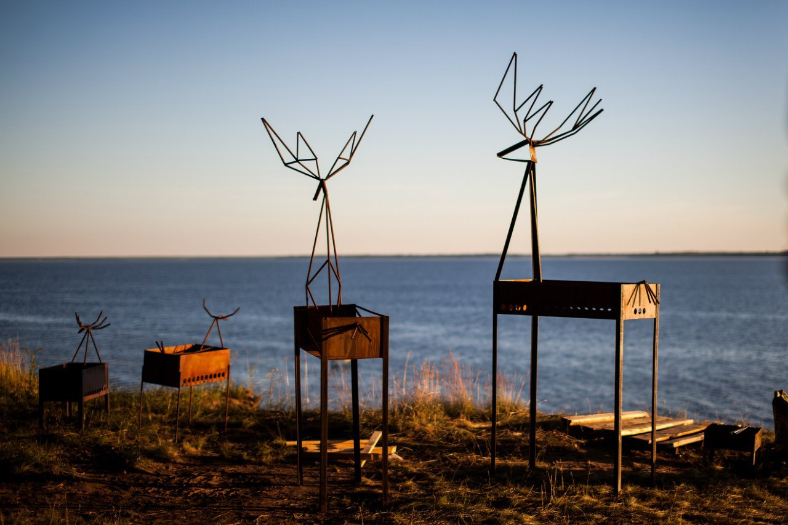

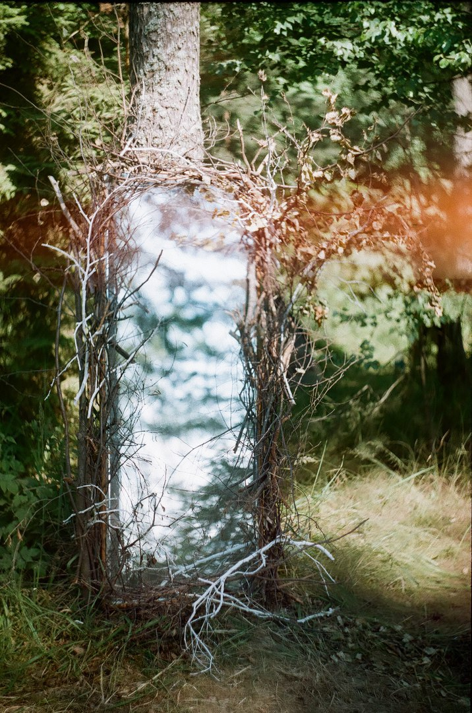

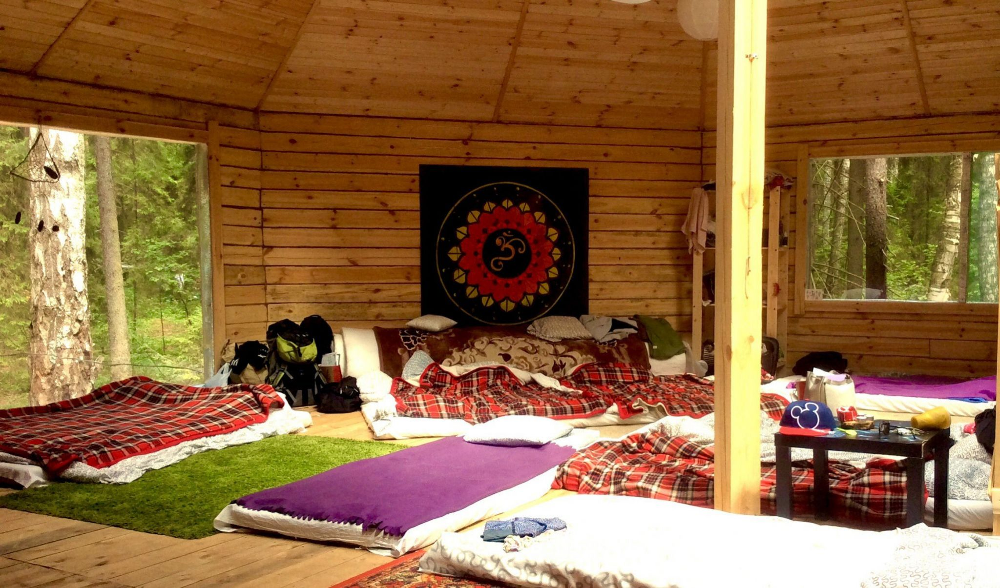

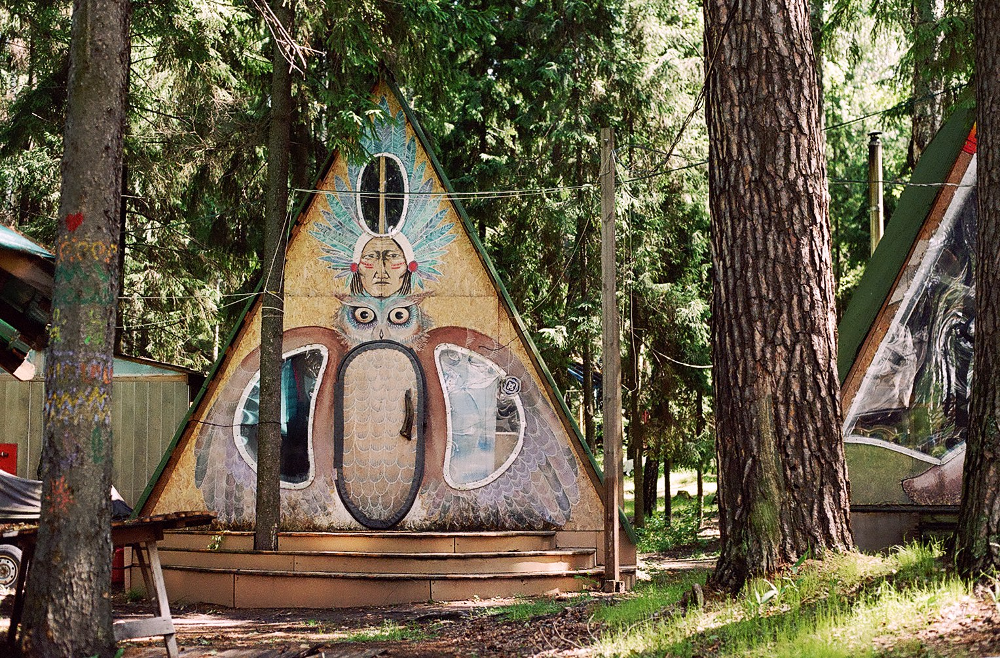

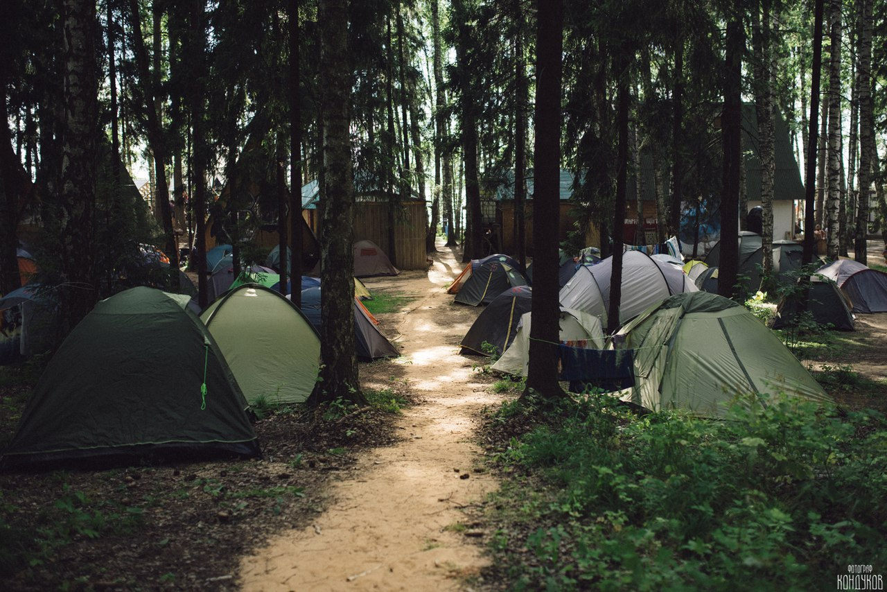

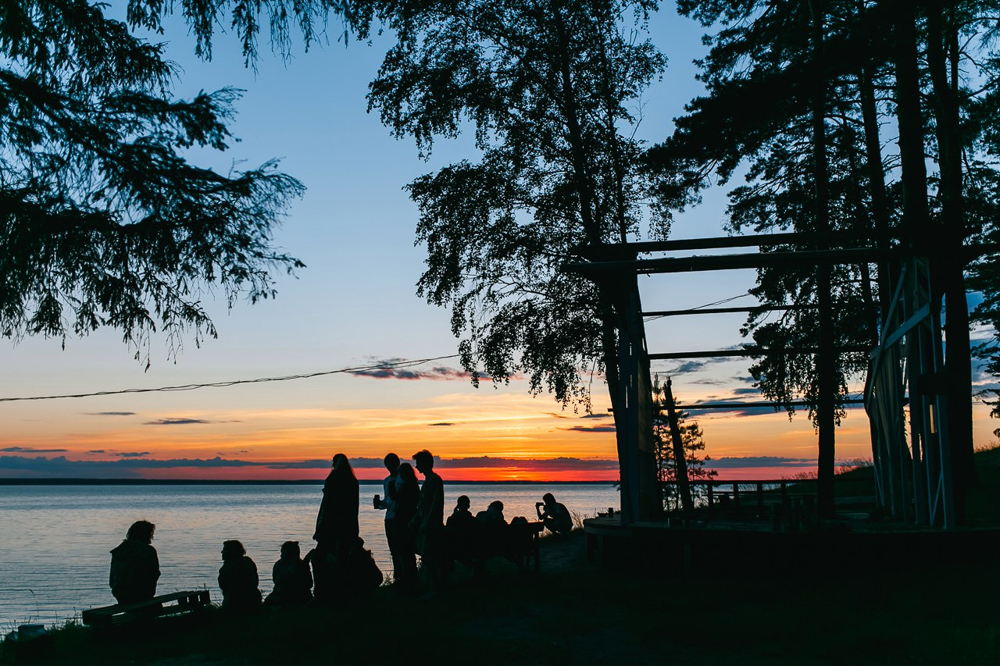

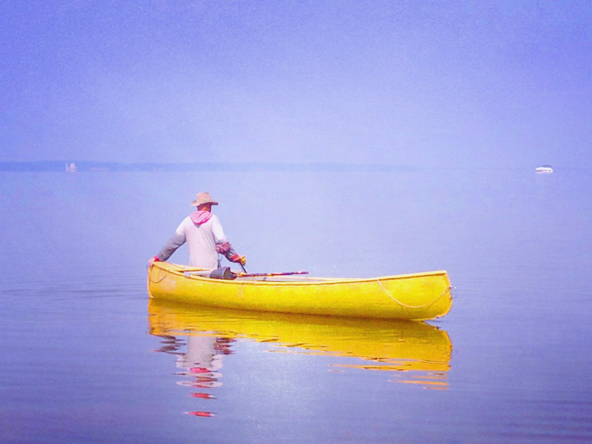

