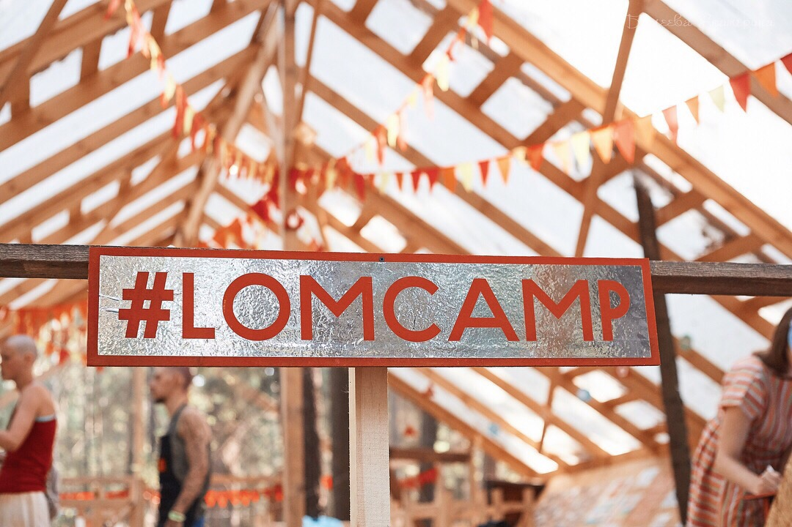

Фестиваль стихий WAFEst стал для нас настоящим командным приключением. 737 участников прошли занятия на нашей площадке творческих мастер-классов. Мы открывали запись на занятия ежедневно в 8 утра, встречая тех, кто с 6:30 уже ждал. Утренняя очередь нас будоражила, вдохновляла быть ответственнее и радовала настроением всех пришедших.

Продуманная система записи, лист ожидания, 4 администратора, 2 куратора, учет и взаимоподдержка – таков был наш танец на фестивале).

<vimeo-embed link="https://vimeo.com/287729396" />
