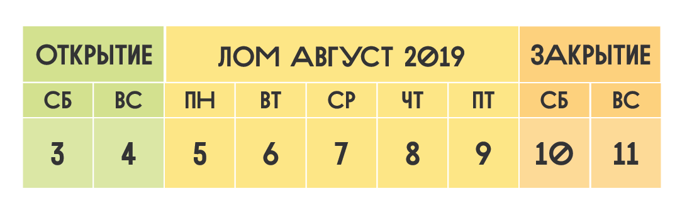

Единственная в этом году смена летнего лагеря ЛОМ была незабываемой. Летней ее ощутить было сложно, ведь погода выдалась по-настоящему осенней, но мы старались создать и сохранить тепло всеми возможными способами. Усидчивые мастерские перенесли с улицы в дом. Вечерами жгли костры и стучали в барабаны, призывая теплые ветра и ясное небо. Иногда получалось. Возможно, именно благодаря прохладной погоде эти лесные открытые мастерские оказались наиболее продуктивными на проекты участников. Умельцы лагеря за дни смены изготовили впечатляющее число произведений: толстовки, обувь, море керамики, реки украшений, флаконы духов, деревянные конструкции, музыкальные инструменты, эпоксидные панно и разные другие задумки воплотились в действительность. Нам не удалось создать вместе какой-либо большой уличный арт-объект, но столярно-металлический цех выпустил на свет арфу и ракетную печку. А еще мы восстановили ветрогенератор Валеру — шедевр прошлогодних смен.

Важной и красивой историей этого летнего лагеря стали съемки документального фильма про Лесные открытые мастерские — самый большой и общий проект для лагеря за все три года его бытия.

Лагерь ЛОМ — это всегда уникальный эксперимент и исследование. И он всегда неповторим. В этот раз неделя лесных мастерских принесла нам, организаторам, множество уроков, и помогла сделать очень ценные выводы. Мы очень благодарны каждому, кто внес свой вклад в это приключение в лесу. Все мастера, все участники смены и каждый вовлеченный в поддержание нашего быта в лесу — ценный элемент творческой социальной системы, выросшей на 9 дней на берегах Волги среди сосен и берез.

Путёвка на смену включает всё,что нужно для жизни и творчества в лесу

### Программа

- Занятия по всем творческим направлениям
- Курсы и проектные лаборатории на выбор
- Инструменты и материалы для проектов
- Лекции, презентации, игры, практики, музыкальные импровизации и фото-видеосъемки

### Размещение

- Обустроенный кемпинг
- Палатка, коврик, спальник при необходимости
- Горячий душ, WC
- Розетки для зарядки гаджетов
- Баня

### Питание

- Питьевая вода из скважины
- Трёхразовое вегетарианское питание
- Вечерние чаепития
- Возможность готовить самостоятельно

### Программа творческих занятий

- Лекции и презентации
- Мастер-классы
- Курсы умений
- Творческие лаборатории
- Совместные проекты
- Создание арт-объектов
- Шоу, выставка, ярмарка
- Фото- и видеосъемка

## 9 дней, 35 участников, 10 мастеров, 5 мастерских, более 25 занятий

### На берегу «моря»

Естественный ритм жизни, созерцание игры стихий и вольный ветер, выдувающий суетливые мысли из головы, очищают восприятие для новых идей, дарят силы для плодотворной деятельности.

Нас ждёт живописный песчаный берег Волги близ Нижнего Новгорода. Здесь на берегу Горьковского “моря” уже десятый сезон существует Сёрфлагерь — место, где расцветают люди. Гостеприимное пространство, где есть всё необходимое для гармоничной жизни на природе: просторный кемпинг, деревянные домики, душ и туалеты, баня, большая и щедрая вегетарианская кухня, крытые беседки, сцены, площадки под мастерские. Тут легко можно забыть о городе и ощутить себя жителем леса.
