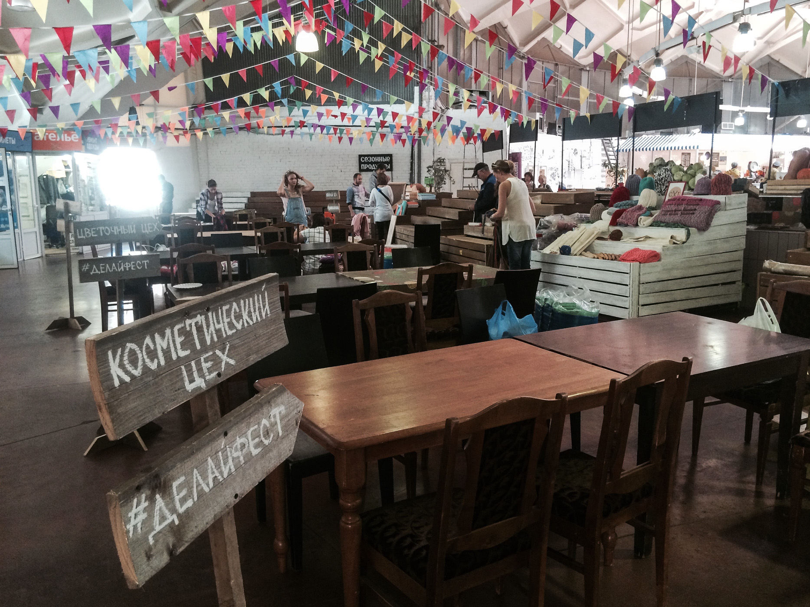

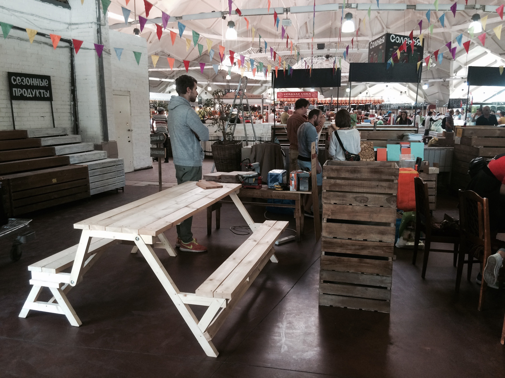

15 августа на один субботний день на Даниловском рынке Москвы возникла Фабрика ручного труда, где каждый желающий мог поработать в любом из её цехов и сделать какой-нибудь предмет быта своими руками. Такое неожиданное преображение рынка стало возможно благодаря его сотрудничеству с командой [портала «Теории и практики»](http://theoryandpractice.ru/).  

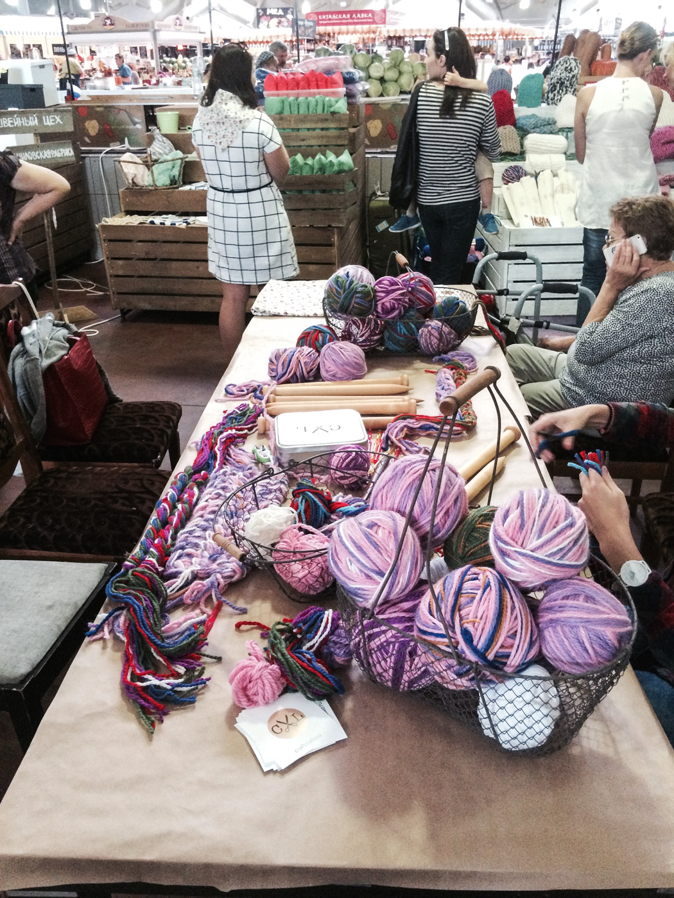

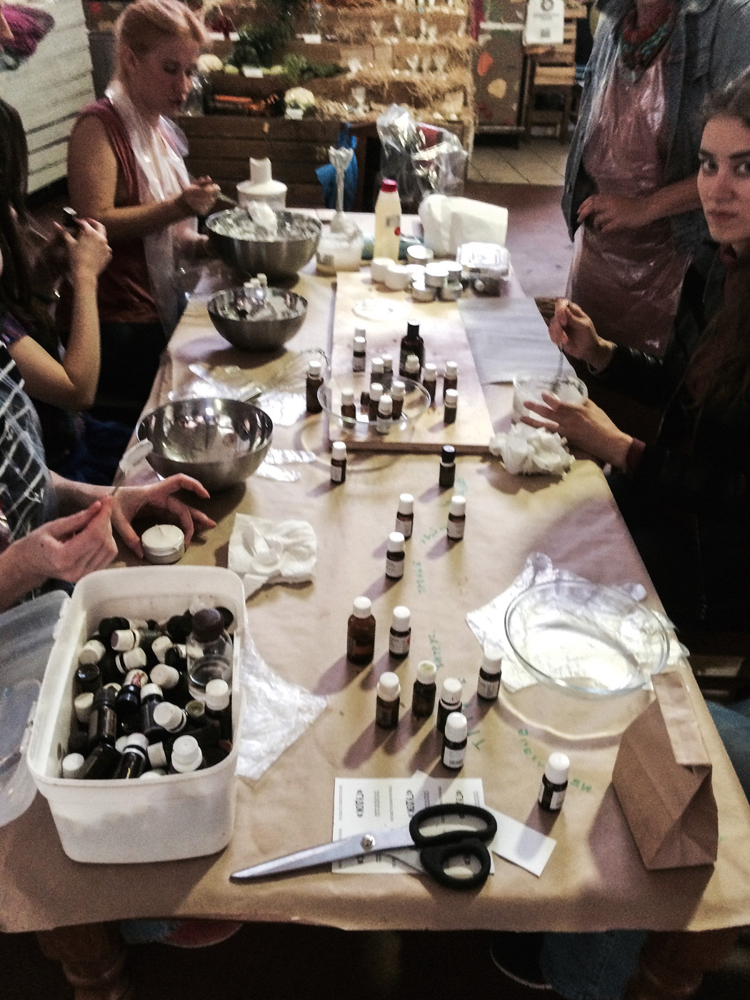

Фабрика состояла из 6 разнонаправленных цехов. Каждый желающий при входе на рынок мог приобрести за 300 рублей билет, позволяющий поработать в одном из цехов и получить вещь, сделанную своими руками. В вязальном цехе мастерицы из [Craft Lab](http://craftslab.ru/) обучали изготовлению трикотажных ковриков. [Panika Derevya](https://www.facebook.com/panikapost) помогала сшить и ракрасить наволочку для интерьерной подушки в швейном цехе. [Dash\_Dash Natural Cosmetics](https://www.facebook.com/DashDashCosmetics) предоставили десятки особенных ингредиентов для создания неповторимого крема-мусса. [Студия Monolama](http://monolama.ru/) подготовила множество деталей для создания значков из оргстекла в конструкторском цехе. [Сервис "Очень хорошо"](https://vk.com/o_horosho) делился навыками создания букетов из овощей в цветочном цехе. А в столярном цехе [мастерская "Рукиоттуда"](https://www.facebook.com/rukiottuda) благотворительного [центра "Вверх"](http://vverh.su/) при поддержке команды OOLEY дала возможность каждому желающему самостоятельно изготовить разделочную доску авторского дизайна.

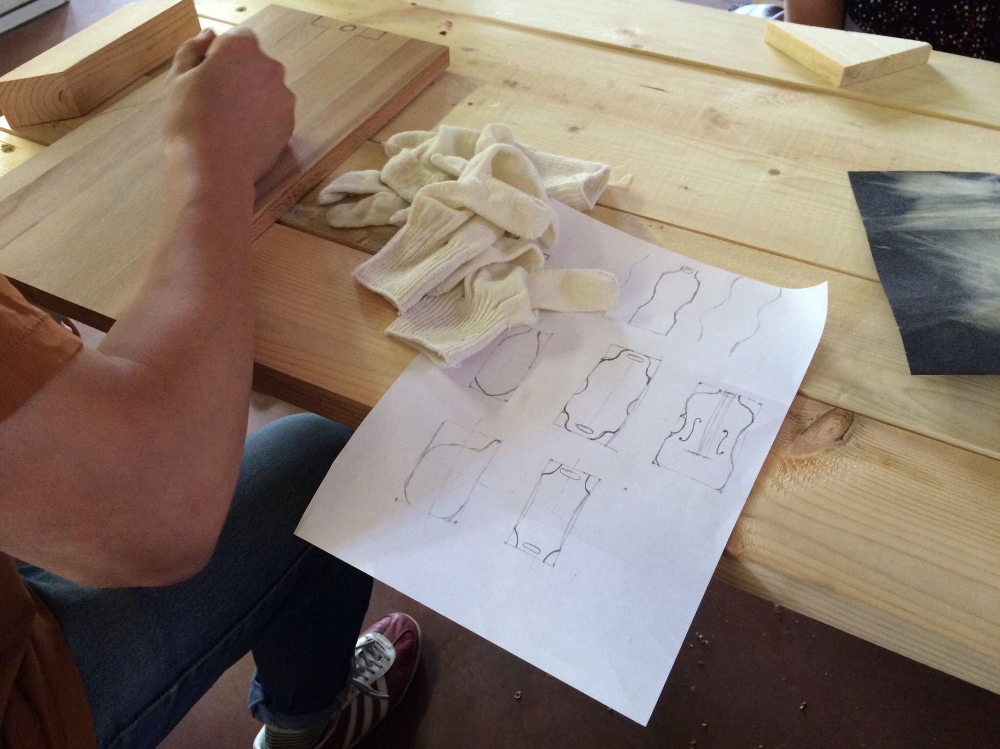

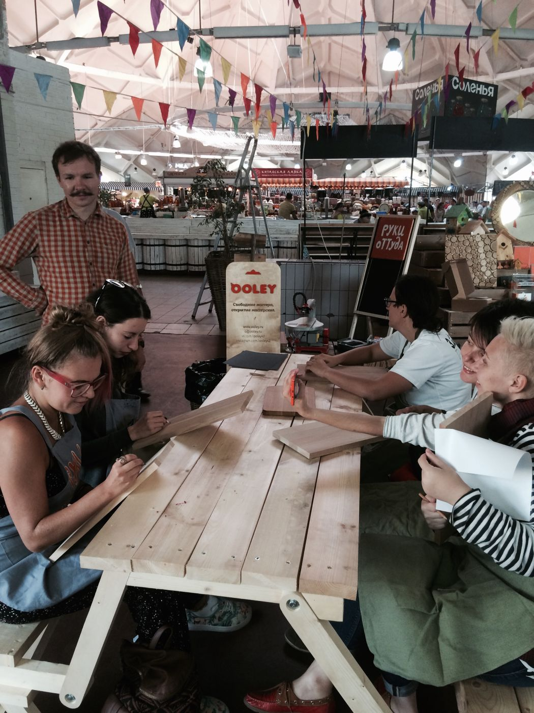
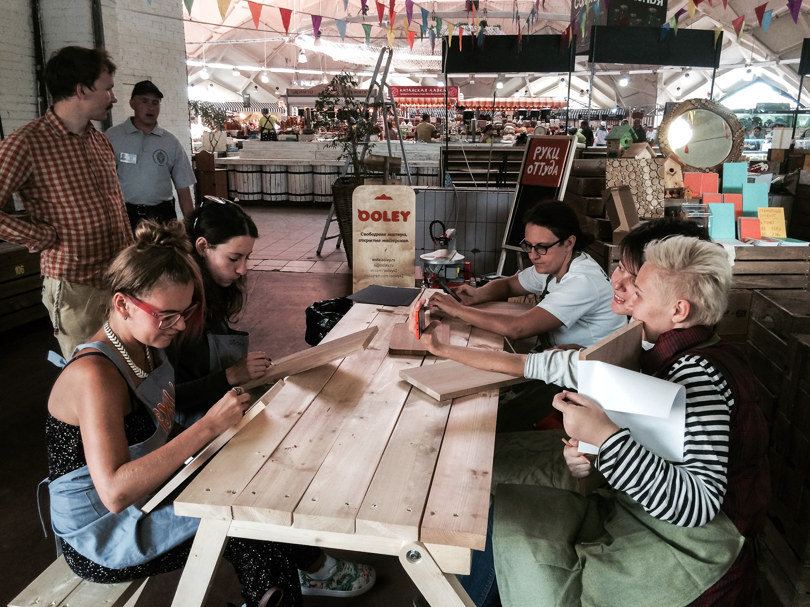

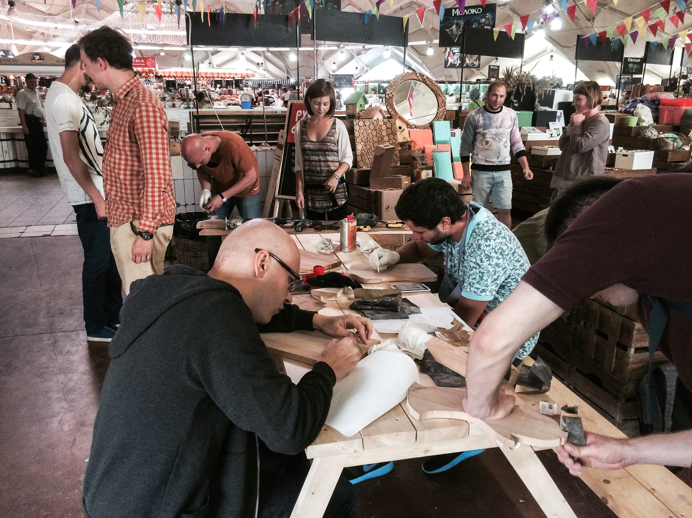
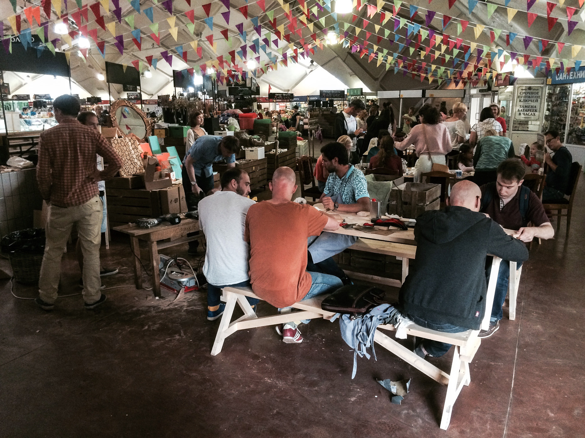

Начав принимать участников в 14:00, Фабрика сразу загрузила свои мощности и всего за 4 часа работы дала возможность творческого самовыражения более ста участникам. В одном только столярном цеху посетители рынка смогли произвести более двадцати уникальных разделочных досок. Самостоятельно разработанную форму доски участники цеха сами вырезали из букового щита электролобзиком. Тщательно ошлифовав поверхности наждачной бумагой и нанеся рисунки выжигательным аппаратом, гости Фабрики покрыли изделия специальным маслом.

Две диковинных рыбы, знак Бетмена, кит, виолончель, гитара, два Питера Гриффина, тесак, овал и различные абстрактные формы — участники цеха нашли выход своей фантазии и сделали разделочные доски настоящим средством самовыражения. Затратив в среднем около полутора-двух часов на работу, каждый из них получил не только уникальный предмет быта, но и удовольствие самостоятельного творчества, а также ценные навыки, которые могут пригодиться во многих жизненных ситуациях.

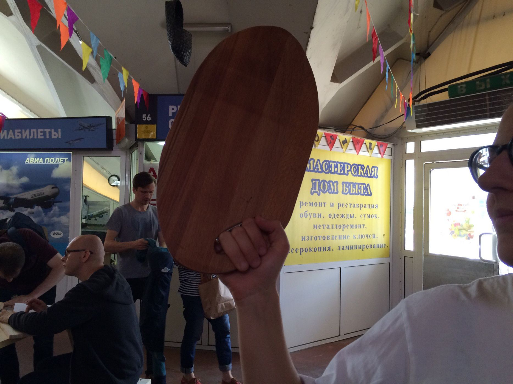

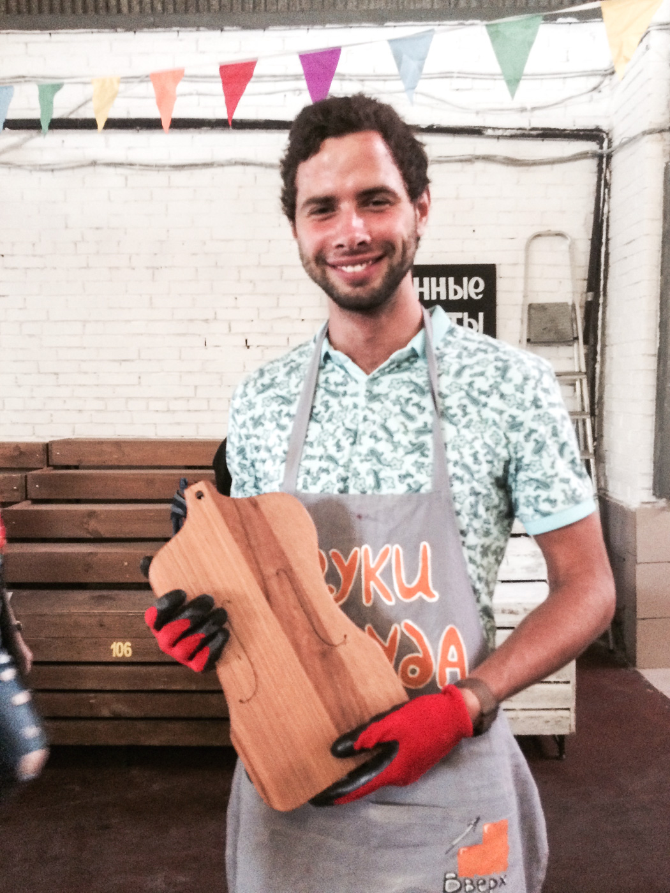
