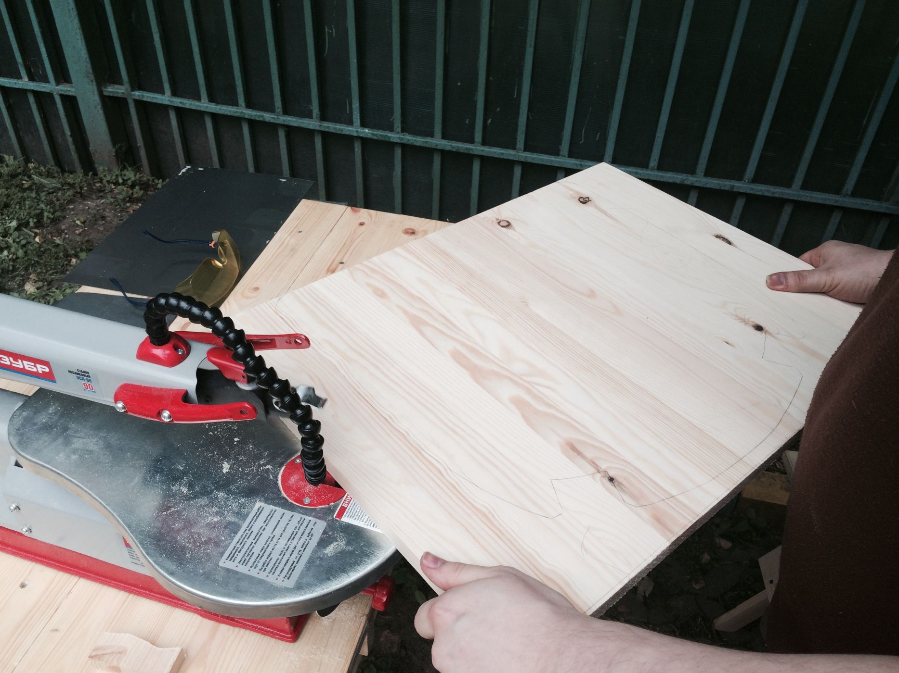

Лобзиковый станок, доступный для использования в прицепе-мастерской OOLEY42, — удобный универсальный инструмент, подходящий при должной сноровке для решения множества задач. Недавно, например, один из наших гостей буквально за полчаса выпилил из большого мебельного щита сиденье для реставрации стула. Хотя, конечно, стоит отметить некоторую непредсказуемость поведения пилок, закупленных для него.

