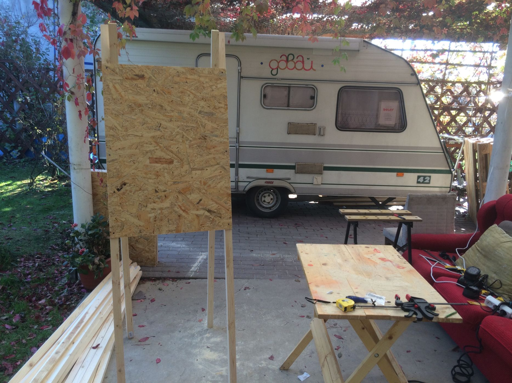
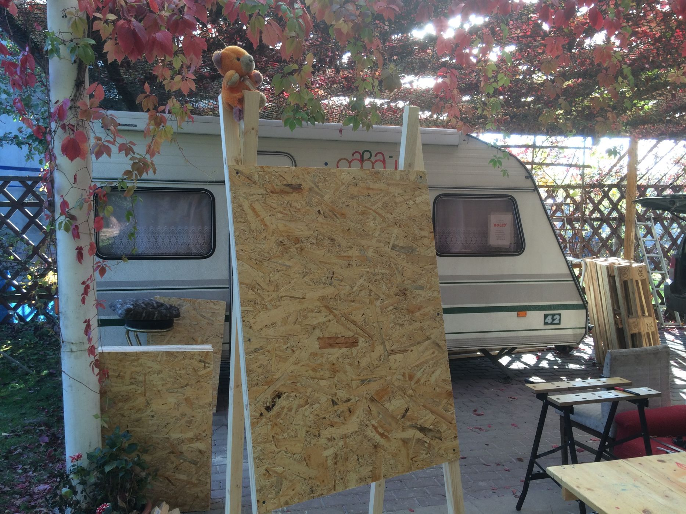
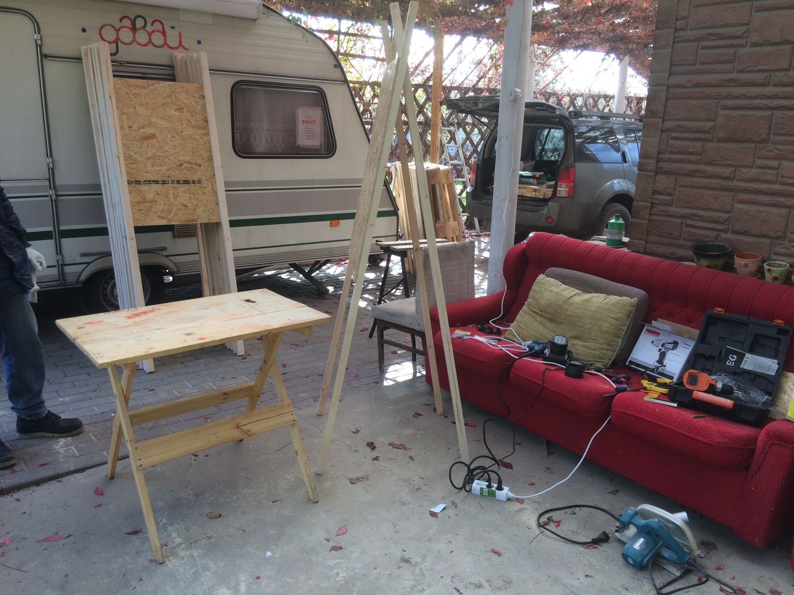
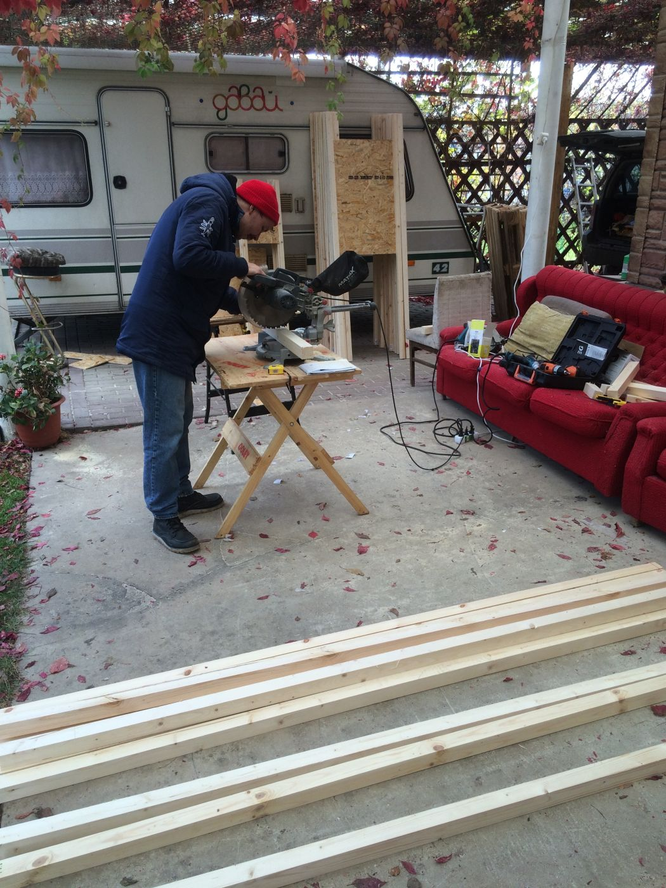

Наша передвижная мастерская OOLEY42 уже давно отправлена на зимовку, но до продолжает работать до самых холодов. Последние теплые осенние деньки становятся прекрасной возможностью поработать на свежем воздухе. Так всего за один день нам удалось основательно подготовиться к Фестивалю Московского урбанистического форума, где [мы представили секцию "Дворовой мастерской](http://ooley.ru/dvorovaya-masterskaya-v-otkrytom-pavilone-festivalya-moskovskogo-urbanisticheskogo-foruma/)". Помимо первичной сборки каркаса Павильона общественника и обработки его огнезащитным составом ярко-розового цвета (о чем производитель, кстати, нигде на упаковке не сообщает), мы напилили и собрали множество несложных мольбертов для организации выставки.

