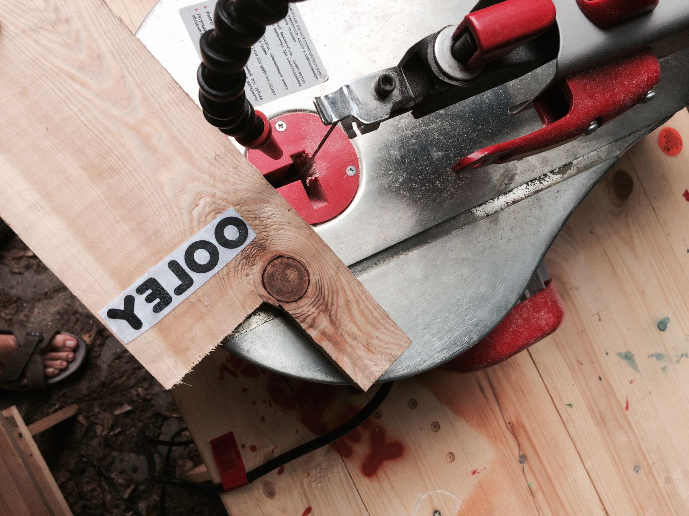
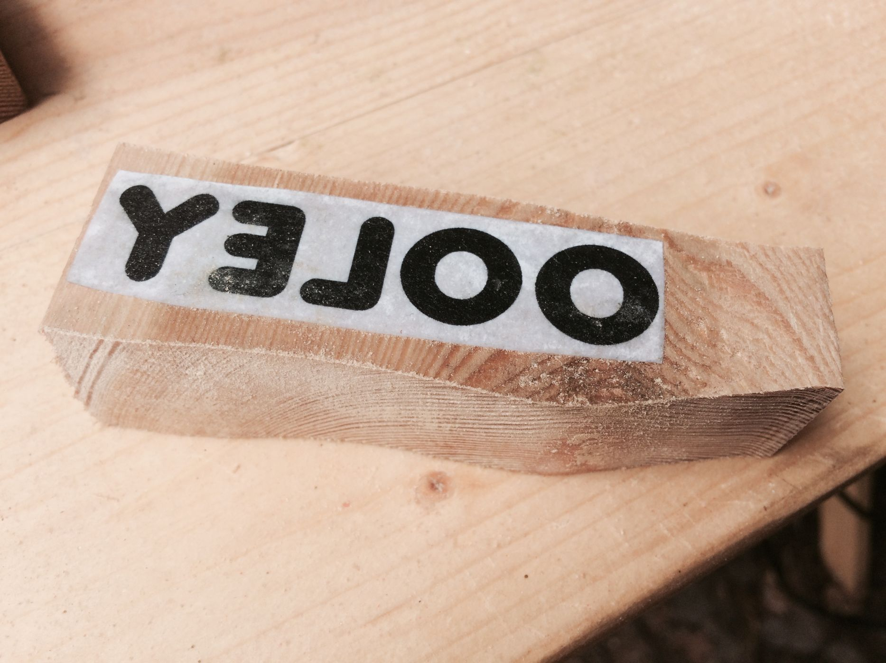
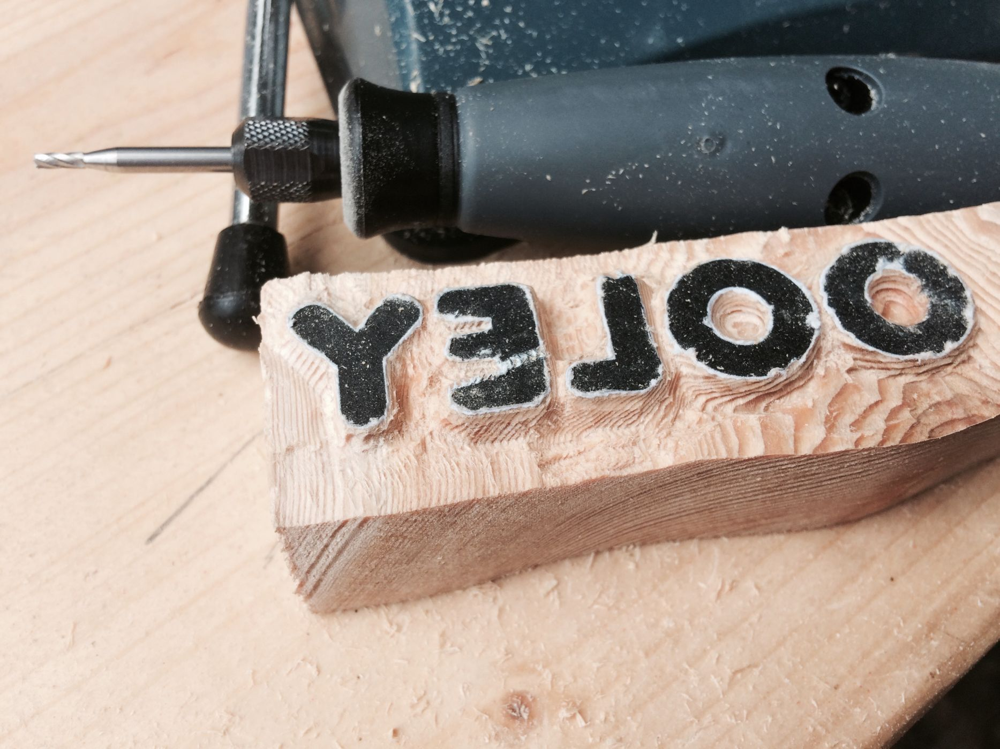
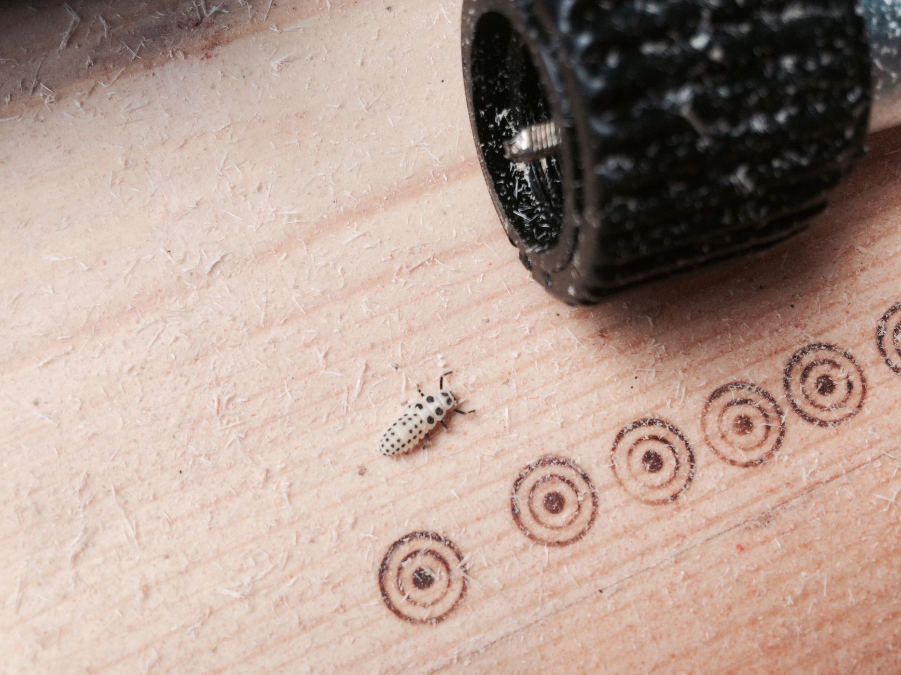
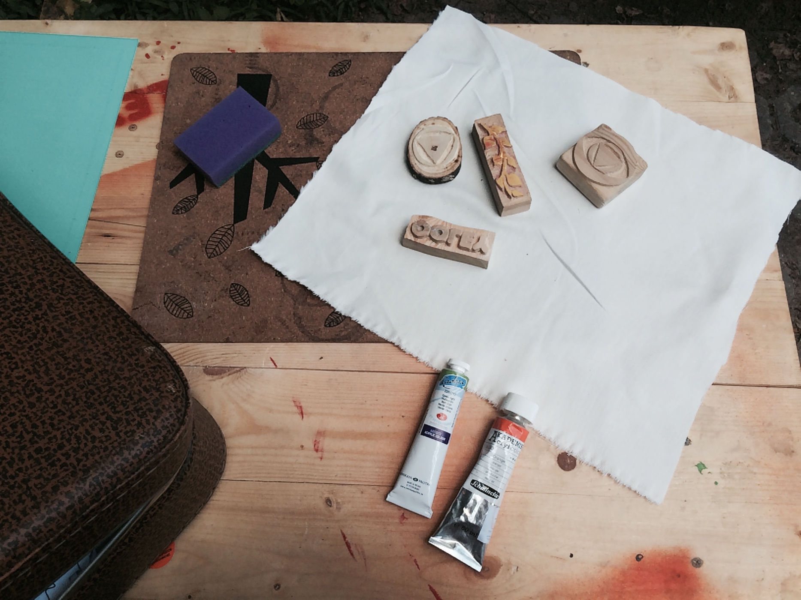
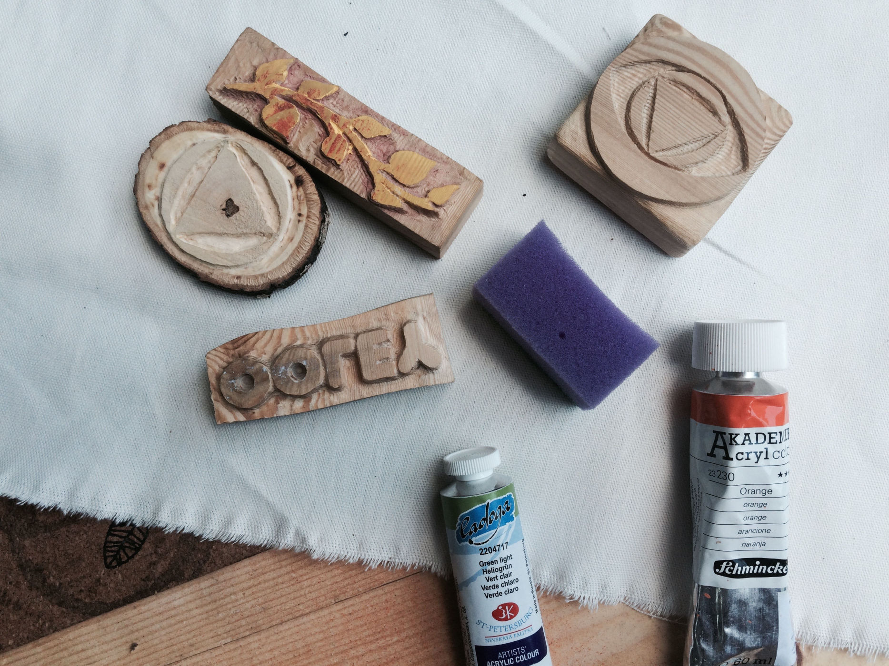
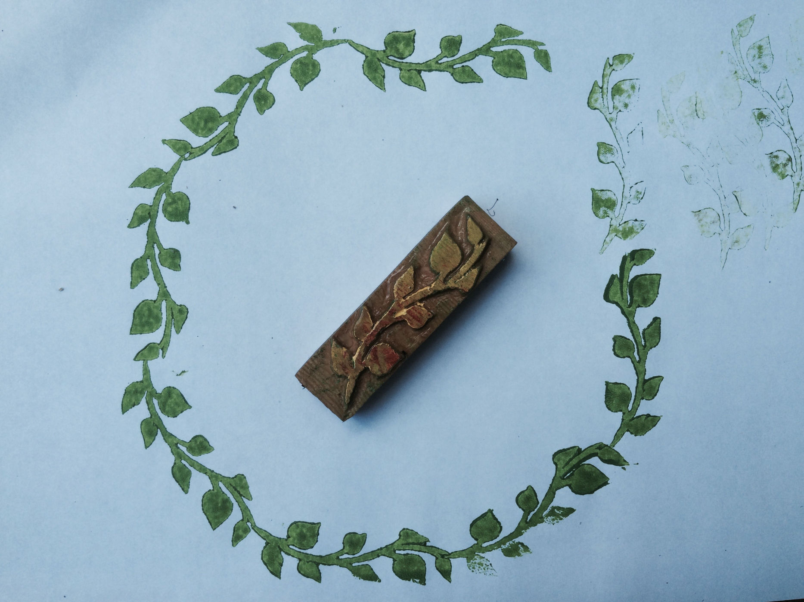

Уже в это воскресенье мы привезём в московский парк Музеон прицеп-мастерскую OOLEY42. Мы примем участие в [квест-пикнике фестиваля "Планета людей"](/practice/event/ooley42-na-kvest-piknike-festivalya-planeta-lyudej-v-muzeone/), проведём целый день в творчестве и обмене навыками, умениями и творческими результатами. Нам предстоит провести 3 последовательных класса, в течение которых поэтапно пройти вместе с заинтересованными учениками все этапы производства швейных изделий из натуральной ткани ручной набойки.

Начнём мы, конечно, с изготовления деревянных штампов. Отпилим заготовки ножовкой или лобзиковым станком. Попробуем ручную резьбу ножами и стамесками, поработаем бормашинами с различными насадками. Несложный штамп можно вырезать примерно за час-полтора. За три часа попробуем научить человек 10—15. Дополнительно предложим людям вырезать трафареты для непосредственного нанесения рисунка на ткань губками.

Мы подготовили несколько штампов-примеров, заодно определившись с материалом. Доски из лиственницы вполне подходят для резьбы бормашинкой: древесина сравнительно мягкая и довольно однородная, в то же время прочная и не крошится.

Второй класс будет посвящен набойке рисунка на ткань. Наносить краску такими штампами несложно: нужна лишь губка и поверхность для её смачивания краской. Для этого подойдёт любая акриловая краска. Под ткань лучше подложить что-то мягкое, у нас вот нашлись пробковые коврики.

Полученные оттиски можно подправить кисточкой или оставить все артефакты как есть. Если уделить этому навыку достаточно времени, качество печати может быть вполне на высоте. В ходе класса мы постараемся первоначально разметить и выкроить из ткани детали будущих изделий, а затем приступить к набойке на них рисунка. После набойки и высыхания краски рисунок необходимо закрепить проглаживанием утюгом через марлю. Можно шить! Третий класс будет целиком посвящён шитью изделий из разрисованной на предыдущем классе тканей.

Приходите творить — посмотрим, что из этого выйдет! [Воскресенье, 2 августа, Музеон.](/practice/event/ooley42-na-kvest-piknike-festivalya-planeta-lyudej-v-muzeone/)
