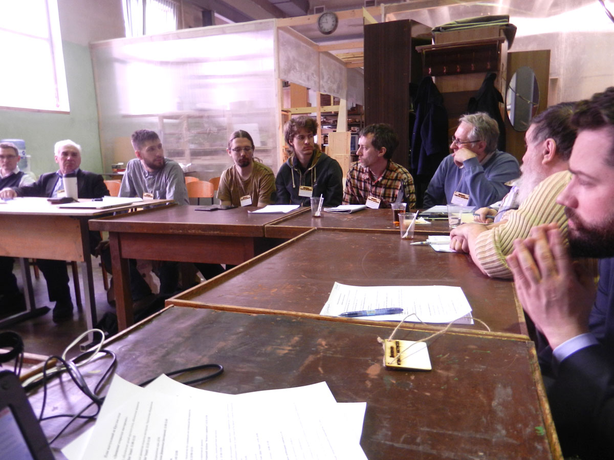
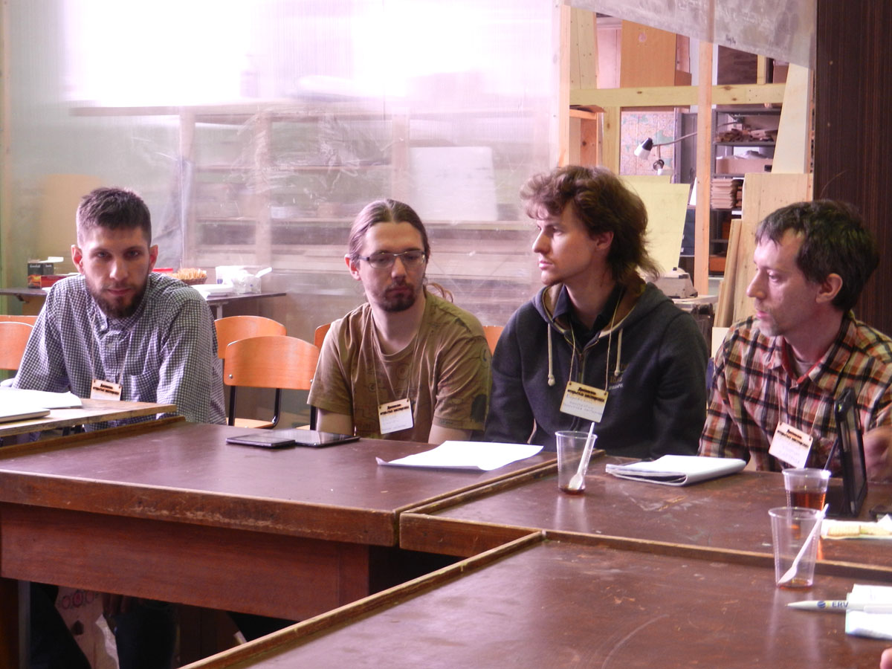
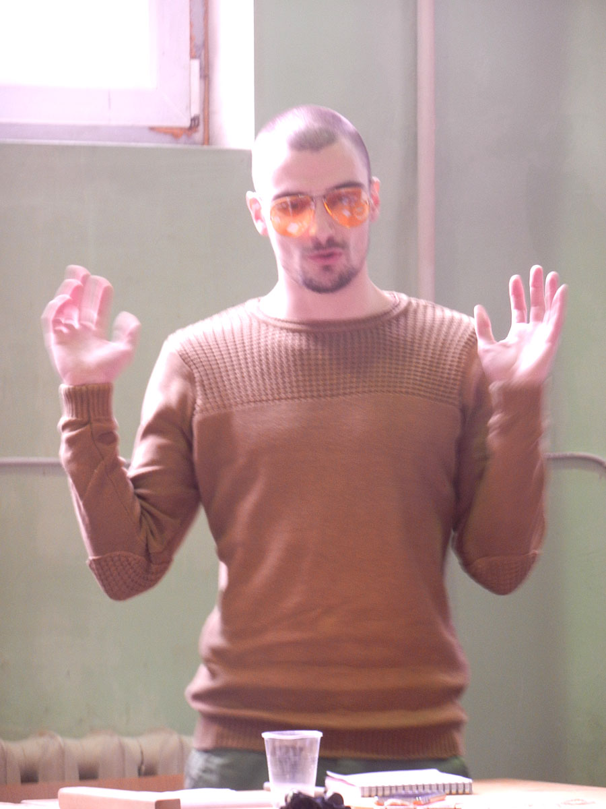
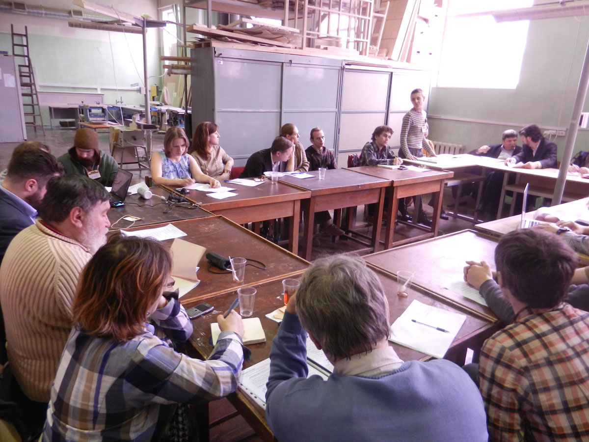
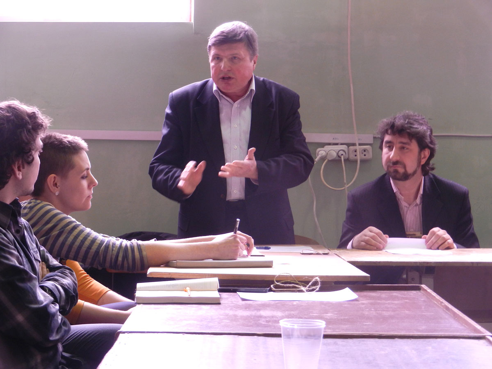
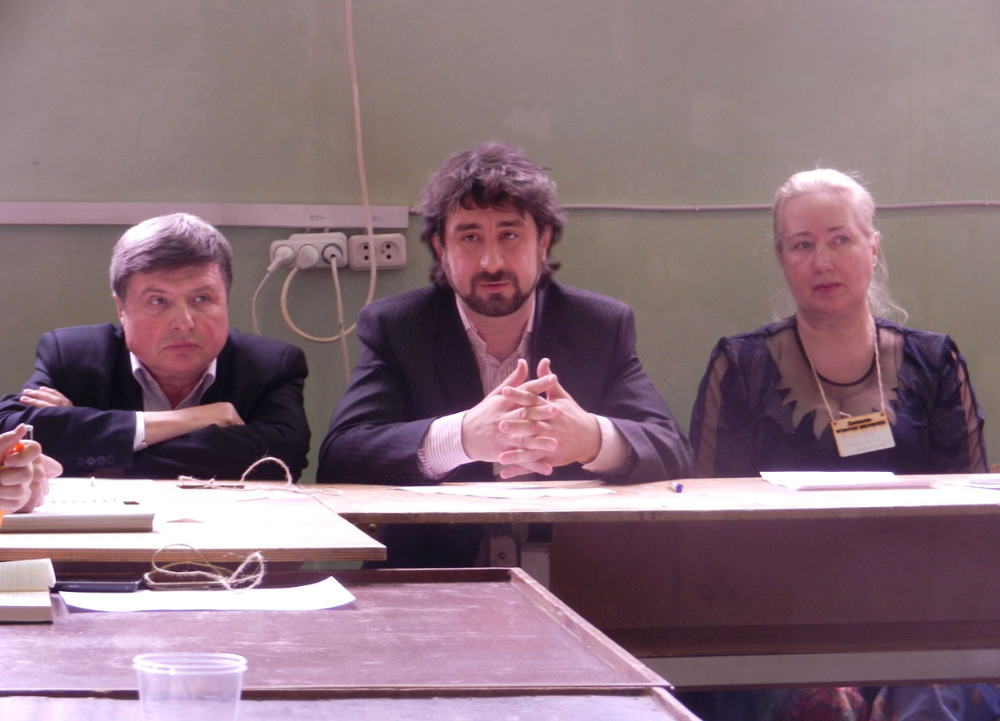
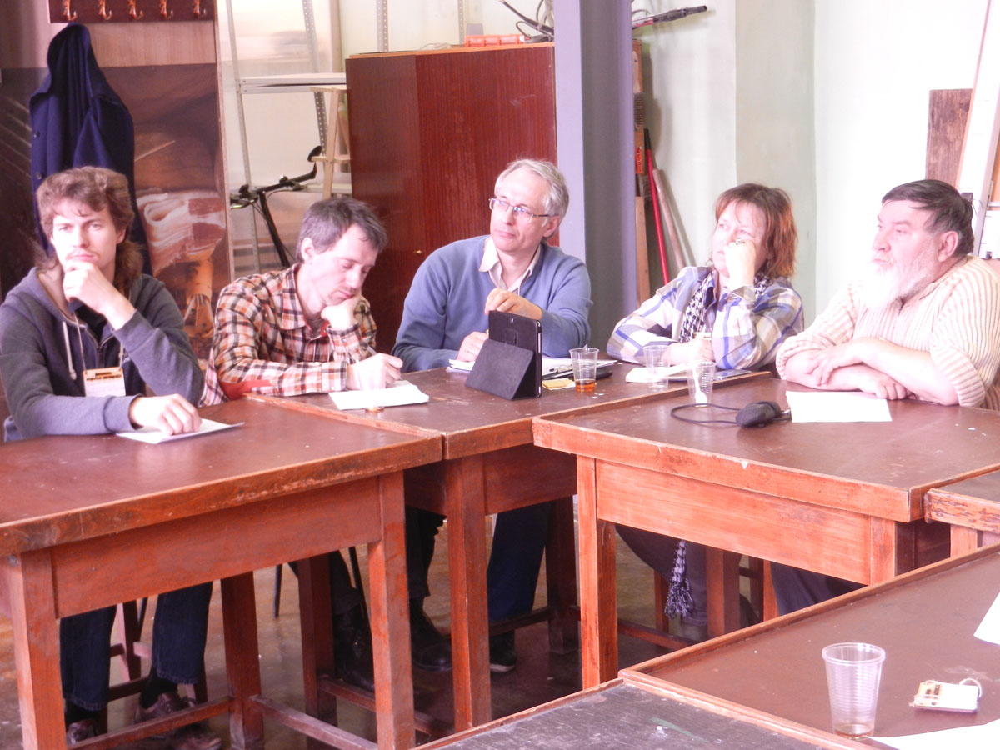
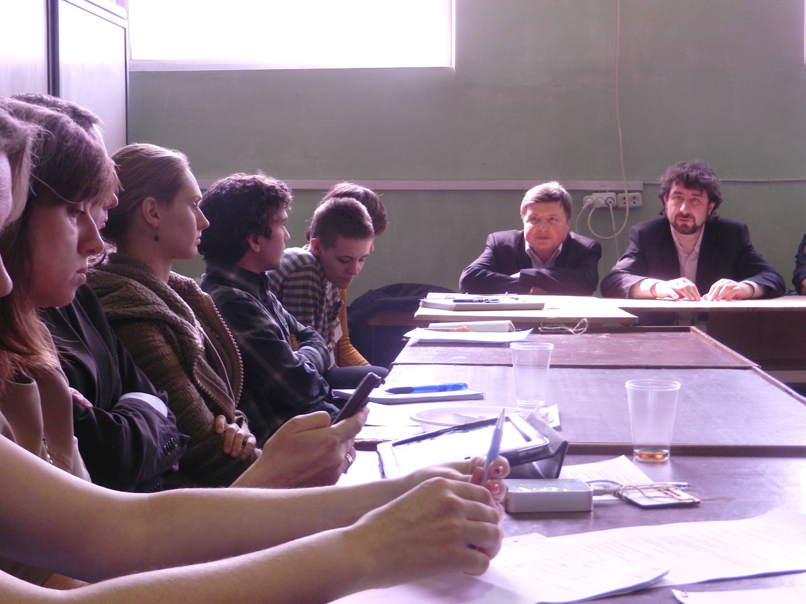

В понедельник 27 апреля 2015 г. на территории общественной мастерской "Дар Труда" состоялся первый [круглый стол на тему "Движение открытых мастерских"](/practice/event/kruglyj-stol-dvizhenie-otkrytyh-masterskih/). В событии приняли участие представители открытых мастерских, коммерческих и государственных структур. Главной целью события было встретиться и познакомиться всем тем, кто заинтересован в развитии этого направления. Прозвучали небольшие доклады, гости обменялись мнениями на актуальные темы. Вдохновляющие выступления участников и живой интерес гостей круглого стола позволили не только погрузиться в тему, но и найти пути дальнейшего взаимодействия. Основная цель организаторов встречи — команды "Дара Труда" — объединить разрозненные открытые мастерские для единого представительства во взаимодействии с органами государственной власти стала чуть ближе. Представители государственных структур пообещали оказать информационную и юридическую помощь формируемому движению.

Во встрече приняли участие:

- Константин Скворцов, [ПК "Дар Труда"](/workshop/catalog/dar-truda/)
- Денис Старов, [OOLEY.ru](https://ooley.ru/)
- Сергей Царев, [Механические Деревянные Шестеренки](http://woodgears.ru)
- Владимир Христофоров, [Crafts Station](/workshop/tour/crafts-station/)
- Татьяна Брусова, [Бюро Находок](http://buro-nahodok.ru)
- Георгий Дудайти, [Про.Движение](/workshop/archive/pro-dvizhenie/)
- Ирина Дорожкова, [Гуслица](http://art-guslitsa.ru)
- Владимир Самойлов, [Designet.ru](http://designet.ru/)
- Оксана Королёва, Департамент культуры г. Москвы
- Леонид Кошелев, Ремесленная палата г.Москвы
- Венера Ровенская, отдел проф-ориентации молодёжи в ГБУ малого бизнеса г. Москвы
- Константин Кибардин, ГБУ "Малый бизнес Москвы"
- Сергей Лобанов, Министерство промышленности и торговли РФ, отдел регионального развития и народных художественных промыслов
- Сергей Свинцов, АКБ "Сотрудничество и разработки" и другие.
