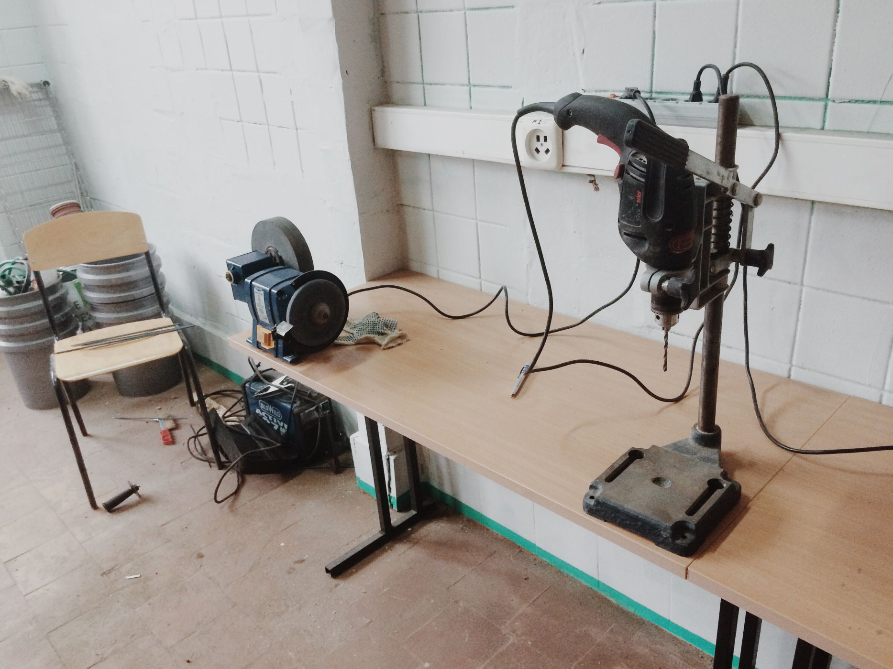
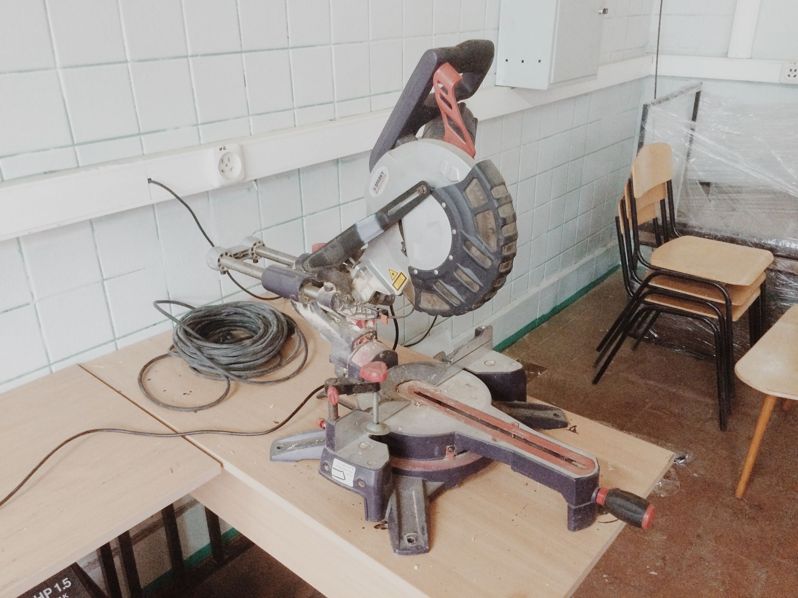

Коворкинг для мастеров [Crafts Station](/workshop/tour/crafts-station/ "Коворкинг для мастеров Crafts Station") открылся совсем недавно и активно пополняет свой парк инструментов и станков.

В арсенале появилась новая мощная **щеточная шлифовальная машина Makita 9741**, с металлической и нейлоновой щетками, идеальный инструмент [для браширования древесины](https://ru.wikipedia.org/wiki/%C1%F0%E0%F8%E8%F0%EE%E2%E0%ED%E8%E5), т.е. выделения рельефной фактуры за счёт удаления мягких волокон дерева.

Также мастерская обзаводится новыми станками. Уже установлены и готовы к работе:

- торцовочная пила с большим рабочим ходом, что дает массу преимуществ в работе
- сверлильный станок, собранный из дрели SKIL и устойчивого основания
- точильный станок Haager
- фрезерный стол на основе ручного фрезера Makita

Скоро планируются новые пополнения.

