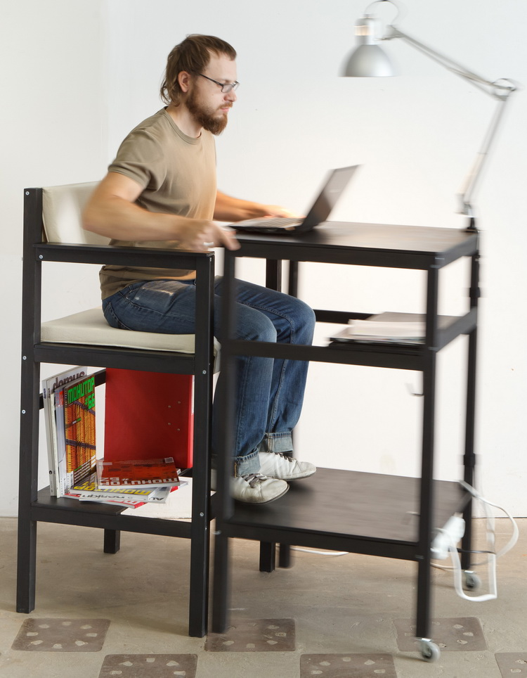
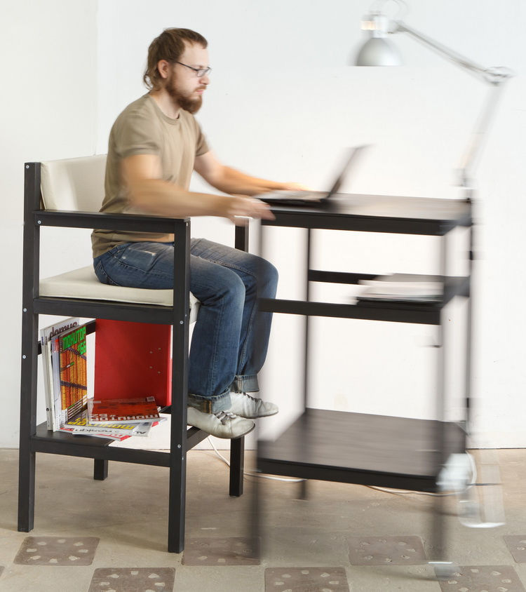
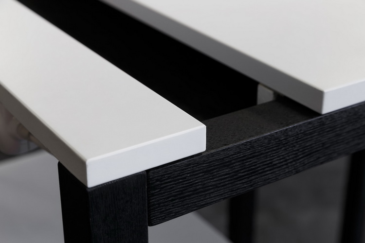
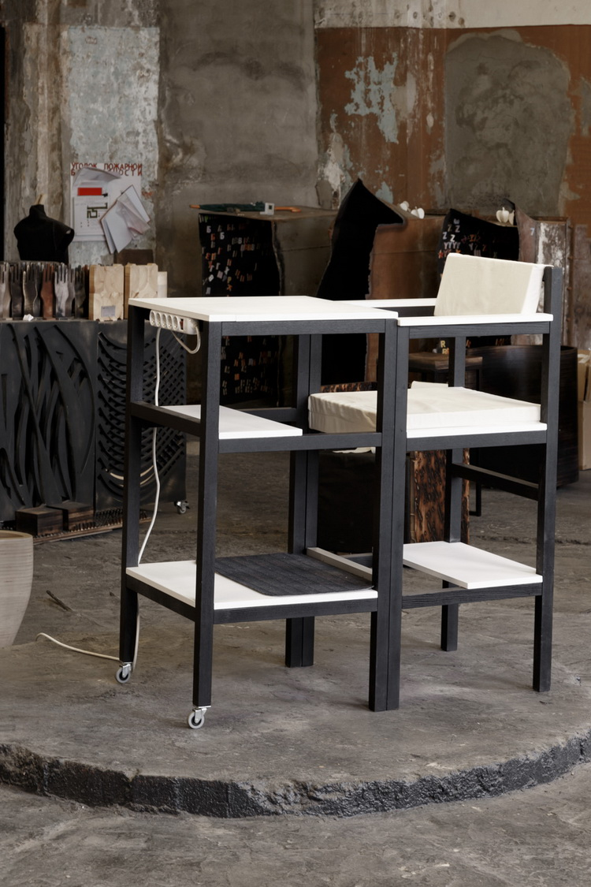
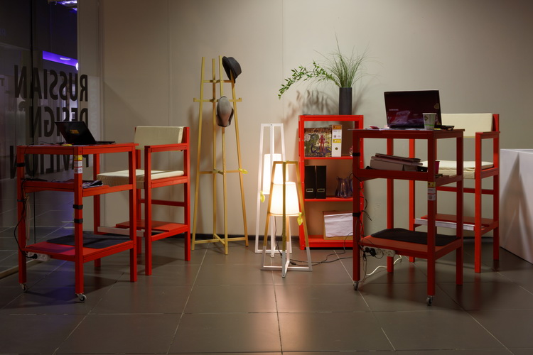

> Мы публикуем присланные вами творческие результаты. Вот, например, продуманное компактное рабочее место от Романа Бондарева из Москвы.

Комплект оригинальной мебели для работы на компьютере, принципиальная особенность заключается в возможности использования не только привычным образом – сидя за столом, но и стоя перед ним. Высота столешницы, реализующая «принцип барной стойки», создает единое коммуникативное поле – сидящий находится на уровне глаз тех, кто стоит. Площадь столешницы составляет необходимый и достаточный минимум и не позволяет захламлять рабочее пространство. Компактный стол оснащен колёсами и мобилен – работу легко перенести в любое доступное место. Ещё одна особенность SitUp – кресло, выполняющее также функцию мини-стеллажа, является стационарным и не задвигается под стол, а наоборот – мобильный стол придвигается к нему.

Вертикальная посадка максимально комфортна, соответствует ортопедическим нормам, полностью мобилизует и стимулирует к эффективному труду. Работа на компьютере в положении стоя также полезна для здоровья, а кроме того, делает удобными «короткие подходы» к компьютеру.

В комплект входят: подушки сидения и спинки кресла, 2 колеса на ножках стола, электропровод с 5-ю розетками для обеспечения всех внутренних энергетических нужд. Для людей разного роста предусмотрено 2 размерности, различающиеся высотой основных поверхностей.

Материал – ясеневый брусок, высококачественная фанера 18 мм, окраска – по выбору заказчика. Подробнее на [http://sit-up.ru/](http://sit-up.ru/)

