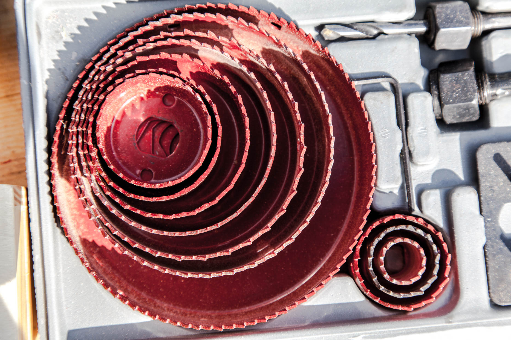
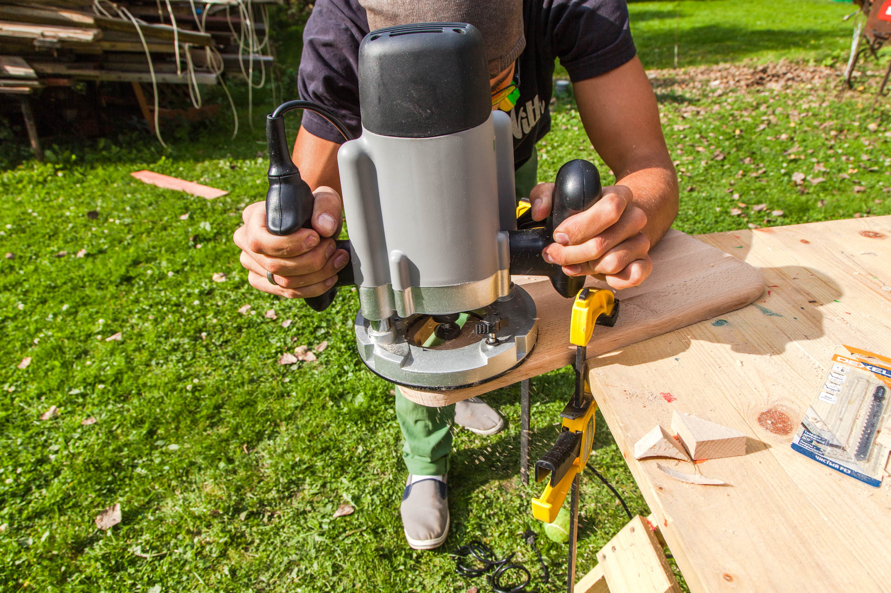
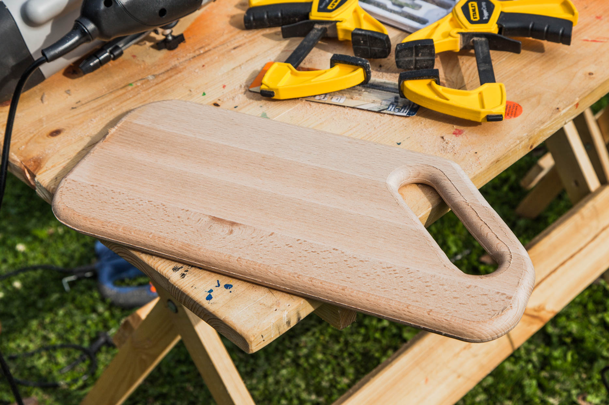
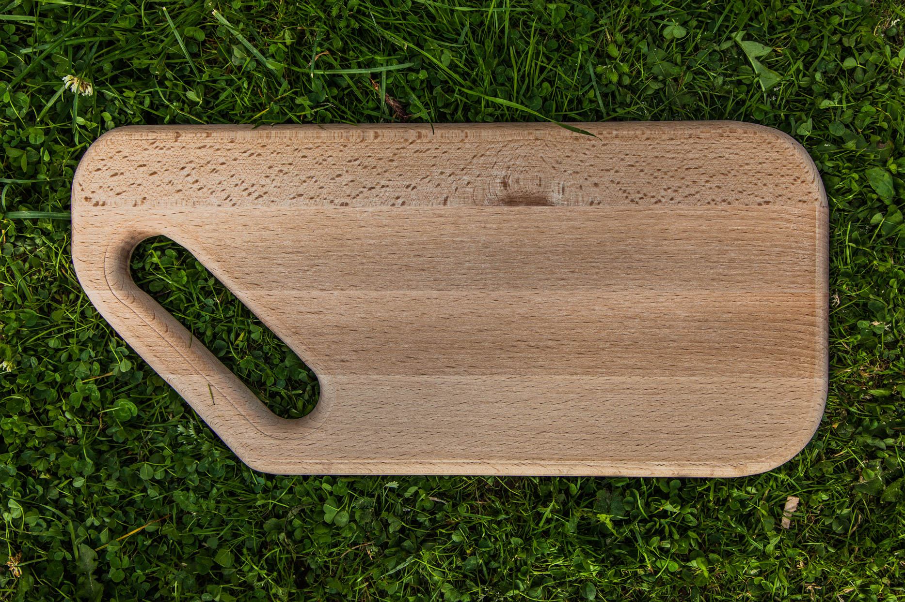

Умение работать с ручным электроинструментом открывает широкие творческие возможности. Дерево — прекрасный натуральный материал, несущий в себе тепло солнца и дыхание жизни величественного растения. Используя доски, бруски и щиты, умелец может создать большую часть своего окружающего пространства.

У нас осталось несколько кусочков **букового мебельного щита толщиной 18 мм** после [недавнего мастер-класса](/practice/ooley42/danilovskiy/) — отличное начало для какого-нибудь несложного деревянного проекта. За идеями далеко ходить не пришлось: щит уже нарезан на **заготовки 40х20 см** — идеальный размер для изготовления кухонной разделочной доски.

Для работы нам понадобятся следующие инструменты:

- электролобзик,
- дрель с набором кольцевых сверл-коронок (перовых свёрл или сверл Форстнера),
- ручной фрезер с фрезой для скругления углов с подшипником,
- шлифмашинка или просто наждачная бумага,
- струбцины для фиксации заготовки.

Первым делом разметим заготовку, наметив очертания будущей доски и отверстия ручки. Электролобзик, особенно с установленным ножом для фигурной резки позволяет выпилить практически любую форму. Мы выбрали форму **прямоугольника с усечённым углом** — просто и эффективно. Отверстие для подвешивания и переноски доски сделаем параллельно срезанной грани так, чтобы его верхняя часть совпадала с центром доски — так она будет висеть на крючке ровно и не будет занимать лишнего места.

Чтобы пилить ровно и уверенно, стоит сначала сделать пробный отпил где-то в ненужной части доски. Важно оценить надёжность фиксации заготовки струбцинами, скорость пиления и возможный угол поворота лезвия, особенно при работе с такой твёрдой древесиной как бук. Потренировавшись, уверенно спиливаем всё лишнее по намеченным линиям.

Скруглённое отверстие для ручки можно было бы выпилить и одним только лобзиком, но о ровных окружностях в таком случае оставалось бы только мечтать. Тут-то нам пригодится **сверло-коронка** нужного диаметра (также в этой ситуации может выручить соответствующее **перовое сверло** или **сверло Форстнера**). Установленные в обыкновенную дрель, коронки быстро вырезают ровную окружность. Вырезанный материал остаётся внутри коронки и может там застревать, что каждый раз требует разборки сверла для очистки. Сделав два отверстия на концах прорези для ручки соединяем их пропилами электролобзиком. Неровности отпила сошлифовываем грубой наждачной бумагой или напильником.

Доска смотрится эстетичнее и прослужит дольше если её края обработать фрезером. Толщина заготовки в **18 мм** позволяет использовать радиусную фрезу **крупнее 8 мм** для эффектного закругления всех краёв доски. Прежде чем начать фрезеровку нашей доски, важно выставить фрезу на правильную глубину и надёжно зафиксировать её в этом положении. Для проверки используем кусок ненужной доски. Мы выставили глубину чуть больше радиуса скругления, так чтобы оставался тонкий "бортик" вдоль края доски.

Тщательно закрепив заготовку, начинаем фрезеровать, внимательно следя за равномерностью движения и поворотов машины. Проходим по внешнему периметру заготовки, одним движением обрабатываем край отверстия для ручки. Повторяем то же самое и с обратной стороны доски. Готово! Осталось произвести финишную шлифовку и покрыть доску специальным маслом.

Масло набираем на **кусок тряпки или губки** и тщательно втираем в заготовку, стараясь не оставлять подтёков и разводов. Даём первому слою **просохнуть часов 8-12** и наносим финишный слой. Еще **сутки сушки** и доска готова к работе в нелёгких кухонных условиях. Твёрдая порода бука выстоит под натиском любых ножей, а обработка маслом предохранит древесину от влаги и загнивания. Напоследок посоветуем выделить отдельные доски для разных видов продуктов и не резать фрукты на пропитанной чесноком древесине. Приятного аппетита!

