Марафон городских действий «Делай Сам» вырос из небольшой экологической акции до масштаба ежегодных фестивалей городского активизма за каких-то 5 лет. Прекрасная в своей простоте идея самовольного улучшения города в духе DIY объединяет уже действующих активистов и их сообщества, а также тех, кто только знакомится с этим сравнительно новым явлением. Теперь [«Делай Сам»](http://www.delaisam.org/) — это открытая платформа, для синхронизации усилий десятков активистов в нескольких городах России и ближнего зарубежья, собственноручно воплощающих свои идеи в жизнь. Мы впервые посетили неформальную конференцию «Делай Саммит» в 2014 году в Культурном центре ЗИЛ, а на следующий год как команда OOLEY приняли активное участие в конференции на территории дизайн-завода «Флакон», где провели несколько мастер-классов по столярке и шитью на базе нашей [мастерской в прицепе](/practice/ooley42/). Мы полностью разделяем решительность в стремлении к самостоятельности, сотрудничеству и творчеству и рады сделать свой вклад в полезное общее дело.

> Делай Сам — это не бренд, не фестиваль и не организация. Делай Сам — это идея самовольного улучшения города своими руками. Вам не нужно никаких разрешений, согласований или договоренностей для того, чтобы разделять эту идею и собственноручно сажать цветы, делать лавки, раздельно собирать мусор или ездить на работу на велосипеде.

Группе художников и городских активистов, которые координировались через e-mail-рассылки и социальные сети, постепенно стало не хватать пусть и ежегодных, но всё же временных собраний. Нашлись те, кто всерьёз воспринял эти мысли и решились воплотить их в жизнь: Дарья Федотова и Марийка Семененко придумали Дом Культуры «Делай Сам/а» и взяли на себя инициативу сначала по поиску подходящего помещения, а затем и по организации его обустройства и работы. Несколько недель активных поисков, поездок и переговоров принесли свой результат: нашлось не только пустое складское помещение бывшей типографии, а ныне Центра городской культуры «Правда», но и средства на его ремонт и оплату нескольких месяцев аренды.

Активистское сообщество откликнулось на призывы к участию и буквально за месяц силами волонтёров бывший склад кофе превратился в просторный светлый зал с синим потолком. Своими силами и инструментами участники команды разбирали старые и возводили новые перегородки, прокладывали провода и трубы, штукатурили и красили стены и потолок. «Делай Саммит» 2016 пришлось немного сдвинуть с традиционно весеннего времени и он состоялся только в конце июня одновременно с открытием ДК «Делай Сам/а». К этому дню были закуплены несколько десятков хороших складных стульев, кто-то принес палеты (какой DIY без них?) и самодельную мебель из ДСП, заработали собранные по знакомым проекторы и колонки, включился кулер с горячей и холодной водой. Для активистов много вещей не нужно: Делай Сам — это в первую очередь люди и их идеи и инициативы. С традиционно насыщенной и разносторонней двухдневной программой новоселье получилось людным даже несмотря на разгар сезона летних отпусков. OOLEY снова принял участие в конференции, где мы продолжили развивать слегка затронутую на предыдущем саммите тему [шитья из использованных баннеров.](/practice/project/banner-bags/)

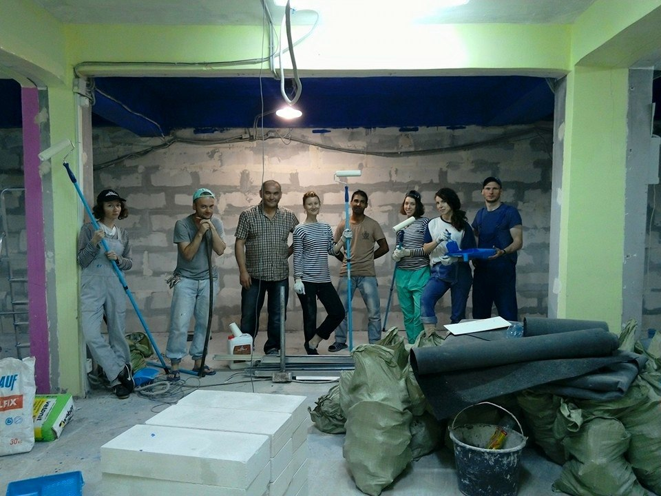
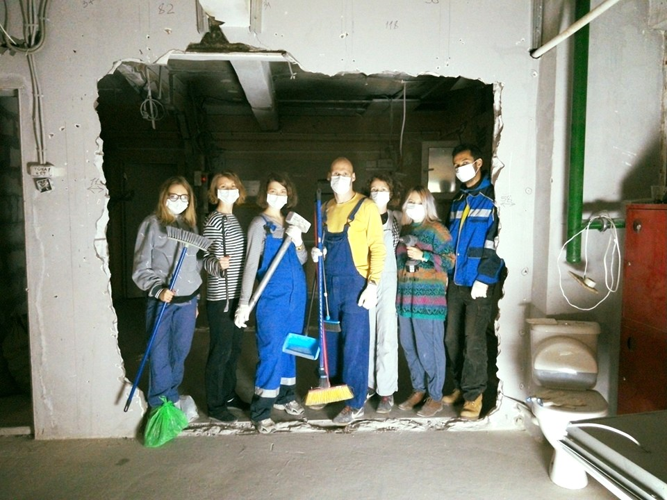

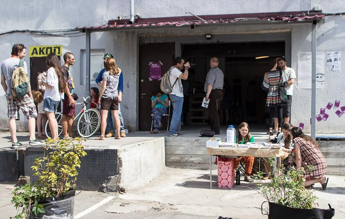
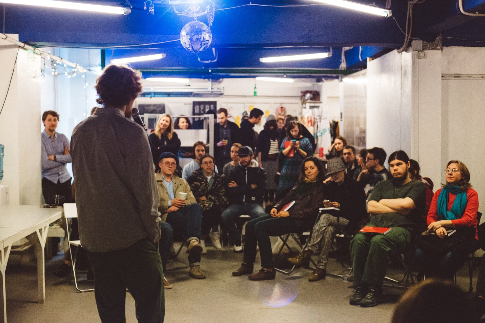

Когда ДК открылся, сразу стало очевидно, что его развитие и поддержание потребует ещё много коллективных усилий. Пустой зал с парой перегородок — ещё не Дом культуры. Обустройство было ещё только впереди. Для начала необходимо было придать более чёткую форму размытым представлениям о модели нового для России типа общественных пространств. Мы увидели возможность принять активное участие в реализации смелого культурного проекта, изучить новые навыки и применить на практике собственные умения. Передвижная мастерская OOLEY откликнулась на призывы о помощи в обустройстве и обживании пространства ДК и вскоре мы взялись за первый совместный проект.

## Стойка для кафе

Команда поваров дружественного вегетарианского кафе выразила готовность заняться важным направлением для привлечения гостей и средств на развитие пространства. Они сами закупили и привезли всё необходимое кухонное оборудование, оставалось только придать отведённой под кафе площадке подходящую форму. Выделенная прозрачной перегородкой из поликарбоната зона должна была отделиться от остального пространства высокой стойкой. Даша и Марийка обратились со своей идеей к Ольге Рокаль, архитектору из дружественного [творческого объединения «Утро»](https://www.facebook.com/utroarch),и вскоре получили детальную схему деревянной конструкции из брусков и ОСП. Дальше за дело взялись мы.

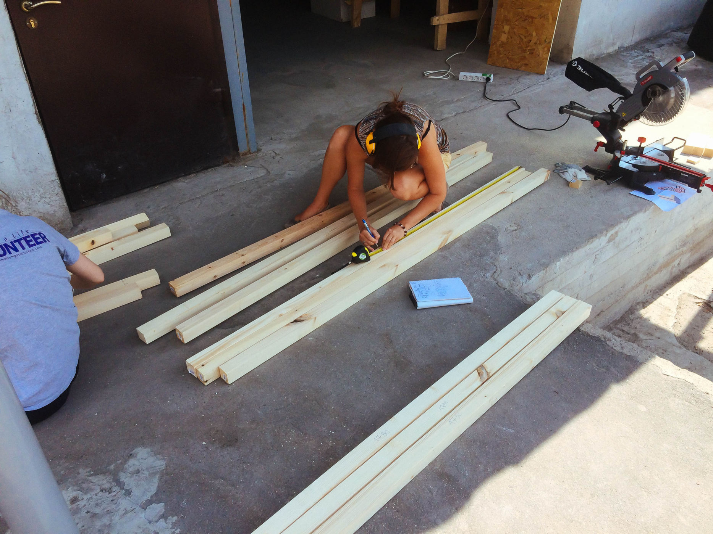
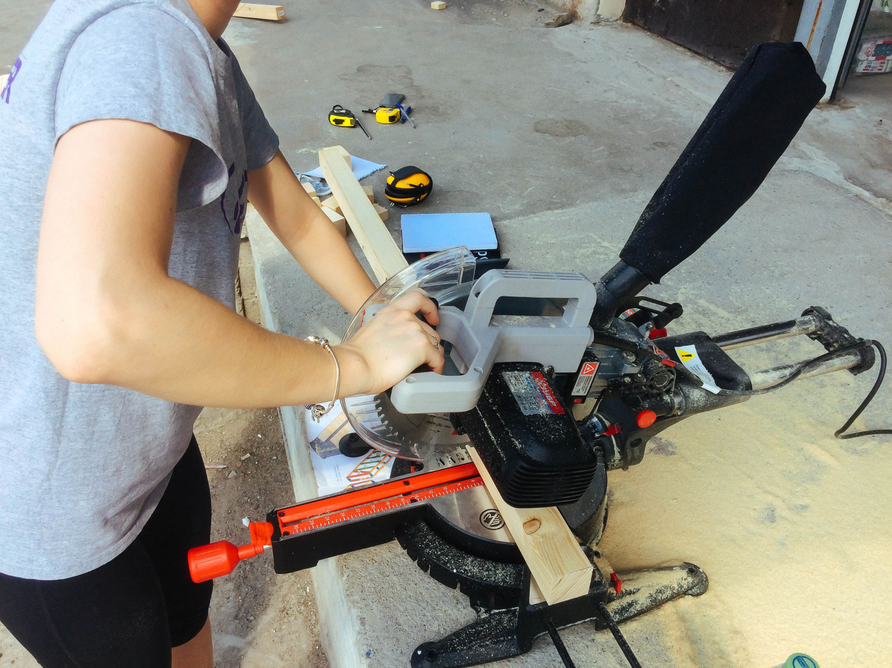
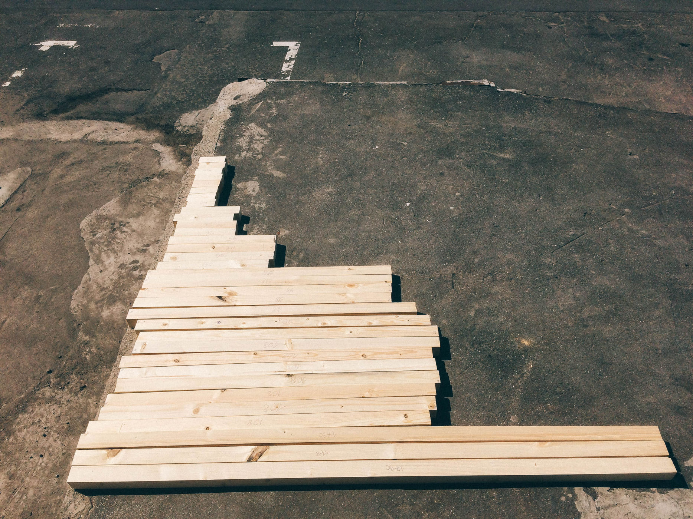

Упаковали передвижную мастерскую в машину, закупили необходимые материалы и позвали всех желающих присоединяться к строительству. С самого утра мы вместе с другими волонтёрами решительно начали пилить бруски 50х50 мм на торцовочной пиле согласно подробной схеме проекта. Собрав основные прямоугольные рамы для стойки и тумбочки, приложили и разметили диагональные укосины, необходимые для придания конструкции жёсткости. Важность этих элементов в конструкциях сложно переоценить, а в оформлении пространства ДК «Делай Сам/а» они стали ещё и одним из заметных элементов дизайна. На готовые рамы саморезами пришили ОСП, покрасив его серой алкидной эмалью. Столешницы вырезали из соснового мебельного щита, который покрыли несколькими слоями тонированного акрилового лака.

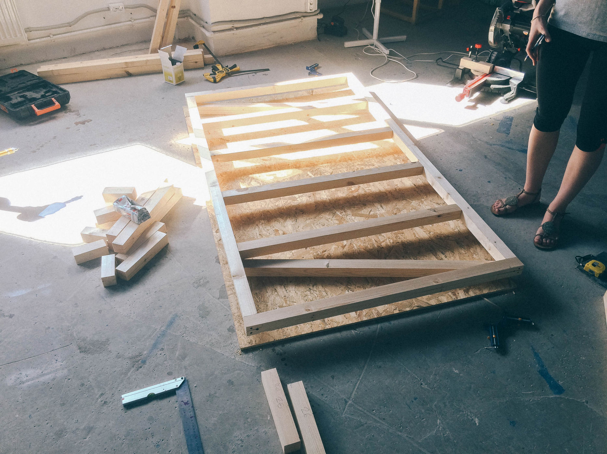

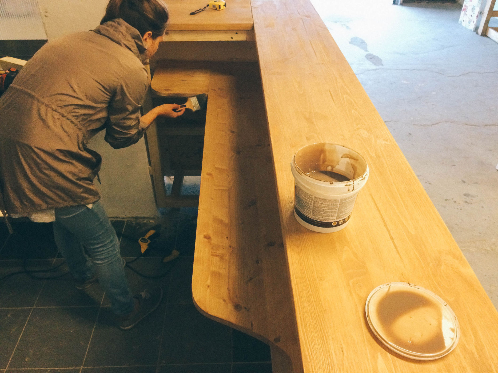

Только когда пришло время установить стойку на место выяснилось, что размеры помещения при расчётах использовались неверные и стойка оказалась короче проёма на несколько десятков сантиметров. Мы не растерялись, быстро адаптировали проект: скрепили тумбочку с основной стойкой и надёжно прикрепили всю эту конструкцию к колонне и полу. Вдоль дальней стены образовался удобный проход, где оставалось только слегка скруглить углы столешницы. Стойка получилась двухуровневой, причём как изнутри, где появилась дополнительная рабочая поверхность кухни, так и снаружи, где на икеевских консолях подвешен дополнительный столик для перекусов. Вскоре в ДК появились вкусные вегетарианские обеды и индийские сладости. Оставшиеся неиспользованными колёса мы прикрепили к одной из палет и, привязав к ней верёвочную ручку, сделали нехитрую тележку для перемещения тяжестей.

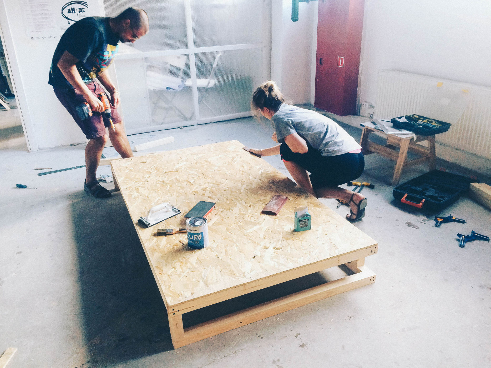

## Витрина шоу-рума «Переработка»

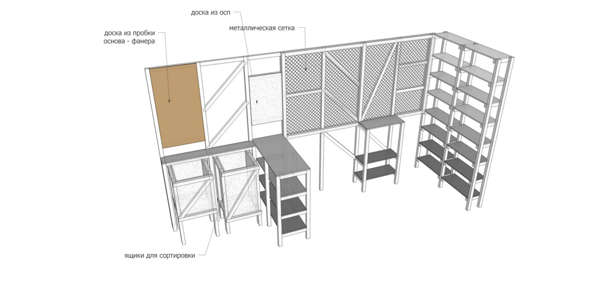

Вторым направлением, которое изначально виделось перспективным источником посетителей и средств, был небольшой центр создания, показа и продажи вещей, сделанных из переработанных материалов в формате апсайклинга, т.е. придания ненужным вещам новых свойств, делающих их полезными в каких-то новых областях применения. От переплавленных и разрезанных стеклянных бутылок до тетрапака и использованных баннеров — многие отходы могут стать подходящим сырьём для создания полезных в повседневности вещей. Повторное использование позволяет сократить не только отходы, но и расходы на производство новых предметов.

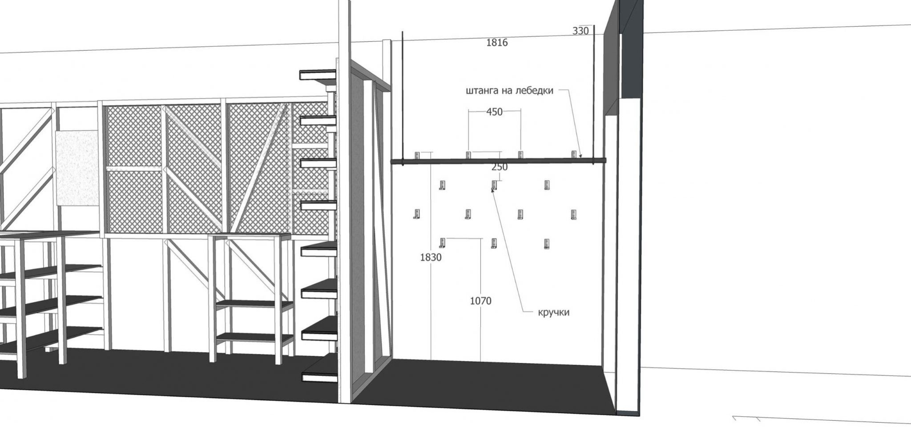

Идея шоу-рума «Переработка» превратилась в новый, чуть более масштабный, архитектурный проект: двухметровый стеллаж и приставная рама у стены с двумя столиками и различными поверхностями для размещения вещей и информации. Часть материалов для конструкции предоставили неравнодушные горожане: в дело пошли подаренные куски ОСП, оставшиеся от какого-то фестиваля, и привезённый с дачи кусок металлической сетки. Понадобилось только пополнить запасы бруса, шурупов и краски. Конечно, такой масштабный проект за один заход сделать сложновато даже при поддержке добровольцев, поэтому на этот раз основную часть конструкции мы запланировали собрать уже в рамках двухдневного открытого воркшопа.

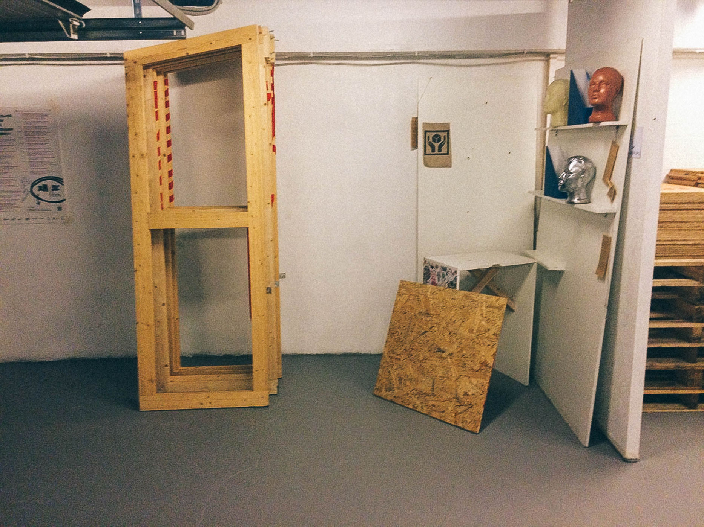

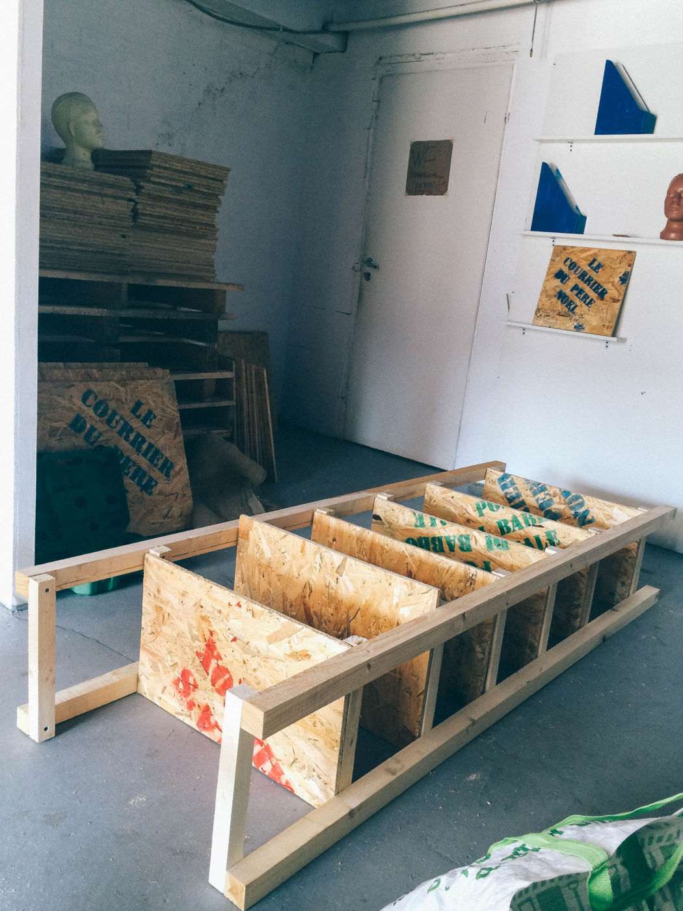

С самого утра мы начали пилить торцовочной пилой бруски в размер. Аня и Галя освоили работу с шуруповёртом и взялись собирать рамки для стеллажа с перемычками, к которым мы прикрепили нарезанные в размер полки из ОСП. Вместе мы смело переосмысляли исходный проект на ходу, адаптируя его под имеющиеся условия: отдельные «ноги» стенда мы связали опорным бруском, а саму конструкцию собрали в виде двух практически симметричных рамок с укосинами. Металлическую сетку закрепили, прижав её по периметру рамой из того же бруска. Каркас мы тут же на месте красили белой акриловой краской, а полки покрывали серой алкидкой на свежем воздухе. Краске нужно время чтобы высохнуть, а людям — чтобы набраться сил завершить начатое. Вскоре полностью покрашенные и соединённые друг с другом стеллаж, два столика с полками и стенд мы надёжно прикрепили к стенам и полу дюбель-гвоздями.

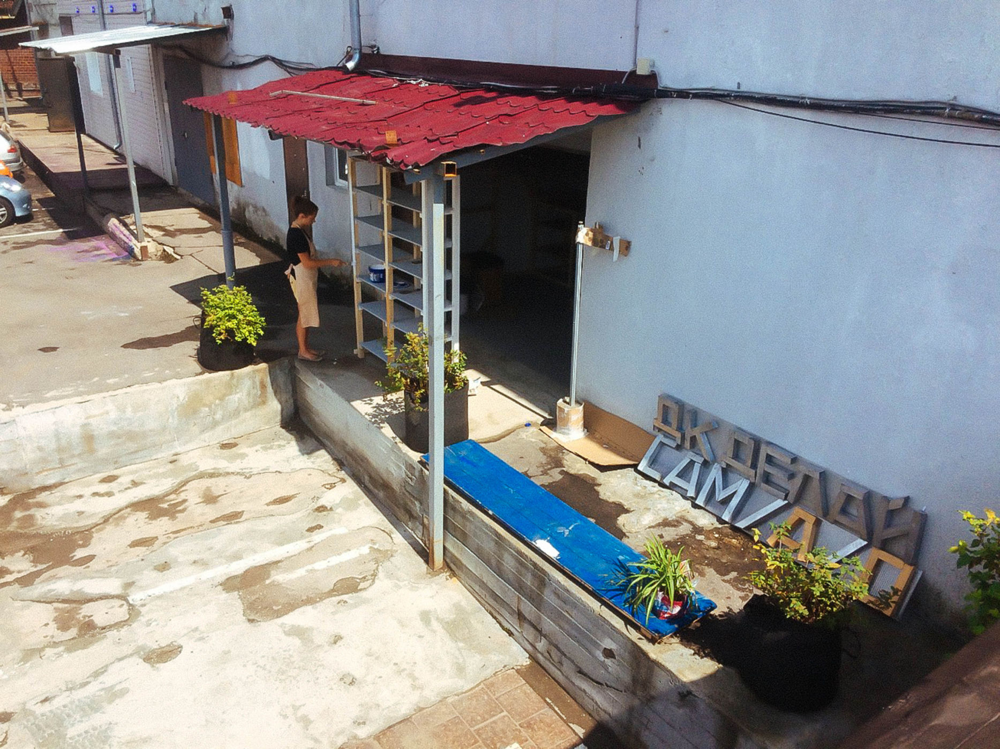

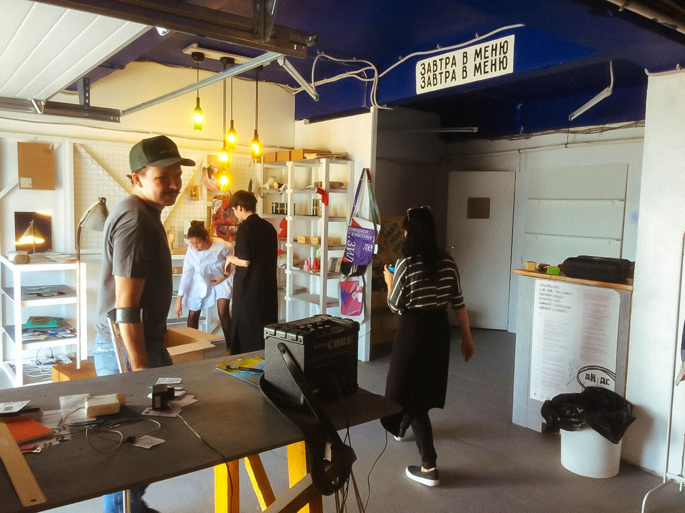

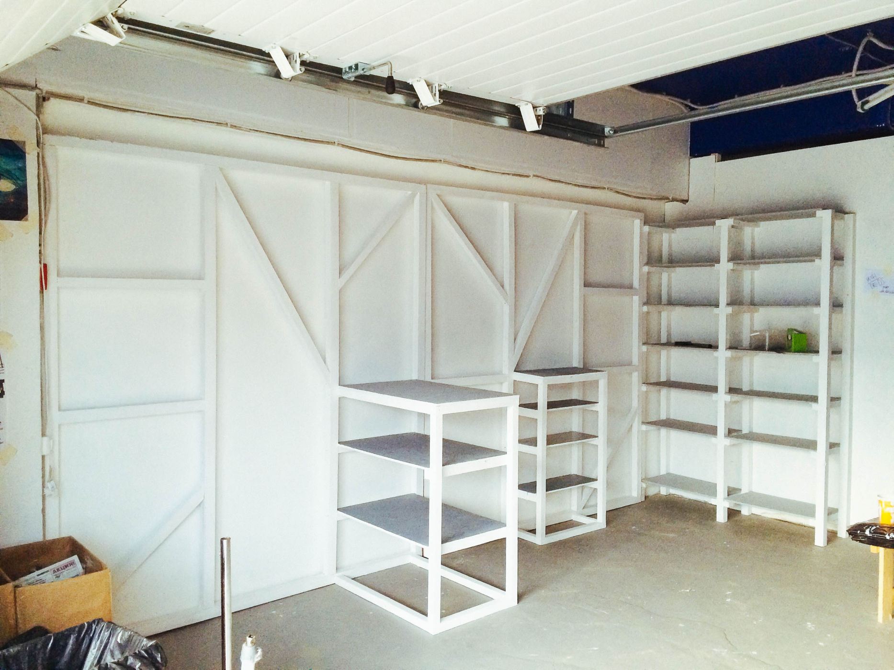

Нам удалось научиться делать доски для кнопок из фанеры и слоёв тонкой листовой пробки с помощью специального клея, но от размещения такой доски в шоу-руме решили отказаться. Вместо этого мы повесили у входа меловую доску, а рядом, впоследствии, поместили полупрозрачную светящуюся вывеску шоу-рума. Она собрана Аней и Галей из куска ненужного прозрачного пластика и рамки из сосновых реек. Однажды научившись работать с шуруповёртом, не перестаешь открывать для себя все новые конструктивные возможности. Мы аккуратно и ровно наклеили вырезанные на плоттере наклейки с буквами слова «переработка», потом покрыли всю вывеску несколькими слоями чёрной аэрозольной краски, а затем сняли наклейки, открыв прозрачные буквы, которые отлично выглядят при включении задней светодиодной подсветки, которую можно организовать LED-лентами или небольшими светильниками на батарейках.

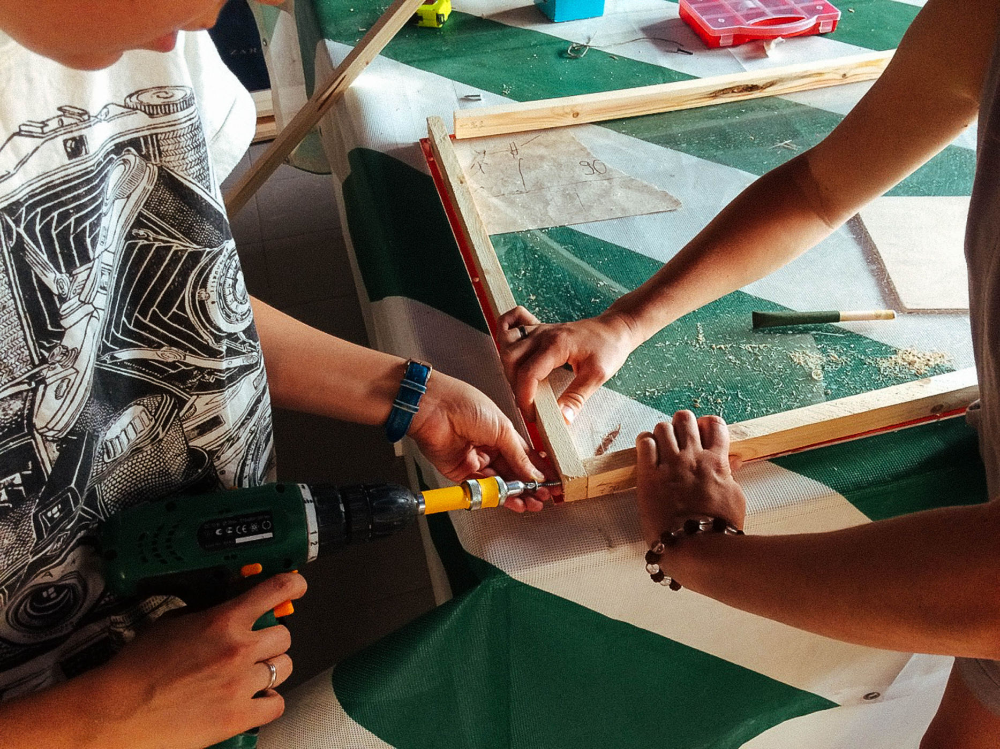
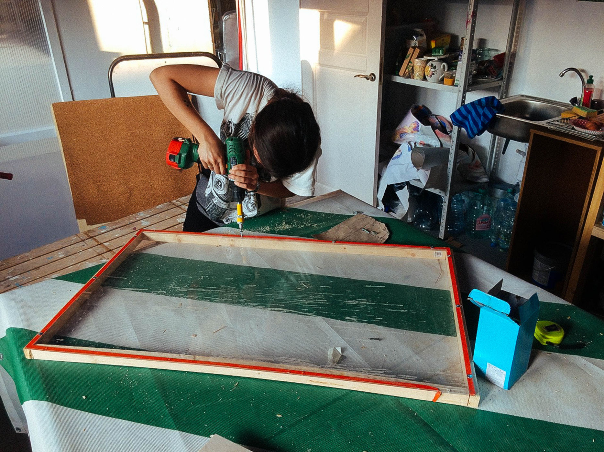

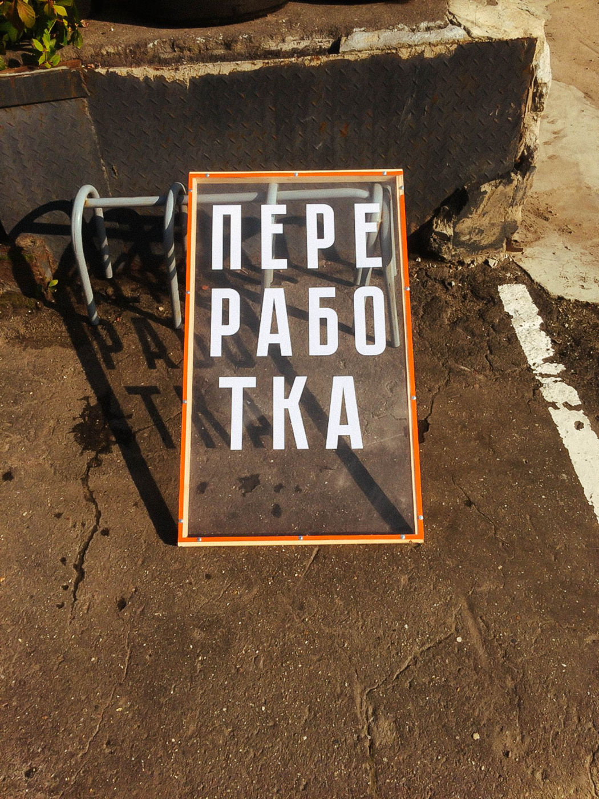

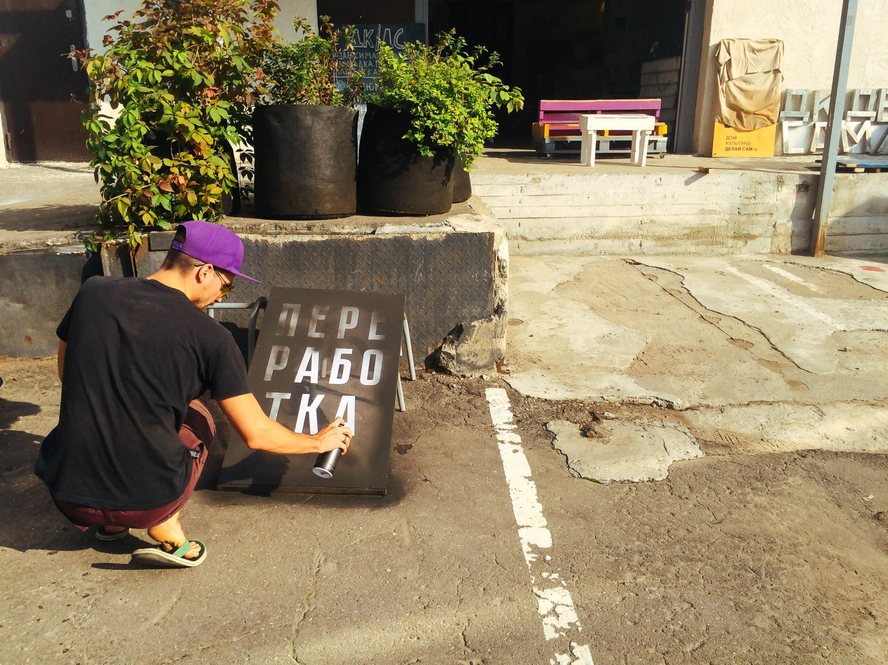

## Столы и стеллаж в мастерскую

Помимо основного зала для встреч и собраний в независимом Доме культуры с самого начала планировалось оборудовать небольшую творческую мастерскую, где художники и и активисты могли бы работать над своими проектами. Для этого в глубине пространства стеной, наполовину из прозрачного поликарбоната, была отгорожена небольшая комната с раковиной и хорошим освещением. На первое время туда принесли громоздкие самодельные столы из тонких листов ДСП, вдоль стены от складской сторожки остался хлипкий узкий стол. Постепенно это пространство стало местом, куда складывается всё, что было принесено в ДК, но не нашло своего места в основном пространстве: куски фанеры и пластика, рекламные щиты и баннеры, баллоны и банки с красками. А ведь ещё нужно где-то хранить инструменты и запасы материалов! Возникла острая необходимость в стеллаже и нормальных рабочих поверхностях. Снова за дело!

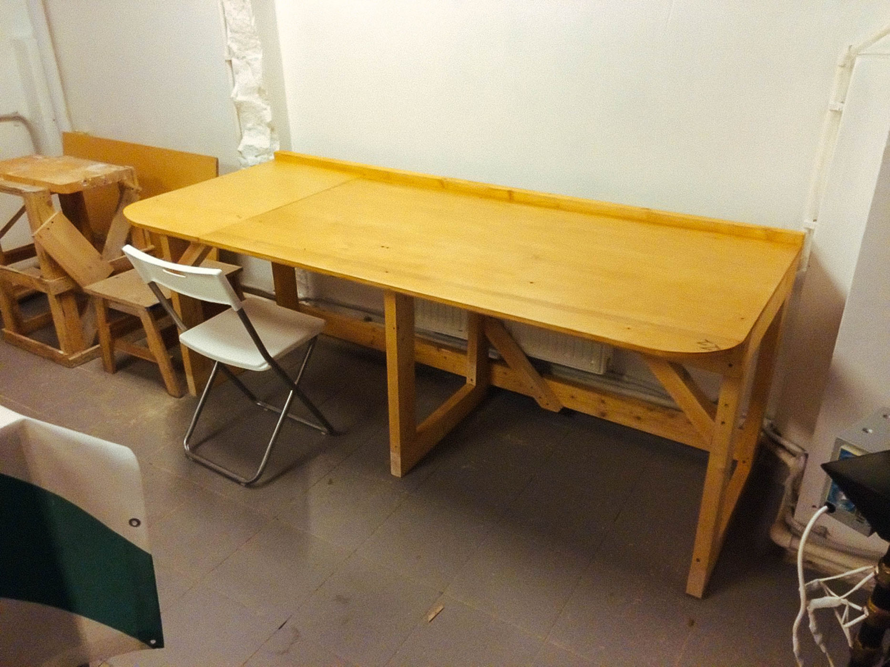

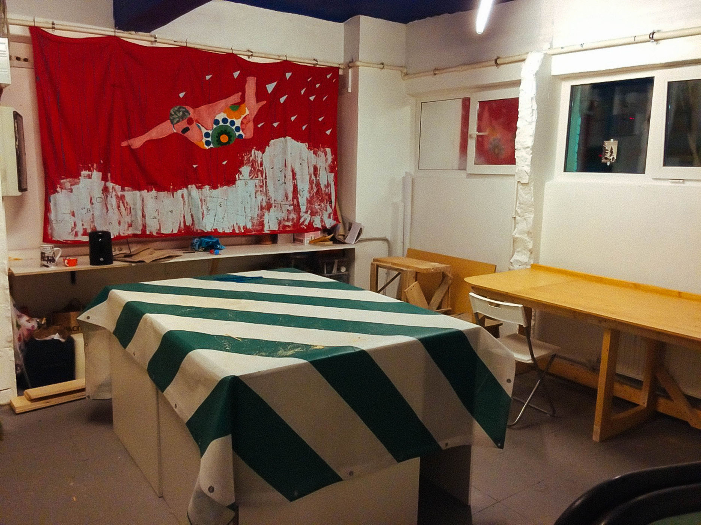

Всё больше проникаясь идеями переработки, мы постарались максимально использовать уже имеющиеся в нашем распоряжении материалы: каркасы мы строили из оставшихся от стойки и стенда брусков, а также из брусков, доставшихся от организаторов летних фестивалей. Собрав рамки из бруса с перемычками, мы связали их полками из обрезков ОСП. Всю конструкцию покрыли слоем акрилового лака и надёжно прикрепили к стене с помощью уголков и дюбель-гвоздей. В мгновение ока полки заполнились ящиками с художественными принадлежностями, инструментами и разнообразными материалами.

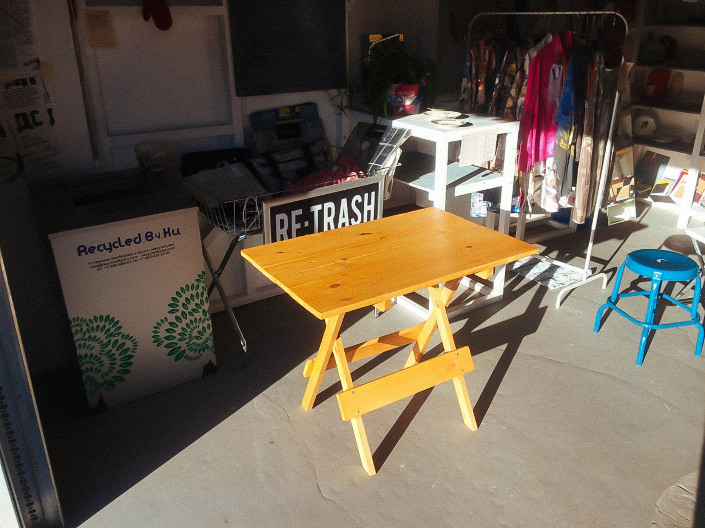

Следом пошли столы. Разобранные и распиленные фестивальные конструкции легли в основу крепкого и устойчивого рабочего стола. Три жёсткие рамки мы скрепили парой широких брусков, усилили конструкцию укосинами и накрыли сверху полутора листами фанеры. Шлифовка, тонированный лак — готово! Освоив эту нехитрую технологию, такую мебель вполне возможно делать в одиночку. Так второй стол, сделанный взамен неудобных коробок из ДСП, был сделан силами одного человека меньше чем за день. Во многом такая скорость обусловлена точностью и скоростью работы с торцовочной пилой, ради которых остальным обитателям и посетителям ДК, правда, пришлось потерпеть эти внезапные оглушающе громкие и пыльные запилы. 4 ножки, 4 бруска для подстолья и 8 одинаковых небольших укосин, делающих эту нехитрую конструкцию на удивление жёсткой. Всё та же фанера в качестве столешницы, покрытие всё тем же тонированным лаком. 80 см — подходящая высота для стола, за которым можно работать как сидя, так и стоя. Теперь рабочих поверхностей в мастерской хватит на всех.

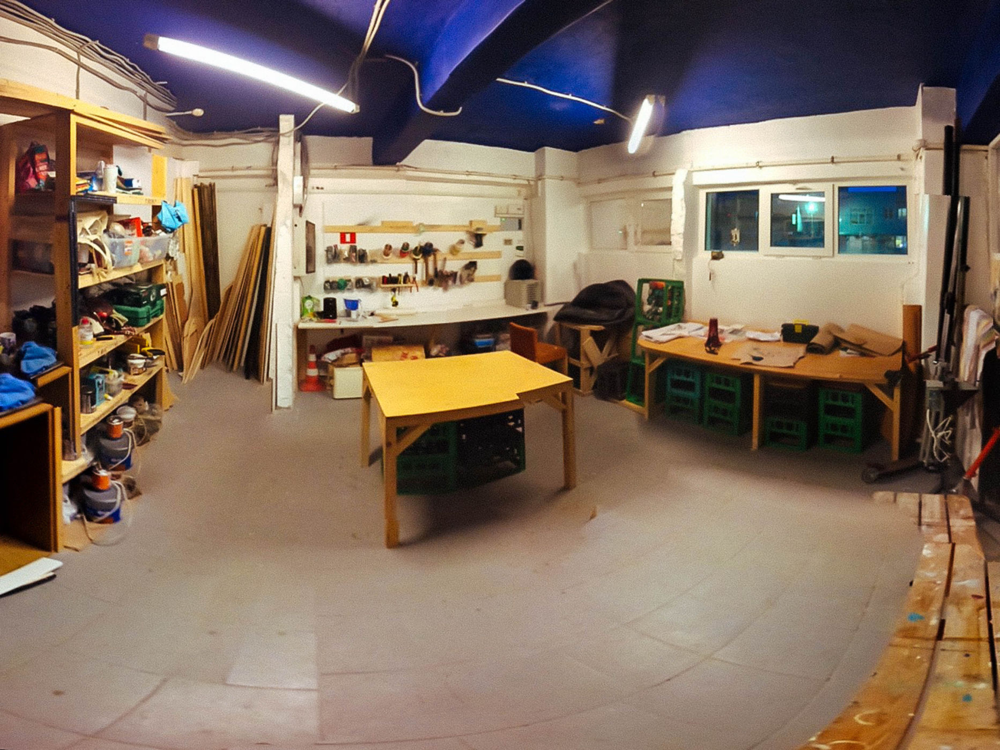

## Мобильный стол для переговоров

Следующим важным пунктом в обустройстве ДК стало изготовление длинного стола для встреч и переговоров. Снова готовы архитектурные эскизы, однако отработанный на столах в мастерской опыт подсказывал немного изменить запланированный дизайн. Использование коротких укосин в верхней части ножек стола позволяет избежать использования горизонтальных перемычек в нижней их части: так ничто не мешает ногам и можно спокойно придвинуть стул и расположиться за столом с максимальным удобством.

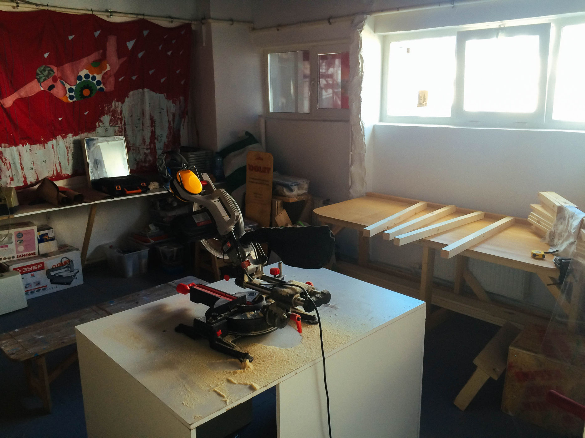

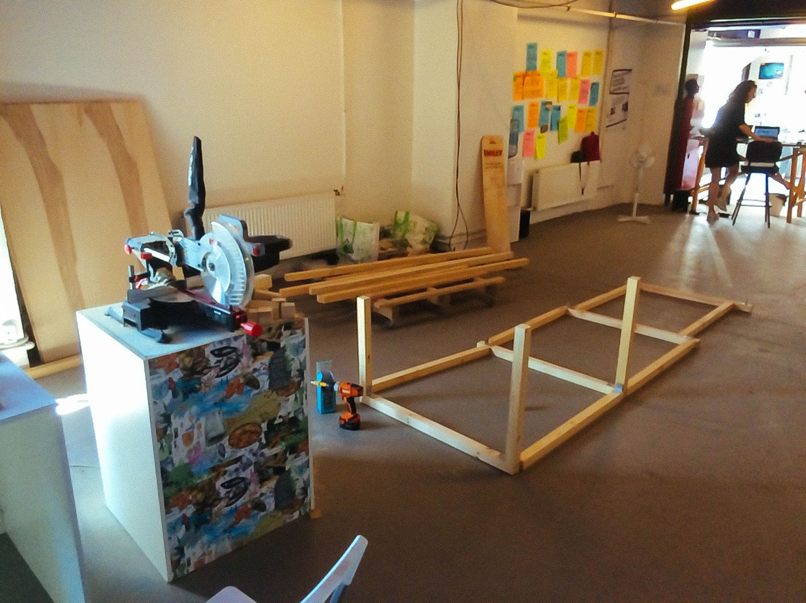

Снова грохочем торцовочной пилой: пилим метровые бруски для трёх секций подстолья. Стол для переговоров и работы за компьютером должен иметь высоту чуть выше обеденного, но, конечно, ниже рабочего верстака. При выбранной высоте рабочей поверхности в 75 см, оставляем 5 см на толщину бруса подстолья, 2 см на столешницу и пилим 4 бруска ножек длиной 68 см. Ещё 4 ножки будут с колёсами, так что делаем их короче на высоту колёс, в нашем случае — на 10 см. Целых 20 укосин отпиливаем длиной около 30-35 см. Собираем секции с помощью саморезов, уголками закрепляем ножки на своих местах. Затем каждую из них укрепляем укосинами по каждому направлению. Укосины крепим шурупами, вкручивая их в заранее просверленные под нужным углом отверстия.

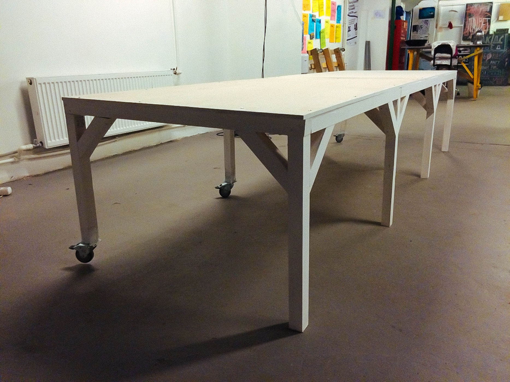

Только когда пришло время установить колёса, выяснилось, что их крепёжная площадка немного больше среза бруса 50х50 мм. Вкручивая шурупы в самые уголки крепления, можно зацепиться за брусок, но такому соединению не хватает надёжности: боковые нагрузки могут легко вырвать крепление. Опыт исследований в области переработки и творческого использования вторичного сырья подсказал отличный способ укрепить слабые места. Всё гениальное просто: мы натянули на места присоединения площадок колёс цилиндры из обрезанных полуторалитровых пластиковых бутылок, которые затем нагрели с помощью технического фена. Нагреваясь, ПЭТ значительно сжимается, надёжно стягивая всю конструкцию, а также становится более прочным и жёстким, что ещё больше усилило место крепежа. Осталось традиционно покрасить бруски в белый цвет, а столешницу из 12 мм фанеры покрыть серой акриловой краской и тремя слоями глянцевого акрилового лака. Стол получился крепкий и устойчивый, но при этом настолько лёгкий, что практический каждый сможет перекатить его в любой угол зала в одиночку.

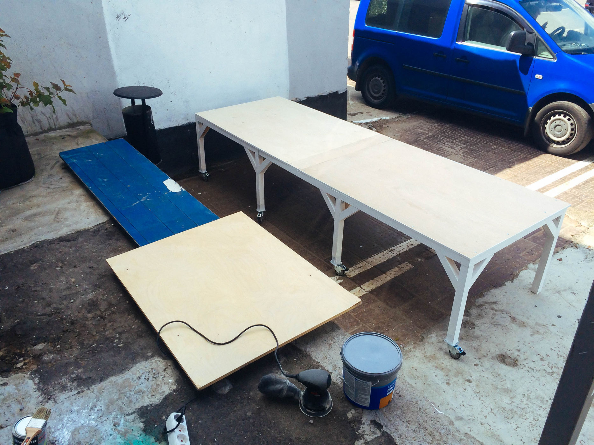
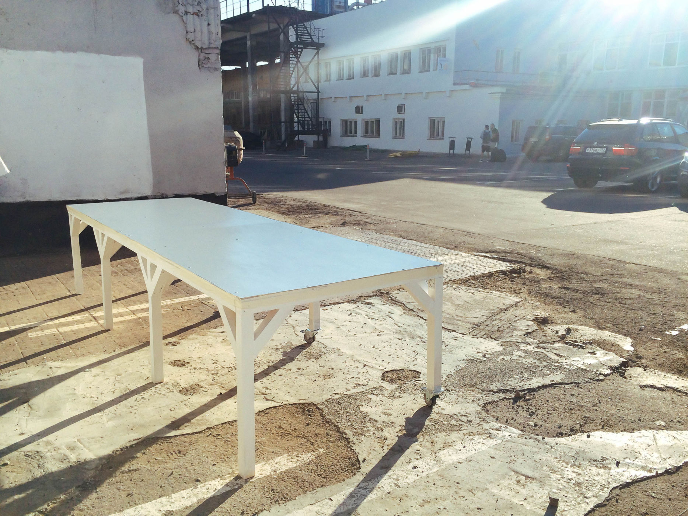

## Стол из бумажных стаканчиков

Ворота ДК «Делай Сам/а» выходят во внутренний двор ЦГК «Правда», где в обычные дни паркуют свои машины работники и посетители многочисленных музыкальных, фото- и тату-студий, танцевальных залов и многих других заведений. Иногда эту парковку освобождают от машин и используют как площадку для проведения различных городских фестивалей. Организаторы планировавшегося здесь пивного фестиваля прониклись идеями переработки и предложили команде ДК принять участие в событии. Изучая возможные варианты сотрудничества, мы нашли и развили идеи DIY-переработки бумажных одноразовых стаканчиков, которые на таких событиях расходуются в огромных количествах. Мы задумали создать сразу два крупных объекта из использованной бумажной тары, при этом приглашая всех желающих поучаствовать во всех этапах их воплощения.

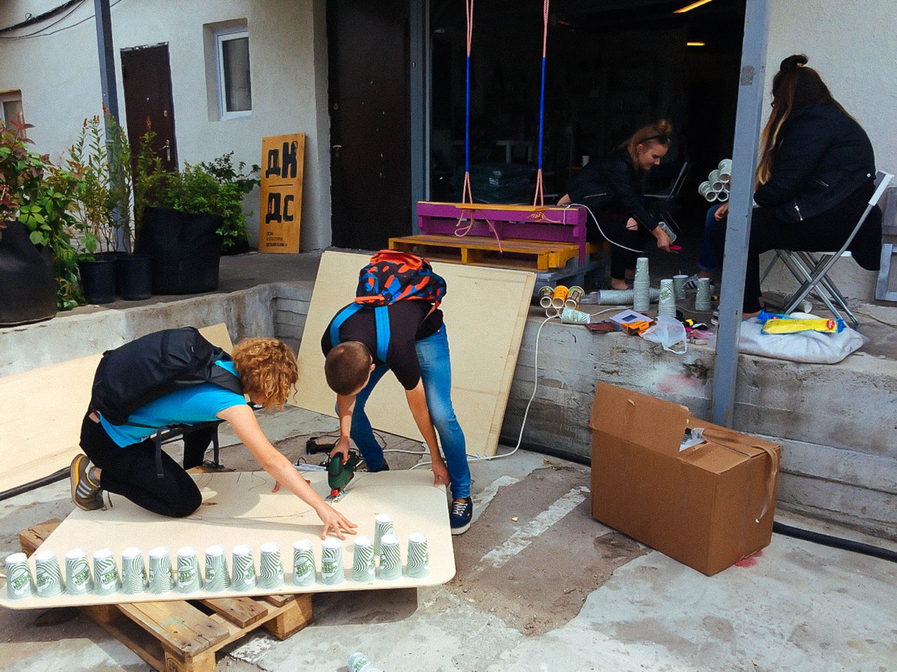

Задумка была следующая: собрать, скрепляя стаканы без донышек степлером, большой шар — люстру, а также высокий стол-стойку из послойно приклеенных к тонкой фанере стаканчиков. Мы закупили несколько листов фанеры, по несколько недорогих термоклеевых пистолетов и степлеров, а также запас стержней и скоб к ним. Пока фестиваль ещё готовился открыть свои двери для горожан, мы вместе с волонтёрами события протестировали наши задумки и сделали первые шаги по их реализации: вырезали из фанеры форму будущей стойки и наклеили первые полтора ряда стаканов, а также скрепили большую часть шара. Остальную работу мы предложили проделать посетителям праздника. Для этого мы оборудовали бочку со шлангом для мытья стаканов и запас сухих тряпок для их последующего вытирания (влага может покоробить фанеру, а термоклей не склеивает влажные поверхности). Многие гости фестиваля с радостью откликнулись на наш призыв и ряд за рядом стол начал расти. Сухой стаканчик ставится на фанеру, затем пистолетом равномерно по всей окружности приклеивается к ней термоклеем. Когда слой готов, он накрывается ещё одним куском фанеры и приклеивается к нему по периметру.

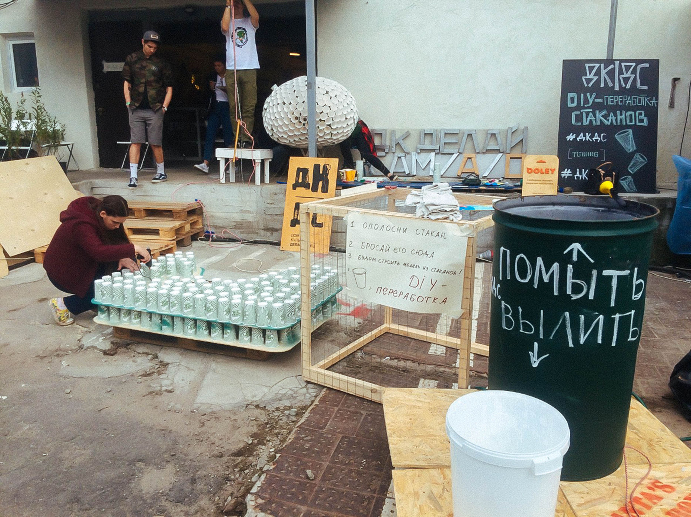

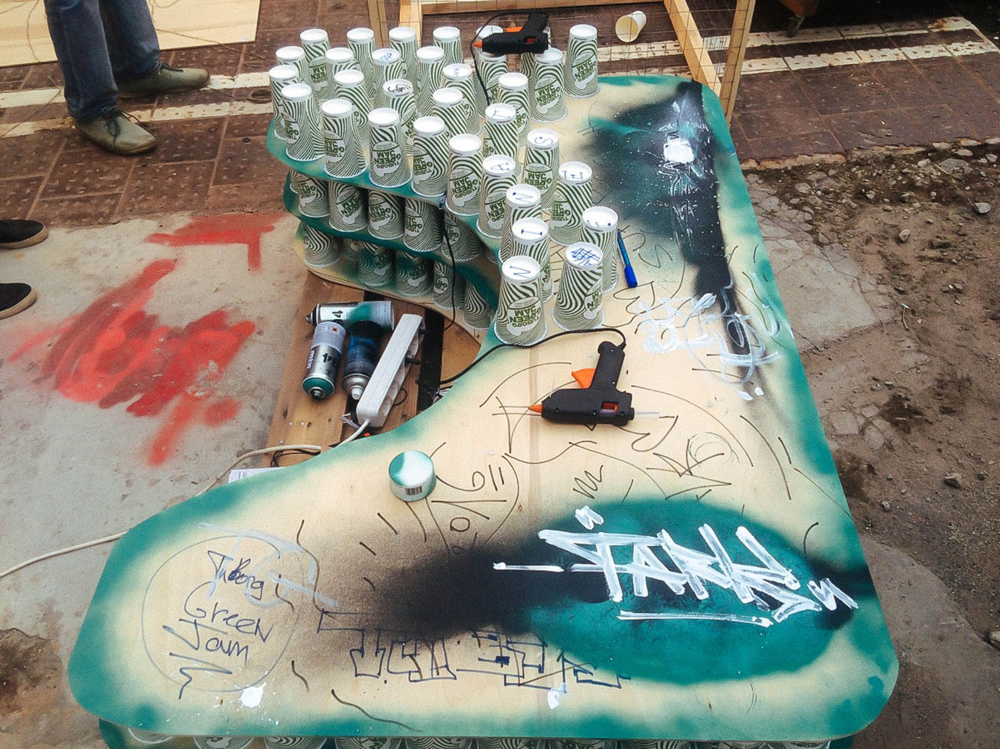

Мы задумали сделать не просто письменный стол, а высокую стойку администратора ДК, высота которой примерно 80 см, что потребовало целых 7 слоёв стаканов. Конечно, усилий отдельных добровольцев было недостаточно, но мы смогли организовать сбор, сортировку и мытьё стаканов из мусорных баков, расставленных по территории фестиваля. Мыли, вытирали и клеили по-очереди все вместе. Стемнело, но мы были уверены, что справимся и закончим стол, пусть и к самому закрытию фестиваля. Так и получилось. Неустанными совместными усилиями нам удалось не только успеть собрать из мусора полезный элемент мебели, но даже покрасить его аэрозольными красками и установить в ДК неподалёку от входа. Конструкция получилась вполне устойчивой и прочной. Столешницу мы сделали из чуть более толстой фанеры слегка иной формы, покрасили её чёрным акрилом и покрыли парой слоёв матового лака. Так гости фестиваля получили новый необычный опыт экологически ответственного праздненства, а ДК|ДС обзавёлся новым полезным элементом мебели.

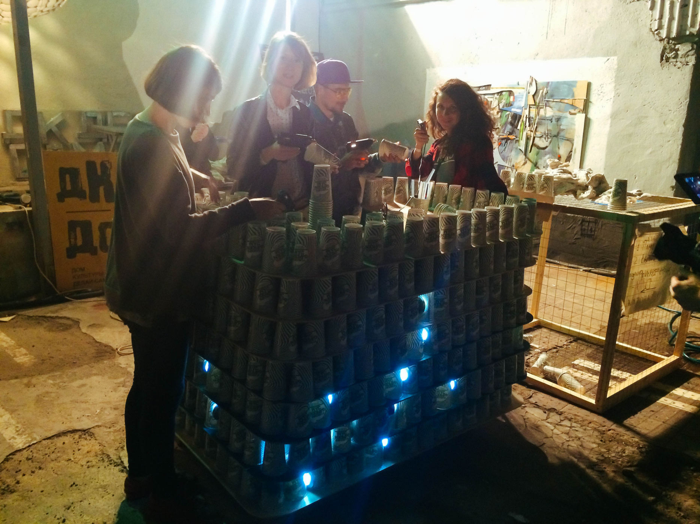
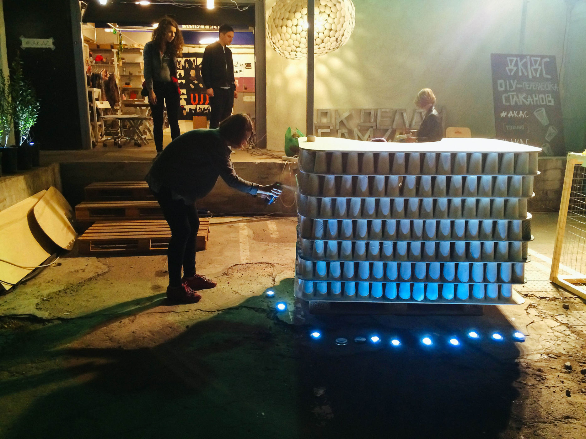

## Мебель в мастерскую из ящиков от стеклотары

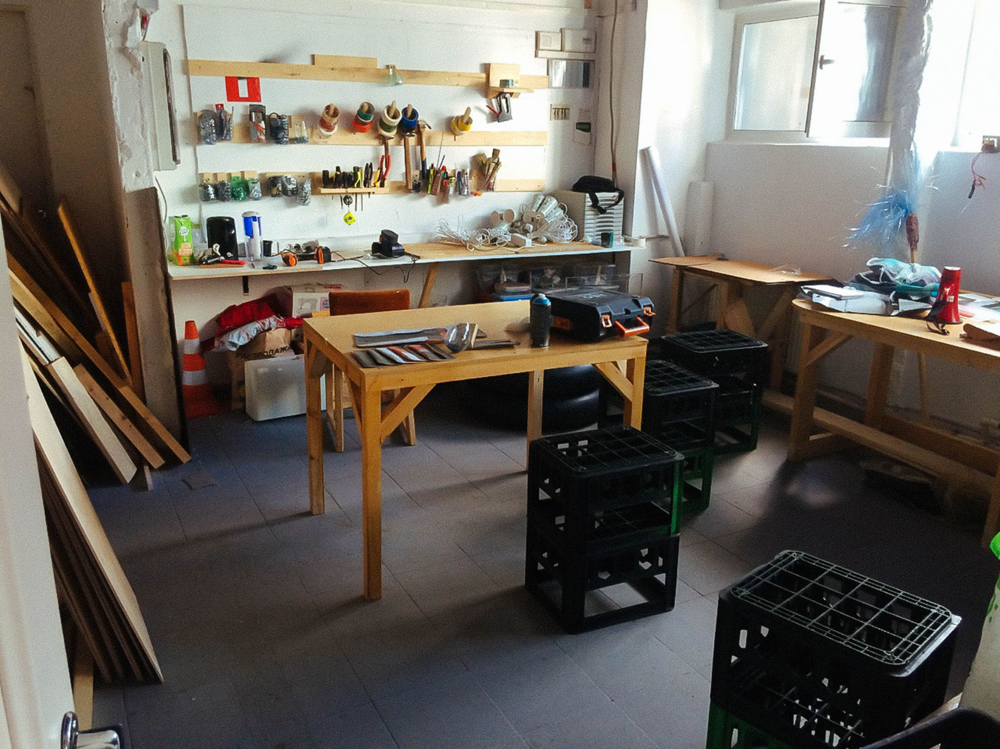

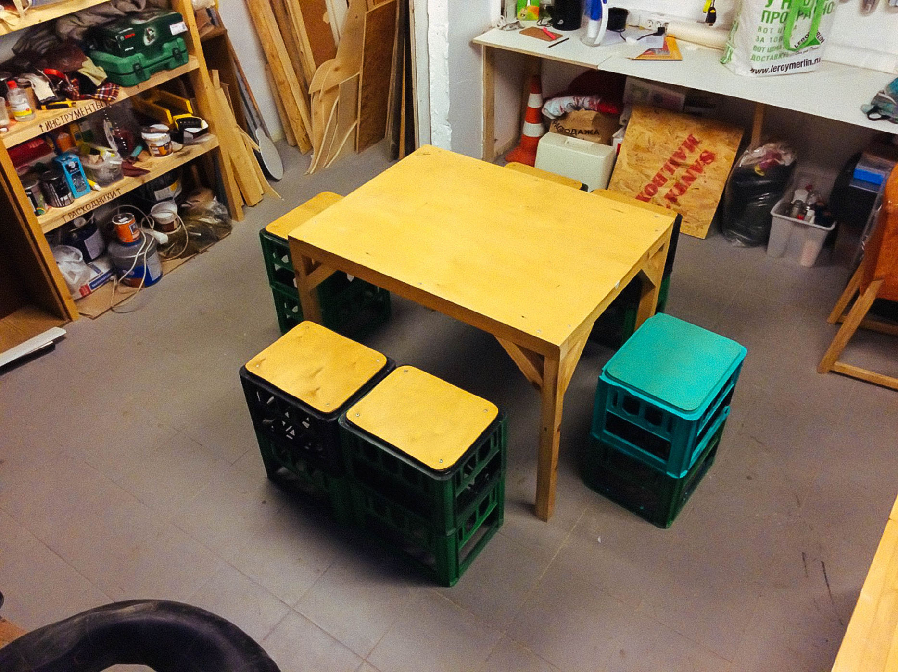

Переработка пивного фестиваля принесла ДК не только удобный стол. На следующий день мы увидели на помойке целую кучу пластиковых ящиков, использовавшихся для создания импровизированной фестивальной мебели. Эти ящики уже один раз претерпели превращение в мебель, а мы придумали, как их применить и у нас. Ставим один перевёрнутый ящик на другой, скрепляем их по углам саморезами, а сверху накрываем дно вырезанным по форме куском тонкой фанеры. Крепим её шурупами, покрываем краской или лаком — табурет готов. Высота такой стопки ящиков слегка высоковата для сидения за обеденным столом, но она идеально подошла к нашим рабочим столам. Мы принесли целую гору ящиков и собрали 8 табуретов, которые аккуратно убираются под столы и всегда готовы не только к удобному размещению участников воркшопов, но и могут служить дополнительной рабочей поверхностью. Оставшиеся ящики мы скрепили торцами с помощью нейлоновых стяжек и, установив под небольшим углом, превратили в стойку для удобного хранения баллонов с аэрозольной краской и лаками.

## Места сидения

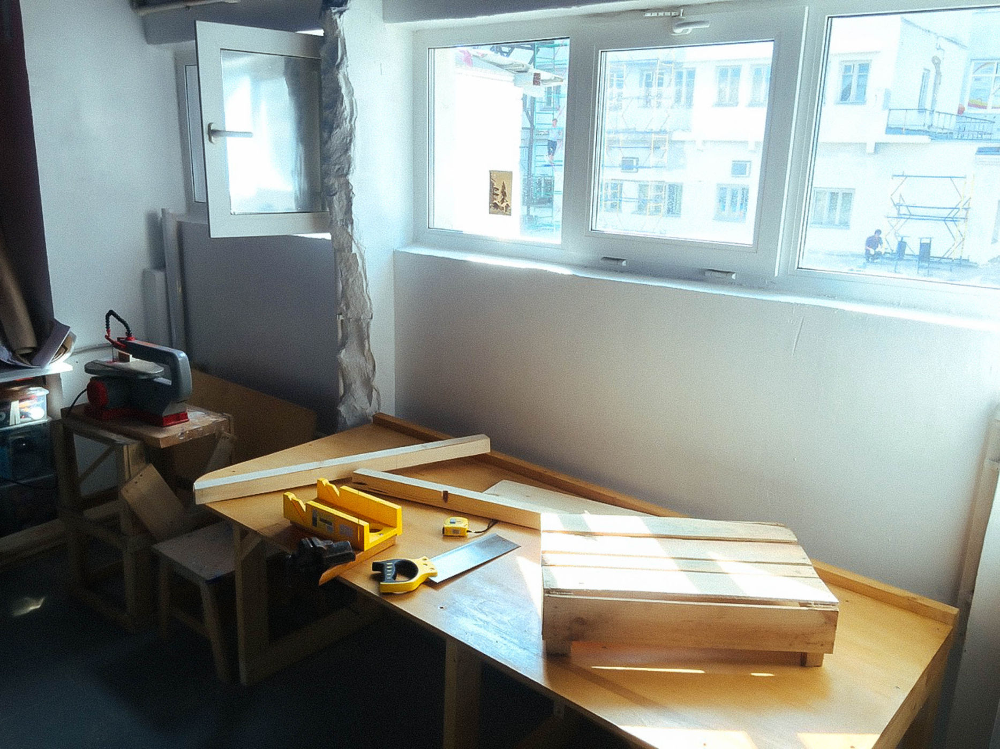

Лёгкие складные стулья идеально подходят для рассаживания рядами зрителей, работы за длинным столом и перекуса у стойки кафе. Но этим возможности размещения для гостей ДК не ограничиваются. Кому-то захочется присесть у высокого стола-стойки, а летом всех так и тянет побыть подольше на улице. Мы ищем вдохновение в сети и в мусоре, находя новые идеи по переработке ненужных вещей в общественную мебель. Неравнодушные горожане принесли в ДК элементы мебели, мы нашли способы их переработать. Например, стул без сидения мы восстановили, вырезав кусок ОСП нужной формы и обтянув его яркой тканью, тоже переданной ДК в качестве дара.

Не всегда всё так просто. Чтобы сделать ещё один высокий барный стул, мы взяли за основу мягкое сиденье со спинкой из кожзама. Для него мы с помощью ручной пилы, стусла и шуруповёрта собрали из брусков крепкую опору, покрасили её белым акрилом и прикрепили к сиденью пластиковыми хомутами. Кому-то такая мебель может показаться непрезентабельной, но она отлично передаёт утилитарный дух DIY-движения. Из деревянного ящика от фруктов те же инструменты помогли собрать небольшую табуретку. Пару мягких компьютерных кресел, которые кто-то вынес на помойку «Правды» было достаточно просто перекрасить и они сразу нашли своё место в библиотеке ДК. Конечно, такие решения нельзя считать долгосрочными, но умение находить возможности оперативно решать возникающие задачи практически без денег — действенный способ развития некоммерческого волонтёрского проекта в условиях современного мегаполиса.

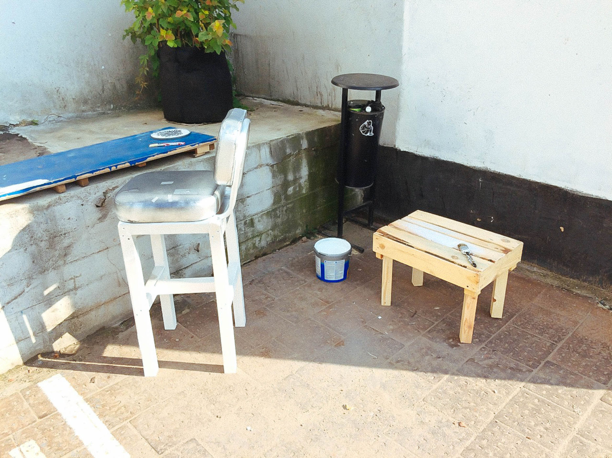

Поставив ещё один деревянный поддон на колёса, мы нарастили его высоту двумя половинками палеты, а посередине сделали общую спинку, сформировав передвижную скамейку, на которой приятно посидеть на уличном пандусе летним вечерком. Вместе мы придумали расцветку и покрасили всё аэрозольными красками. Для удобства пришлось взять в руки «болгарку» с шлифовальным диском и сточить острый край поддона, упиравшийся в спину. Такое скругление сделало скамейку вполне удобной.

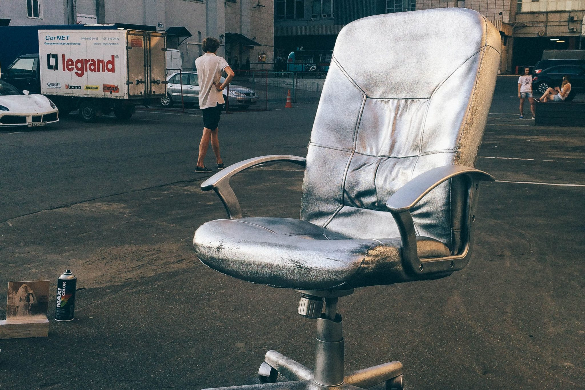

Когда для кафе в ДК понадобились дополнительные столики, стало ясно, что из имеющихся обрезков и находок сделать что-то достаточно лёгкое и аккуратное не получится и мы предложили использовать для этих целей комплект для сборки, изготовленный нами в столярной мастерской. Мы привезли в ДК набор [«Стол-Х»](/practice/project/stol-x/), состоящий из 6 деталей ножек из лиственницы, 6 сосновых досок столешницы и подготовленных к расклёпке 4 алюминиевых втулок. В таком виде стол при перевозке занимает очень мало места, а сборка его до готовности производится за 15—20 минут. Молоток и стальной боёк для расклёпки быстро соединяют каркас, к которому шуруповёртом притягиваем столешницу. Стабилизируем конструкцию перемычками внизу и остаётся только покрыть все это матовым лаком — складной столик для кафе готов.

## Хранение мелочёвки в мастерской

Деревянный стеллаж в мастерской помог найти место имеющимся инструментам и коробкам с материалами. Полка на кронштейнах над рабочим столом дала место для хранения рулонных и листовых материалов. Но встал вопрос о хранении небольших инструментов вроде отвёрток и плоскогубцев, а также всевозможных шурупов, винтов, гаек и других полезных мелочей. Исследуя варианты простых и дешёвых решений, мы остановились на использовании удобной системы «французский клин» (["french cleat"](https://en.wikipedia.org/wiki/French_cleat)).

Для такого крепления достаточно распилить доску вдоль циркулярной пилой с лезвием, установленным под углом 45°. Так получаются две детали, идеально совмещающиеся друг с другом и способные надёжно удерживать даже значительный вес. Для этой системы мы отвели стену над длинным столом в мастерской. Стена там сделана из гипсокартона и для надёжного крепления опорных планок понадобилось использовать довольно много шурупов. Мы не планируем вешать на эти планки какие-то тяжёлые полки, а для мелочёвки запаса прочности должно хватить. Ответную часть доски мы распилили на множество небольших кусочков, каждый из которых стал основой для создания отдельных единиц хранения. Основную массу таких модулей мы сделали из обрезанных пластиковых бутылок. Треугольные обрезки от укосин пошли в ход как уголки при сборке полки с отверстиями для отвёрток и ножниц. Вкручиваем пару саморезов в ответную планку и получаем модуль для подвеса молотка. Присоединив на клей и шурупы фанерные площадки и обрезки реек, мы сделали модули для хранения множества видов клейких лент, незаменимых в мастерской. Удобно разместив основную массу мелочёвки на стене, мы продолжаем пополнять систему новыми модулями по мере необходимости.

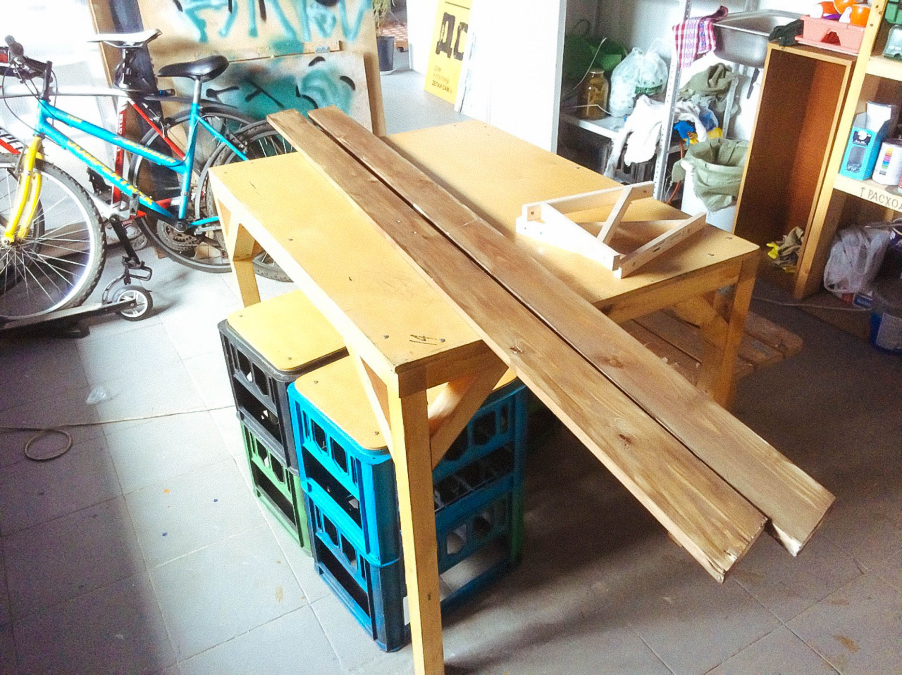

## Дзен-гардероб

Лето в Москве довольно короткое и уже в сентябре погода стала по-настоящему осенней. Наступило время курток, зонтов и дождевиков. Понятно, что всё это гостям ДК нужно куда-то вешать, пришла пора обустраивать гардероб. Мы давно обсуждали варианты его реализации: рассматривали идеи с множеством настенных крючков и подвесными системами. Но когда пришло время воплощать идеи в жизнь, мы увидели куда более простые и дешевые альтернативы. В магазине нужно было купить только трёхметровую профильную стальную трубу, а все остальное нашлось в мастерской. Скруглив две грани бруска рубанком, мы просверлили в одной из них ряд отверстий, в которые вбили готовые деревянные шканты. Покрыли вешалку лаком и прикрутили шурупами с обратной стороны перегородки из ОСП. Для крепления к стене стальной штанги мы выпилили из обрезков широких брусков две колодки с пазами по размеру трубы. Закрепив их к стойке и стене шурупами, вставлили в пазы предварительно загрунтованную и покрашенную белой аэрозольной краской штангу. Простая, но очень вместительная гардеробная система готова принять на себя вес нескольких десятков курток и пальто. Главное — не испытывать штангу подтягиваниями.

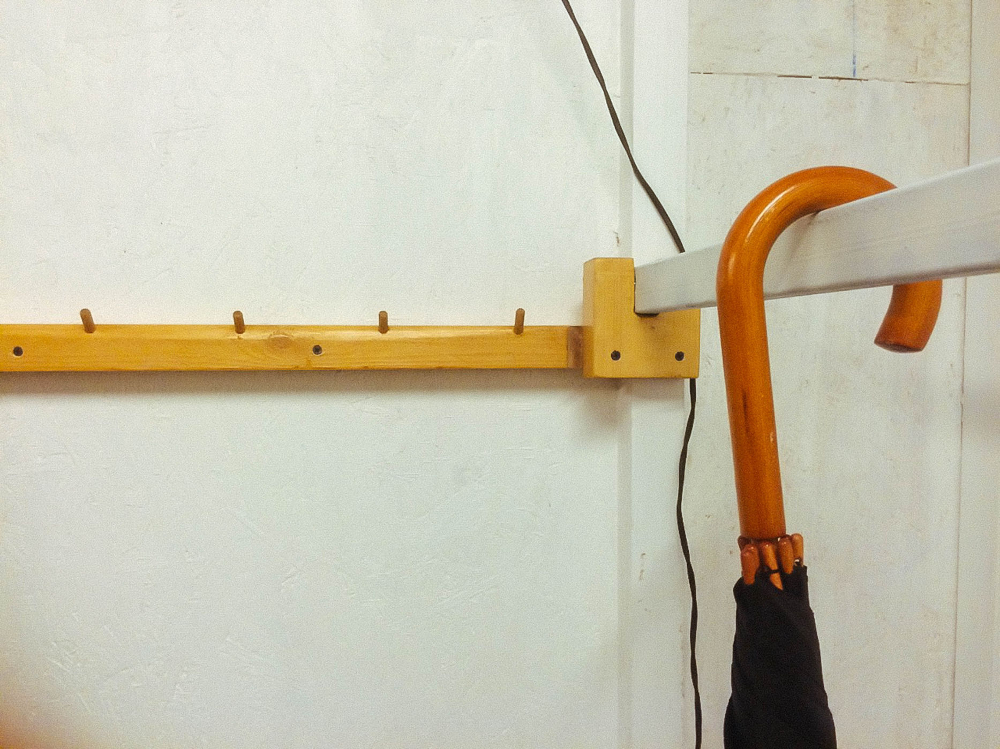

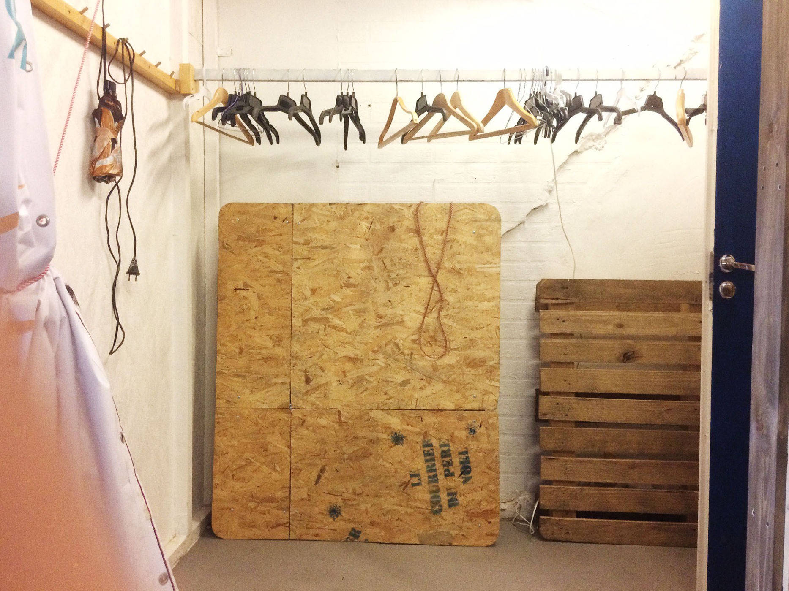

Также чтобы более чётко отделить зону кафе от гардероба и двери, ведущей в туалет, мы возвели новую полупрозрачную перегородку из двух подаренных кем-то ДК дубовых палет. Отшлифовав старые загрязнения, мы увидели красивую живую текстуру этого благородного дерева и решили оставить его без отделки. Закрепив первый поддон дюбель-гвоздями к полу и стене, мы водрузили на него второй и скрепили их друг с другом. Без усиления дополнительной стойкой внешнего края перегородка получалась довольно хлипкой и мы использовали доски оставшиеся от фестивальных конструкций для придания стенке необходимой прочности. В итоге мы получили крепкую полупрозрачную стену с красивой текстурой дерева, которая эффективно делит пространство на зоны без образования тёмных углов. Гардероб готов встречать гостей.

## Пластиковое окно в проём гаражной двери

Наиболее важный этап подготовки пространства к зиме был ещё впереди. Широкая гаражная дверь — символ открытости и гостеприимства ДК «Делай Сам/а». Но если летом она приносит свежий воздух и приятную прохладу, то уже в начале осени стало ясно, что она довольно плохо защищает от холода, а через щель снизу в помещение ощутимо дует ветер. Полностью закрывать и герметизировать дверь — значит потерять связь пространства с улицей, оставив людям снаружи лишь небольшую вывеску и чёрную железную дверь. Было решено сделать большое окно.

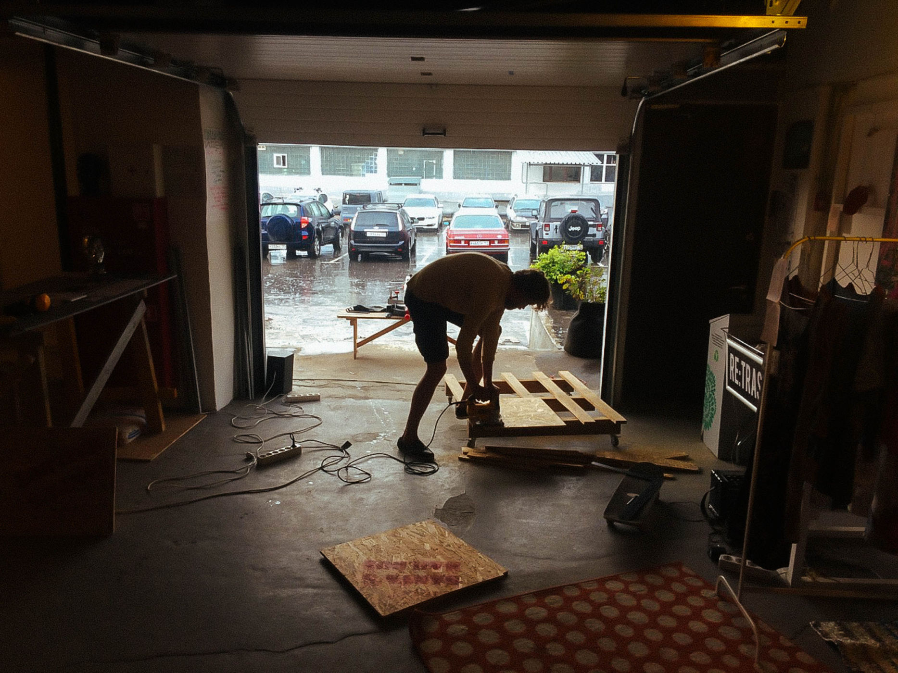

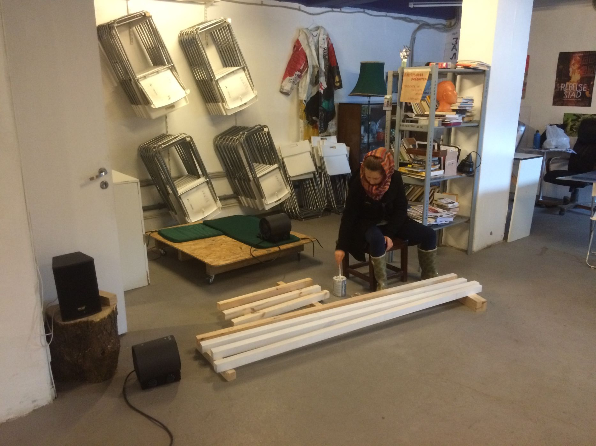

Стекло как материал мы даже не рассматривали, а обратились к опыту [нижегородского сёрф-лагеря «FreeDOM»](/workshop/map/surf2free/), где мы недавно побывали. Там мы видели множество окон, собранных из двух слоёв прозрачного листового пластика на утеплённой раме. Рассмотрев различные виды пластика, мы остановились на применении намного более прочного, чем оргстекло, и более стойкого к внешним погодным условиям, чем ПЭТ, монолитного поликарбоната и заказали два листа 2050х3000 мм толщиной 3 мм в компании, производящей теплицы. Т.к. проём двери оказался немного выше, чем 2050 мм, нам пришлось придумывать способ приподнять всю конструкцию окна без потери прочности и теплоизоляционных свойств. Решением стало использование в качестве основания большого клеенного бруса 100х100 мм. Также нам понадобились ещё 6 брусков 50х50 мм для рамы, самоклеющаяся резиновая уплотнительная лента, саморезы для сборки рамы и крепления пластика, а также уголки и дюбель-гвозди для прикрепления рамы к полу и стенкам проёма.

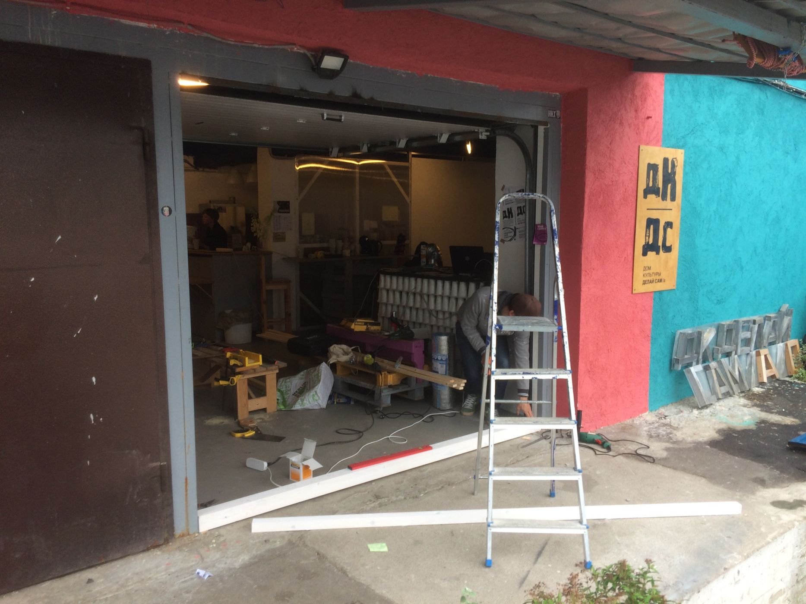

Срезав все выступающие части металлической рамы, мы напилили бруски в размер проёма с помощью обычного пластикового стусла и ручной пилы. Готовые элементы конструкции мы тут же на месте красили белой акриловой краской, просушивая её тепловентилятором. Одновременно с помощью электролобзика с пилкой по металлу на малой скорости напилили в размер поликарбонат.  Затем закрепили клеенный брус в основании, собрали раму в проёме. Наклеив уплотнительную ленту по всему периметру рамы, прислонили и закрепили шурупами через каждый 20-25 см внешний слой поликарбоната. Перед тем, как закрыть раму вторым слоем пластика, насыпали в неё немного обычной поваренной соли, которая сможет впитать всю излишнюю влагу и предотвратит запотевание окна. После установки второго листа поликарбоната надёжно крепим всю конструкцию к металлической раме проёма, заполняем все оставшиеся щели утеплителем и монтажной пеной и любуемся получившейся картинкой. Днём солнечный свет по-прежнему заливает всю входную группу ДК, а по вечерам тёплое освещение внутренних помещений мягко струится наружу, приоткрывая внутренний мир пространства взглядам прохожих. Такое окно — не просто символ, это декларация прозрачности и открытости проекта людям. К тому же с ним тепло и тихо, ну и видно тех, кто есть внутри и кто только собирается зайти.

## Продолжение следует

Начавшись с отдельных проектов, работа в ДК превратилась в настоящий поток разнообразных творческих начинаний. Обустраивая и «обживая» пространство,  мы получили массу опыта в конструировании простой, но функциональной мебели, а также погрузились в практику тотальной «переработки». Сотрудничая с разными людьми по различным направлениям, мы смогли реализовать проекты, невозможные для каждого из нас по отдельности. Усилиями добровольцев при минимальном вложении денег пустой склад бывшей типографии превратился в общественный центр, бросающий вызов существующей городской культуре и вдохновляющий активистов выходить из тени, общаться и объединять усилия для улучшения города и жизни в нём. ДК «Делай Сам/а» — настоящий социальный эксперимент, где никто не знает результаты наперёд. Каждый может подключиться и внести свой вклад в развитие проекта, и не мы одни считаем, что это того стоит. Не ждать указаний и не просить разрешений, а своими руками превращать окружающий мир в более прекрасное место — начать бывает сложно, но продолжать так действовать всегда невероятно интересно. Главное — пробовать, внимательно наблюдать и быть открытыми к любым изменениям. А лучше — стать этими изменениями самим.

Мы постараемся и дальше смело идти вперёд, смотря в лицо возникающим трудностям и неопределённости, и, конечно, продолжим делиться наработками с вами. До встречи в ДК «Делай Сам/а»!
