[Творческая усадьба "Гуслица"](/workshop/catalog/guslitsa/) — международный культурно-образовательный центр в **80 км от Москвы**. Окружённая живописными природными пейзажами, более чем столетняя промышленная усадьба общей площадью **10 000 кв.м.** с прилегающей территорией в **4 га** — настоящий простор для вдохновения и творчества. Художники и музыканты, танцоры и актёры, скульпторы и архитекторы приезжают в арт-резиденцию чтобы создавать здесь свои произведения. В просторных залах регулярно проходят самые разнообразные выставки и выступления, от камерных показов и спонтанных спектаклей до масштабных фестивалей и крупных галерейных проектов.

Здание усадьбы — сложный архитектурный коктейль из смелых дореволюционных кирпичных построек, утилитарных советских пристроек к ним, а также преимущественно деревянных перегородок и перекрытий уже нового времени. В первый раз здесь не сложно заблудиться, но даже давние резиденты "Гуслицы" не знают всех закоулков этого обширного пространства. Несмотря на неоднократные попытки организации удобной навигации по усадьбе и её территории, чёткой и понятной системы наименования помещений и указателей к ним здесь так и не сложилось. Когда OOLEY откликнулся на призыв "Гуслицы" приезжать и включаться в волонтёрскую работу по обновлению и развитию усадьбы, разработка и создание навигационных табличек стало нашим первым совместным проектом.

Суть проекта заключалась в соединении элементов уже давно существующего пазла. **Фотограф Андрей Колосов** подготовил [более пятисот прекрасных снимков окружающих ландшафтов](https://www.facebook.com/profile.php?id=1836861050&sk=photos&collection_token=1836861050%3A2305272732%3A69&set=a.10203796223626172.1073741917.1836861050&type=3), **художник и каллиграф Александр Желонкин** уже разработал уникальный [заголовочный шрифт "Алхимический устав"](https://www.facebook.com/photo.php?fbid=1518767961751813&set=a.1478078882487388.1073741833.100008558714232&type=3&theater), а руководство уже определилось с примерным видом итоговых табличек. Оставалось только составить список необходимых указателей и продумать всю технологическую цепочку их производства. Мы старались по-максимуму использовать уже имеющиеся у нас и у "Гуслицы" возможности, сделав этот процесс максимально простым и повторяемым.

Тщательно изучив все альтернативы, мы пришли к, пусть и немного кропотливой, но всё-таки простой и легко повторяемой технологической цепочке. Уже в первый заезд за **два дня** нам удалось создать сразу **14 указателей** для центральной навигационной стойки напротив ресепшена, а за второй подход мы подготовили все ингредиенты для создания десятков новых табличек. Мы собрали все необходимые материалы в одной большой коробке, познакомили волонтёров пространства с производственной технологией, а теперь делимся этими знаниями здесь в попытке создать подробную инструкцию, позволяющую сохранять единство оформления постранства даже при полной смене волонтёрской команды.

### Набор

В одной большой коробке мы собрали все ключевые инструменты и материалы для создания навигационных указателей. В ней содержатся:

- конверт с нарезанными на плоттере трафаретами названий помещений усадьбы, а также комплектом прописных букв "Алхимического устава", строчных букв [бесплатного шрифта "Tsarevich"](http://mishapanfilov.ru/font_tsarevich.html), цифрами и стрелками,
- глянцевый акриловый лак,
- клей ПВА,
- белая акриловая краска,
- кисти для лака,
- кухонные губки
- нарезанные и отшлифованные фанерные заготовки,
- отпечатки фотографий на лазерном принтере,
- гвозди для степлера.

А теперь обо всём порядку.

### Дощечки

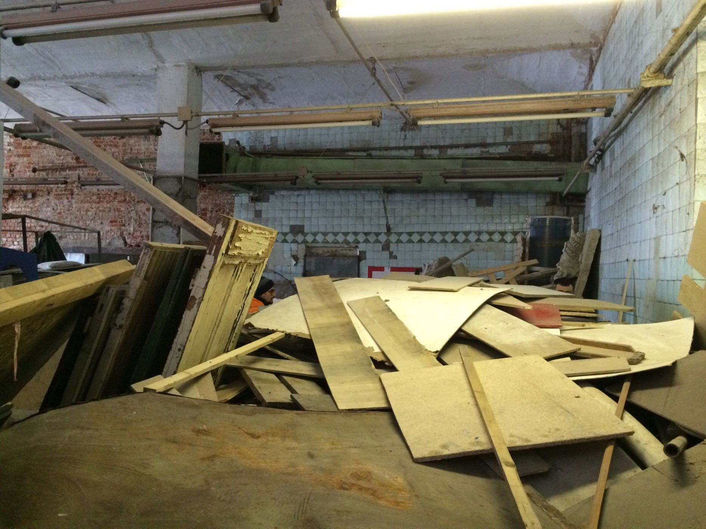
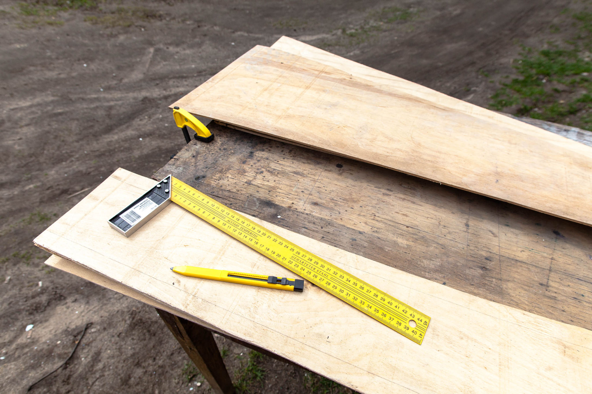

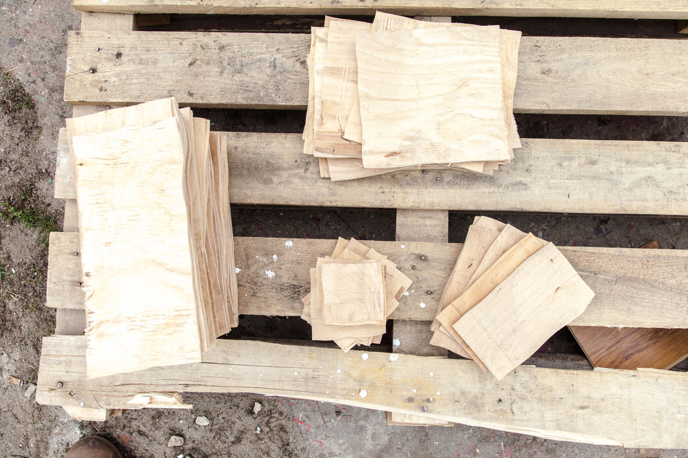

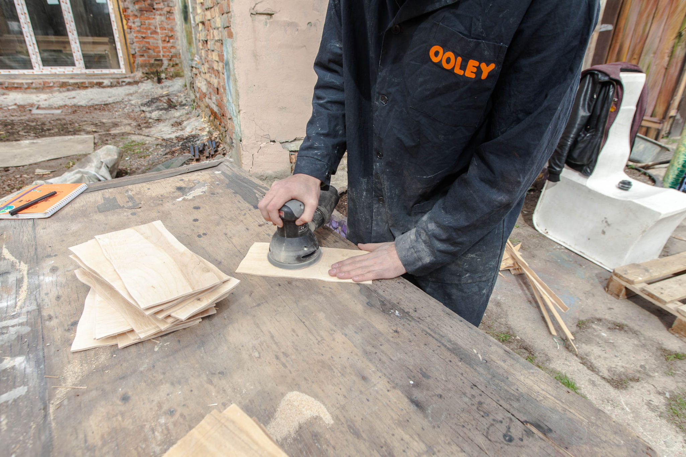
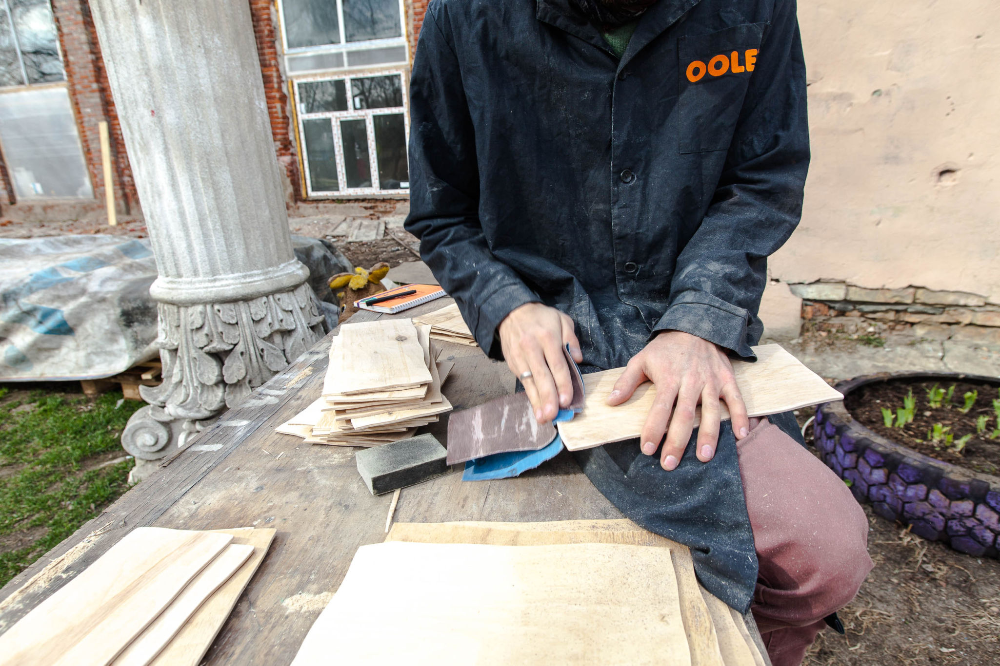

Основой табличек мы выбрали **тонкую фанеру 4 мм толщиной**, куски которой удалось отыскать, порывшись в завалах материалов в ещё нерасчищенном зале мастерских. Размер каждой таблички не должен превышать размера отпечатка на листе формата А4, поэтому фанера нарезана прямоугольниками **длиной 29 см**. Творческая атмосфера "Гуслицы" не выносит ровных линий и форм и края дощечек намеренно вырезаны электролобзиком слегка волнистыми. Так каждая табличка получает некоторую индивидуальность и вместе они создают приятную текучую композицию. Доски шириной **12-15 см** предназначены для надписей в одну строку, более широкие доски (**20 см**) — для двустрочных надписей.

Для аккуратного перевода изображений на доски важно последовательно отшлифовать их поверхность шлифовальной бумагой зернистостью **Р100, Р180 и Р240**, а края слегка скруглить грубой шкуркой. Тщательно очищаем доски от древесной пыли сухой кисточкой и можно приступать к следующему этапу.

### Трансфер фотографий

Мы отобрали наиболее подходящие для переноса фотографии из коллекции и подготовили их [для печати на черно-белом лазерном принтере](https://yadi.sk/d/MxtIwLqdrWnFc), повысив контраст и детализацию в фотошопе. Для переноса таких изображений на дерево как правило используется специальный состав под названием **гель-медиум**, а также особый клей **"Mod podge"**, но это довольно редкие и дорогие ингредиенты и, как оказалось, их нетрудно заменить вполне доступным составом. Для этого в небольшой емкости вроде пластикового стаканчика смешиваем в пропорции **1:1** обычный клей **ПВА** и акриловый **лак**. Наносим кисточкой получившуюся смесь на доски и аккуратно прикладываем к ним отпечатки фотографий изображением вниз. Для надёжного сцепления тонера с доской важно равномерно прижать бумагу гибким шпателем или небольшим резиновым валиком. Оставляем заготовки сохнуть **минимум на 3 часа**, а лучше на всю ночь.

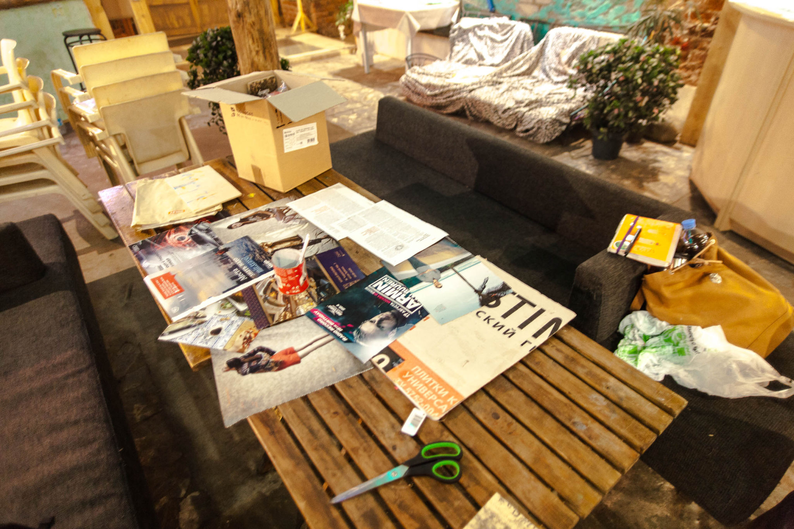

Следующим этапом идёт оттирание лишних слоёв бумаги влажной губкой. Нам понадобится ёмкость с водой, обычная кухонная губка и запас терпения. Техника довольно простая, но требует аккуратности и внимательности. Слегка влажной губкой нужно смочить бумагу и легкими круговыми движениями счищать её слоями, превращая в небольшие катышки. Важно **не переборщить с количеством воды** и не дать ей размочить слой клея с тонером — для этого оттираем бумагу в несколько заходов, каждый раз снимая всё более тонкий слой. Влажные волокна бумаги могут быть почти незаметны, но при промежуточной сушке доски рисунок снова становится почти не виден за белой пеленой — ничего страшного в этом нет. После покрытия лаком они будут выглядеть так же, как ещё влажные. За два-три подхода с промежуточной сушкой, аккуратно работая влажной губкой и, по необходимости, просто подушечками пальцев, удаётся очистить почти всю лишнюю бумагу, оставив лишь тонкий полупрозрачный слой с тонером. Тщательно высушиваем доски и приступаем к нанесению надписей.

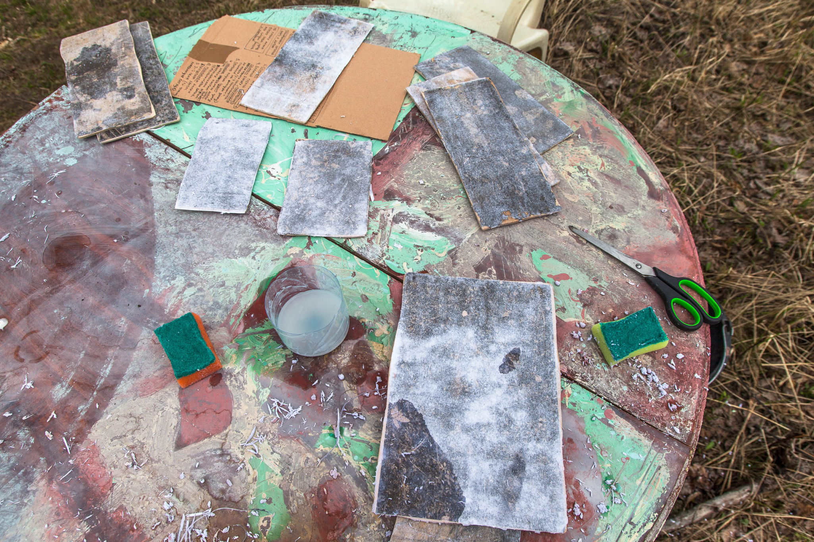

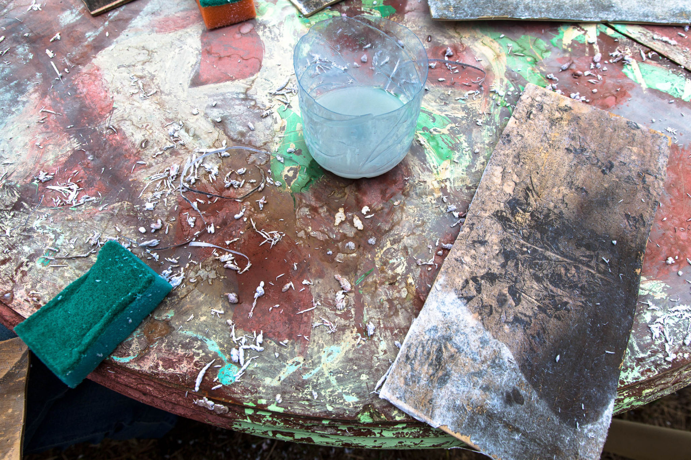
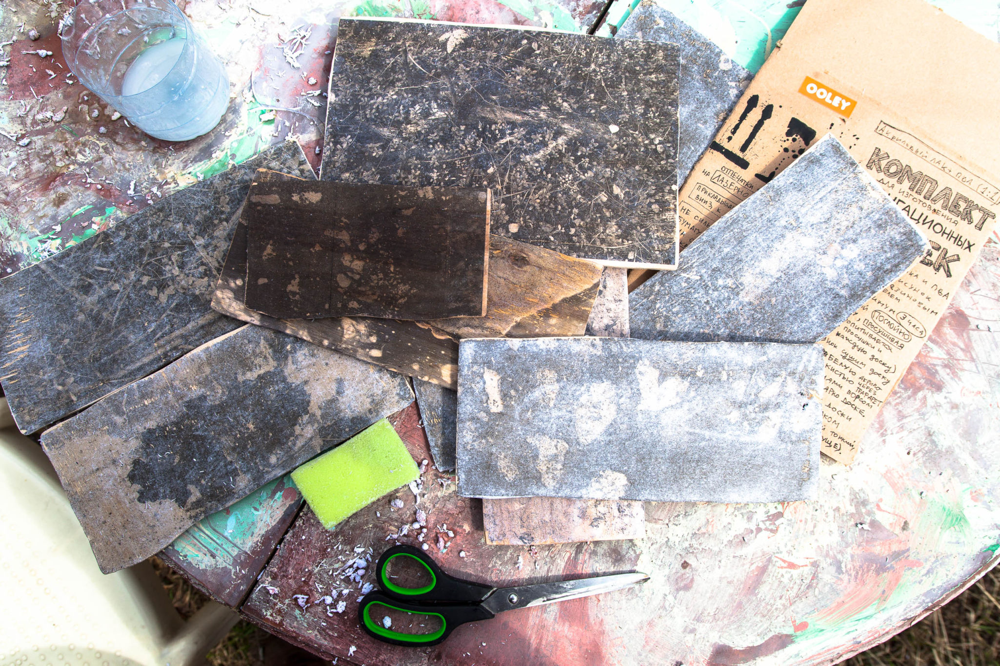

### Надписи

Мы полностью отрисовали шрифт **"Алхимический устав"** и адаптировали его и бесплатный шрифт **"Царевич"** для применения в трафаретах. Большинство названий помещений "Гуслицы" выполнены в виде готовых надписей на отдельных листах плотной **ПЭТ-плёнки**, однако некоторые надписи придётся набирать побуквенно с использованием листов с алфавитом. Важно тщательно выровнять надпись относительно краёв доски, а при побуквенном наборе ещё и отслеживать **равномерность межбуквенных интервалов**. Важно не ошибиться и с расположением и направлением стрелок.

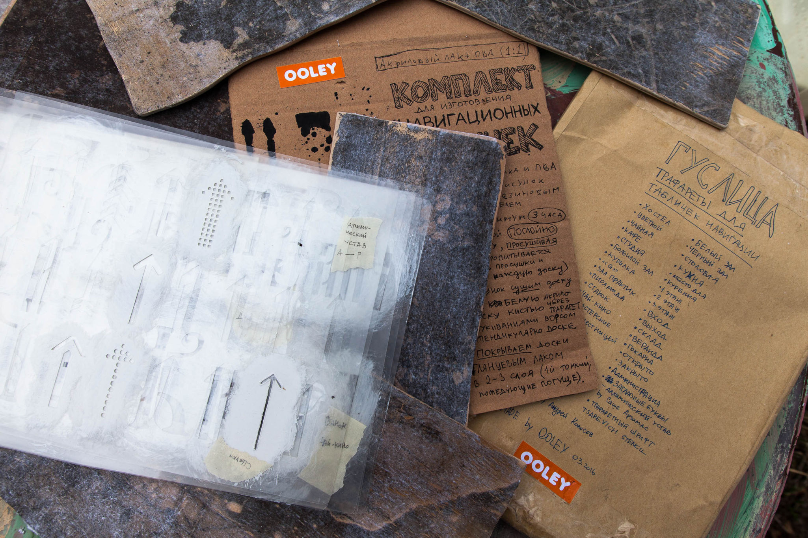

Белая акриловая краска наносится на доску половинкой обычной кухонной губки. Для этого нужно взять немного краски из банки, перенести на кусок картона или фанеры и тщательно набить ею губку лёгким постукиванием. Если краски на губке будет слишком много, она затечёт под трафарет и надпись расплывётся, поэтому лучше не пытаться добиться сплошного цвета при нанесении первого слоя. **Технический фен** поможет просушить краску за считанные минуты и, не смещая трафарета, можно сразу нанести финальный слой краски. Аккуратно поднимаем плёнку трафарета и даём надписи хорошенько просохнуть.

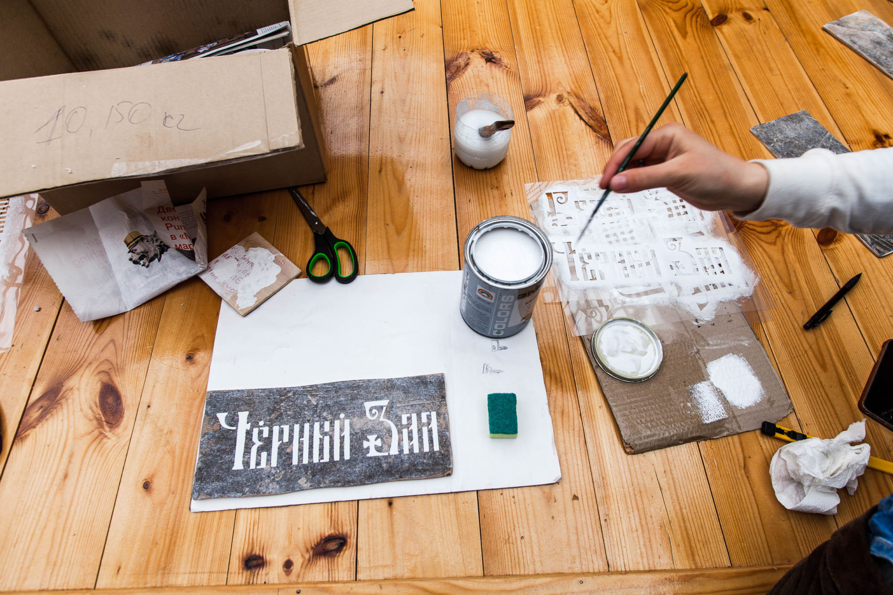

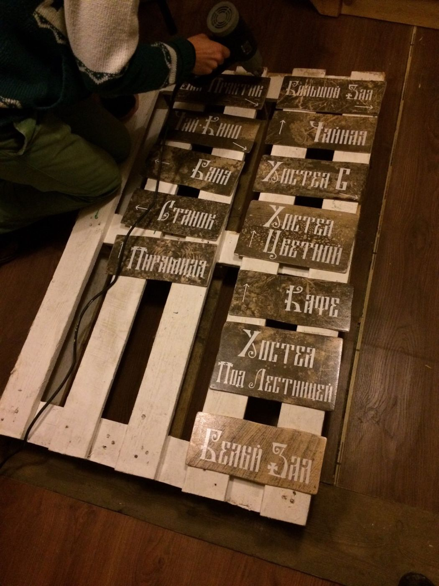

Если краска всё-таки затекла под плёнку и надпись стала нечёткой, огрехи можно **закрасить простым карандашом**. Также можно исправить мелкие повреждения перенесённого рисунка.  При необходимости дорисовываем кавычки или другие элементы кисточкой. Всё, осталось покрыть получившиеся указатели глянцевым акриловым лаком в два слоя и готово. Технический фен **в I режиме (80°С)** поможет значительно ускорить этот процесс без потери в качестве работы.

### Крепление

Лучший вариант крепления указателей — найти деревянную основу и прибить их мелкими гвоздями молотком или используя строительный степлер с гвоздиками длиной **12—16 мм**. Два-три гвоздя надёжно закрепят доску и позволят при необходимости аккуратно её перенести или заменить.

### Резюме

Нам удалось собрать полный комплект всего необходимого для создания полноценной навигационной системы в огромном пространстве арт-усадьбы, собственноручно наполнить указателями центральный холл здания, а также передать знания этой технологии волонтёрам "Гуслицы". Надеемся, эта инструкция окажется полезной и поможет сделать пространство культурно-образовательного центра чуть более удобным и понятным для всех.

