### ЛОМ — новый формат совместного продуктивного отдыха на природе.

**Это лагерь для людей всех возрастов, где вдали от городской суеты можно расслабиться, наполниться общением с живой природой и единомышленниками и реализовать вдохновение в разнообразных творческих проектах.**

В проекте OOLEY мы исследуем и развиваем новые подходы к творчеству с 2012 года. Мы не только собираем доступную информацию о существующих открытых мастерских и прочих креативных пространствах, но и обобщаем её в теории устройства и организации устойчивых творческих процессов.

Во многих городах есть пространства и мастерские, где регулярно проходят мастер-классы. Краткие ознакомительные занятия с известным результатом — отличная возможность ненадолго отвлечься от привычных забот и позаниматься чем-то новым и интересным. А если уделить ремеслу побольше времени и внимания: пройти образовательный курс или взяться воплощать свои исследовательские и творческие проекты в ремесленном коворкинге, можно радикально поменять род деятельности и весь образ жизни.

Каким бы ни был удобным город, каждому человеку порой хочется уехать подальше от пыли, шума, спешки и побыть хоть немного в контакте с природой. Кому-то достаточно выбраться на дачу, кто-то отправляется в дальние страны, а можно вместе поехать с рюкзаками и палатками в лес. Массовые летние фестивали под открытым небом становятся все популярнее.

Так хорошо хоть немного пожить под открытым небом. Постепенно приходя к гармонии с природой, человек очищается, наполняется энергией и шире открывается новому опыту. Ранние подъемы, зарядка, здоровая пища и активное взаимодействие со стихиями дарит невероятный прилив сил и вдохновения. Так можно глубже изучить свои возможности, обнаружить и раскрыть новые грани своей личности. Это хорошо понимают те, кто, отправляясь на природу, берут с собой разнообразный спортинвентарь, а также музыкальные, художественные и прочие инструменты для творчества.

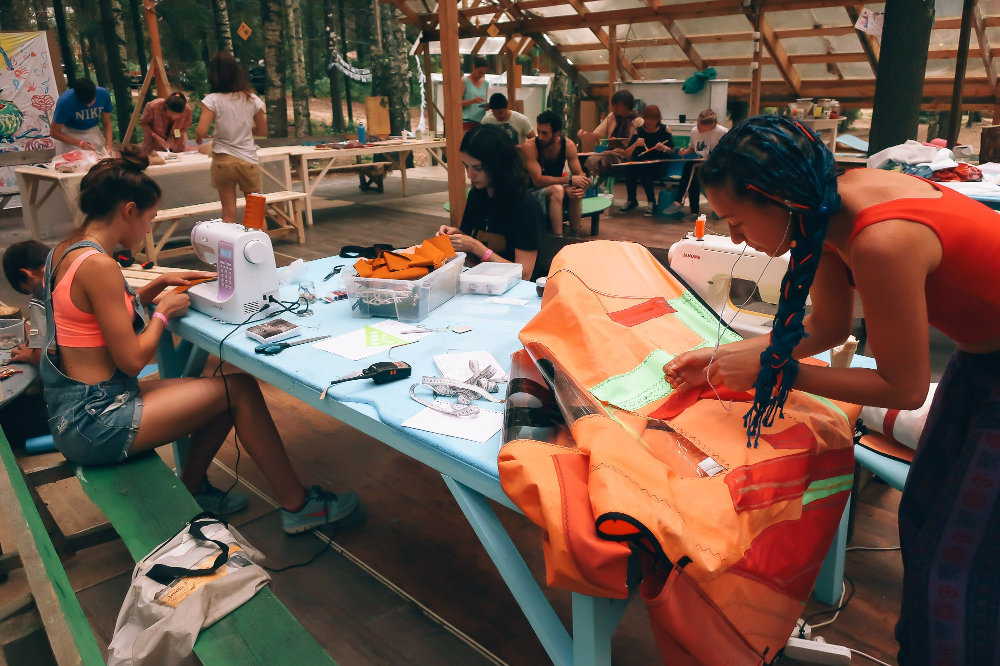

Мастер-классы давно стали неотъемлемой частью практически любого летнего фестиваля. Они подразумевают разовые занятия, на которых группа учеников, выполняя указания мастера, из заготовок получает поделку, которую можно забрать с собой. Такой подход даёт возможность прикоснуться к ремеслу практически каждому. Пара часов занимательного рукоделия без лишних трудностей и тонкостей процесса — отличный формат отдыха. Но что делать, если этого кажется мало? Как не просто чуть прикоснуться, а по-настоящему погрузиться в новое для себя ремесло?

Размышляя над этим, мы разглядели новый формат, позволяющий как вдохновиться природой, так и реализовать это состояние в творчестве. К настоящему моменту у нас накопилось достаточно инструментов и опыта в организации открытых мастерских, чтобы всерьез заняться созданием универсального творческого пространства в походных условиях. Нам посчастливилось познакомиться и найти единомышленников в уникальном природном пространстве — [**Сёрфлагере на Горьковском море**](https://vk.com/surf2free). Так перед нами открылась возможность применить эти идеи и наработки на практике.

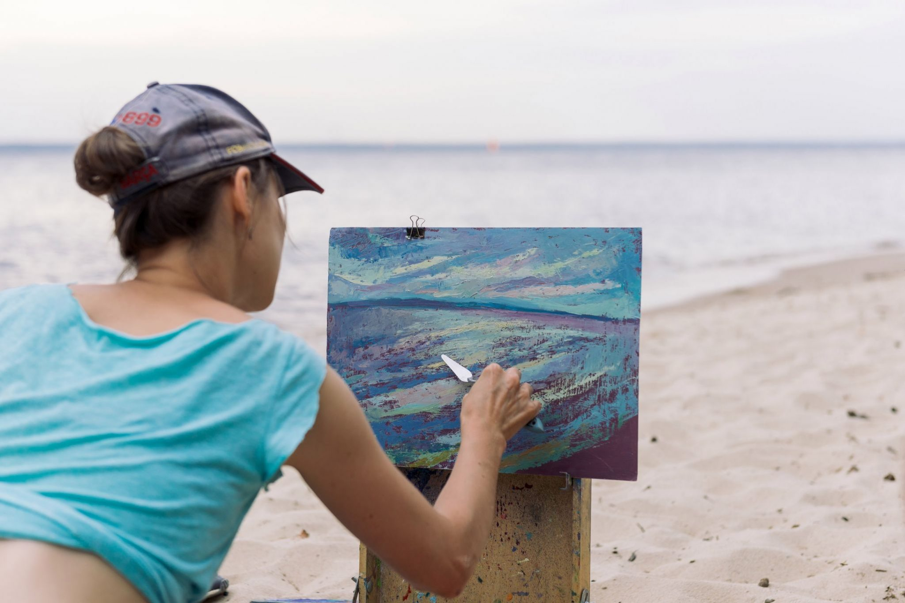

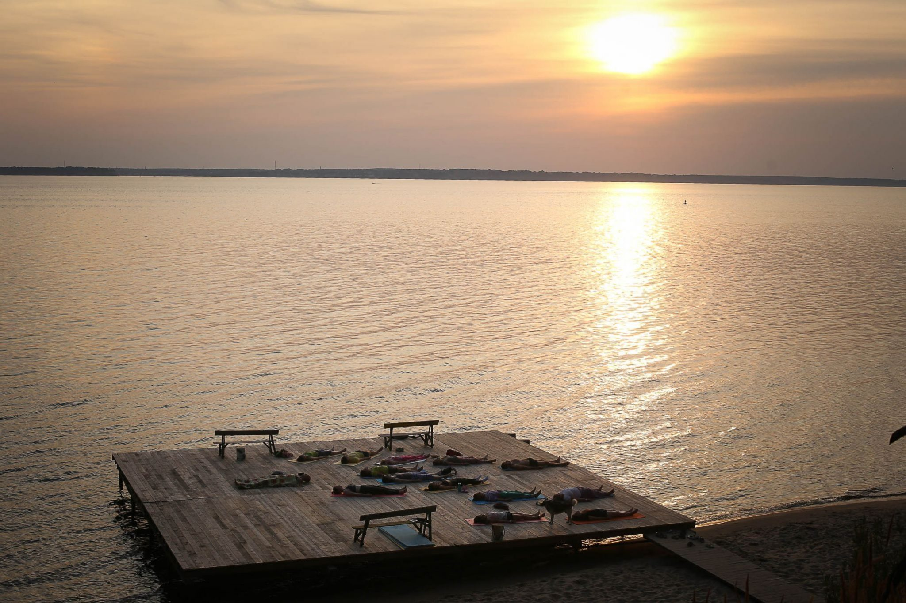

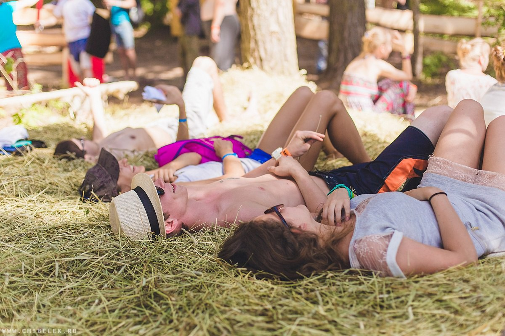

Мы знаем, что открытая мастерская — это не какое-то определенное место, а живой процесс совместного творчества, который можно развернуть где угодно. Конечно, для этого нужны разнообразные инструменты и материалы, но самое важное — созидательный настрой участников. Совсем не нужно ждать, пока кто-то специально организует для этого пространство: чтобы начать достаточно самого малого. Открытую мастерскую можно запустить с простым карандашом и листком бумаги, творческий процесс сам подскажет пути дальнейшего развития.

У многих пылятся дома редко используемые инструменты, а современное оборудование и материалы как никогда доступны в широко раскинувшихся торговых сетях. В глобальной сети постоянно пополняется невероятный объем полезной информации практически на любую тему — с каждым днём все легче самостоятельно осваивать творческие технологии. Все ингредиенты уже есть, осталось соединить их вместе в правильной пропорции.

Основные компоненты любой открытой мастерской — это рабочее пространство, инструменты, материалы и, конечно, взаимодействующие друг с другом люди. И, кажется, мы, наконец, нашли возможность соединить это все воедино. Сёрфлагерь гостеприимно предоставляет свои обустроенные лесные сцены и домики для организации мастерских, а также предлагает комфортные условия размещения для участников кэмпа.

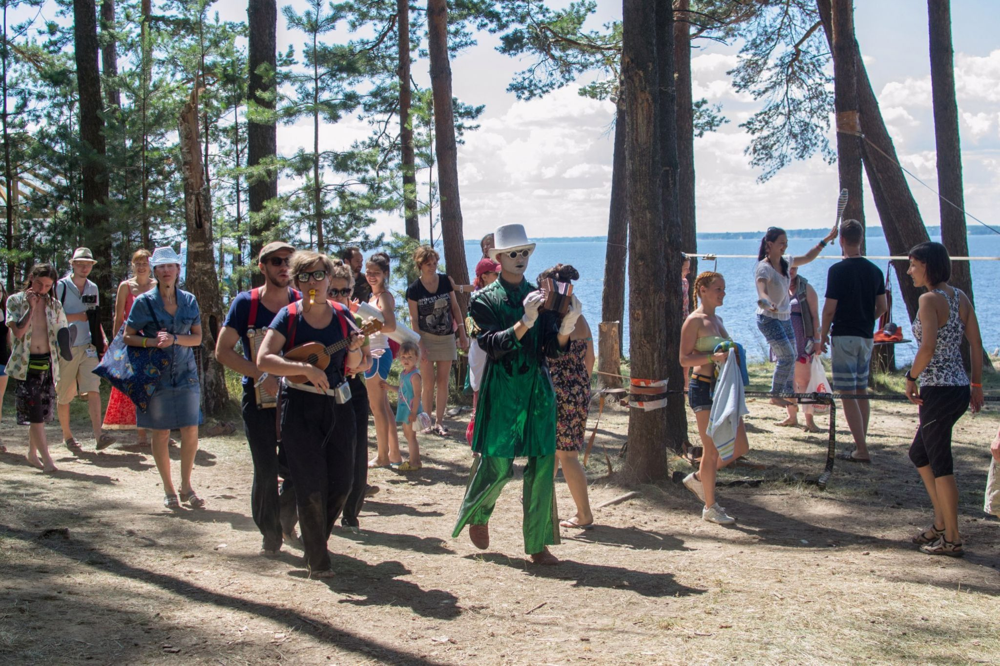

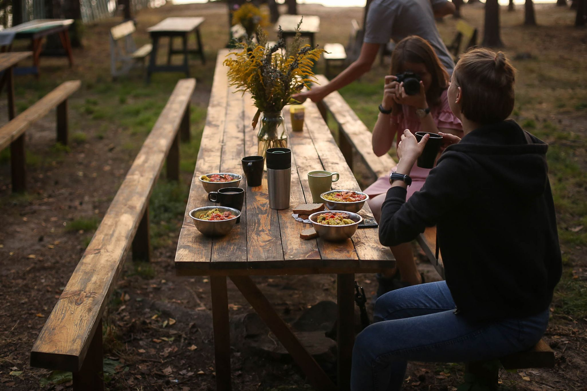

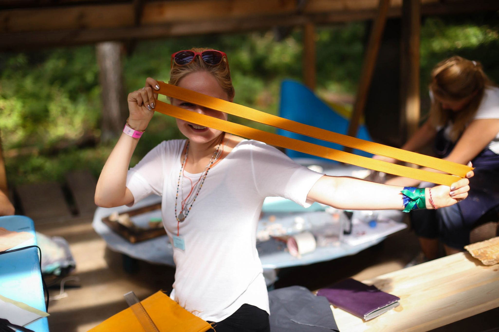

Лагерь свободного творчества — это наш рецепт продуктивного взаимодействия человека с природой. Сочетание естественного расслабления тела и ума, фокуса на взаимном обучении и сотрудничестве с широкими созидательными возможностями дает человеку шанс увидеть себя в совершенно новой перспективе. **Лесные открытые мастерские** — это творческий процесс, который разворачивают люди, вдохновленные природой и возможностями совместной самореализации.

Мы обнаружили ключевые роли, которые могут сыграть участники общего творческого процесса. **Мастера** делятся своими инструментами, навыками и умениями. **Кураторы** поддерживают и развивают творческий процесс. **Гости** внимательно слушают и получают навыки, а **умельцы** с благодарностью используют возможности лагеря для реализации личных и совместных проектов.

**[Проектный подход](/theory/system/projectapp/)** — основа осознанного творчества. И это — первое, что стоит освоить и начать применять каждому участнику открытой мастерской. Конечно, не попробовав себя в чем-то, сложно проработать полноценный проект. Мы знаем, что нужно демонстрировать новичкам различные образцы и примеры проектов, для формирования представления о возможностях мастерской. Необходимо также уметь обеспечить плавное погружение человека в непривычное для него ремесло.

Вживую рассмотреть образцы произведений в различных техниках, понаблюдать за рабочим процессом в качестве зрителя, а затем, наметив приоритеты, попробовать себя на вводных мастер-классах — вот прозрачный метод постепенного погружения в практику. Затем внимательно слушать мастеров и оттачивать умения в ходе их углубленных курсов. А затем можно и воспользоваться приобретенной в этом процессе творческой свободой. Ведь творчество — это нечто большее, чем применение отдельных навыков. Подлинная свобода самовыражения обнаруживается в смелом сочетании различных приёмов и технологий.

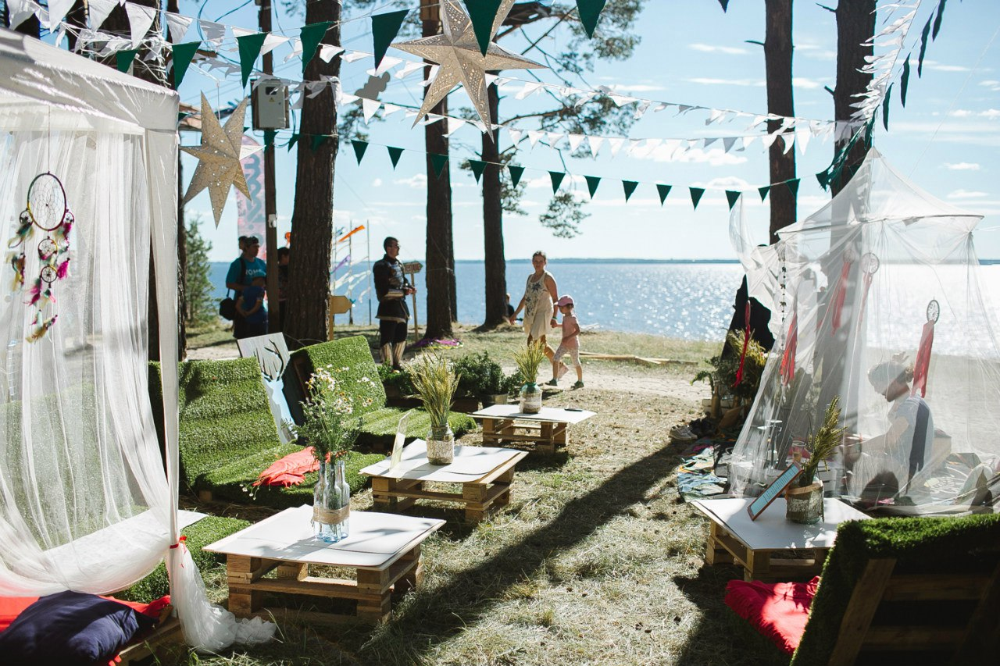

Мы видим открытые мастерские кульминацией процесса знакомства с творчеством. Здесь наступает тот бесценный момент, когда человек впервые понимает, что он сам осознанно прошёл все стадии проекта от придумывания и проработки идеи до завершенного произведения и его представления. И не видит проблемы повторить этот путь снова. Так запускается продуктивный цикл, в котором человек всегда знает, каким будет его следующий шаг навстречу совершенству. Творчество — это процесс воплощения человеком его собственных представлений о прекрасном. Открытая мастерская предоставляет творческие возможности, оставляя человеку максимум свободы для самовыражения.

Умельцы, обладающие достаточными умениями, самостоятельно работают в мастерской над  проектами с одобрения куратора. Это могут быть любые задумки от личных творческих начинаний с целью исследования или самовыражения до крупных совместных инженерных проектов. Можно предложить любую интересную идею. Куратор скорректирует проект с учётом возможностей мастерской и компетенций автора, а также поможет спланировать этапы его реализации. Куратор также помогает умельцам не застревать на пути к самостоятельной реализации идей.

Такая методология позволяет человеку, даже вовсе не разбирающемуся в творчестве, широко осмотреться и плавно погрузиться в заинтересовавшие его направления. Но ведь даже окинуть взглядом все многообразие созидательных практик — не такая уж простая задача. В этом поможет выработанное нами [деление творчества на пять стихий](/theory/system/elements/), аналогичных тем, которые выделяли в природе древние. Каждая из стихий включает в себя несколько ключевых мастерских, охватывающих все основные технологические процессы этого направления.

- Элемент **Земля** включает гончарную и скульптурную мастерскую, открывающие широкий спектр приёмов в работе с твёрдыми и твердеющими массами.
- Стихия **Вода** — это столярная мастерская, работающая с древесиной (водопроводящей тканью сосудистых растений), а также мастерская «переработка», предназначенная для работы с резиной, пластиками, смолами и прочими синтетическими органическими материалами.
- Элемент **Огонь** сочетает в себе работу с высокими температурами, металлами и неорганической химией в кузнице и слесарной мастерской.
- **Воздух** — это все техники работы с тонкими материалами, доступные в изостудии, макетной и швейной мастерских.
- **Эфир** — пятый элемент творчества, включающий исследование слова и текста в литературе, звука и ритма в музыке и выразительных возможностей жеста в театральных постановках.

Конечно, границы между мастерскими легко размываются, однако такое логическое деление помогает создавать действительно многогранное творческое пространство.

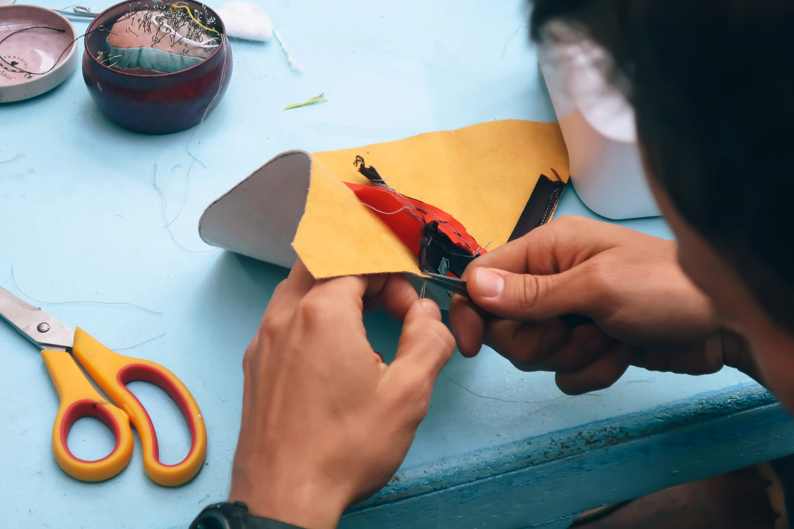
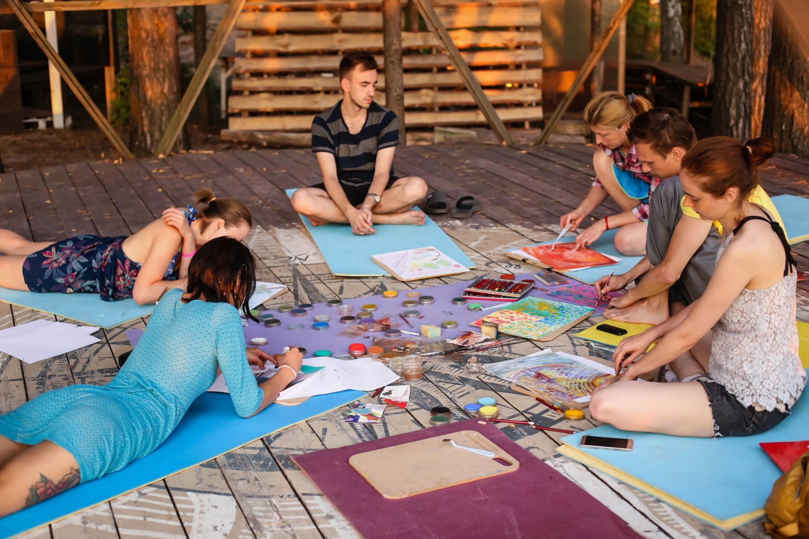

Для того, чтобы окинуть всё это взглядом, попробовать свои силы в интересующих направлениях и освоиться с выбранными техниками необходимо время. Трансформация из гостя и начинающего ученика в умельца, самостоятельно воплощающего своё вдохновение — путь, который мы стараемся сделать максимально быстрым и простым. Однако, вряд ли для этого хватит пары дней. Необходим день на осмотреться, второй — немного прикоснуться к ремеслу. Ещё пару дней на набор ключевых навыков и умений. Плюс время для свободной работы над проектами. Так образуются недельные смены, которыми живёт лагерь свободного творчества. Оставляя время для себя, природы и общения, каждый день в лагере включает две трёхчасовые сессии работы в мастерских, а также вечернюю лекцию, музыкальный джем, кинопросмотр или другое интересное общее занятие, которое может предложить каждый.

Когда времени достаточно, появляется возможность расслабиться, отбросить городскую спешку и сонастроиться с естественными ритмами природы. Чистый воздух и зарядка по утрам, вегетарианское питание и прогулки по лесу. Виндсёрфинг и солнечные ванны летом или снежные битвы и катание на сноукайте зимой — для этого в Сёрфлагере просто идеальные условия. А Лесные открытые мастерские позволяют преобразовать полученный от общения с природой и единомышленниками заряд энергии в реальные творческие произведения. От небольших ювелирных и художественных изделий до масштабных произведений искусства и инженерных проектов — результаты лагеря свободного творчества непредсказуемы и способны удивить каждого участника, в том числе и его организаторов.

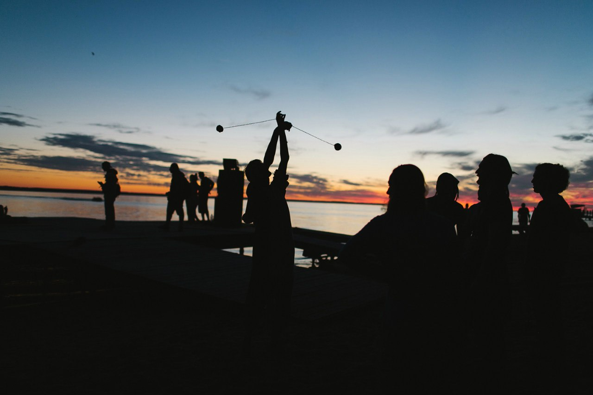
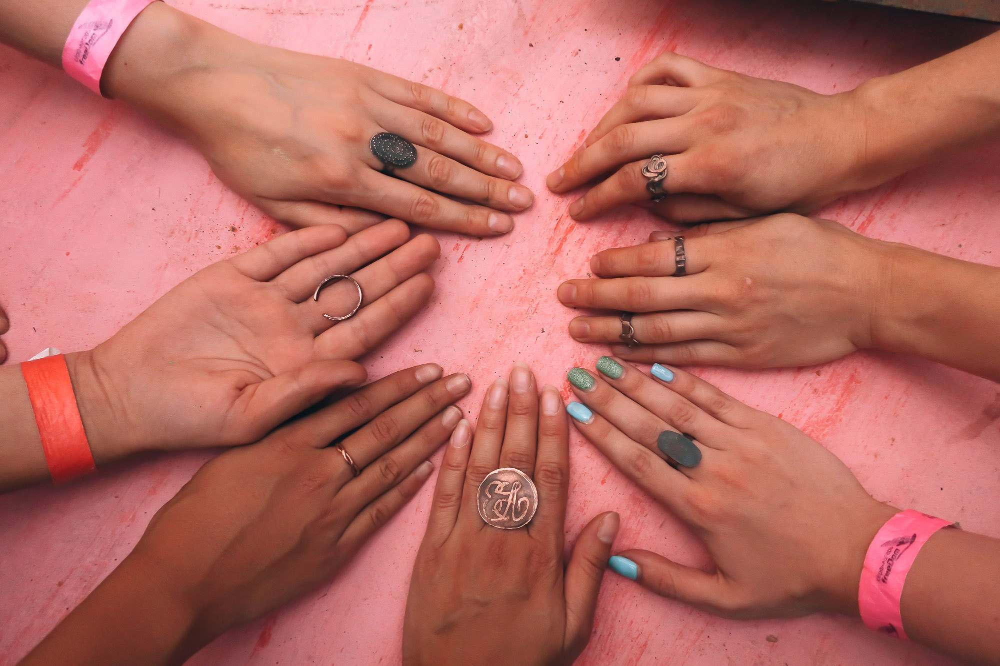

Доверие и открытость к живому совместному творчеству делает лагерь ЛОМ уникальным проектом, где каждый сможет найти для себя неповторимый способ раскрыть свой внутренний потенциал. Мастера смогут взглянуть на свои умения под новым углом, а также, обмениваясь друг с другом опытом, обнаружить перспективные направления развития и сотрудничества. Кураторы отточат свои педагогические навыки и получат возможность, работая в мастерской, вдохновлять и поддерживать окружающих умельцев. Гости смогут познакомятся с множеством новых подходов к творчеству, а умельцы погрузятся в это многообразие, чтобы научиться применять его для решения личных и коллективных задач. ЛОМ — живое творческое сообщество и чем плотнее сотрудничество всех участников лагеря, тем более глубокой и наполненной оказывается смена и её результаты. Серфлагерь предоставит прекрасные условия жизни в лесу, OOLEY оборудует универсальное творческое пространство, а что из этого получится, зависит от каждого из участников этого коллективного процесса.

<vimeo-embed link="https://vimeo.com/299208902" />

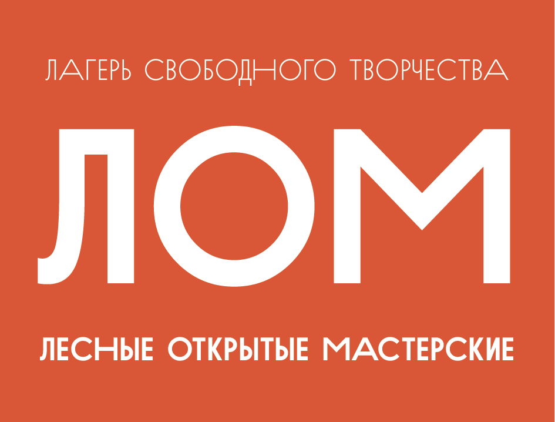

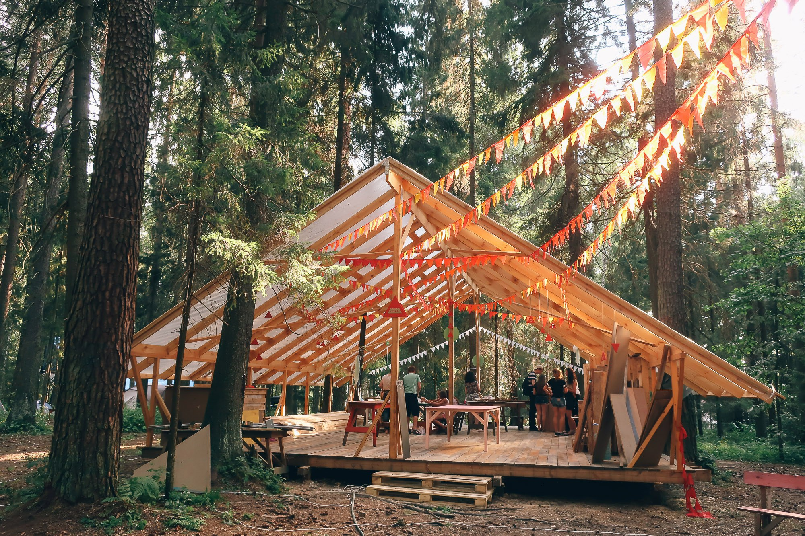

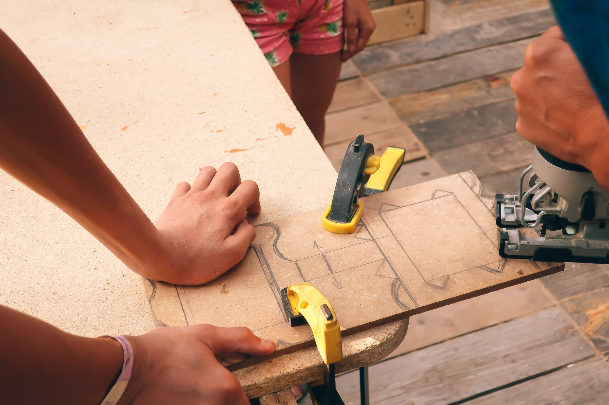

