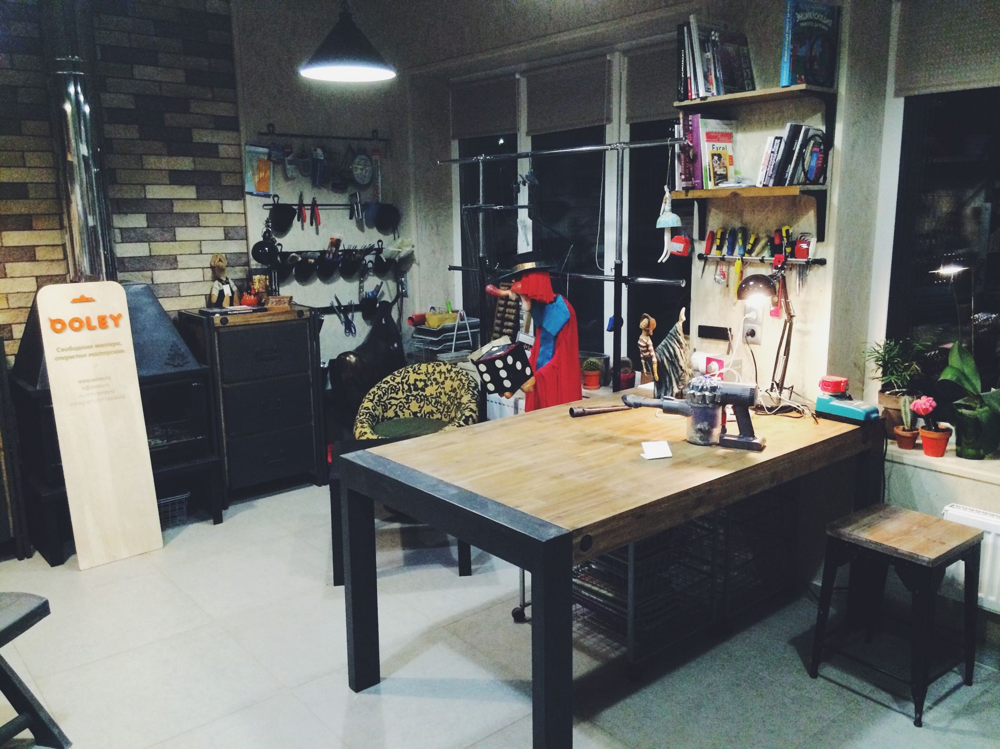
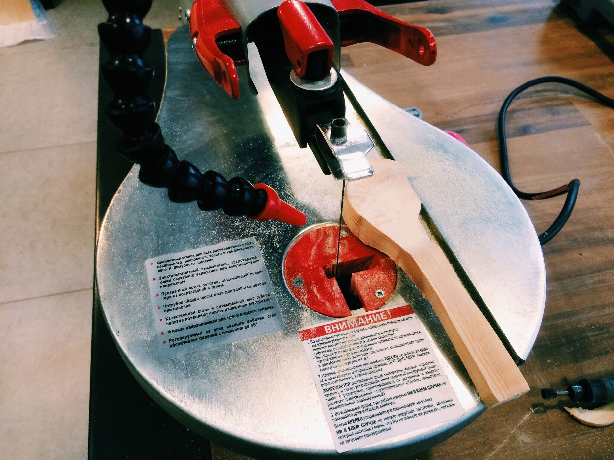

Есть множество способов вырезать из дерева ложку, все зависит от наличия инструментов, времени и умений. Мастерам для этого нужно полено, топор, нож и стамеска, а также наждачная бумага и масло для пропитки. OOLEY старается идти в ногу со временем и демонстрирует как можно сделать ложку из доски с помощью лобзикового станка и электрической бормашинки.

Первым делом вырезаем примерную заготовку из доски с помощью лобзикового станка. В плоскости доски вырезаем характерную форму ручки и ковша, срезаем лишний материал с нижней части будущей ручки.

Дальше в дело вступает бормашинка с насадкой в виде грушевидной фрезы. Срезаем всё лишнее, делаем ручку тоньше, вырезаем внутреннюю часть ковшика. Будьте бдительны — не вырежьте слишком много, чтобы ложка не получилась дырявой. Далее пригодится шлифовальная насадка с наждачной бумагой чтобы сгладить все неровности и довести форму до желаемой.

Собственно, ложка готова! Осталось только обработать её маслом и покрыть при желании воском. Для пропитки маслом можно использовать губку или ватный диск, или окунуть ложку в стакан с маслом. Оставить на полчаса—час и вытереть насухо излишки масла. Натереть воском. Ложка готова к использованию!

Если вы знаете, как делать ложки легче, правильнее и быстрее, делитесь знаниями в комментариях! Учтём все советы.
