Изучая зарубежный DIY-опыт и наработки, мы часто находим различные открытые инструкции и схемы создания самых разнообразных штук. Один из полезнейших ресурсов в сфере рукоделия, в широком смысле этого слова, — портал Instructables.com, где можно найти подробные иллюстрированные пошаговые инструкции к творческим проектам. Именно там мы однажды наткнулись на занимательные чертежи столов сделанных из одного листа фанеры.

[www.instructables.com/8x42-2-Tables-from-1-sheet-of-plywood/](http://www.instructables.com/id/8x42-2-Tables-from-1-sheet-of-plywood/)

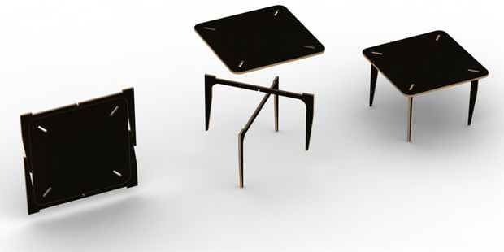
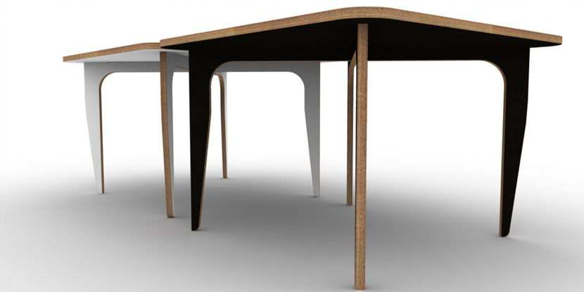
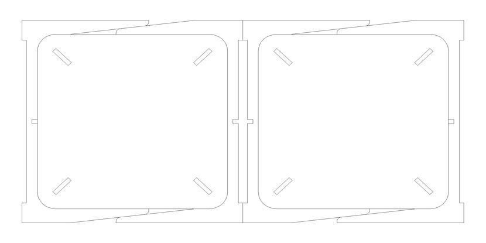

Изящное дизайн-решение позволяет всего из одного стандартного листа фанеры 1500х3000 мм толщиной 24 мм вырезать все необходимые детали для сборки сразу двух больших рабочих столов. К инструкции приложены схемы для программирования фрезерного или лазерного ЧПУ-станка, а в комментариях отмечено, что раскрой можно выполнить и ручными электроинструментами. Изящный дизайн привлёк наше внимание и мы решили попробовать сделать такие столы самостоятельно. К сожалению эта инструкция предлагается лишь как идея, отрисованная на компьютере, то есть ни фотографий готовых столов, ни описания опыта их использования там нет. Не проблема, пройдём этот путь и сами!

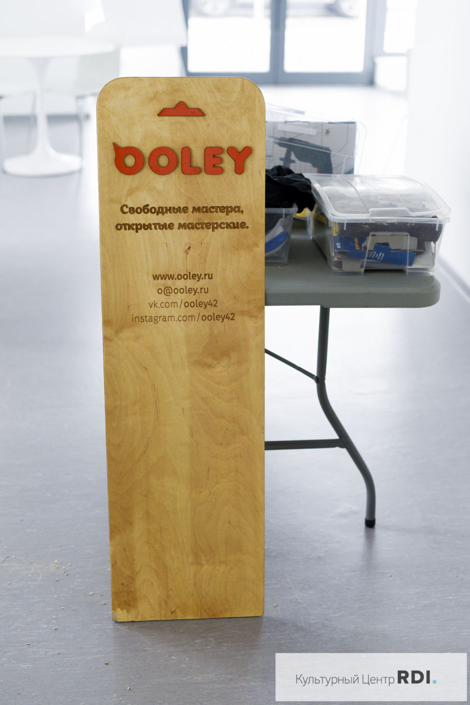

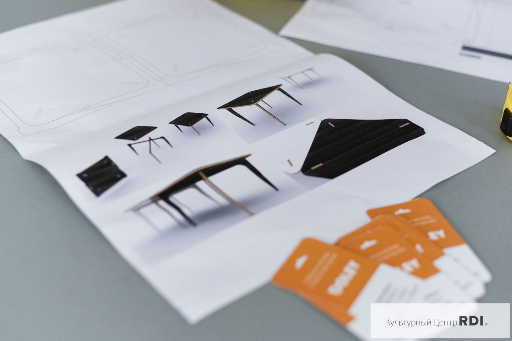

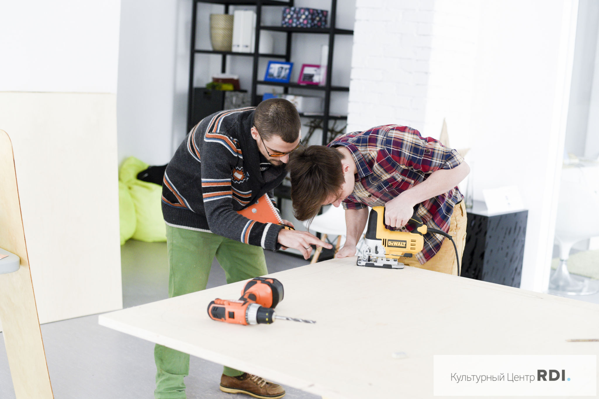

Проект, конечно, кажется простым только на первый взгляд. Да, у нас уже есть достаточный для этого инструмент, но перед передвижной мастерской постоянно встаёт серьезный вопрос о пространстве для воплощения подобных проектов, особенно зимой. Шуметь и пылить в своей квартире — не самая лучшая идея. На улице редко бывают достаточно тёплые дни, чтобы проработать не замёрзнув хотя бы час. Да и для инструмента это могут быть не самые подходящие условия. Но мы не унываем, ведь знаем немало московских общественных столярных мастерских, где можно без особых трудностей реализовать даже самые смелые проекты. К тому же вполне возможно, что материал можно будет приобрести прямо на месте.

Однако на этот раз получилось немного иначе. К нам обратилась команда Культурного центра нового подмосковного жилого комплекса Ново-Молоково с предложением провести серию мастер-классов для жителей района. К нашему удивлению, Центру как раз не хватало рабочих столов для организации полноценного коворкинга в отведённом для него помещении. После пробного мастер-класса по резьбе и выжиганию, мы предложили прямо на месте выпилить и собрать полноценные рабочие столы в ходе серии открытых воркшопов для всех желающих. К сложному инструменту можно допускать людей от 16 и старше, что совпадает с целевой аудиторией коворкинга. Мы запланировали справиться с этим проектом за три выходных четырёхчасовых сессии работы открытой мастерской.

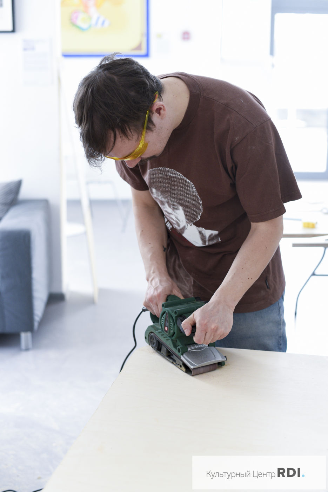

За время переговоров мы успели собрать макет стола из тонкой фанеры в масштабе примерно 1:3 и обдумали технологию распила и сборки. Макет показал некоторую шаткость конструкции, что заставило задуматься об использовании более толстой фанеры. Оставалось только приобрести все необходимые расходники, крепежи и доставить на площадку эти огромные листы фанеры. Один лист большеформатной фанеры толщиной 24 мм весит около 75, а 27 мм — все 85 килограмм. Мы заказали доставку двух листов фанеры на сайте [Fanerra.ru](http://fanerra.ru/) и дополнительно попросили распилить их на 4 квадрата 1500х1500 мм — по одному на стол. Оплатили заказ электронно и назначили доставку на день перед воркшопом. В качестве крепежа решили использовать саморезы и мебельные винты-конфирматы. Мы готовы начинать!

## Первый воркшоп

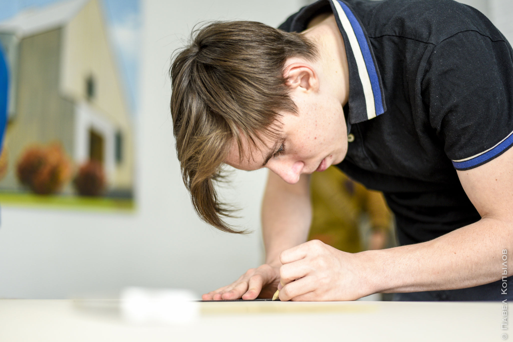

Четыре часа — не так уж много времени для столярного дела. Не так давно столярничество было длительным процессом кропотливого труда исключительно ручным инструментом. Современный электроинструмент ускоряет и упрощает базовые механические операции, однако это далеко не всё. В ЧПУ-станок загружается непосредственно программа, а для ручной работы необходима ответственная стадия разметки контуров реза на заготовке. Автор инструкции приложил схему со всеми необходимыми размерами и нам оставалось лишь бдительно перенести эти размеры на поверхность фанеры с помощью угольника, длинной линейки, циркуля и простого карандаша.

Развёртка передвижной мастерской в стенах культурного центра занимает, ориентировочно, 45 минут, и к моменту начала воркшопа мы успели нанести разметку для резки первого листа 24-миллиметровой фанеры. Для выпиливания заготовок мы применили электролобзик с пилками для чистого прямого реза. Радиус поворота с таким полотном составляет около 100 мм, что совпадает с радиусом скругления углов столешницы. Для вырезания пазов в перемычках ножек, а также для вырезания отверстий для их вставки в столешницу, мы предварительно сверлили отверстия шуруповёртом.

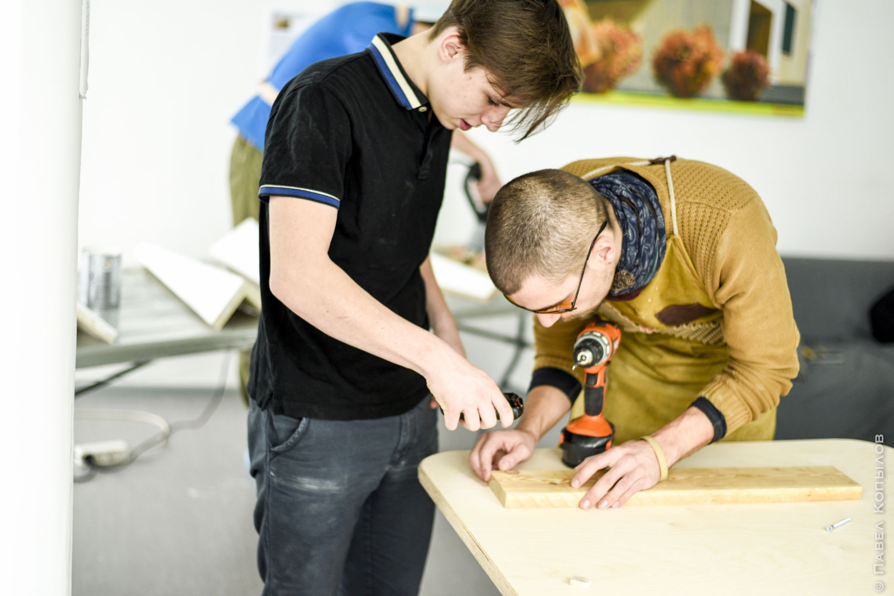
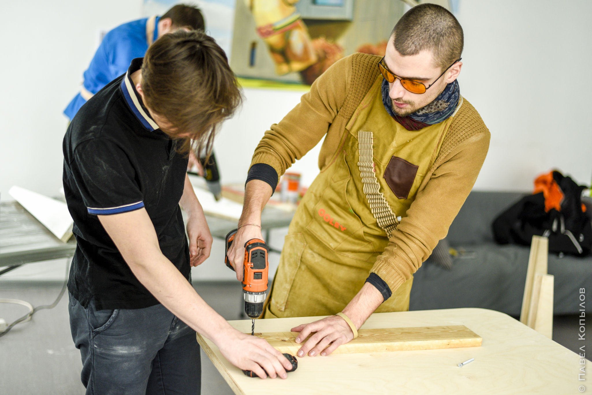

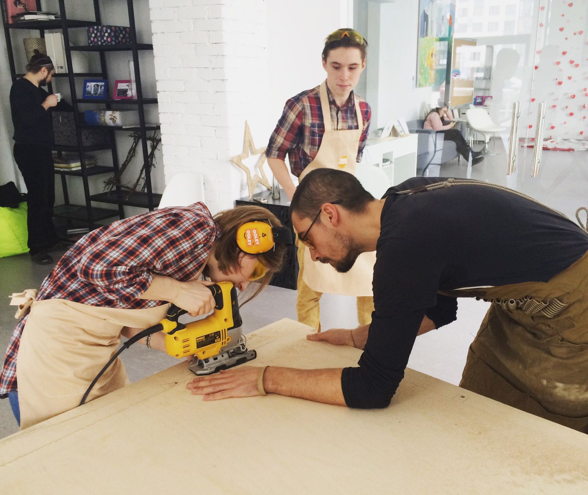

При создании стола, особенно с такой конструкцией, крайне важна точность в размерах заготовок и пазов. Ручной электроинструмент не даёт такой точности, как ЧПУ-станок, особенно когда человек пользуется электролобзиком впервые в жизни. Вместе нам удалось выпилить заготовки достаточно аккуратно, а вот пазы все-таки пришлось дорабатывать потом молотком и стамеской, что потребовало дополнительных сил и времени. Скруглив кромку столешницы кромочным фрезером с радиусной фрезой 6 мм, мы приступили к сборке стола. Силой забив перекрестие ножек в пазы в столешнице, мы притянули их к ней с помощью мебельных стяжек — "конфирматов". Для сверления пробовали применить специальные конфирматные свёрла с изменяемой глубиной сверления, однако они не смогли справиться с трудностями сверления торцов фанеры: центральное сверло застревало и сворачивало крепивший его винтик. Попытки затянуть его посильнее привели только к порче идущего в комплекте тонкого шестигранного ключа. Видимо, такие свёрла предназначены исключительно для ДСП, ДВП и подобных материалов. Пришлось сверлить отверстия в два подхода:

- сверлим отверствие сверлом 6 мм на грубину вкручивания конфирмата,
- расширяем его держателем для конфирматных свёрел без центрального сверла

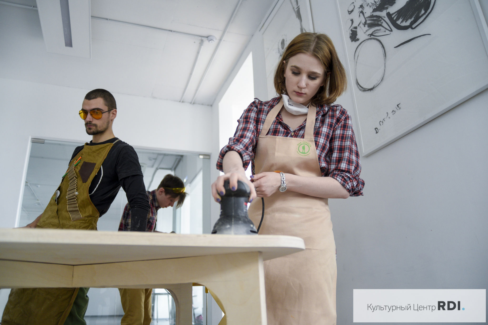

Стяжка помогла сделать конструкцию крепче, однако это не сильно повлияло на всё-таки явно недостаточную устойчивость готового стола. Конечно, сказался не везде перпендикулярный ход пилки лобзика, однако основной недостаток обнаружился в самой конструкции. Изящность дизайна привела к потере конструктивной жесткости изделия. Стол неплохо держит продольные толчки и не трясётся. Однако ножки оказались слишком тонкими и гибкими, стол заметно качается при его "скручивании". Мы не стали проверять на практике, но было очевидно, что если поставить на такой стол чашку чая и попытаться за ним поработать, неприятности неизбежны. Понимая, что такой стол вряд ли будет использоваться в коворкинге, мы отдали его на растерзание местным детишкам, позволив им начать рисовать на нём всё, что им заблагорассудится. На этом первый воркшоп завершился и мы отправились размышлять над полученным опытом.

## Переосмысление конструкции

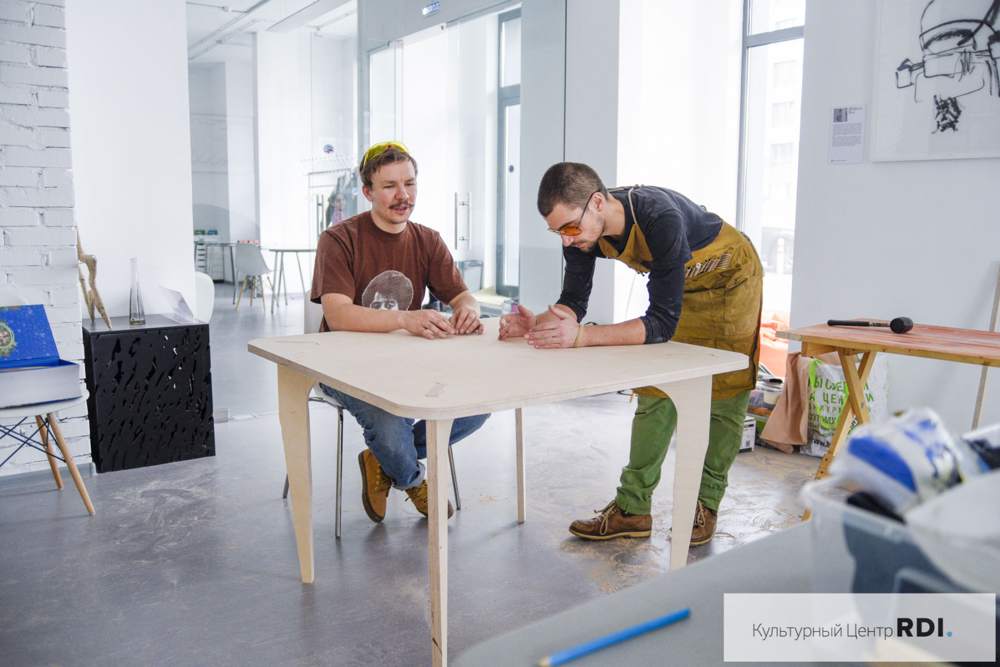
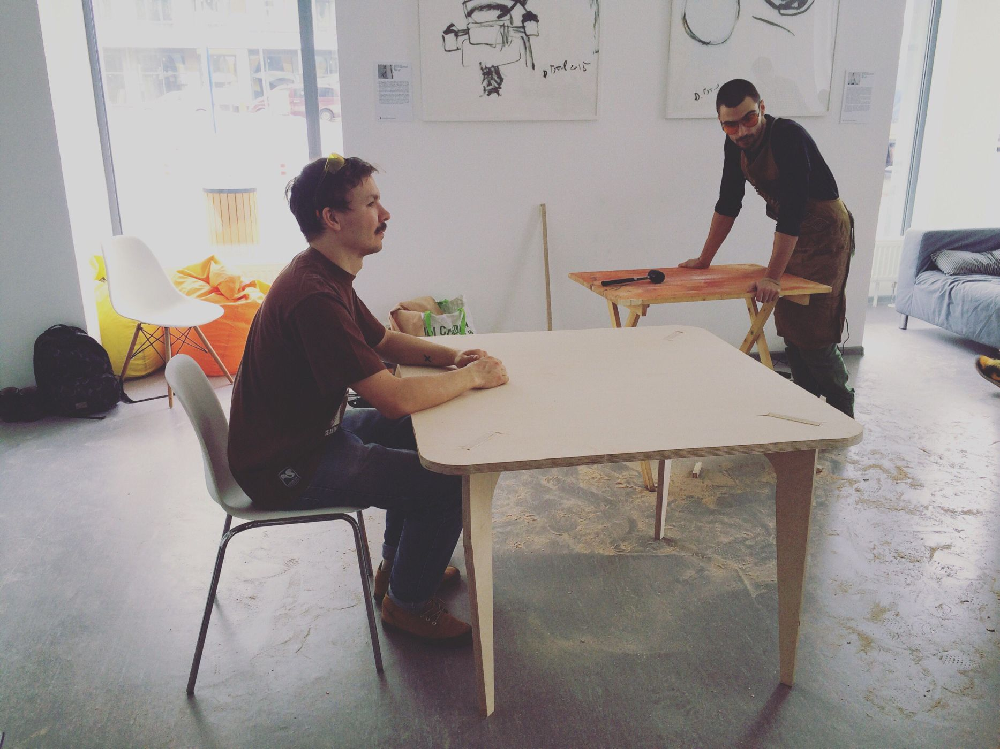
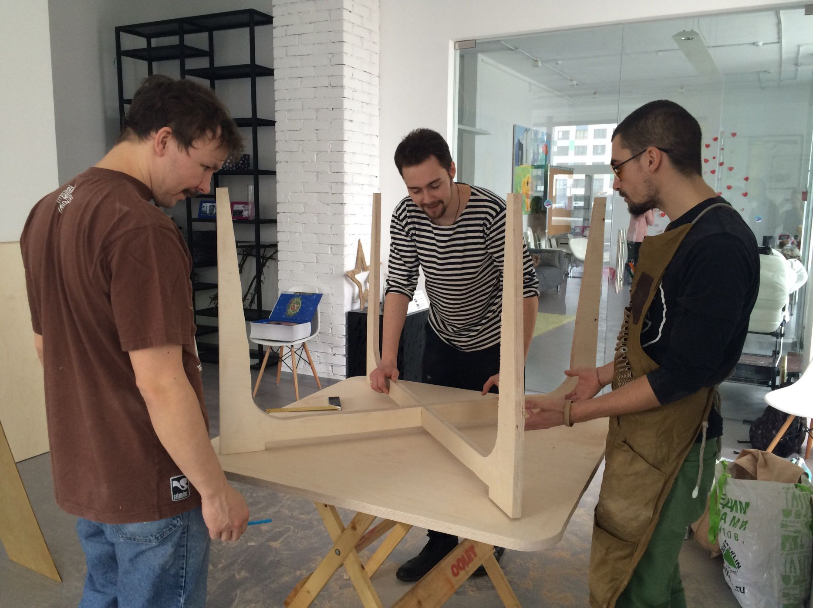

Исходной конструкции не хватает перекрестий и перпендикулярных плоскостей, придающих жёсткости. Мы решили переработать структуру стола, оставаясь в рамках использования одного целого листа фанеры. В процессе размышлений и проверки гипотез мы создали два макета из картона, малярного скотча и термоклея, а затем и более масштабный макет стола из 10-миллиметровой фанеры. Уже на этой стадии стало очевидно, что использование двухэлементных ножек, соединённых под прямым углом, с использованием даже нешироких царг (верхнего пояса подстолья, соединяющего ножки между собой) даёт отличную жёсткость и прочность конструкции. Собранный на морозе буквально за полчаса макет, даже без царг и соединённый лишь гвоздями спокойно выдерживает вес взрослого человека и не качается. Высоту стола решили оставить прежней, 750 мм — это чуть выше обеденного стола и идеально для работы с ноутбуком и бумагами. Захватив с собой небольшой лист тонкой фанеры для царг, мы готовы строить столы новой конструкции.

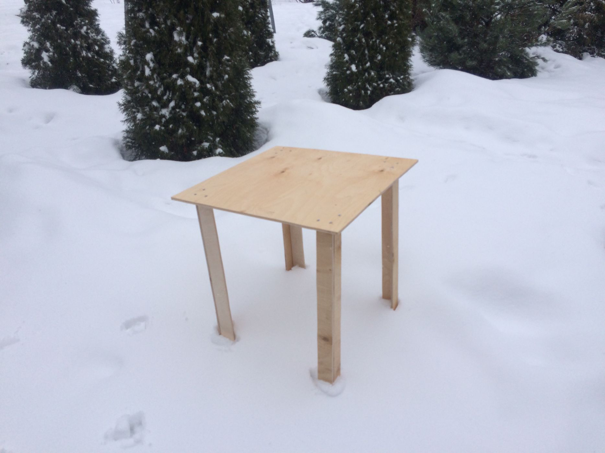

## Второй воркшоп

В обновлённой конструкции мы учли неточность пиления электролобзиком и сделали линии отпила прямыми и навылет, что позволило нам задействовать ручную циркулярную пилу, дающую намного более качественные спилы. Безусловно, циркулярка — еще более сложный и опасный инструмент, чем электролобзик, и мы внимательно отнеслись к работе и обучению обращению с ним. Участники воркшопа начали работу с разметки сразу двух столов, отмечая не только линии пила, но и смещённые на ширину отступа подошвы пилы линии для выставления направляющей. Для аккуратных прямых отпилов пиление циркулярной производится только вдоль направляющей (мы использовали ровный кусок фанеры) и с использованием пильного диска с частыми зубьями для чистого реза. Важно всегда помнить о существенной ширине пропила, составляющей примерно 3 мм и учитывать это при разметке расстояний до направляющей. Также стоит помнить, что циркулярная пила даёт достаточно много опилок и выбрасывает их довольно мощной струёй — без очков не обойтись.

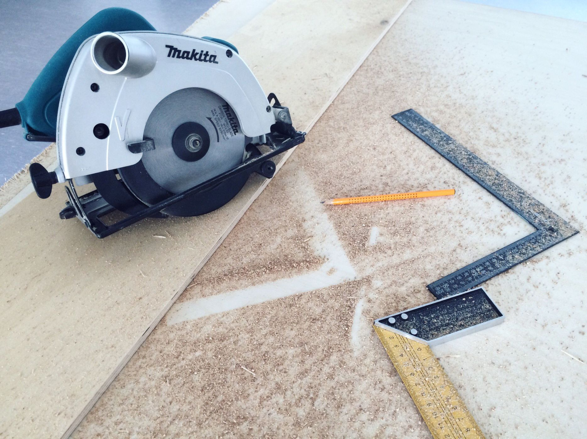

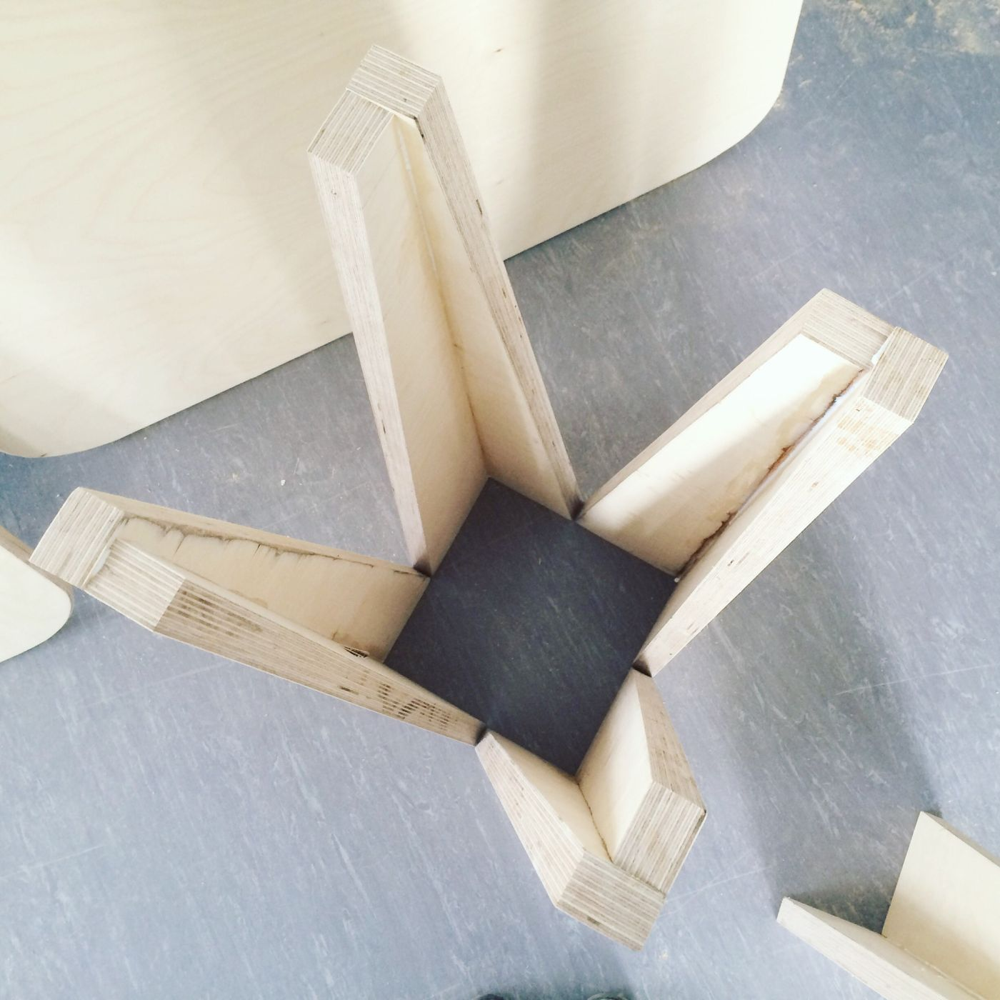
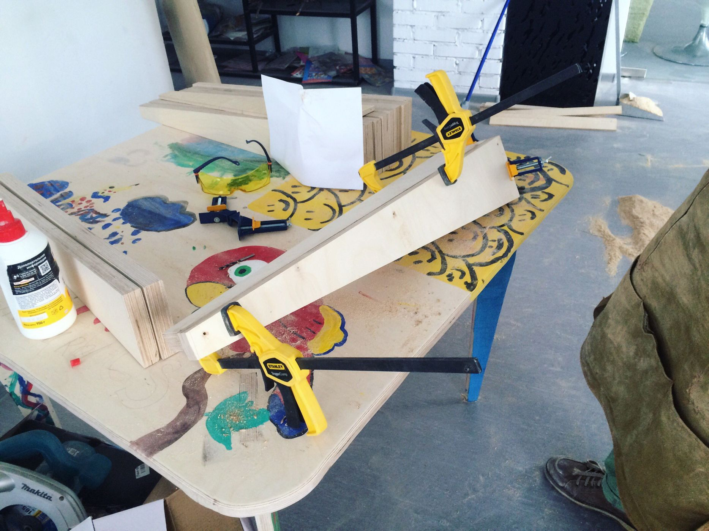

Совместными усилиями мы достаточно быстро выпилили два комплекта заготовок для столов. Мы постарались эффективно сочетать работу по доработке ножек и царг с обработкой столешниц. Лобзиком привычно скруглили углы столешниц, а их кромки со всех сторон обработали радиусной фрезой. В это время началась активная шлифовка деталей. В ход пошли шлифовальные листы на тканевой основе, эксцентриковая и ленточная шлифмашинки. К горстке сравнительно крупной стружки от пиления добавилось плотное облако мелкой пыли от шлифования грубой, а затем и более тонкой шкуркой. Все участники работали в очках и респираторах, так что это было довольно безопасно, однако пространство культурного центра еще долго будет помнить об этом моменте. В особенности сложно это будет забыть уборщице, которой еще не один день придётся собирать оседающую на все поверхности пыль.

Подготовленные детали ножек мы скрепляли с использованием угловых и прямых струбцин, столярного клея и саморезов. После отладки процесса сборка одной ножки занимает не более 10 минут. Намазываем обе поверхности клеем, совмещаем и закрепляем в угловой струбцине и стягиваем всё это прямой. Напротив стыка засверливаем отверстия для саморезов и скрепляем ножку в трёх точках. Всё, можно снимать струбцины и переходить к следующей ножке.

За второй воркшоп мы смогли полностью подготовить 2 столешницы, 8 ножек и 8 царг, готовых к покраске и сборке. К тому же мы нашли возможность разобраться и с самым первым шатким столом. Как оказалось, маленькие дети — завсегдатаи культурного центра и для них требуется свой стол для рисования и прочего творчества. Мы укоротили ножки примерно на 200 мм, сделав удобный для детей от 5 до 15 лет "детский" стол для работы стоя или сидя на диване.

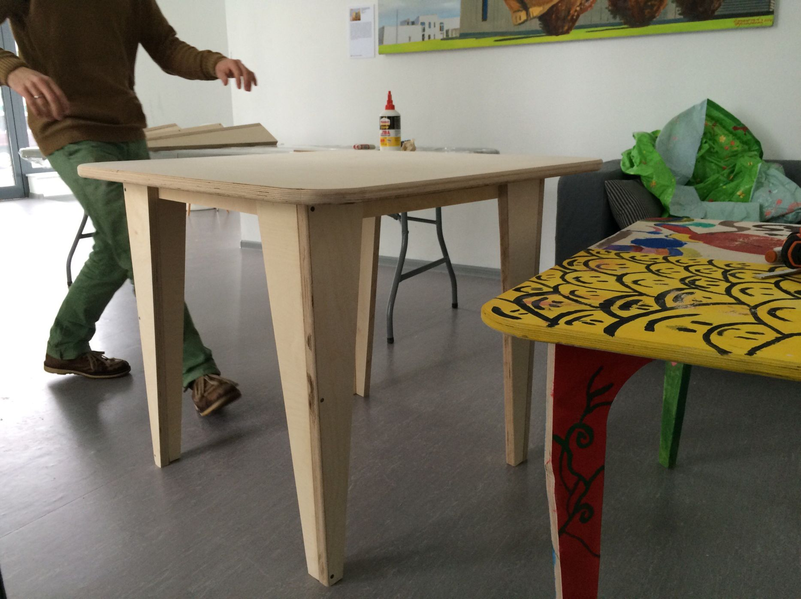

## Дизайн отделки

Немаловажная часть любого столярного проекта — финишная отделка готового изделия. Здесь всегда рождается множество разнообразных идей и их сочетаний, однако важно всегда проверять соответствие внешнего вида предмета его функциональному назначению. Размышляя над оформлением столов, мы рассматривали варианты приклеивания различных карт, схем и прочих бумажек методом декупажа, пробовали сделать набор трафаретов для нанесения всевозможных декоративных элементов на дерево, однако вовремя осознали, что для работы в коворкинге необходимы наименее отвлекающие поверхности, позволяющие сконцентрироваться на работе. Мы решили обратиться к эффектному сочетанию гладких крашеных поверхностей с фактурой необработанного дерева. Вариант обработки фанеры масло-воском пришлось отбросить в связи с ограниченностью времени на сушку, ведь повторный слой масла можно наносить только через сутки впитывания и сушки первого слоя. В очередной раз нас выручили акриловые вододисперсионные краски и матовый лак. Мы разработали несложную композицию из крашеных в белый ножек, ярких царг и покрытых прозрачным лаком столешниц. Осталось воплотить это всё за один четырёхчасовой воркшоп.

## Третий воркшоп

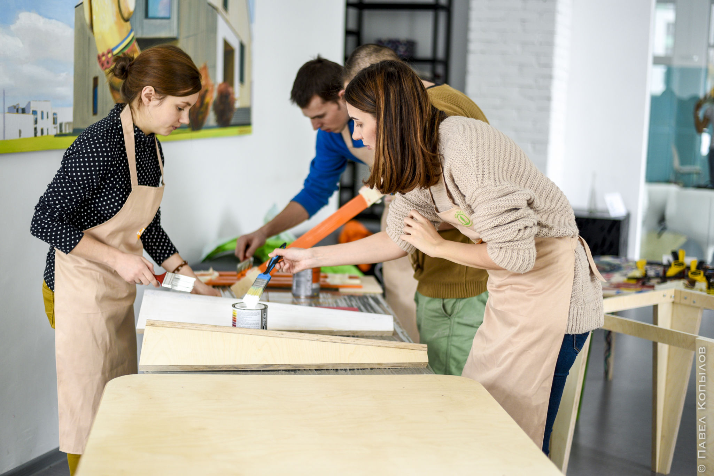

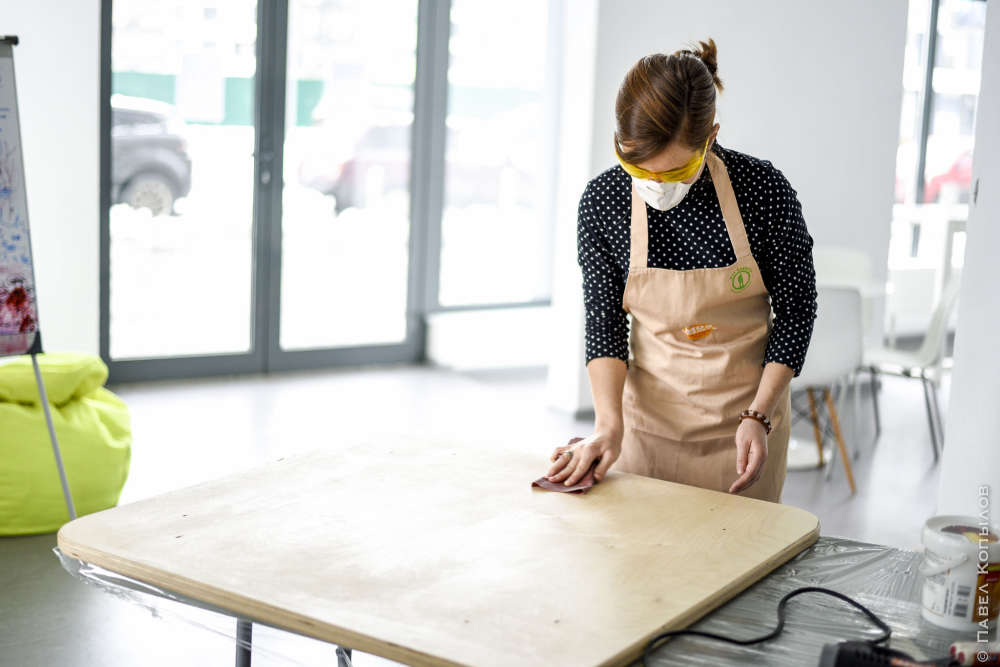

Для того, чтобы начать красить детали, необходимо определить их расположение относительно друг друга и подготовить все крепёжные отверстия. После пробной примерной сборки, мы снова разобрали все на детали и приступили к активной покраске. Для хорошего укрытия фанеры требуется 2—3 слоя акриловой краски. Слои, в зависимости от толщины, сами по себе сохнут не менее часа, поэтому нам пришлось прибегнуть к хитрости. Для ускорения сушки мы применили строительный фен, в первом режиме выдувающий струю воздуха температурой 80°С. Нанести слой краски или лака, просушить феном, отшлифовать тонкой шкуркой поднявшийся деревянный ворс (краска же на водяной основе), протереть слегка влажной тряпкой от образовавшейся пыли — вот этапы непрерывного покрасочного процесса, позволившего уложиться в имеющиеся сроки. Конечно, любые подтёки краски даже с использованием фена сохнут намного дольше и мы то и дело пачкали и пачкались еще влажной краской. Соединив два листа самоклейки и вырезав из них ровный круг, мы сделали трафарет для фирменной голубой точки из логотипа девелоперской компании RDI. Обычная губка для мытья посуды позволила за один раз нанести краску плотным ровным слоем. Переходим к сборке!

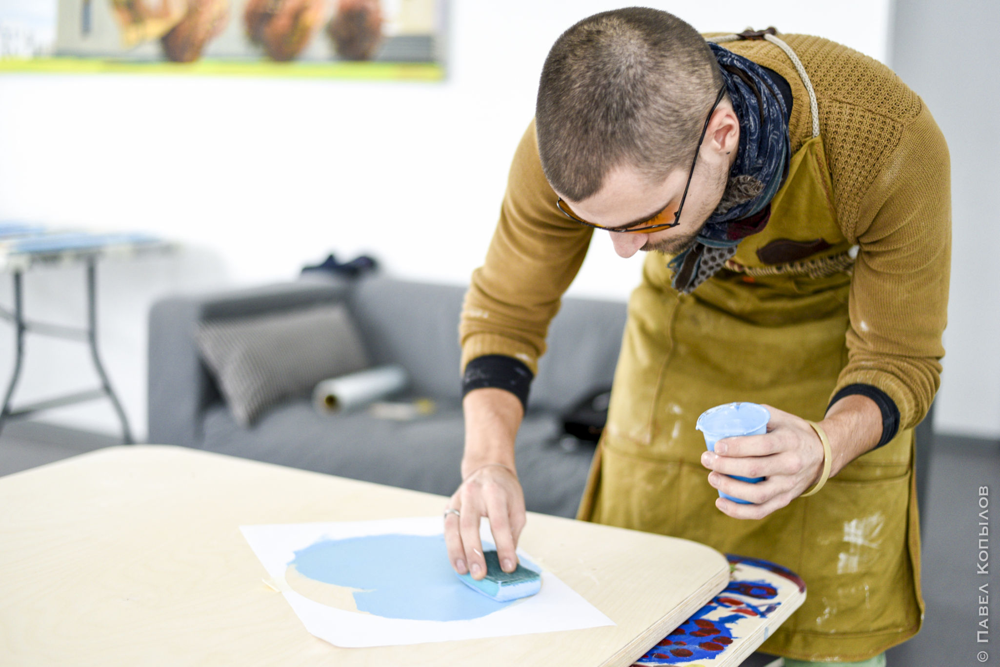
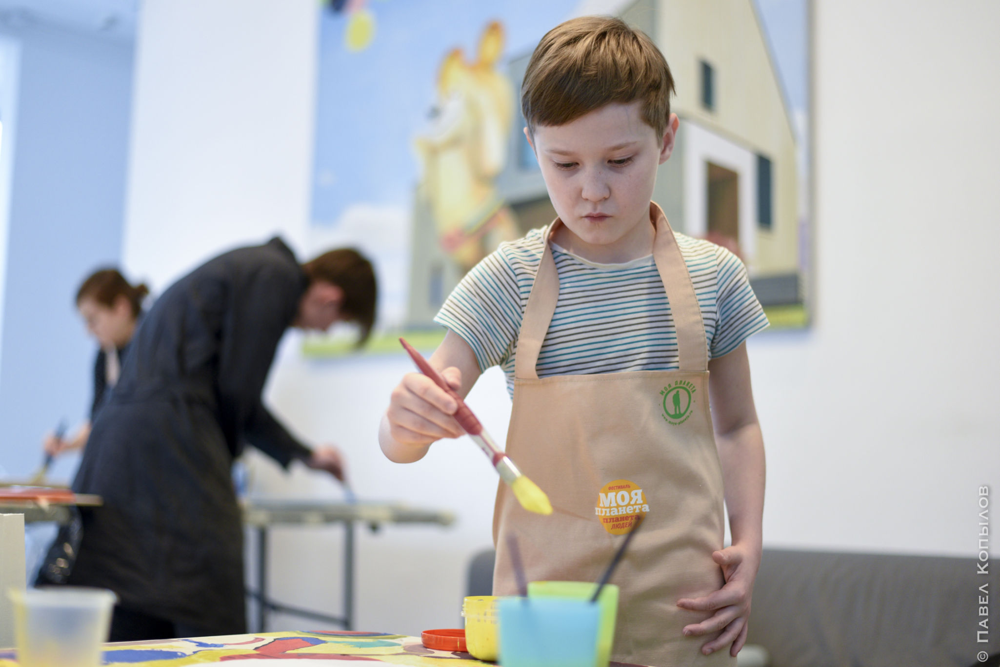
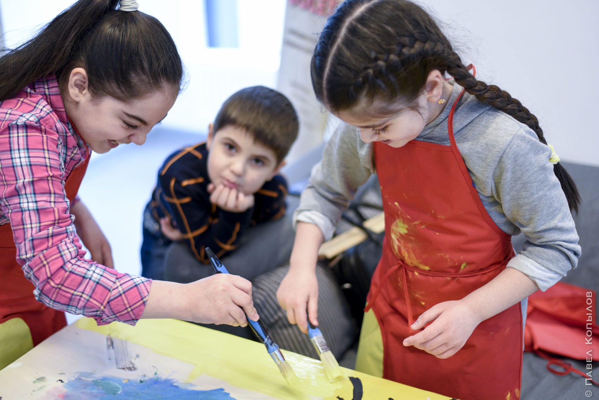
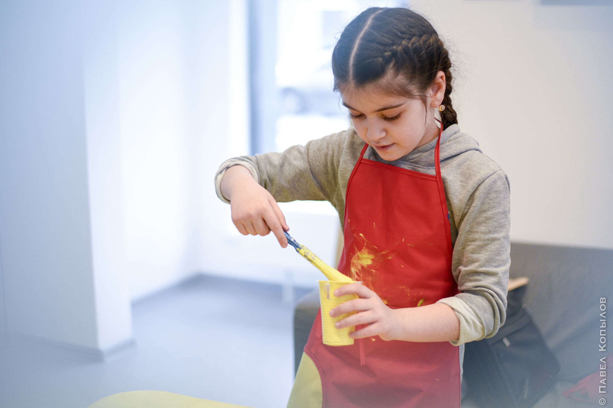
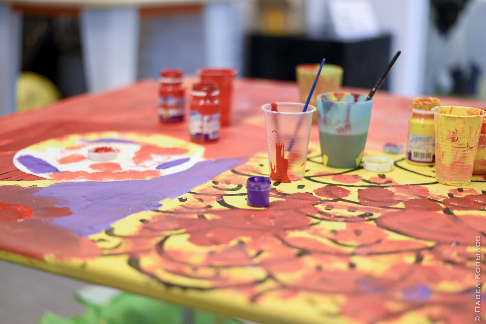

Царги присоединяются к внутренним сторонам ножек с помощью саморезов с плоскими шляпками. Затем кладём столешницу сверху на собранное подстолье и выравниваем её по угольнику. В столешницах мы заранее разметили и просверлили отверстия для вкручивания конфирматов. Сверлим отверстия для конфирмата в ножках и вкручиваем винты шестигранными ключами. Для стяжки стола нам хватит всего 8 таких соединений, по два на каждую ножку. В очередной раз мы убедились в том, что конфирмат не очень-то подходит к работе с фанерой, когда во время затяжки один из них сломался, а в другом начал стёсываться шестигранный шлиц. В следующий раз в подобных ситуациях использование толстых оцинкованных саморезов представляется более предпочтительным. Финишное покрытие столешниц лаком, тщательная уборка за собой и всё, мы уложились в срок!

## Выводы

Столы получились жёсткими и устойчивыми, фетровые наклейки на ножках убрали даже самый малый люфт, а также позволили нивелировать вес столов — по наливному полу такие ножки скользят бесшумно и легко. За три воркшопа мы вместе с заинтересованными местными жителями вырезали и собрали три стола. Участники этих событий попробовали свои силы в новых для себя формах деятельности, обучившись базовым приёмам разметки, пиления, шлифовки, сверления и соединения деревянных деталей. Мы привнесли новый формат событий культурного центра, хотя, конечно, ценой заполонения всего его пространства мелкой древесной пылью. Там ещё остался целый квадрат фанеры толщиной 24 мм и мы, возможно, еще завершим серию четвертым столом, однако на этот раз мы лучше дождёмся весны и будем пилить и шлифовать деревяшки на улице.
