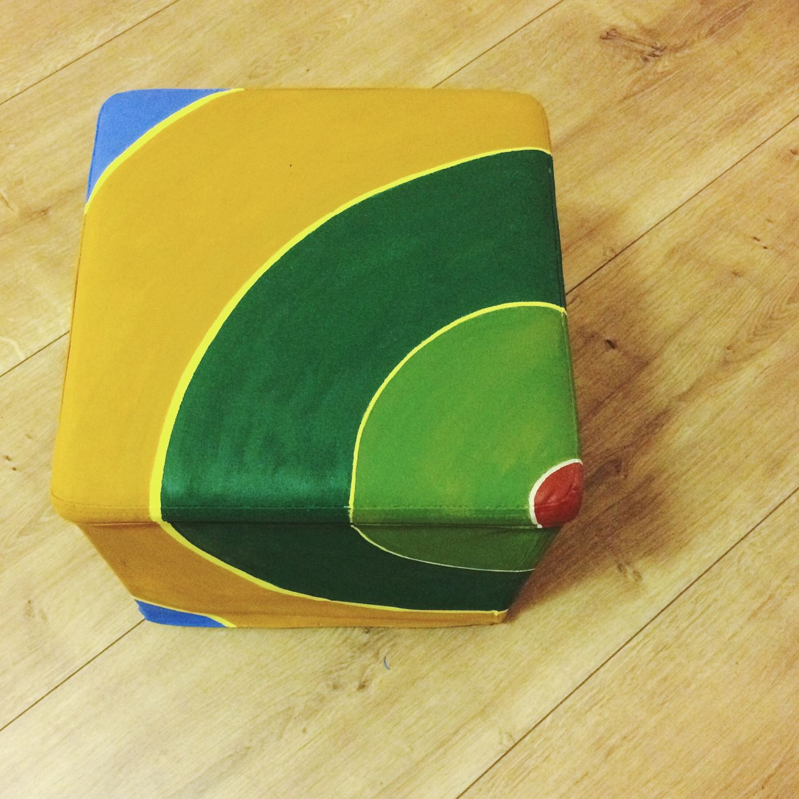
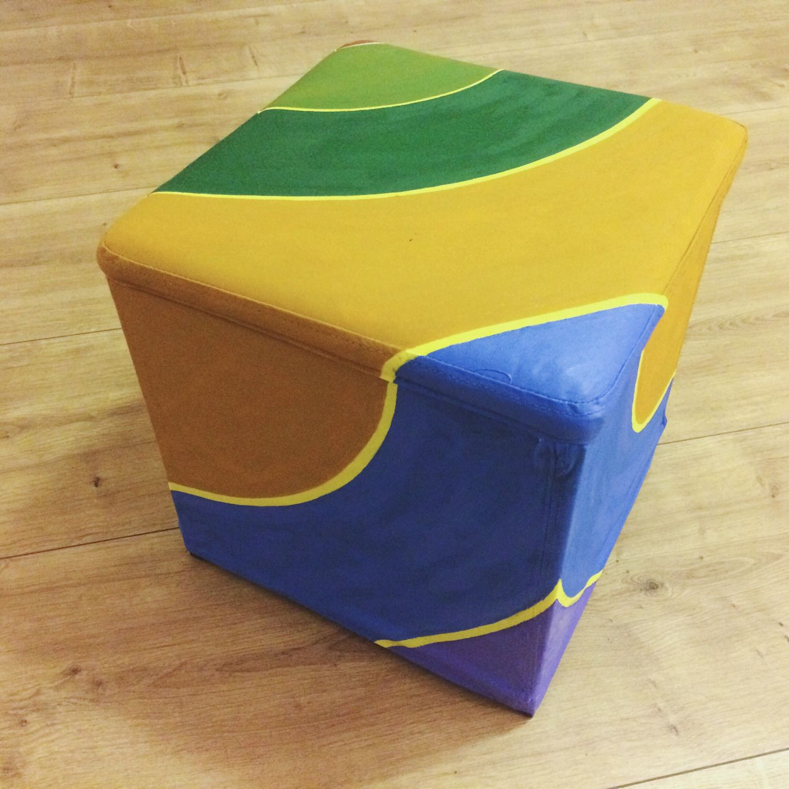

Мы уже показали вам наш [яркий пуфик](http://ooley.ru/prostoj-no-yarkij-puf/ "Простой, но яркий пуф") и обещали рассказать, как без особых трудностей разметить что-то квадратное кругами. В данном случае мы раскрашивали этот яркий, но очень легко пачкающийся желтый пуфик из ИКЕА. Задумка была простой: изобразить сечения невидимых вложенных шаров, пересекающих плоскости пуфа. Звучит сложно, выглядит эффектно, рисуется быстро и довольно легко.

### Инструменты:

- циркуль или толстая игла,
- карандаш,
- широкие и тонкие кисти.

### Материалы:

- толстая нить,
- акриловые краски.

### Размечаем поверхность  

Стараясь не усложнять композицию, центром всех сфер мы выбрали один из уголков пуфа. Хотя вы можете начинать из любой точки, это не сильно усложнит процесс разметки.

В качестве циркуля мы использовали несложную конструкцию из иглы, нити и карандаша. На нити завязывается узелок и протыкается иглой, которая втыкается в центральную точку будущих окружностей. На желаемом расстоянии нитка привязывается к карандашу мы готовы наносить разметку.

Круг за кругом размечаем всю поверхность пуфа.  Рисунок усложняется, когда линии начинают заходить на "дальние" от центра грани, но довольно быстро можно разобраться, куда нужно перенести наш "циркуль", чтобы форма продолжалась естественно.

### Раскрашиваем 

Когда разметка готова, можно переходить к раскрашиванию. Подберите цвета по вкусу. Если какого-то цвета нет, попробуйте получить его смешением имеющихся на листе бумаги или на простой тарелке, акрил с нее потом можно будет легко отскоблить даже ногтем. Старайтесь наносить краску равномерно плотным слоем.

Заполнив основные площади ровным слоем краски приступаем к доводке рисунка более тонкой кистью. Постарайтесь сделать края кругов ровными, а линии между ними равномерной ширины, тогда вы сможете получить аккуратный радующий глаз результат.

### Готово!

Отдельно закреплять краску не нужно. Просто дайте ей высохнуть и можете начинать пользоваться обновленным предметом интерьера.

