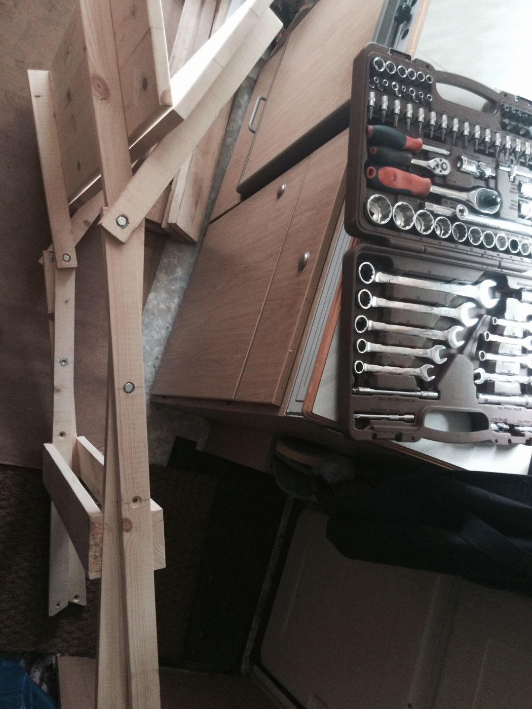

Прицеп-мастерская OOLEY42 – отличное место для хранения и перевозки инструментов и материалов, в ней классно рисовать, шить и делать макеты, но все более серьёзные творческие задачи лучше выполнять на улице. Мы собрали уже целый парк инструментов для деревообработки и работы с металлами и пластиками и уже не терпится опробовать всё это в деле, но тут возникла предсказуемая проблема. У нас не оказалось стола для того, чтобы вынести его под выдвижной тент прицепа и обустроить полноценный рабочий верстак. Мы любим такие трудности, принимая их как личный вызов. Мы даже не искали складные столы в продаже, а сразу принялись за изучение возможных схем для самостоятельного создания мебели точно под наши нужды.

<youtube-embed link="https://youtu.be/o2lwOkXZj40" />

Мы изучили несколько схем складной мебели. Сначала нам попалась отличная инструкция по созданию эффектного раскладного стола на youtube-канале "Сделай, Сэм!". Нам в прицеп эта схема не подошла, но её однозначно можно применить в других проектах.

<youtube-embed link="https://youtu.be/A6PlqXxwiZ8" />

Последующее изучение темы привело нас к потрясающе простой и в то же время эффективной схеме раскладной мебели, используемой [одной украинской фирмой](http://berest-cs1075373.uaprom.net/) для производства своих комплектов для пикников и уже опробованной мастерами.

<youtube-embed link="https://youtu.be/hh0YZdUXHg0" />

Это несложная конструкция и мы взялись за дело. К сожалению, для того, чтобы сделать такой стол в прицепе-мастерской нам не хватало одного — стола. И чтобы разорвать этот бесконечный цикл, мы решили воспользоваться возможностями дружественного [производственного коворкинга "Дар Труда"](/workshop/map/dar-truda/). Администратор Роман помог не только определиться с необходимыми материалами, но даже помог их доставить на площадку в ходе совместной закупки материалов.

### Материалы

- брус 20х45 общей длиной 5400 мм
- доска 95х20 общей длиной 6800 мм
- болты М6 или М8 длиной 35 мм (чуть меньше двух толщин используемого бруска)
- мебельные гайки (или просто гайки)
- шайбы 6 (8) мм внутренний и 16 мм внешний диаметр
- саморезы

Широкий ассортимент инструментов производственного коворкинга позволил нам выбрать наиболее подходящие для наших задач инструменты, однако стоит помнить о том, что задачи пиления и сверления дерева могут быть выполнены многими способами.

### Инструменты

- рулетка, линейка и карандаш
- торцовочная пила
- планетарная и ленточная шлифмашинки
- сверлильный станок
- шуруповёрт
- свёрла по дереву 2, 6 и 8 мм, а также перовое сверло 16 мм
- гаечный ключ с головкой 12 мм

Измерив доступное пространство прицепа и применив наши [знания о столостроительстве](/practice/project/duboviy-stol/), мы рассчитали наиболее подходящие габариты стола:

- ширина 600 мм
- длина 900 мм
- высота 760 мм

Для этого нам понадобятся:

- 4 бруска 900х45х20 мм для ножек
- 4 бруска 450х45х20 мм для опор столешницы
- 6 досок 900х95х20 мм для столешницы
- 2 доски 700х95х20 мм для ребер жёсткости ножек

Первым делом мы **напилили** из бруса заготовки для ножек и опор столешницы. Правильнее всего будет уже на этом этапе **скруглить** оба конца ножек и опоры с одной стороны — это необходимо для устойчивости и цельности конструкции.  Напиленные заготовки можно сразу **отшлифовать** наждачной бумагой или шлифмашинкой. **Размечаем** отверстия для болтов  в ножках симметрично на краях и на расстоянии ~20 см от края. В опорах болты будут размещаться только с одного края.

**Сверлим** отверстия, соответствующие диаметру используемых болтов. Со стороны, где будут вбиты мебельные гайки нужно просверлить на глубину ~5 мм сверлом потолще.

А для того, чтобы в ножках не торчали головки болтов, мешая складыванию стола, **расширяем** в этих местах отверстие  по размеру используемых шайб перьевым сверлом на глубину шляпки болта. В опорах столешницы такие углубления делать не нужно, ведь можно расположить на месте совмещения досок при складывании практически плоские мебельные гайки. Однако, этот приём может помочь подобрать наиболее эффективную глубину зацепления болта и резьбы гайки, чуть притопив его вместе с гайкой в дерево. Если вместо мебельных используются обыкновенные гайки с шайбами, места их расположения тоже углубляются чтобы они не выступали и не мешали складыванию стола. Лишнюю блину болта **можно сточить** напильником или срезать ножовкой по металлу. **Скручиваем** полученные заготовки болтами и получаем две опорных детали стола, готовые для соединения со столешницей.

Вплотную к концам опорных брусков, расположенных строго параллельно, прижав струбцинами к столу, **прикручиваем** доски столешницы саморезами, не забывая предварительно **просверлить** отверстия маленьким сверлом во избежание растрескивания древесины.

Прикладывая вплотную друг к другу, мы присоединяем по три доски на каждую сторону складной конструкции и получаем две половины столешницы **по 300 мм шириной** каждая. Стол уже можно собрать и поставить на пол, проверяя правильность расчётов и отпилов. Нам остаётся только прикрепить саморезами **рёбра жёсткости** ножек стола на расстоянии примерно 15—20 см от пола так, чтобы они не мешали складыванию стола, но давали ему необходимую устойчивость. Конструкция стола готова!

Если вы тоже не скруглили края ножек и опор заранее, то это ещё не всё. Нетрудно заметить, что прямоугольные края ножек нужно немного исправить чтобы они не мешали опираться столешнице на всю плоскость опор и для увеличения площади контакта ножек и пола. Отметив на одном уровне высоту и угол поверхности пола, отпиливаем всё лишнее. В верхней части линию отпила можно наметить лезвием или полотном от ножовки.

**Стол собран!** Нам понадобилось ещё один раз разобрать его на 4 крупные детали для того, чтобы покрыть поверхности защитным **масловоском для дерева**. Сутки сушки и стол готов к финальной сборке. Прокладываем все места возможного трения **шайбами** и затягиваем болты с одинаковым усилием, позволяющим деталям вращаться.

Нам удалось вскоре опробовать стол в ходе нашего участия в организации зоны мастерских на [Делай Саммите 2015](/practice/ooley42/om-at-delay-summit-2015/) на Флаконе и можем быть уверены в простоте, надёжности и устойчивости этой конструкции.
