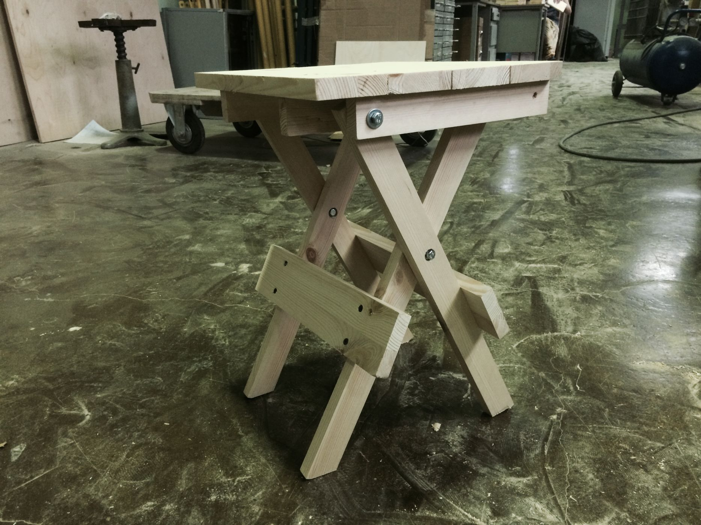
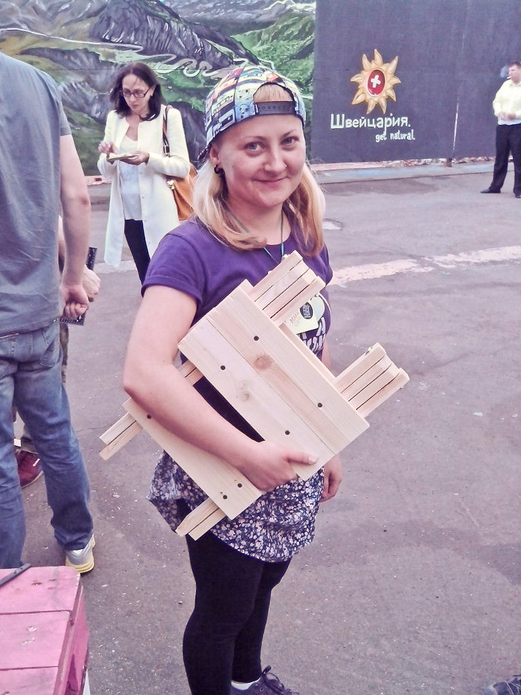
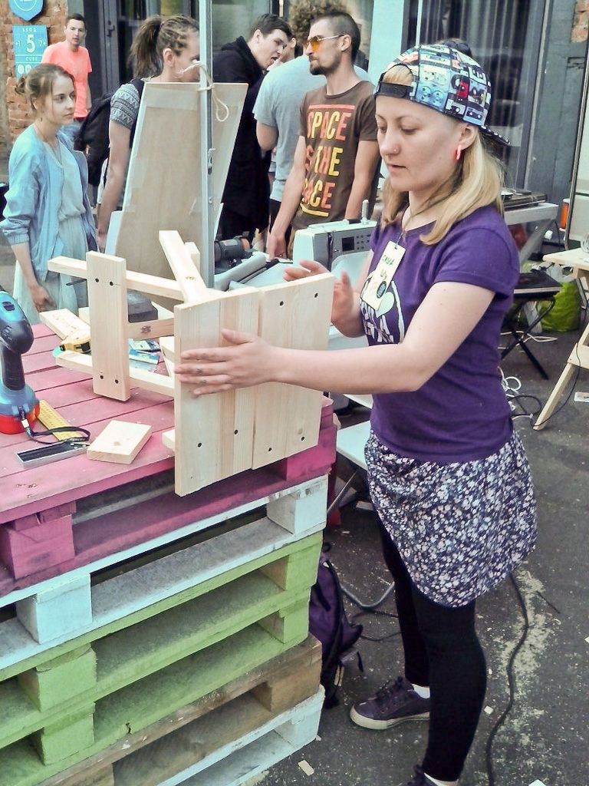

Складная мебель — прекрасное средство расширить возможности любого помещения, например, мастерской, в особенности — передвижной. Мы уже разобрались с созданием [складного стола-верстака](/practice/project/stol-x/) и усвоили конструкцию и соотношения его складного механизма. Теперь этот принцип можно применить и для иных задач.

Конечно, мы не изобрели колесо, решив сделать складные табуретки по такому принципу. Одна украинская фирма продаёт такие табуретки в комплектах с такими же столами, а на ютьюбе есть даже несколько уроков по их самостоятельному изготовлению.

<youtube-embed link="https://youtu.be/X15QlVUdK10" />

<youtube-embed link="https://youtu.be/O9lb30ZtpAc" />

<youtube-embed link="https://youtu.be/sq6b240PzvM" />

Впервые мы воплотили эту идею в [производственном коворкинге "Дар Труда"](/workshop/catalog/dar-truda/), в рамках подготовки к совместному мастер-классу на [Делай Саммите 2015](/practice/ooley42/om-at-delay-summit-2015/). В качестве исходного сырья администратор Роман предоставил нам неплохие метровые обрезки соснового мебельного щита толщиной 18 мм и шириной от 25 до 75 мм. Нам это подошло идеально. Все детали крепежа удалось закупить разом в ближайшем Леруа Мерлен.

### Материалы

- брус 100х25х18 общей длиной 3000 мм
- доска 100х75х18 общей длиной 2000 мм
- болты М6  длиной 35 мм (чуть меньше двух толщин используемого бруска)
- мебельные гайки (или просто гайки)
- шайбы 6 мм внутренний и 16 мм внешний диаметр
- саморезы

Широкий ассортимент инструментов производственного коворкинга позволил нам выбрать наиболее подходящие для наших задач инструменты, однако стоит помнить о том, что задачи пиления и сверления дерева могут быть выполнены многими способами.

### Инструменты

- рулетка, линейка и карандаш
- торцовочная пила
- планетарная и ленточная шлифмашинки
- наждачная бумага
- сверлильный станок
- шуруповёрт
- свёрла по дереву 2, 6 и 8 мм, а также перовое сверло 16 мм
- гаечный ключ с головкой 12 мм
- 2 струбцины

Отталкиваясь от размеров сырья, мы построили несложные соотношения размеров деталей. Мы разметили все линии реза и напилили на торцовочной пиле все необходимые заготовки.

- 4 бруска 500х25х18 для ножек
- 4 бруска 250х25х18 для опор сиденья
- 6 досок 330х75х18 для сиденья и рёбер жесткости

Лучше всего уже на этом этапе скруглить оба конца ножек и опоры с одной стороны и отшлифовать заготовки. Далее сверлим отверстия на концах ножек и с отступом **от края в 200 мм** сверлом **6 мм**. Со стороны, где будут размещаться мебельные гайки, немного рассверливаем отверстия сверлом побольше. Со стороны шляпки болта нужно сделать **углубление ~5 мм** с помощью перьевого сверла. Аналогично подготавливаем отверстия с одного края каждой опоры сиденья.

Собираем каркас, прокладывая места трения **шайбами**. Расположив основания строго параллельно друг другу, кладём сверху первую доску сиденья и надёжно прижимаем эту конструкцию к столу **струбцинами**. Теперь можно наметить тонким сверлом отверстия для саморезов и скрепить ими каждую из половинок сиденья. Табурет можно уже собрать и протестировать правильность расчётов и отпилов. Остаётся только правильно прикрепить к ножкам собранной табуретки **рёбра жёсткости** и конструкция собрана полностью!

В производственном коворкинге нам потребовалось на все эти операции не более 40 минут, учитывая наличие мощных инструментов и соответствующих компетенций. Теперь можно еще раз пройтись шлифовальной бумагой по углам и поверхностям табуретки и приступить к нанесению **масловоска или лака.**

Мы не собрали не просто табуретку, но **прототип**, по которому и провели наш совместный мастер-класс на [Делай Саммите 2015](/practice/ooley42/om-at-delay-summit-2015/). Участники справились с задачей в условиях открытой передвижной мастерской в течение  1—2 часов, командно и по одиночке собрав **3 полноценных складных табуретки.**

