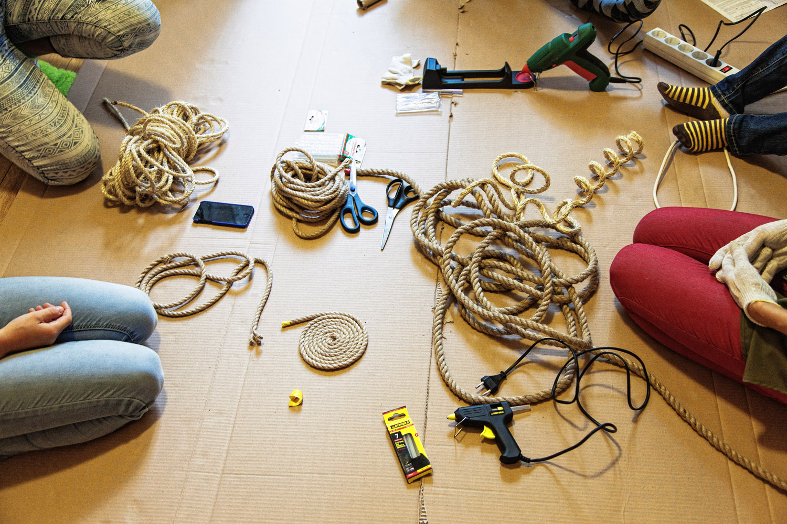
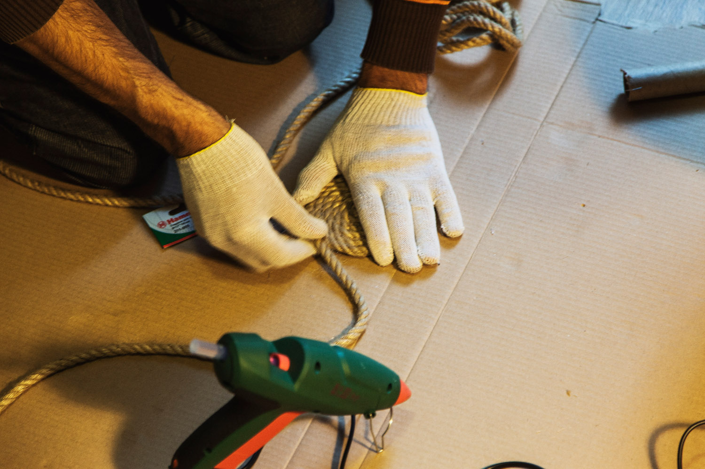
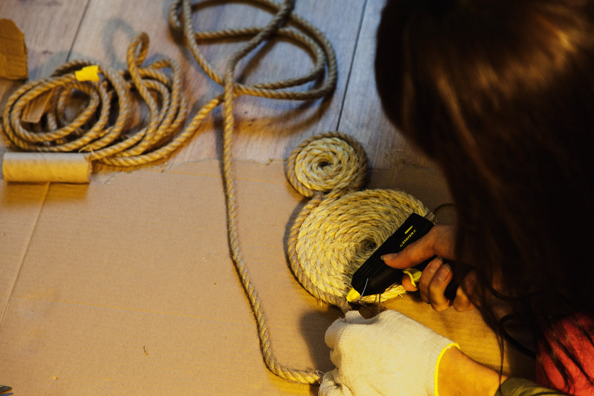
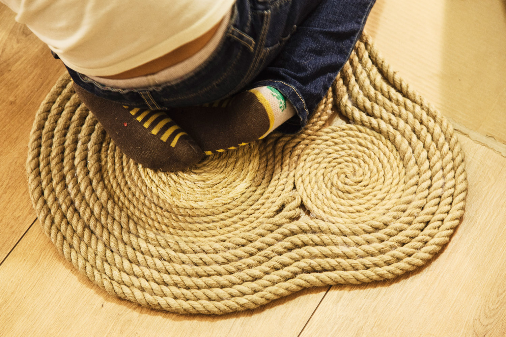

Сделать коврик или какую-нибудь подставку под вазу или горшок или что-то подобное — это простая и легкая задача, научиться вить веревку и склеивать её витки.

#### Инструменты:

- Клеевой пистолет любой марки.

#### Материалы:

- Веревка достаточной длины. Можно разных видов.
- Запас клея
- Перчатки

>Веревка, клеевые пистолеты и клей для них.

Чтобы не испачкать рабочую поверхность клеем, накрываем её бумагой или картоном. Обязательно надеваем перчатки чтобы не обжечься и не склеить пальцы горячим клеем.

> Чтобы коврик был ровным, клеим его, прижимая каждый виток к плоскости

Наносим на веревку ровную линию клея длиной в несколько сантиметров и формируем центр спирали. Постепенно продолжаем равномерно наносить клей на поверхность соприкосновения веревок и склеивать их, прижимая к рабочей плоскости.

> Стараемся не оставлять непроклеенных участков, но и не переборщить

Пробуйте менять направления склейки, комбинировать виды веревок, экспериментируйте!

> Коврик будет готов через час!
