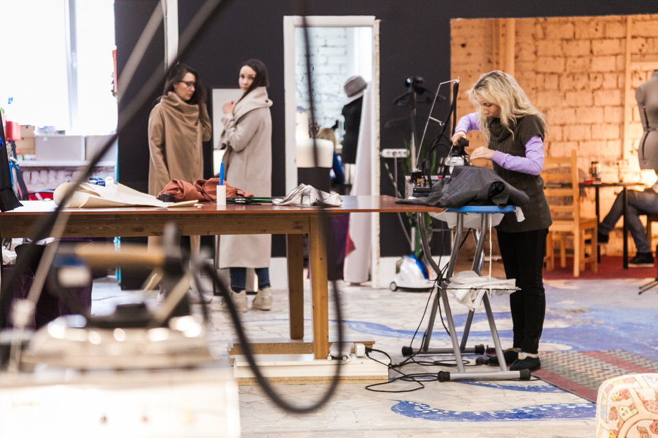
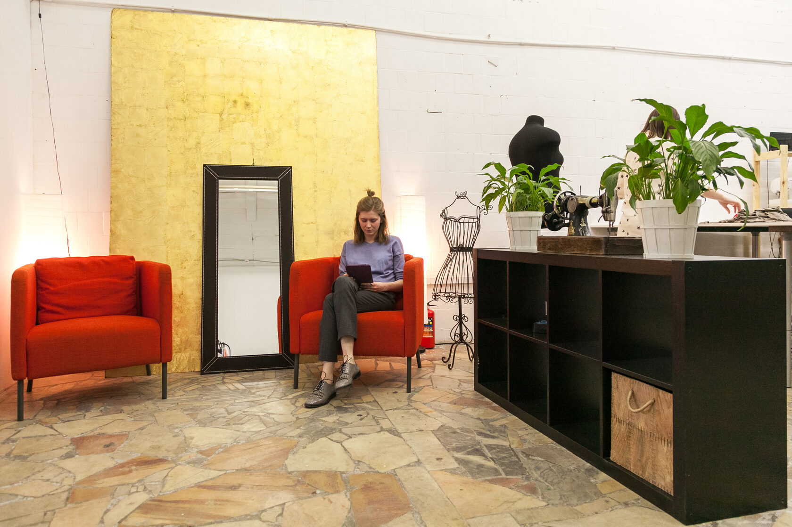
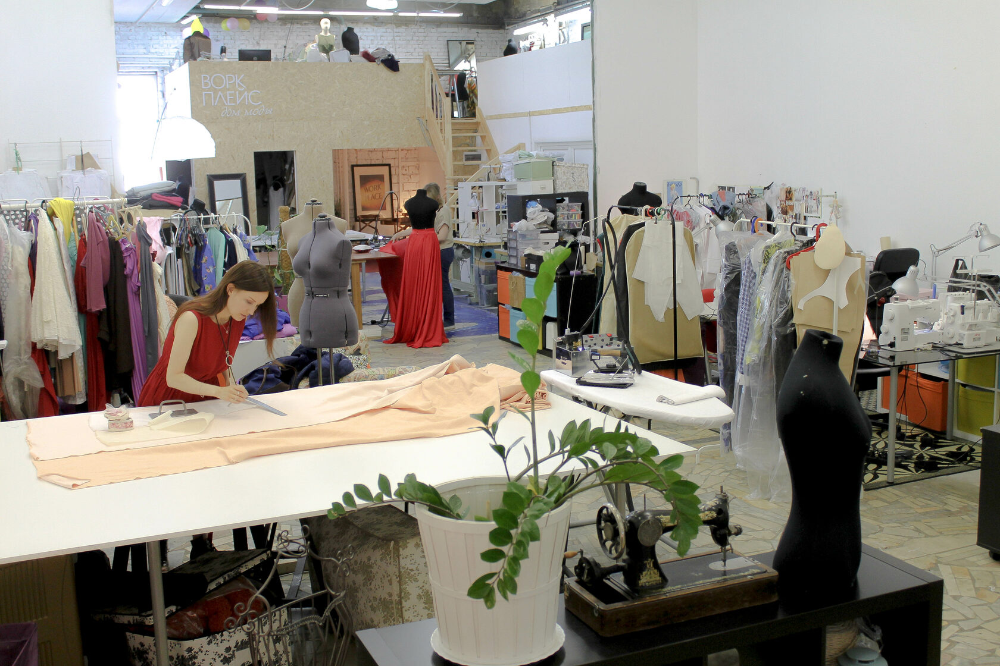
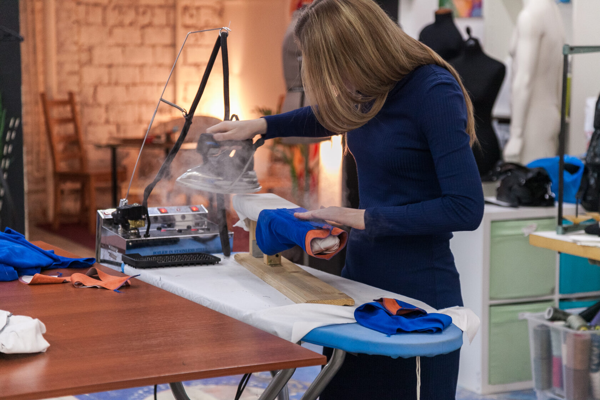
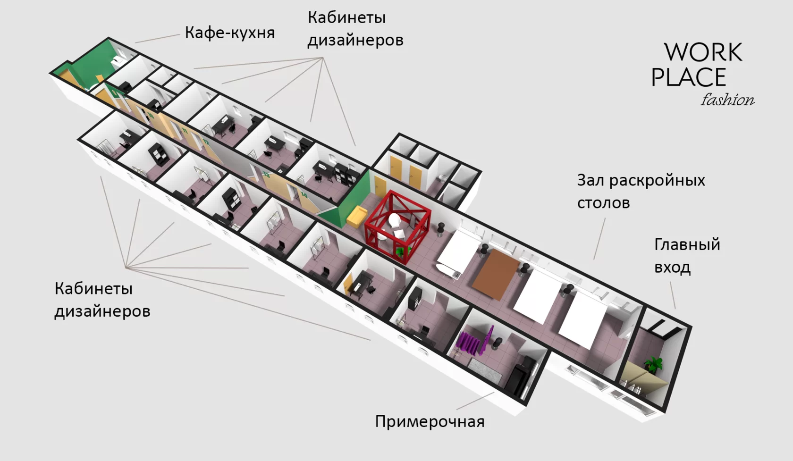

Автор проекта: [Евгений Волк](https://volklab.ru/fashion/)

## Задача

Придумать идею для пустующего лофта, задизайнить пространство, сверстать сайт и пошуметь в прессе.

## Идея

Создать новый вид коворкингов, где дизайнеры одежды смогут использовать наше оборудование, большие столы и встречать клиентов в красивых примерочных, а не дома.

## Решение

Закупить оборудование, создать фотоконтент и пригласить дизайенров переехать из квартирных ателье к нам, чтобы работать с коллегами в рабочей обстановке дома моды.

## 2013 — 2015 Старт проекта

#### Место рождения концепции — Москва, Бауманская, Переведеновский переулок 18, строение 7

https://youtu.be/GraZ3CX19wY

## 2016 — 2018 Второй выход

#### Москва, Бауманская, Переведеновский переулок 18, строение 2

## 2018 — 2022 Воркплейс в наши дни

#### Москва, Новый Вернисаж в Измайловском Кремле

## Пресса о проекте

«[Заняться делом: Мастерские в Москве, где можно поработать](https://www.the-village.ru/village/business/management/222571-kovorkingi-masterskie)», The-village.ru, 02.10.15

«[Проект Workplace для дизайнеров одежды в Петербурге](https://www.intermoda.ru/cit/proekt-workplace-dlya-dizaynerov-odezhdy-v-peterburge.html)», intermoda.ru, 16.07.2015

«[Настал декабрь, и у всех разом сократились заказы](https://zvzda.ru/interviews/a03b0379aad6)», журнал «Звезда», 28.05.15

«[Телепередача «Хэштег: чем отличаются коворкинги от воркплейсов»](https://youtu.be/nIaxI_Re6yc)», Хэштег Хэштегов, 5.11.14

«[Лебедев создал новый лого для Workplace](https://www.sostav.ru/publication/artemij-lebedev-rabota-nad-oshibkami-12960.html) », Sostav.ru, 28.10.14

«[Евгений Волк и история создания сети воркплейсов](https://issuu.com/muzalewsky/docs/t_man_01_saratov_issuu/13)», terra-sar.ru, 04.10.14

«[Воркплейс для начинающих модельеров и дизайнеров](https://brother-friends.ru/?p=38400)», Brother friends, 21.07.14

«[Воркплейсы — профессиональные центры для людей творческих профессий](https://broidery.ru/?p=38950)», broidery.ru, 11.03.14

«[Телеканал Мир о воркплейсах меняющие ход событий людей](https://www.youtube.com/watch?v=itOqoob_X3w)», Телеканал МИР, 18.02.14

«[Стартап: Евгений Волк](https://youtu.be/GraZ3CX19wY)», Телеканал ТНТ-Новый регион, 12.02.14

«[Скандал с лого Лебедева: найти и переделать](https://siliconrus.com/2014/02/skandal-s-logo-lebedeva-nayti-i-peredelat/)», siliconrus.com, 05.02.14

«[Артемий Лебедев признался в плагиате](https://www.the-village.ru/village/hopesandfears/news/154875-workplace-logo)», The-Village, 31.01.14

«[Студия Лебедева уволила дизайнера за плагиат](https://tjournal.ru/paper/lebedev-workplace)», Tjournal.ru, 31.01.14

«[Студия Лебедева создала лого для workplace](https://www.sostav.ru/publication/studiya-lebedeva-sozdala-logo-dlya-work-place-8081.html)», Sostav.ru, 30.01.14

«[Анонс логотипа WORKPLACE от Студии Артемия Лебедева](https://www.artlebedev.ru/workplace/logo/)», artlebedev.ru, 2014

«[Евгений Волк об открытии в Москве первого воркплейса](https://www.m24.ru/audios/1222)», МоскваFM, 23.01.14

«[В Москве открылся воркплейс для дизайнеров](https://www.the-village.ru/village/service-shopping/service/137849-vork)», The-Village, 22.01.14

«[Евгений Волк: Как превратить портных и парикмахеров в предпринимателей](https://www.the-village.ru/village/hopesandfears/management/153747-wolf-like-a-phoenix)», The Village, 09.12.13
