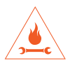
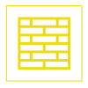

С каждым днём всё сложнее охватить одним взглядом всё многообразие возможностей человека трансформировать окружающий мир. Интенсивные научные разработки и стремительное внедрение новых изобретений постоянно расширяют эту сферу. Сегодня чтобы изучить все доступные технологии уже недостаточно обладать энциклопедическим умом и усидчивостью. Необходимо охватить не только чрезвычайно обширный, но и постоянно расширяющийся спектр человеческого потенциала. А ведь это важно сделать каждому, кто задумывает воплотить любой комплексный творческий проект.

Никогда в истории людям не были настолько доступны такие широкие творческие возможности. Колоссальный объём открытой образовательной информации в сети, обилие доступных инструментов и материалов в удобных торговых сетях, общественные мастерские различных направлений. Сложно не броситься во все стороны одновременно! Но ведь можно сориентироваться и проложить маршрут исследования по карте.

Карту нам предстоит нарисовать самим. Любая карта начинается с осей координат. Два взаимных перпендикуляра опишут нам плоскость. Каждая линия соединяет по две противоположных, но взаимопроникающих друг в друга бесконечности.

## Материя — энергия

Хотя материя и энергия не так и отличны (с точки зрения квантовой физики это вообще одно и то же), люди, как правило, легко могут провести между ними грань. Координату на этой оси определяет соотношение, в котором в той или иной творческой технологии сочетаются затраты материалов и энергии.

## Органика — неорганика

Вторая ось пересекает первую, порождая просторную координатную плоскость. Живое и неживое каждый легко различит, хоть и бывают сложные случаи, когда становится заметна неразрывность этих двух понятий. Жизнь в животном ясна и наглядна, но гораздо сложнее сказать про жизнь стоящего в вазе цветка или растущих из раствора кристаллов. Конечно, жизнь лежит в основе всего, что нас окружает. Ведь и воздух и многие горные породы — следы и последствия жизни. В этой области наука химия наметила примерную границу между органическим и неорганическим мирами, которые неизбежно пересекаются и эта координата покажет, в каком конкретно сочетании.

## Пространство

Бескрайняя плоскость, вмещающая всю нашу карту — лишь малая часть всеохватно окружающего пространства. Выйти за рамки превращения живой и неживой материи позволяет изучение всё более тонких форм энергии. Энергия мысли, звука, жеста, слова, движения — мощные средства для самопознания и самовыражения.

# Воздух

## Тихая кропотливая работа с тонкими материалами

### Изостудия

#### Возможности

- Рисовать
- Расписывать
- Окрашивать
- Чертить
- Декорировать
- Макетировать
- Лакировать
- Тонировать
- Грунтовать

#### Инструменты

- Кисти
- Карандаши
- Ручки
- Линейки
- Циркули
- Зажимы
- Мастихины
- Стаканчики
- Мольберты
- Планшеты

#### Материалы

- Бумага
- Краски
- Пастель
- Лаки
- Разбавители
- Плёнки
- Клеи
- Малярная лента
- Салфетки

### Швейная

#### Возможности

Шить
Вязать
Ткать
Прясти
Вышивать
Плести

#### Инструменты

Швейные машинки
Иглы
Ножницы
Булавки
Мелки
Сантиметры
Пяльца
Спицы
Крючки
Утюги
Оверлоки

#### Материалы

Нитки
Ткани
Ленты
Кнопки
Пуговицы
Пряжа
Мулине
Молнии
Застёжки

# ВОДА

## Механическая обработка органических материалов

### Столярная

#### Возможности

Пилить
Сверлить
Шлифовать
Фрезеровать
Строгать
Собирать
Склеивать
Стягивать
Гнуть

#### Инструменты

Пилы
Дрели
Молотки
Шуруповёрты
Рубанки
Фрезеры
Стамески
Лобзики
Угольники
Стусла
Шлифмашинки
Струбцины

#### Материалы

Фанера
Доски
Бруски
Рейки
Мебельные щиты
Шканты
Саморезы
Клей
Гвозди
Скобы

### Переработка

#### Возможности

Плавить
Экструдировать
Прессовать
Растворять
Паять
Формовать
Отверждать

#### Инструменты

Термофен
Клей
Терморезак
Канцелярские ножи
Ножницы
Печь
Стеклорезы
Формы
Экструдер
Шредер

#### Материалы

Пластики
Бумага
Картон
Плёнки
Пакеты
Верёвки
Бутылки
Стёкла

# Огонь

## Работа с электричеством, высокими температурами, едкой химией, металлами и механизмами

### Слесарная

#### Возможности

Точить
Шабрить
Пилить
Сверлить
Шлифовать
Полировать
Закручиванить
Рихтовать

#### Инструменты

Молотки
Отвёртки
Гаечные ключи
Головки
Напильники
Надфили
Труборезы
Тиски
Плашки
Метчики
УШМ
Трубогиб
Точила
Мультиметры
Наковальни

#### Материалы

Винты
Болты
Гайки
Шайбы
Заклёпки
Уголки
Трубы
Арматура
Полосы
Стержни
Шпильки

### Кузница

#### Возможности

Плавить
Отжигать
Ковать
Отливать
Затачивать
Закалять
Травить
Отпускать
Сваривать
Резать
Паять
Патинировать
Полировать

#### Инструменты

Горн
Наковальни
Молоты
Щипцы
Сварочные аппараты
Подкладки
Горелки
Гладилки
Паяльники

#### Материалы

Уголок
Швеллер
Профильная труба
Подшипники
Сталь
Уголь
Газ
Электроды
Флюс
Припои

# Земля

## Придание формы твердым и твердеющим массам

### Гончарная

#### Возможности

Лепить
Крутить
Обжигать
Глазуровать
Сушить
Текстурировать

#### Инструменты

Стеки
Ножи
Леска
Гончарные круги
Емкости
Кисти
Петли

#### Материалы

Глина
Ангобы
Глазури
Краски
Уголь

## Скульптурная

#### Возможности

Формовать
Заливать
Лепить
Резать
Точить
Замешивать
Вибрировать
Армировать

#### Инструменты

Шпатели
Вёдра
Миксеры
Мастерки
Плиткорезы
Ракели
Киянки

#### Материалы

Гипс
Бетон
Керамика
Песок
Щебень
Мрамор
Гранит
Керамзит
Пластификаторы
Арматура

# Эфир

## Музыка и игра со светом, жестами и текстом

### Театр

#### Возможности

Выступать
Изображать
Танцевать
Разыгрывать
Сочинять
Ставить
Снимать
Репетировать
Режиссировать

#### Инструменты

Грим
Костюмы
Сценарии
Сцены
Зеркала
Камеры
Освещение

### Музыка

#### Возможности

Настраивать
Джемить
Петь
Свистеть
Играть
Стучать
Импровизировать
Дирижировать

#### Инструменты

Барабаны
Флейты
Гитары
Пианино
Синтезаторы
Колонки
Микрофоны
Микшеры
Усилители
Перкуссия
Диджериду
Варганы
Караталы
Ксилофоны

### Фото и видео

#### Возможности

Снимать
Записывать
Анимировать
Ретушировать
Экспонировать
Монтировать
Позировать

#### Инструменты

Фотоаппарат
Видеокамера
Студийный свет
Светоотражатель
Микрофон
Тележка
Стабилизатор
Стол для анимации

## Интересные сочетания

#### Бесконечный потенциал сочетания различных материалов, творческих техник и приёмов на стыке ремёсел
