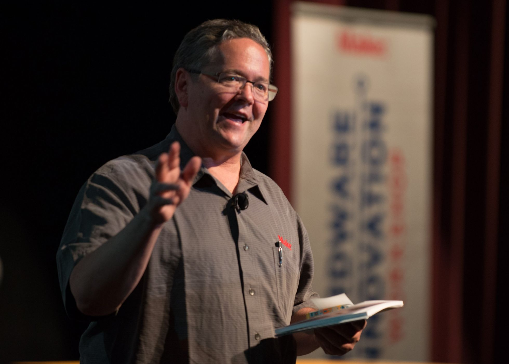

_Основатель международного движения любителей мастерить Дейл Доэрти убежден, что корпорации больше не способны к инновациям. Ими должны и могут заниматься мейкеры — самоучки, которые в своих гаражах двигают прогресс вперед._

Созданное Дейлом Доэрти движение мейкеров готово принять в свои ряды любого, кому нравится делать вещи своими руками. По подсчетам газеты USA Today, этому критерию соответствует 57% взрослых американцев старше 18 лет, а ежегодный вклад мейкеров в ВВП США составляет $29 млрд.

Ярмарки Maker Faires, крупнейшие из которых движение проводит в Нью-Йорке, Париже, Риме, Токио, Канзас-Сити, Детройте и Атланте, ежегодно посещают несколько миллионов человек. В 2014 году одна из Maker Faires прошла в Белом доме: Барак Обама, общавшийся с мейкерами и рассматривавший их изобретения, тогда призвал «каждого американца отметить этот день деятельностью, которая воодушевит новое поколение мейкеров».

Год от года Maker Faires расширяют свою географию — в 2017-м крупные ярмарки проходят в 30 городах мира, впервые включая Москву. Начиная с 2011 года General Electric строит для мейкеров GE Garages — технохабы, где мастера могут создавать прототипы своих продуктов при помощи современного оборудования, в частности лазерных резаков и 3D-принтеров. В России подобный технохаб работает при технологическом университете МИСиС.

## Король гаражей и пророк Web 2.0

Родившийся в 1955 году Дейл Доэрти — сооснователь вместе с Тимом О'Рейли американского медиахолдинга O'Reilly Media, который издает книги и журналы по науке и технике и предоставляет образовательные услуги онлайн. Доэрти известен как один из пионеров интернета. В 1993 году он создал первый в Сети прообраз поисковика, портал со списками ссылок — Global Network Navigator, который стал первым в мире сайтом, зарабатывавшем на интернет-рекламе. Доэрти — автор термина «Web 2.0»: в начале 2000-х он предсказал, как изменится интернет благодаря росту объемов контента, создаваемого пользователями. С 2005 года издает журнал Make, в котором популяризирует идеи мейкерства.

## «Компании подорвали веру в наши силы»

##### — Почему вы придаете такое значение мейкерству?

— Мейкерство — это откат от культуры потребления. Когда-то культура потребления вытеснила из нашей жизни очень естественные вещи. Купить стул или шкаф стало легче, чем сделать самому, пообедать в фастфуде — легче, чем самому приготовить еду. Люди разучились делать вещи своими руками, забыли о том, какое удовлетворение это приносит. Но ведь это стремление заложено в человеческой природе! Если мы возьмем историю США и Европы, мы увидим, что не так уж многое в ней делалось из необходимости — большинство изобретений, великих открытий и преобразований совершалось для творческого самовыражения. И сейчас мы возвращаем то, что было мейнстримом до индустриальной эпохи. Ты можешь делать вещи сам — ты обретаешь способности, которые культура потребления у тебя отняла.

##### — А разве мейкерство не удел бедных стран? В СССР люди не могли купить новый автомобиль, цветной телевизор, коротковолновый приемник. Зато все умели ремонтировать. Что в этом хорошего?

— Не согласен про бедность, ведь то же самое было в США: поколение 1980-х вынуждено было самостоятельно собирать компьютеры и писать для них программы. Но потом компании приучили людей к мысли, что все сделают за них. С одной стороны, они облегчили нам жизнь, с другой — подорвали веру в наши силы. Главный посыл компаний: «Ты ни в коем случае не должен открывать наше устройство! Сгорела батарея? Не трогай, мы сами ее заменим». Получается, ты не должен ничего уметь делать самостоятельно. Одна из идей, которые я популяризирую в журнале Make, — если ты не можешь открыть устройство, которое приобрел, значит, оно не принадлежит тебе по-настоящему. То же самое, кстати, верно и для программ: если лицензия запрещает тебе подстраивать софт под свои нужды, он не будет тебе действительно полезен. Люди не понимают, что компании отняли у них возможность пользоваться вещами, как им удобно.

##### — Вряд ли такие взгляды нравятся корпорациям, которые построили индустрию одноразовых вещей...

— Некоторые из них уже учатся видеть ценность в нашем движении. Когда несколько лет назад Microsoft выпустила Kinect — бесконтактный контроллер для видеоигр, — мейкеры тут же взломали новинку, изучили, как она работает, и сделали на ее основе массу полезных вещей, например медицинские приложения, которые измеряют активность движений или применяются для диагностики заболеваний, которыми страдают пожилые люди. Представители Microsoft сперва возмущались: вы нарушили наши права, мы подадим на вас в суд! Но затем руководство компании увидело, что взломщики, по сути, придали новую ценность их продукту, и тон заявлений изменился: они стали говорить о том, как устройство компании помогает людям сохранять здоровье.

##### — А мейкеры могут победить крупные компании в конкурентной борьбе, предложив более дешевый и выгодный продукт?

— Речь не идет о конкуренции нос к носу. Мейкеры часто создают вещи, которых не существует, а значит, и будущие рынки. В этом их сила: они пробуют вещи, которые нравятся им самим, а значит, могут оказаться нужными и другим людям. А компании работают иначе: сперва изучают рынок, чтобы понять, чего на нем нет, потом делают продукт и стараются навязать его потребителю. Этот продукт предназначен для максимально широкой аудитории, а значит, он усредненный и безликий. А кустари-мейкеры отлично работают с нишами, со штучными вещами, которые могут зацепить небольшие сегменты аудитории. Например, есть крупные компании, которые делают бионические протезы. Но им в голову не придет сделать для пациента-ребенка стильный протез руки с эмблемой Бэтмена! Мейкерство ценно тем, что привносит совершенно новые правила игры в бизнес: вместо того чтобы просто покупать продукт, вы участвуете в его создании. Ведь мейкеры чаще общаются с теми, для кого предназначена их продукция. Например, мейкеры, которые делают те же бионические протезы, постоянно консультируются с самими инвалидами.

##### — Давайте скажем прямо: мейкерство — это просто хобби.

— Я всегда спорил с такой формулировкой. Мейкеры решают проблемы, которые корпорации и правительство не могут решить — во многом потому, что в отличие от правительства и корпораций они действительно любят то, чем занимаются. Есть множество примеров технологий, созданных мейкерами. Например, первые 3D-принтеры в середине 1980-х разрабатывались именно командами инженеров-мейкеров, а промышленные компании не видели в них никакого коммерческого потенциала. В итоге один из разработчиков продал свой принтер крупной компании за полмиллиона долларов. Это уже далеко не хобби, это стартап. Есть примеры коммерческих успехов мейкеров, которые делают образовательные продукты или, например, игрушки. Но большинство мейкеров не стремятся сделать огромную корпорацию и заработать кучу денег. У некоторых из них это получается, и это хорошо. Но идеальный сценарий для любого мейкера — зарабатывать на жизнь тем, что он любит делать. Я всем говорю: нам нужны не новые Facebook и Uber c миллиардной капитализацией, а множество мелких компаний, которые создают рабочие места и приносят людям удовлетворение от жизни.

## «Во всем мире большие компании давно не занимаются инновациями»

##### — Слушая вас, можно подумать, что большие компании — это какой-то тупиковый путь развития.

— Две недели назад я был на Maker Faire в Токио. Там повсюду были роботы — для развлечений, для работы, для всего, что угодно. Каждый посетитель сразу понимал, что в плане робототехники Япония — самая продвинутая страна. Но это все были проекты мейкеров-одиночек, а не корпораций.

В Японии инновации традиционно исходили от больших компаний вроде Mitsubishi, Panasonic, Sony, и в стране до сих пор много талантливых инженеров, которые в основном заняты в таких компаниях. Но парадокс в том, что в действительности корпорации перестали быть инновационными еще с 1980-х годов. Они не делают великих открытий, не создают по-настоящему революционных устройств, не меняют мир. Этим занимаются их сотрудники в свободное от работы время. И так не только в Японии, хотя там это заметнее всего. Во всем мире инновационные важные изобретения создаются маленькими группами технических энтузиастов. Корпорации могут только вовремя их заметить и купить.

То, что сейчас делают мейкеры, напоминает ранний интернет — такой, каким он был в 1990-е. Вокруг было много технологий, которые были доступны каждому. Но интернет-гиганты выросли и закостенели. Крупные компании тратят миллионы на исследования рынка — и сплошь и рядом промахиваются по цели. Если ты не вовлечен в процесс изобретательства по-настоящему, ты никогда этого не поймешь. Это одно из главных наших преимуществ. Крупная компания всегда может сделать свой продукт дешевле, быстрее, чем у мейкера. Но компания не видит, какими другими путями можно использовать ее продукцию, кому еще она будет полезна.

##### — А компании как-то пытаются задействовать мейкеров?

— Да. Такие корпорации, как SAP, Google, Microsoft, сейчас перестали нанимать на работу только профессиональных инженеров, они ищут таланты, в том числе и в сообществе мейкеров. Точно так же поступают многие производители электроники, которым нужен интернет вещей. В этой области у мейкеров есть масса интересных идей и наработок. Вообще, компании хорошо понимают нашу ценность, когда видят какие-то конкретные разработки, которые можно быстро превратить в продукт и вывести на рынок.

##### — И мейкеры удерживаются в компаниях? Ведь одной из причин, породивших ваше движение, явно была усталость от офисного труда.

— Конечно. Ребенок моей знакомой спрашивает ее: «Мама, что ты делаешь на работе?» — «Я печатаю на компьютере». — «Это я вижу. Но что ты делаешь?» Люди сами не понимают что. Они хотят видеть результаты своего труда, делиться ими с другими. Отсутствие всего этого — то, что так раздражает в офисном труде. И это огромная проблема. Да, часто креативные люди, которые выходят на работу в корпорации, через какое-то время покидают их. И никакие деньги их не удержат, потому что они не выносят контроля, не соглашаются работать над тем, что им неинтересно.

## «Это борьба умирающих гигантов!»

##### — Многие современники молятся на Стива Джобса, считая его технологическим гением. Но он же показал компаниям, что закрытые платформы приносят больше денег, чем открытые. Это противоречит самой идеологии мейкерства.

— Вот почему мне всегда больше нравился Стив Возняк. Но не надо осуждать Джобса. Он проявил дальновидность, настояв на закрытой архитектуре своих устройств и благодаря этому отвоевав огромную долю рынка. Но сейчас правила вновь меняются: компании удушают друг друга патентами, запрещают друг другу дорабатывать закрытые платформы своих устройств и тем самым мешают развиваться и себе, и конкурентам. Это какая-то борьба умирающих гигантов! А мейкеры чаще всего не патентуют свои технологии, обмениваясь ими совершенно открыто. И это позволяет им создавать продукты и программы, не тратя на это миллионные бюджеты. Будущее — за открытым кодом, это очевидно.

##### — А вас лично кто вдохновляет?

— Бенджамин Франклин. Это был типичный американский изобретатель. У его родителей не было денег на школу, и он изучал науки самостоятельно: устраивал эксперименты, мастерил самые разные вещи. Когда уже вся Америка знала его как ученого, друзья спрашивали, отчего он не патентует свои изобретения, а он говорил: я не хочу делать на этом деньги, мне нужно улучшить жизнь людей. Он основал первую в Америке публичную библиотеку, потому что понимал, что много образованных людей полезнее, чем еще один богатый.

А еще меня вдохновляют гениально сделанные вещи. Вчера я был в московском Музее космонавтики, смотрел ранние продукты советской космической программы — ракеты, капсулы, спутники — и думал, насколько талантливыми бывают люди, когда они работают вместе. Нас сейчас многое разделяет — политика, границы. Но нам предстоит вместе решать по-настоящему важные проблемы в таких областях, как здравоохранение, экология, образование. Политики и большие компании не сделают этого за нас. Это одна из причин, по которым наше движение стремится проводить Maker Faires во всех крупных странах.

##### — Русские мейкеры чем-то отличаются от американских?

— Здесь, в России, я вижу два типа гениев. Одни — это ученые: физики, математики. Другие — это те, кто умеет сделать многое, имея в распоряжении малое. Изобретательность в решении проблем, грамотное использование ресурсов — здесь вам, русским, нет равных. Вы умудрялись развиваться при жестких ограничениях, которые накладывали природа и общество.

##### — Мне кажется, что эта изобретательность русских от того, что в нашей стране государство столетиями было не очень дружелюбно к народу. Если оно вдруг когда-нибудь изменит отношение, наши творцы-мейкеры совершат экономический рывок?

— Вы всерьез надеетесь, что государство это сделает? Ха-ха! Даже в США правительство нам не то что бы помогает. Этим летом я был в Китае, где правительство очень ценит наше движение, надеясь с его помощью развивать малый технологический бизнес, и старается сделать для нас что-то полезное. Но обычно такие инициативы выливаются во что-то формальное вроде призывов «Давайте станем мейкерами! Почему ты еще не мейкер?» и «Школы, нам срочно нужны курсы мейкерства!». Мне кажется, пытаться организовать работу на уровне государства — неправильный подход. Это нужно делать на местном уровне. Государство же может помогать в чем-то мелком — найти помещение для технохаба, дать движению определенное признание. Но все остальное без государства гораздо проще. Вот, смотрите, я общаюсь с вами, а вы общаетесь со мной. А государство делает так: вы общаетесь с государством, а потом государство общается со мной.

##### — Критики мейкерства говорят: «Зачем вообще что-то делать руками? Скоро все вещи будут делать роботы».

— Мне и в самом деле приходилось сталкиваться с этой глупой идеей. Да, в будущем робототехника станет играть огромную роль в промышленном производстве. Но ведь останутся те, кто проектирует роботов, как и те, кто ставит им задачи. В конце концов многие рабочие сейчас занимаются абсолютно скучной рутинной работой вроде конвейерной сборки. Если роботы возьмут ее на себя, им только спасибо надо сказать.

Конечно, можно пойти дальше и начать рассуждать о том, что роботы рано или поздно научатся делать других роботов, но мы не знаем, как будет выглядеть мир в столь отдаленном будущем. Зато могу с уверенностью сказать, что робототехника вернет производство из Китая обратно на Запад, ведь китайцы не смогут просить зарплаты ниже, чем у роботов.

Мы учим людей не тому, чтобы делать все вещи руками. Мы учим их гораздо большему — пользоваться инструментами, перенимать технологии внутри сообщества умелых людей, привлекать экспертизу по всему миру. Этого не делают ни традиционные вузы, ни корпорации. В этом смысле наше движение — нейтральная территория.

##### — Еще лет десять назад родители в России посылали своих детей учиться на юристов и экономистов. Сейчас, когда многие юристы и экономисты сидят без работы, родители говорят детям: иди учись на инженера или биолога. Внезапная любовь к науке — долгосрочный тренд?

— Мне кажется, родители делают ошибку и в том, и в другом случае. Мы не знаем, на что способен наш ребенок и к чему у него лежит душа. Очевидно, что в будущем большинство рабочих мест будет занято специалистами в какой-то технологической области. Но загвоздка в том, что технологии будут развиваться стремительно и сотрудникам придется четыре-пять раз за жизнь менять сферу деятельности, чтобы не остаться за бортом. Единственное, чему мы должны научить своего ребенка, — быть хорошим учеником и адаптироваться к изменениям быстрее, чем школы меняют свои программы, видеть, в каком направлении движется мир и где ты можешь оказаться полезен.

### 5 продуктов, сделанных мейкерами

- В 2008 году пять энтузиастов из итальянского города Ивреа создали Arduino — открытую платформу для разработки дешевой электроники. Платы Arduino спроектированы так, чтобы пользователи могли собирать компьютеры, смартфоны и роботов, словно из деталей конструктора. К 2013 году в мире было продано 700 тыс. наборов Arduino.
- В 2009 году два мейкера из калифорнийского TechShop создали компанию Square, выпустившую на рынок платежный терминал для смартфонов Square Reader. К 2014 году оценочная стоимость компании достигла $6 млрд.
- В 2010 году студенты MIT разработали Makey Makey — набор схем и кабелей, позволяющий превратить в клавиатуру любой повседневный предмет — посуду, мебель и даже листки бумаги. Они собрали на запуск производства $0,5 млн на Kickstarter.
- В апреле 2011 года, всего через месяц после катастрофы на АЭС «Фукусима-1», мейкеры из хаба Tokyo Hackerspace разработали бесплатный датчик Гейгера, который каждый желающий мог распечатать на 3D-принтере. В течение месяца в Токио было распечатано около 10 тыс. таких датчиков.
- В 2013 году на базе Arduino два итальянских мейкера разработали еще один «конструктор» — Knitic, позволяющий производителям текстиля собирать полностью автоматические ткацкие станки.

Автор: Илья Носырев Оригинал статьи: [http://www.rbc.ru/own_business/13/09/2017/59b80a299a79479d484faed4](http://www.rbc.ru/own_business/13/09/2017/59b80a299a79479d484faed4)
