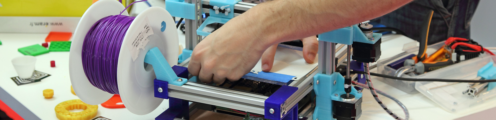
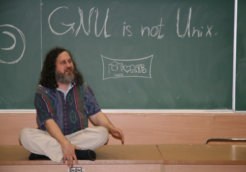
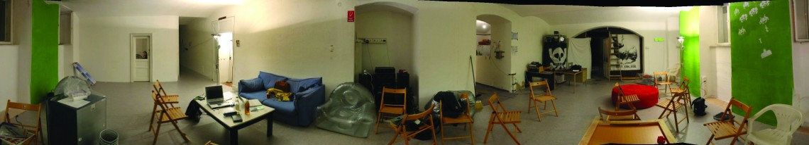
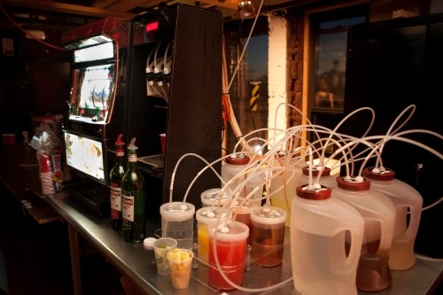

_Публикуем замечательный материал портала [XX2 век](http://22century.ru/) о растущем по всему миру движении MakerSpace, идеи которого во многом созвучны идеям **OOLEY**._

Полсотни людей толпятся в скромном помещении Makespace, затерянном на одной из узких улочек Мадрида между кофейнями и парикмахерскими. Молодёжь хипстерского вида, университетские преподаватели и косматые гики — всех их объединяет интерес к робототехнике, 3D-печати, цифровому искусству и всевозможным техническим устройствам, способным изменять окружающий мир. Многие из них относят себя к набирающей всё большую популярность *субкультуре «мейкеров»*.

На первый взгляд, это собрание чем-то напоминает религиозную общину. Мейкерспейсы — их храмы, где единоверцы собираются, чтобы воздать дань «третьей индустриальной революции» и причаститься к созиданию будущего. Мейкеры — это не только свидетели прогресса и его проповедники, но активные участники продвижения технической мысли.

Каждый четверг, когда «прихожане» собираются на свои встречи, здесь не умолкает жужжание 3D-принтеров, а в воздухе стоит запах пайки. Интерьер [_Makespace Madrid_](http://makespacemadrid.org/) далёк от гламурных «креативных пространств», и скорее походит на гараж или мастерскую с сотнями захламлённых деталями полок, различных коробок и грудами спутанных проводов.

Сегодня в календаре их паствы особый день — празднование _Hardware Freedom Day_: пристрастием к *Open Software* и пиратству мейкеры решили не ограничиваться и провозгласили свободу каждого создавать собственную технику в обход ІТ-корпораций и дистрибьюторов. К примеру, здесь, в *Makespace Madrid*, учат, как собрать самодельный 3D-принтер, сконструировать дрон или как при помощи подручных средств проапгрейдить свою квартиру до уровня «умного дома». И, конечно же, посвящают всех желающих в тайну трёхмерной печати.

— У каждого из пяти основателей нашей «мастерской» был свой бэкграунд. Я, например, специалист в области computer science, другие ребята — архитектор, промышленный дизайнер, художник и бизнесмен, — рассказывает основатель _Makespace Madrid_ _Сезар Гарсия_. — Нашей идеей было создать пространство, где воплощается идеология открытого проектирования (_Open Design_). «Копируй всё, что существует и работает, совершенствуй и распространяй», — вот девиз мейкеров.

_Makespace Madrid_ был основан весной 2013 года, деньги на его создание собирали через краудфандинг. Сейчас он существует на пожертвования «прихожан». Однако платят здесь не «десятину», а фиксированные 30 евро в месяц — чтобы приобщение к технике будущего могли позволить себе, в том числе, и граждане с небольшим, по здешним меркам, достатком.

За прошедшие два года паства _Makespace Madrid_ выросла с пяти до семидесяти участников, которые регулярно учатся и трудятся в этом пространстве. Начинающих ІТ-специалистов приводит сюда потребность в технической базе, пенсионеры находят новое хобби и живое общение, а некоторые рассказывают, что не могут поставить 3D-принтер дома, поскольку через пару недель жена выбросит его на помойку.

— Попытки создать подобное пространство в Мадриде были и до нас, — продолжает Сезар, — но первые мейкерспейсы не просуществовали и месяца. Сейчас в городе действует уже пять таких мастерских, в частности в двух университетах — _CEU San Pablo University_ и *Technical University of Madrid*.

И это только начало, заверяет основатель _Makespace Madrid_. Движение мейкеров стремительно распространяется по всему миру, достигая даже самых отдалённых уголков, от Шанхая до Кабула. Сейчас на них ещё смотрят как на своего рода сектантов, сетует Сезар, однако сами мейкеры не огорчаются, считая себя ни больше ни меньше как первопроходцами нового способа производства.

### Евангелие от Бранда

Обложка **The Whole Earth Catalog**. Издание 1969 года.

Движение мейкеров уходит корнями во времена средневековых ремесленников и изобретателей Нового времени. После индустриализации и появления массового производства в ХІХ—ХХ веках индивидуальное изготовление вещей отошло на периферию, став уделом ювелиров и редких частных портных. Стало проще купить дешёвые фабричные вещи, нежели тратить силы и время на их изготовление своими руками.

Интерес к ремеслу возобновился в США лишь в 1950-х годах. В это время Америка переживала экономический подъём, средний класс обрастал жильём и автомобилями, а всё это требовало надлежащего ухода и ремонта. При этом у низших классов возникла нужда самостоятельно собирать предметы потребления, недоступные им по цене. Таким образом в словаре американцев появилось новое выражение: **DIY** —_Do It Yourself_ («сделай сам»). Впрочем, тогда DIY-культура преимущественно не заходила дальше полезных советов по ведению домашнего хозяйства.

Если у современных мейкеров спросить, кого бы они назвали своим евангелистом, в ответ прозвучало бы имя _Стюарта Бранда_. В 60-х годах этот молодой биолог и дизайнер принадлежал к тусовке стенфордских хиппи. Так же как и во всей Америке тех лет, молодёжь из _Stanford University_ ходила с длинными волосами и принимала ЛСД. Но, в отличие от сверстников из _Berkeley_, они не были завсегдатаями антивоенных акций и даже не стеснялись сотрудничать с технологическим подразделением Пентагона DARPA. Больше уличной политики их привлекала сила научного прогресса. Именно в этом сообществе рождались идеи персонального компьютера и сетевой коммуникации как средств для «подлинной свободы».

В 1968 году Стюарт Бранд выпускает книгу под названием **«Каталог всея Земли»** (**The Whole Earth Catalog**), которую позже _Стив Джобс_ назовёт «_Google_ в печатном виде за 35 лет до появления _Google_». На этой книге выросло целое поколение гениев Кремниевой долины, хакеров, контркультурщиков и экологов. На обложку «Каталога…» Бранд поместил первую спутниковую фотографию Земли, которая, по его замыслу, должна была стать символом планетарного экологического движения.

Дровяная печь _Vermont Castings_.

В то же время «Каталог…» открывал новую главу в становлении DIY. На страницах книги Бранд даёт массу рекомендаций, рецептов домашних лекарств, советов по сварке, использованию бензопил и садовых инструментов, освоению навыков каменщика или, например, ведению натурального хозяйства. А важнейшими инструментами для революционеров Бранд назвал две вещи: **дровяную печь*Vermont Castings*** и **персональный компьютер**. Все описанные в книге «лайфхаки» были направлены на популяризацию автономного и экологического производства. Задача-максимум — преодолеть отчуждение и репрессивное разделение труда, обратившись к некому подобию средневековых цехов.

Не пройдёт и десяти лет, как Стюарт Бранд, свойственно своему поколению, превратится из хиппи в яппи — советника губернатора Калифорнии и успешного бизнесмена в сфере новых технологий. Идеи Бранда будут раскритикованы как утопия, контрреволюция и «анархизм способа жизни».

Тем не менее многие начинания Бранда легли в основу движения хакеров, борцов с копирайтом и таких проектов как _WikiLeaks_. В конце 2000-х годов благодаря распространению интернета и 3D-печати, начатое полвека назад дело DIY продолжили мейкеры.

Сейчас старик не на шутку заинтересовался новым движением и излучает завидный оптимизм по этому поводу. Аналоговые инструменты и компьютеры, на которые он делал ставку ещё в 1960-х, сегодня нашли применение в мейкерских мастерских. Бранд задаётся вопросом: если кустарное гаражное производство вещей и аппаратуры — это и есть «третья индустриальная революция», не звучит ли это слишком тривиально? И он находит ответ: «Вспомните, сколь тривиальными казались первые персональные компьютеры».

### Open Design

Когда в начале 1980-х годов часть сотрудников лаборатории искусственного интеллекта _Massachusetts Institute of Technology_ (MIT) разбежалась по коммерческим фирмам, они прихватили с собой целый ряд программных разработок. Став частной собственностью фирм, программы оказались закрыты для дальнейших научных исследований.

Основатель движения свободного ПО Ричард Столлмен выступает в МГУ.

Это крайне возмутило одного из оставшихся сотрудников лаборатории _Ричарда Столлмена_, который решил объявить войну «укрывателям» общественного достояния. Так зародилось движение за свободное программное обеспечение (_Freeware_) или открытое ПО (_Open Source_).

«Я разозлился и решил что-то делать. Я решил построить вселенную свободы», — утверждает Столлмен, до сих пор продолжающий свою борьбу. В 1994 году он опубликовал манифест под названием **«Почему у программы не должно быть хозяев»**. Его ключевой идеей было то, что мир программ кардинально отличается от мира физических вещей, поскольку вещь может использовать только один человек, и это даёт основание рассуждать о некой собственности, тогда как информационное пространство зиждется на возможности копирования и свободного воспроизводства. Если вы распространяете информацию, у других её не убавится.

Но можно ли пойти дальше? Можно ли расширить принцип копирования на святая святых частной собственности — физические вещи и средства производства?

Таким вопросом в 1997 году задался кандидат машиностроительных наук из того же MIT _Сепер Киани_. Он предложил воспользоваться принципом «открытого кода» в сфере разработки вещей и аппаратуры и совместно с единомышленниками задался целью сформулировать принципы _«открытого проектирования»_ (**Open Design**).

Обратиться вновь к идеям _Open Design_ заставило бурное развитие технологий, в частности, трёхмерной печати. К середине 2000-х годов на рынке появились относительно дешёвые модели 3D-принтеров, которые брались на вооружение уже не только корпорациями и исследовательскими центрами, но и рядовыми энтузиастами.

Возможность печатать реальные вещи, разместив мини-фабрику на своём рабочем столе, привлекла внимание одновременно тысяч людей. 3D-принтеры позволили перешагнуть прежние барьеры человеческих возможностей в сфере производства и копирования физических тел, и уже этим приковали к себе пристальный интерес.

«Вы можете сделать серию снимков любого объекта на свой _iPhone_ и при помощи таких программ как _123D Catch_ создать его компьютерную модель. Не существует копирайта на физические вещи! Лозунг, освободивший музыку, звучал: _«Rip. Mix. Burn»_ (слоган _iTunes_). Новый лозунг — _«Rip. Mod. Make»_, — провозглашает журналист _Крис Андерсон_ в своей книге **«Мейкеры: Новая индустриальная революция»**.

Так, соединив традицию DIY, последние достижения робототехники и электроники, возможности 3D-печати и принципы свободного проектирования, зародилось движение мейкеров. Неудивительно, что основная часть разработок, рождающихся в мейкерспейсах, — от чертежей дронов до трёхмерных моделей вещей — распространяются в сети по свободной лицензии _Creative Commons_.

Если же говорить о 3D-составляющей субкультуры, копированием безжизненных предметов окружающего мира мейкеры не ограничиваются. В 2005 году преподаватель британского _University of Bath_ *Адриан Боуер*объявил о старте проекта _RepRap_ (_Replicating Rapid Prototyper_) — первого 3D-принтера, способного к самовоспроизведению. Вскоре экспериментальный _RepRap_, разработанный по принципу _Open Design_, принялся печатать своих «сыновей», а те в свою очередь «внуков».

Адриан Боуер (слева) и Вик Оливер (справа) рядом с принтером _RepRap_ и его первой копией, все пластиковые части которой напечатаны на родительском устройстве. Предполагается, что в будущем _RepRap_ сможет печатать также металлические, керамические, восковые, цементные и даже съедобные детали, а также будет оснащён бормашиной, лазером, паяльником и роботизированным манипулятором.

Некоторые оптимисты пророчат, что усовершенствованный _Replicating Rapid Prototyper_ сможет воспроизводить себе подобных и распространяться со скоростью вируса. Так что недостатка в настольных фабриках в ближайшем будущем не предвидится — была бы энергия, печатный материал и свобода лицензий.

Данная технология, даже по самым скромным прогнозам, уже в ближайшем будущем способна коренным образом преобразить сферу производства. И пускай сейчас первое поколение мейкеров сутулится над своими весьма кустарными изделиями, вера этих людей в то, что они стоят на передовой прогресса, только крепчает.

### Выход в большой мир

Если *Web 1.0* — это интернет сайтов, *Web 2.0* — интернет соцсетей и массового участия в создании контента, то чем обещает быть _Web 3.0_? Согласно одному из определений, это будет время выхода интернета в реальный, физический мир. Таким образом, наравне с зарождающимся «интернетом вещей» (Internet of Things), движение мейкеров — один из первых трендов эпохи _Web 3.0_.

Принципиальное отличие мейкеров от различных цифровых субкультур состоит в их «оффлайновости». Раз уж производить реальные вещи, то делать это в реальном пространстве! «Пришло время развиртуалиться, пожать друг другу руки и в прямом смысле пощупать результат совместных усилий», — призывают мейкеры на своих пабликах в соцсетях. Do It Yourself? Нет, это определение принципиально устарело. Теперь впору говорить о принципе _Do It Together_.

Места для совместного труда и исследований имеют различные названия: мейкерспейсы, фаблабы, хакерспейсы, техшопы. Между этими типами пространств есть некоторые различия, однако их предназначение весьма схожее — предоставлять техническую базу для проектирования и создания различных вещей реального мира.

Первая программа по созданию «фабричной лаборатории» стартовала в далёком 2001 году на базе _MIT Media Lab_. Авторы проекта задались целью изучить, как информационный контент соотносится со своим физическим представлением, и каким образом технологии способны изменить общественное производство, переместив его на горизонтальный уровень. Концепт лаборатории был позаимствован в одной из популярных аудиторий в MIT, оснащённой современным оборудованием, которую в миру называли «Как сделать (почти) всё».

Успехи проекта дали толчок к распространению этого опыта в других местах. На данный момент в мире насчитывается 125 фаблабов в 34 странах, сконцентрированных преимущественно в университетах и исследовательских центрах.

Пространство венского хакерспейса _Metalab_.

В массы производственные пространства пошли несколько позже. Один из первых «народных» хакерспейсов под названием [_Metalab_](https://metalab.at/) был создан в 2006 году в австрийской столице Вене, где существовало хакерское сообщество с глубокими традициями. Своим логотипом основатели _Metalab_ выбрали телефонную будку — пример технологического проекта общественного пользования, радикально изменившего коммуникацию и культуру. Годом позже команда _Metalab_ создала сайт [_Hackerspaces.org_](http://hackerspaces.org/wiki/), который помог стремительно популяризировать мейкерские «мастерские».

Barbot, робот для смешивания коктейлей, созданный энтузиастами из NYC Resistor.

После посещения _Metalab_, группа американских энтузиастов основала свои хакерспейсы: [_NYC Resistor_](http://www.nycresistor.com/), [_HacDC_](http://hacdc.org/) и [_Noisebridge_](https://www.noisebridge.net/).

Всего сегодня в мире от 700 до 1000 мейкерспейсов. В частности, около сотни расположены в Германии, более сотни — в Китае (преимущественно в Шанхае). Центром мейкерского движения, безусловно, являются Соединённые Штаты, где создание мейкерспейсов активно поддерживает правительство. На территории экс-СССР хакерспейсы открылись в Киеве, Минске, Москве, Казани, Санкт-Петербурге, Калиниграде.

_GEMSI_ или «Глобальная инициатива предпринимательства и мейкерспейсов» — это организация, занимающаяся продвижением производственных пространств в странах Третьего мира. Её усилиями мейкерспейс был открыт в Бейруте, а позже — в послевоенном Багдаде. А первый в Западной Африке фаблаб [_Woe Lab Togo_](http://www.woelabo.com/), расположенный в Ломе, Того, и вовсе начинался с 3D-принтера, собранного энтузиастами из электронных отходов, которыми изобилуют местные свалки.

### «Техника молодёжи» на службе DARPA

Всё новое — хорошо забытое старое, и случай с мейкерами здесь не исключение. Вспомните советские станции юных техников, чем это не предтечи фаблабов? Разработкой «дронов» того времени занимались кружки авиамоделирования, а глобальной коммуникацией — движение радиолюбителей. Журналы _«Техника молодёжи»_ и *«Моделист конструктор»* можно смело считать предшественниками издания [_«Make»_](http://22century.ru/docs/%E2%80%99http://makezine.com/%E2%80%99), с выпуска которого в 2006 году ведёт свою летопись новая субкультура.

КПСС всецело поддерживала изобретательский потенциал широких народных масс, что позволяло стране «догонять и перегонять» страны капиталистического Центра даже в условиях катастрофических стартовых позиций и ограниченности ресурсов. Передовые разработки юных техников брались в оборот научно-исследовательскими институтами и внедрялись в производство. Кроме того, советская субкультура «мейкеров» давала качественные кадры для высокотехнологического производства, науки и обороны. Не говоря уже о том, насколько самодельные вещи снимали социальное напряжение в условиях дефицита.

Можно лишь догадываться, опирались ли в середине 2000-годов DARPA, правительство США и IT-корпорации на этот уникальный советский опыт. Но тот бум, который переживает движение не без поддержки перечисленных субъектов, наталкивает на подобные мысли.

«Я надеюсь, что каждая компания, каждый колледж, каждая община, каждый гражданин присоединятся к нам, когда мы поднимем мейкеров, конструкторов и изобретателей по всей стране», — в июне 2014 года сказал*Барак Обама* на открытии мейкерской выставки в Белом доме.

Слова Обамы вовсе не безосновательны, ведь за прошедшие годы федеральная власть приложила достаточно усилий, чтобы оснастить 3D-принтерами и другой необходимой техникой сотни библиотек по всей стране. Помимо этого три года назад DARPA учредила грант в размере 10 млн. долларов на внедрение 3D-печати в школьное образование, и выделила 3,5 млн. долларов компании [_TechShop_](http://www.techshop.ws/) на расширение сети мейкерспесов.

_TechShop SF_, Сан-Франциско, одна из множества мейкерских мастерских, поддерживаемых компанией _TechShop_.

В массовом распространении технологии 3D-печати Американское правительство усматривает путь к замещению импорта дешёвых китайских товаров, вернув производство на свою территорию. «Столетия поиска дешёвой рабочей силы окончены. Трудовой арбитраж больше не управляет торговлей», — провозглашает в своей книге о «революции мейкеров» _Крис Андерсон_.

И в Белом доме с его визионерством вполне согласны. С изготовлением пластиковых безделушек для дома 3D-принтеры справятся не хуже китайских рабочих, и даже не потребуют законной миски риса. Каковы будут последствия для китайской экономики, остаётся только догадываться. Поэтому не зря и само правительство КНР печётся о собственных разработках в сфере 3D-печати, а местный комсомол всячески завлекает молодёжь в роботизированные мастерские.

Точно так же, как и в СССР, сеть «станций юных мейкеров» способна обеспечить подготовку новых качественных кадров для национальной науки и обороны. И потом, кто первым воспользуется новыми изобретениями, если не родное правительство? Тем более, если оно профинансировало саму возможность этих разработок.

Похоже, что власть в некоторых государствах в совершенстве освоила технологию краудсорсинга. Предоставляя возможность тысячам людей по всей стране свободно пользоваться новейшей техникой, получать навыки продуктивной работы с нею, проводить исследования и эксперименты, власти США рассчитывают сполна окупить свои инвестиции. Ведь диалектический закон перехода количества в качество ещё никто не отменял.

Боятся ли свободного копирования и производства вещей в бизнес-кругах? С одной стороны, часть производителей опасаются быть вытесненными с рынка DIY-продукцией, ведь чисто гипотетически скопировать можно будет любую вещь физического мира, не придерживаясь авторских прав. Но пока технология крайне несовершенна, и, чтобы играть на опережение, предприятия сами всё активнее осваивают методы трёхмерной печати.

Самые дальновидные компании за свои авторские права пока не переживают, и, напротив, делают ставку на краудсорсинг. Крупные игроки рынка могут последовать примеру корпорации _Toyota_: в конце 2014 года компания выложила в открытое пользование почти 6000 собственных патентов на разработки в сфере водородных двигателей. Здесь действует вовсе не альтруизм, а расчёт на то, что новые исследования «в заданном направлении» подскажут верные пути разработкам самой компании и расширят нужную нишу рынка.

Если в СССР народная изобретательская инициатива служила делу строительства социализма, то почему она не может послужить строительству капитализма?

### Еретики

За свою короткую историю движение мейкеров успело бросить вызов товарному производству и так же быстро стать частью мировой капиталистической системы. Общины первых христиан уступают место христианству как государственной религии Римской Империи.

Провозглашённый принцип свободного копирования вещей и даже самих средств производства нёс (и до сих пор несёт) в себе огромный революционный потенциал. Фактически впервые со времён возникновения индустриального общества появилась возможность перенести производство конечных продуктов на низовой уровень. Изобрести подобие средневекового цеха на новом технологическом уровне, где исчезнет само понятие разделения труда, а производитель станет владельцем конечных результатов производства. Впрочем, революции на этот раз не получилось. Правительства и корпорации оказались куда проворнее, чем горстка энтузиастов, мечтающих об «автономных коммунах производителей».

Революции не получилось на этот раз, но это ещё не значит, что революции не будет вообще. В своё время печатный станок Гутенберга, распространившись по всей Европе и Америке, фактически разрушил мир феодализма и власть католической церкви. Теперь воодушевлённые прихожане хакерспейсов желают проверить мир на прочность своими станками 3D-печати.

---

Автор — Андрей Мовчан. Оригинал материала: [http://22century.ru/docs/makers](http://22century.ru/docs/makers)
