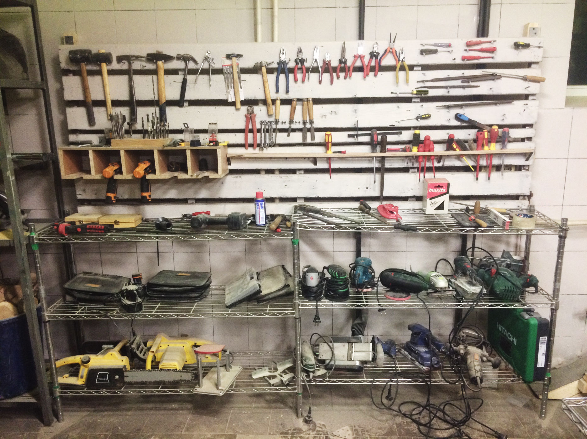

Мы стараемся внимательно следить за развитием общественных мастерских, регулярно наведываемся к ним и наблюдаем заметные изменения. Московские столярные коворкинги набирают популярность и сразу две таких мастерских уже столкнулись с проблемой нехватки пространства для всё нарастающего количества посетителей и их творческих проектов. Решение не заставило себя долго ждать.

И ["Дар Труда" на Преображенке](http://ooley.ru/places/dar-truda/) и ["Crafts Station" на Кристалле](http://ooley.ru/places/crafts-station/) пришли к одному и тому же решению этой насущной проблемы — надстроить второй ярус мастерской, используя значительную высоту потолков старых промышленных помещений.

В Даре труда второй уровень используется для хранения материалов и заготовок, а достроенный недавно дополнительный пролёт над зоной станков планируется сдавать мастерам под личные выделенные зоны и верстаки.

В коворкинге Crafts Station, по мере наполнения новыми станками и прочим крупным оборудованием, просто стало не хватать места для пустых парт-верстаков, где производится основная работа с ручным электроинструментом и склеиваются заготовки. Второй ярус стал закономерным решением этой проблемы, заодно позволив создать под лестницей уютную каморку для отдыха умельцев с раздевалкой, чайником и микроволновкой.

Мы рады, что общественные мастерские не только справляются с трудностями существования в Москве, но и растут и расширяются прямо на глазах. И несмотря на то, что выполнение заказов для этих мастерских по-прежнему является основной строкой дохода, а коворкинги с трудом окупают затраты на собственное содержание, можно говорить о постепенном становлении общественной столярки как части городской среды. Продолжаем наблюдать и ждём новых "расширений" мастерских.
