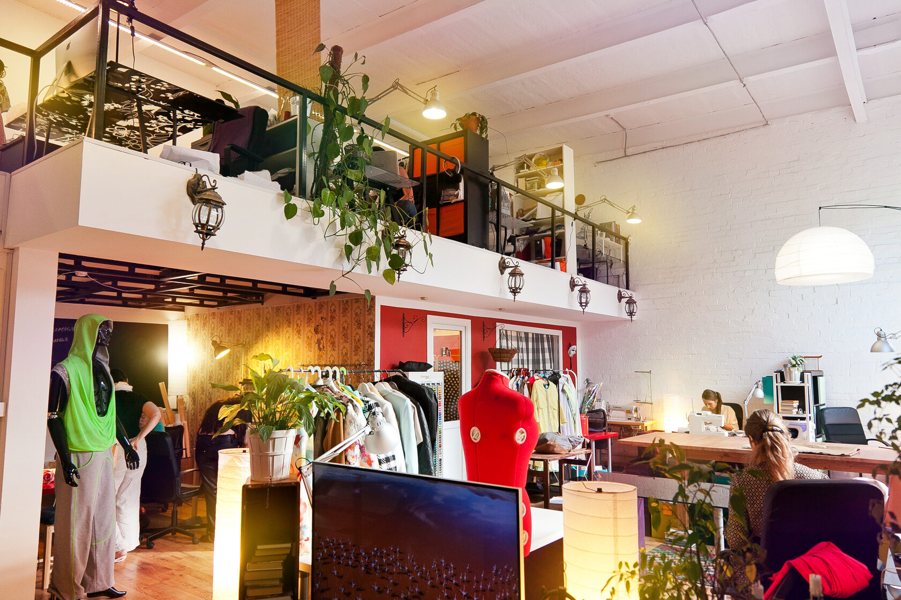
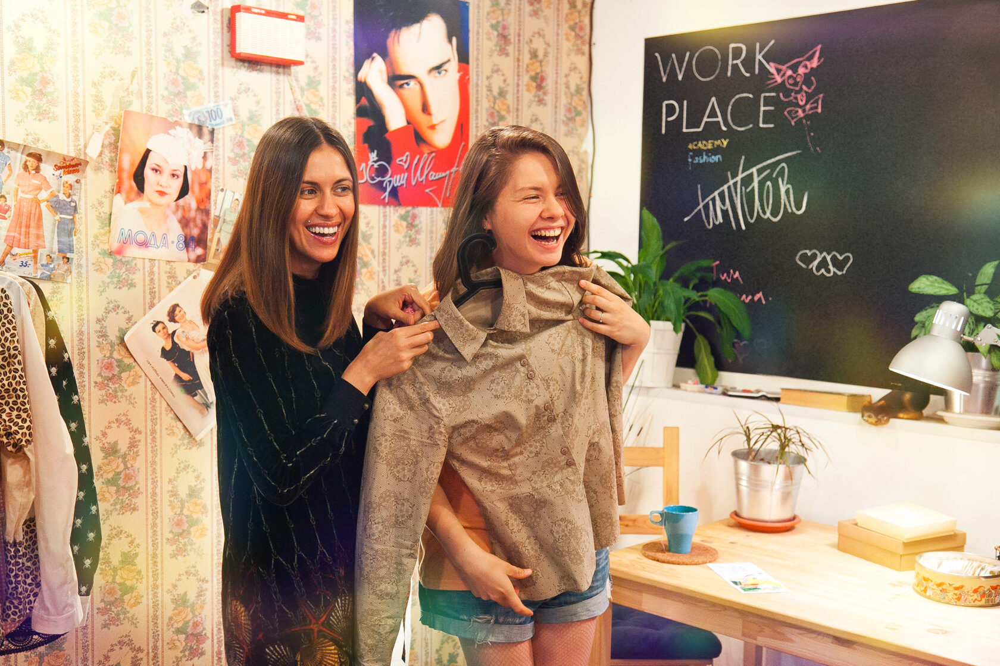
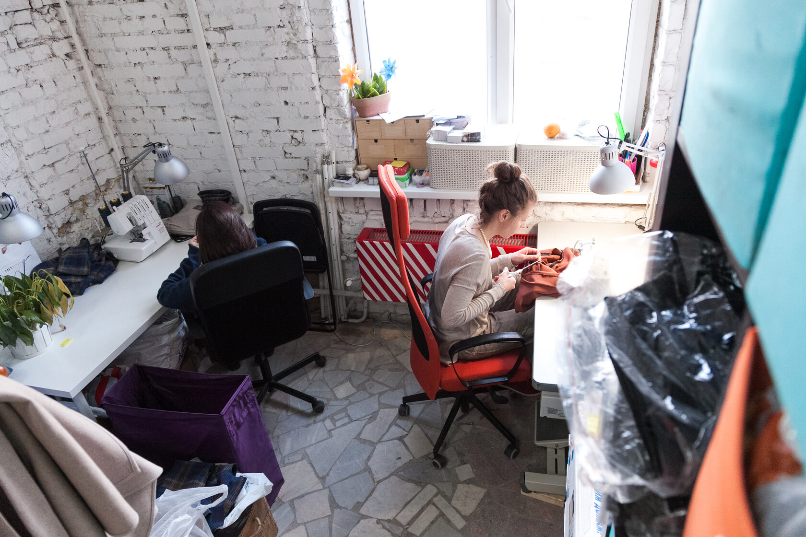
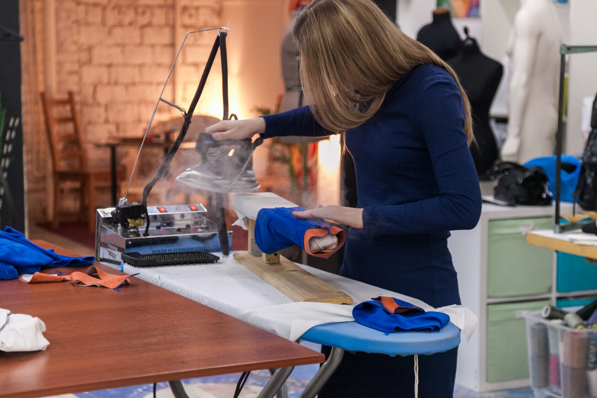
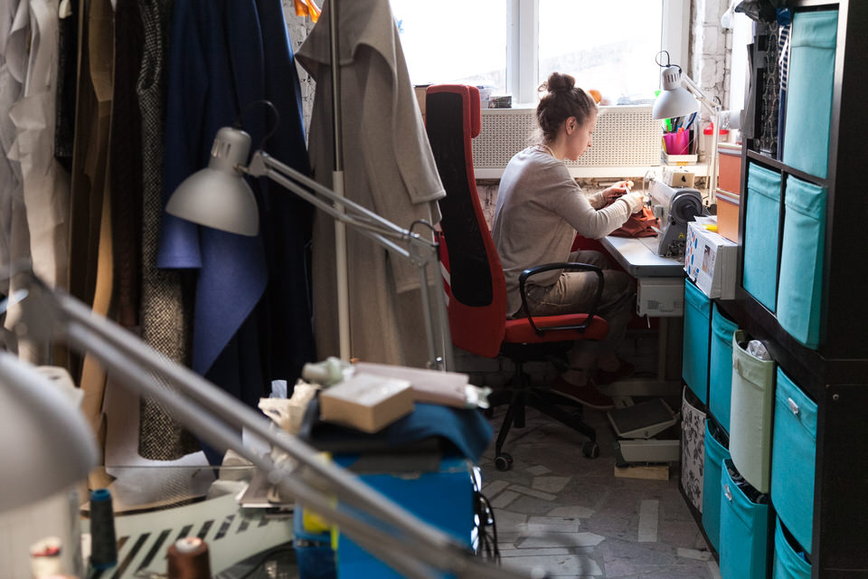
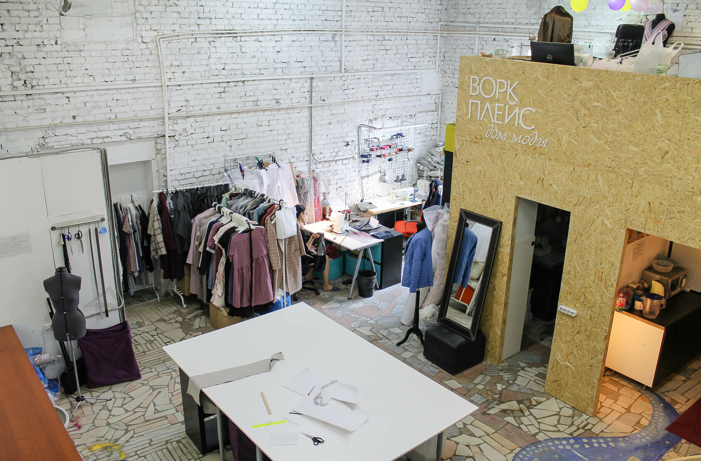
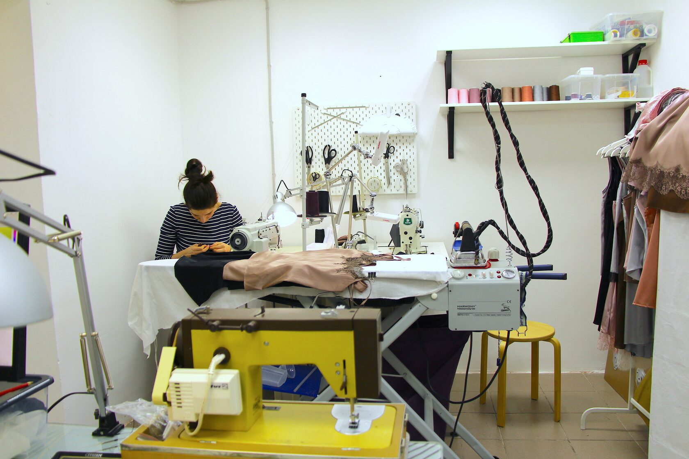
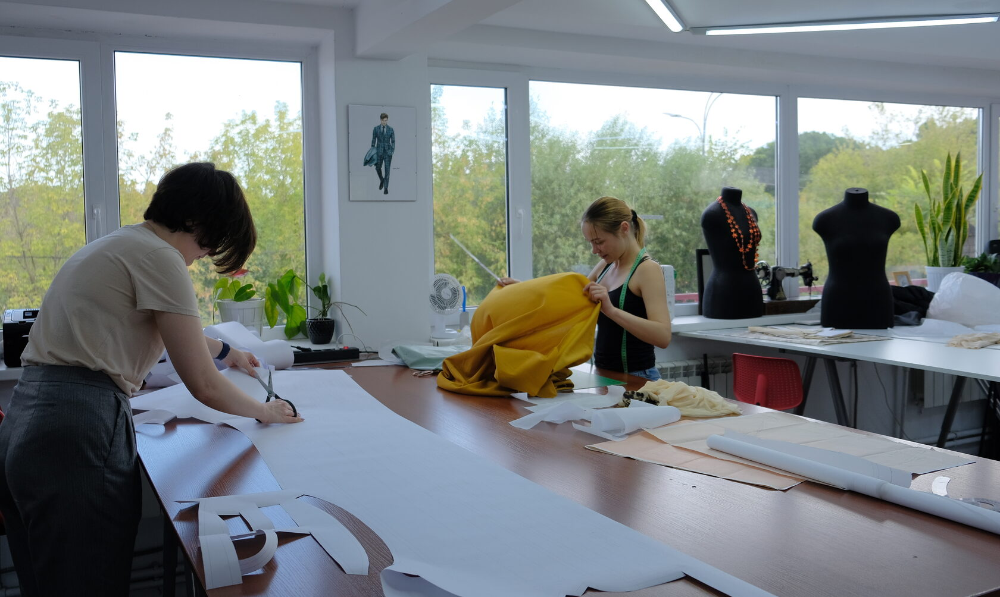

Автор проекта: [Евгений Волк](https://volklab.ru/fashion/)

<youtube-embed class="my-6" link="https://youtu.be/itOqoob_X3w" />

## Задача

Придумать идею для пустующего лофта, задизайнить пространство, сверстать сайт и пошуметь в прессе.

## Идея

Создать новый вид коворкингов, где дизайнеры одежды смогут использовать наше оборудование, большие столы и встречать клиентов в красивых примерочных, а не дома.

## Решение

Закупить оборудование, создать фотоконтент и пригласить дизайенров переехать из квартирных ателье к нам, чтобы работать с коллегами в рабочей обстановке дома моды.

## 2013 — 2015 Старт проекта

#### Место рождения концепции — Москва, Бауманская, Переведеновский переулок 18, строение 7

<youtube-embed class="my-6" link="https://youtu.be/GraZ3CX19wY" />

## 2016 — 2018 Второй выход

#### Москва, Бауманская, Переведеновский переулок 18, строение 2

## 2018 — 2022 Воркплейс в наши дни

#### Москва, Новый Вернисаж в Измайловском Кремле

Далее - цитаты из [текста нового владельца пространства Кирилла Мельчакова](https://vc.ru/tribuna/170511-workplace-fashion-prostranstvo-feshn-klaster-gde-mozhno-nayti-srazu-27-dizaynerov-odezhdy-shvey-i-portnyh)

#### Workplace Fashion — пространство, фешн-кластер, где можно найти сразу 27 дизайнеров одежды, швей и портных

В ноябре 2018 года Евгений Волк передал мне свой бизнес — воркплейс «Дом моды» в Москве, которому исполняется 9 лет в ноябре. Раннее я работал в нем в качестве администратора и с первых месяцев работы просто влюбился в проект.

Когда вся ответственность за существование бизнеса встала на мои плечи, я был очень заинтересован, чтобы проект жил и приносил деньги в качестве пассивного заработка. Главная задача, которая у меня стояла — это осуществить 100% нагрузку. Процессы все настроены, внутри создана своего рода экосистема, которая работает без стороннего вмешательства. Могу не появляться в студии 2-4 недели, при этом администратора внутри нет.
Есть большие планы и амбиции по развитию, только давай по порядку.

### Концепция

Мало отличается от стандартного понимания коворкинга кроме направления и отсутствия часовой аренды. У нас только ежемесячные абонементы для открытия своей мастерской индивидуального пошива/бренда, мини-цеха, лаборатории бренда с минимальными затратами денег и времени.

С переездом в 2017 году в новое помещение мы отошли от полного формата опен-спейса. Помещение позволило сделать отдельные мастерские (кабинеты), которые дизайнеры оборудуют под себя, и одну общую зона для раскроя и ВТО.

Такой формат позволяет дизайнерам долго сотрудничать с нами и расти внутри коворкинга, переезжая в кабинеты большего размера.

### Как у нас сейчас дела

Пережили пандемию с минимальными потерями: в начале марта 2020 года заполняемость стала 100%, а к концу марте съехало только 3 дизайнера. Мы предоставляли скидки пропорциональные тем, которые арендатор давал мне.

Сложно заполнить коворкинг снова, поменялось мышление насчет организации своей мастерской (многие работают дома) и также низкая ставка коммерческой недвижимости переманивает потенциальных клиентов.

Сейчас в коворкинге 14 дизайнеров и 13 швей (сотрудников у дизайнеров). Кто-то занимается индивидуальным пошивом, кто-то запустил бренд, кто-то открыл мини-цех, у кого-то корсеты, нижнее белье, повседневная одежда, кто-то шьет костюмы для бальных танцев или гимнастов, а кто-то сотрудничает со звездами.

После переезда мы перестали предоставлять резидентам швейные машинки (раньше давали бытовые), они не окупались, а в новом формате все привозят свои, так как на своем оборудовании работать лучше. Однако в 2020 году решил протестировать за доп.стоимость в месяц предоставлять промышленные машинки, появился спрос: сейчас у меня 10 собственных машин и они все заняты. С декабря тестирую сдачу оверлока, правда с ним сложнее в обслуживании.

### Конкуренция

Швейных коворкингов в Москве я знаю около 5-ти, большая часть заточена под любителей шить для себя или желающих научиться шитью. Есть один коворкинг с промышленным оборудованием и почасовой оплатой.

Я не привык считать кого-то конкурентами, мы коллеги и я с радостью рекомендую другие коворкинги, если не могу закрыть потребность клиента.

Из-за пандемии главным конкурентом стала коммерческая недвижимость в центре, которая освободилась и к настоящему моменту подешевела.

> Диалог дизайнера и впервые пришедшего клиента:
> —Вау, это все ваше (про студию и работающих дизайнеров в общей зоне)
> —Да, это все мое! Проходите, пожалуйста, в примерочную

### Швейное коммьюнити

Внутри коворкинга образовалось свое сообщество:
Все друг другу помогают — приехал курьер, за тебя встретят или отдадут заказ, если ты не успеваешь; 
Случаются выгодные сотрудничества — бренд заказывает образцы у другого резидента; 
Работают совместно над одним заказом клиента; 
Подсказывают где купить ткани, какую машинку купить, как обработать лучше края и тд.

Со своей стороны мы организуем застолья на 23 февраля и 8 марта, День Рождения студии, Новый год, пикники — это дни, когда большинство резидентов могут за одним раскройным столом поговорить и познакомиться.

Организуем тематические кинопросмотры и бизнес-бранчи весной и осенью, куда приглашаем экспертов по темам и наших подписчиков.
Финансы

Расходы от 220 тыс до 251 тыс:

* Аренда: 171 тыс
* Коммунальные услуги: летом — 10 тыс, зимой: 31 тыс
* Уборщица: 14 тыс
* Интернет: 1, 5 тыс
* Реклама: 10 — 20 тыс
* Расходные материалы: 5 тыс
* Бухгалтерия: 9 тыс

**Доход: 373 600 руб**

### Планы развития

Два года хожу с мыслью, что хочу открыть бОльшего размера фэшн-кластер и с бОльшим спектром услуг и возможностей: фотостудия, услуга по изготовлению лукбуков, коворкинг с емежесячными абонементами и часовой оплатой, пространство для мастер-классов и лекций, мини-цех для отшива маленьких партий, шоу-рум для работы с байерами.

Воркплейс станет не только пространством для работы и встреч с клиентами, но и экспертом в том, как упаковать свой бизнес и расти в нем, как выстраивать процессы, как и где продавать, как укрепиться в своей нише, как начать работу с оптом. Воркплейс - это о предпринимательстве, историях предпринимателей в швейной индустрии, об историях успеха и провалов.

Мы создадим комплекс, в котором можно будет использовать нужные дизайнеру инструменты на разных этапах развития бренда, мастерской или ателье.

Вечный вопрос — найти подходящее помещение и инвестора, который также любит фэшн-индустрию и готов ее развивать.

Пусть это будет посылом в космос и все найдется.

## Пресса о проекте

«[Заняться делом: Мастерские в Москве, где можно поработать](https://www.the-village.ru/village/business/management/222571-kovorkingi-masterskie)», The-village.ru, 02.10.15

«[Проект Workplace для дизайнеров одежды в Петербурге](https://www.intermoda.ru/cit/proekt-workplace-dlya-dizaynerov-odezhdy-v-peterburge.html)», intermoda.ru, 16.07.2015

«[Настал декабрь, и у всех разом сократились заказы](https://zvzda.ru/interviews/a03b0379aad6)», журнал «Звезда», 28.05.15

«[Телепередача «Хэштег: чем отличаются коворкинги от воркплейсов»](https://youtu.be/nIaxI_Re6yc)», Хэштег Хэштегов, 5.11.14

«[Лебедев создал новый лого для Workplace](https://www.sostav.ru/publication/artemij-lebedev-rabota-nad-oshibkami-12960.html) », Sostav.ru, 28.10.14

«[Евгений Волк и история создания сети воркплейсов](https://issuu.com/muzalewsky/docs/t_man_01_saratov_issuu/13)», terra-sar.ru, 04.10.14

«[Воркплейс для начинающих модельеров и дизайнеров](https://brother-friends.ru/?p=38400)», Brother friends, 21.07.14

«[Воркплейсы — профессиональные центры для людей творческих профессий](https://broidery.ru/?p=38950)», broidery.ru, 11.03.14

«[Телеканал Мир о воркплейсах меняющие ход событий людей](https://www.youtube.com/watch?v=itOqoob_X3w)», Телеканал МИР, 18.02.14

«[Стартап: Евгений Волк](https://youtu.be/GraZ3CX19wY)», Телеканал ТНТ-Новый регион, 12.02.14

«[Скандал с лого Лебедева: найти и переделать](https://siliconrus.com/2014/02/skandal-s-logo-lebedeva-nayti-i-peredelat/)», siliconrus.com, 05.02.14

«[Артемий Лебедев признался в плагиате](https://www.the-village.ru/village/hopesandfears/news/154875-workplace-logo)», The-Village, 31.01.14

«[Студия Лебедева уволила дизайнера за плагиат](https://tjournal.ru/paper/lebedev-workplace)», Tjournal.ru, 31.01.14

«[Студия Лебедева создала лого для workplace](https://www.sostav.ru/publication/studiya-lebedeva-sozdala-logo-dlya-work-place-8081.html)», Sostav.ru, 30.01.14

«[Анонс логотипа WORKPLACE от Студии Артемия Лебедева](https://www.artlebedev.ru/workplace/logo/)», artlebedev.ru, 2014

«[Евгений Волк об открытии в Москве первого воркплейса](https://www.m24.ru/audios/1222)», МоскваFM, 23.01.14

«[В Москве открылся воркплейс для дизайнеров](https://www.the-village.ru/village/service-shopping/service/137849-vork)», The-Village, 22.01.14

«[Евгений Волк: Как превратить портных и парикмахеров в предпринимателей](https://www.the-village.ru/village/hopesandfears/management/153747-wolf-like-a-phoenix)», The Village, 09.12.13
