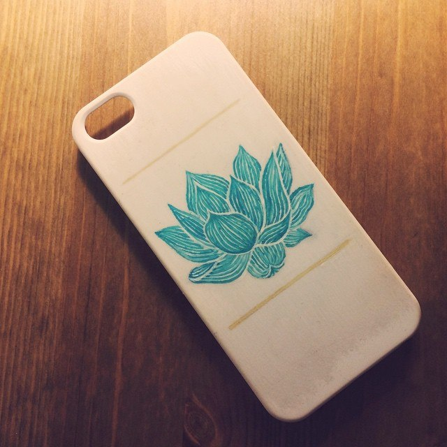
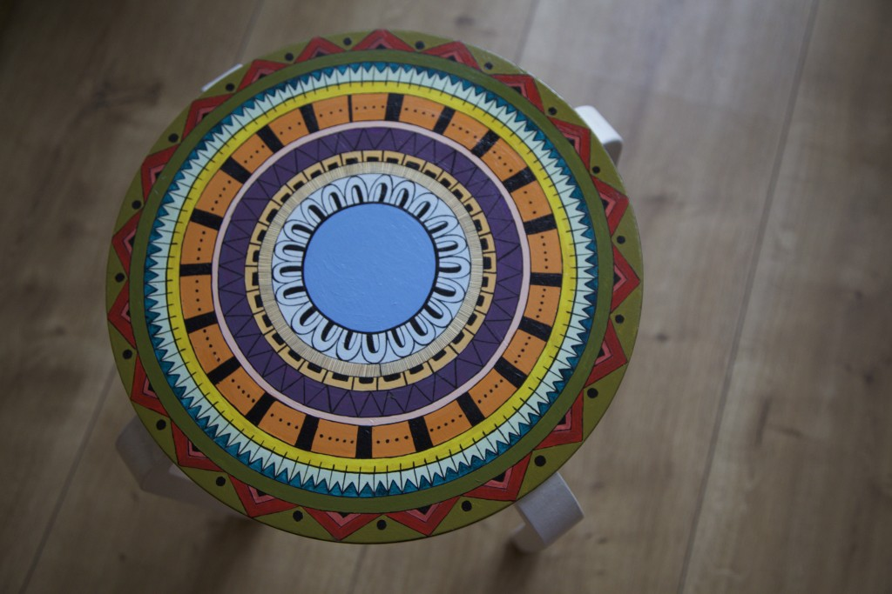

Мы все ценим оригинальные поделки, вещи, отражающие наше восприятие мира и настроение. Многие из нас достаточно высоко ставят творчество и оригинальность. Есть те, кто частенько рисует, придумывает идеи, прилагает творческий подход к вещам повседневности даже в таких мелочах как выбор одежды или решение как повязать шарф или надвинуть на лоб шапку. Мне хочется рассказать вам о простом способе расширить свое представление о поделках и возможностях делать окружающее нас пространство более живым, давать старым вещам второй шанс и просто занимать порой пустое и пугающее свободное время интересным занятием. **Рисовать акрилом по предметам - прекрасное дело!** Звучит просто и, возможно, с первого раза даже скучно. Но при включении фантазии может родиться множество прекрасных идей. Итак, его величество акрил.

Акрил является воднодисперсной краской на основе полиакрилатов. Такие краски легко разбавляются водой, поддаются смешиванию, после высыхания они становятся стойкими к воздействию воды. Наносить краску можно как в разбавленном, так и в густом пастообразном состоянии. Акрил быстро сохнет, что очень удобно при создании небольших работ, нанесении нескольких слоев, да и просто в процессе рисования - не нужно страшиться задеть ладонью или рукой еще не просохший участок.

При высыхании акриловые краски становятся темнее, их цвет приобретает более насыщенный оттенок, что порадует глаз привыкших рисовать акварелью, которая так и норовит побледнеть и исчезнуть с листа. **Акрил может использоваться также как альтернатива масляной краске.** Текстура после нанесения получается ровная — акриловые краски, в отличие от масляных, не образуют трещин. Ложится краска плёнкой, которая немного блестит, не требует закрепления закрепителями и лаками и смывается после высыхания только специальными растворителями. Хотя соскоблить слой краски ногтем или твердым предметом также не составляет труда, особенно если вы будете рисовать на пластике, стекле или любой другой твердой поверхности. Да, по поводу поверхностей: акриловые краски и лаки можно использовать на любой нежирной основе типа стекла, дерева, металла, полотна, холста и т.д.

Разобравшись с характеристиками этой чудо-краски нырнем в бездну возможностей, открывающуюся перед нами одновременно с открыванием баночек с акрилом. **Практически любой предмет вашего обихода можно преобразовать с помощью этого яркого материала.** Для меня первыми шагами к осознанию, что рисовать можно не только на бумаге, было рисование акриловыми красками на одежде. Начиналось все с довольно простых надписей на футболках в подарок друзьям, что затем переросло в идею перенесения более сложных картинок на ткань. Иногда на помощь приходили самодельные трафареты, изготовленные с помощью принтера и ножниц. В целом любой угодный вам рисунок, даже небрежный набросок от руки, позволит ожить старой футболке, спрятать пятно на видном месте или может быть просто избавит от скуки.

Рисовать на ткани не сложно, важно лишь подложить под слой, на котором рисуешь, бумагу, чтобы краска не отпечаталась на спинке футболки или столе. Краску лучше класть густым слоем, так как при высыхании могут образовываться "дырочки" и зазоры за счет текстуры тканевого полотна.

Еще одним занятным вариантом будет разрисовать чехол для телефона. Придумать свой образ, перенести понравившееся изображение, отметить знаком или символом предмет, маячащий перед глазами всё время, — это может иметь глубокий смысл.

В данном случае лучше нанести на поверхность пластикового чехла сначала акриловый грунт, чтобы акрил ложился ровнее и держался крепче. А дальше дело за эскизом и краской. **Готовый рисунок стоит покрыть лаком.** Хоть акрил и крепкий малый, регулярное ерзанье в карманах, попадание в руки, воду, удары о столешицы, ключи в сумках и прочие механические повреждения со временем будут наносить ущерб вашему рисунку. Лак от этого защитит. Хорошо подходит яхтный лак в аэрозольных баллонах или в банках, наносимый кистью. Одного-двух слоев достаточно. Другого такого чехла для телефона точно не будет. Предметы мебели так же имеют потенциал росписи акрилом, об одно таком изделии мы уже рассказывали ранее в нашей [публикации про табуретку-мандалу](http://ooley.ru/taburetka-s-mandaloj-na-siden-e/ "Табуретка с мандалой на сиденьи").

Зная о возможности акрила укрывать и разрисовывать любые поверхности можно теперь оторвать взгляд от монитора, оглянуться вокруг и неожиданно для себя обнаружить сколько всего вокруг можно разрисовать. **Нас окружают холсты!** И мы можем поддерживать в себе огонек творческого взгляда на мир, фантазируя и перенося свои фантазии на окружающие нас предметы без особого труда, даже, можно сказать, — с удобством. И часто не нужно покупать ничего нового, искать замысловатое, выбрасывать надоевшее. Достаточно поверить в себя, взять в руки кисть и набор красок и дать волю порыву намазать краской какой-нибудь рисунок. Все мы это можем.

**Акриловых вам свершений!**
