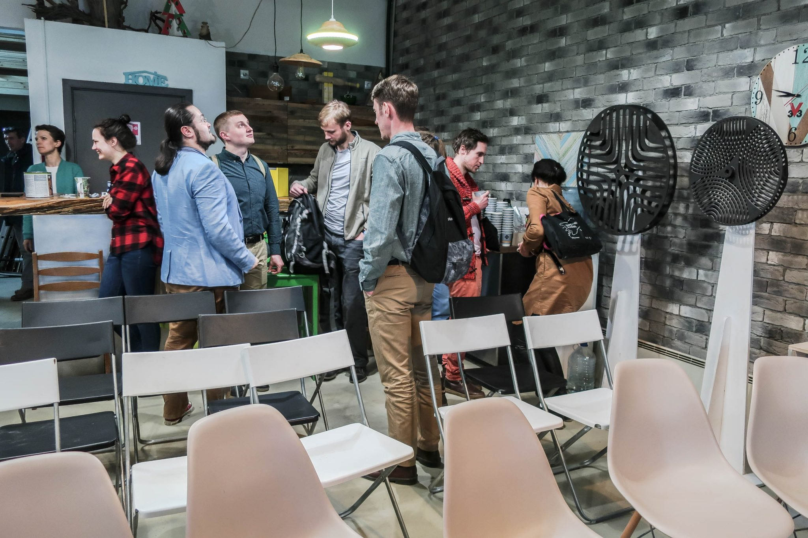
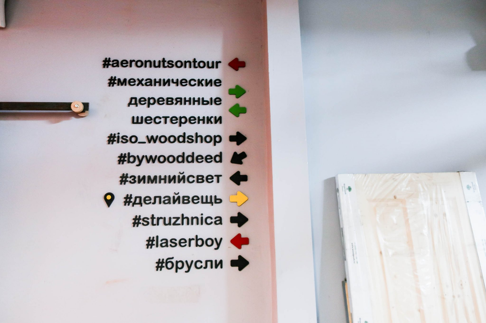
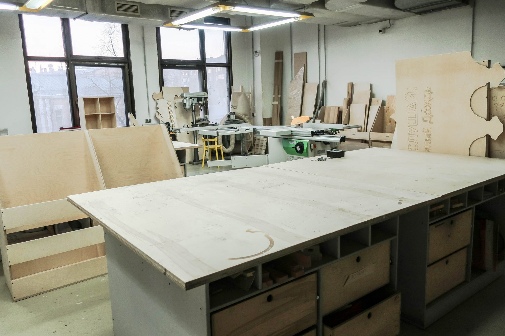
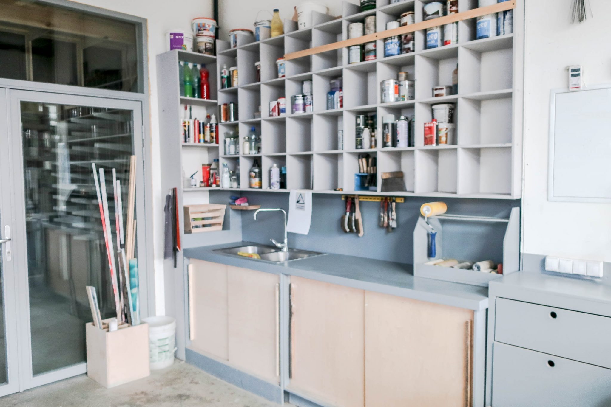
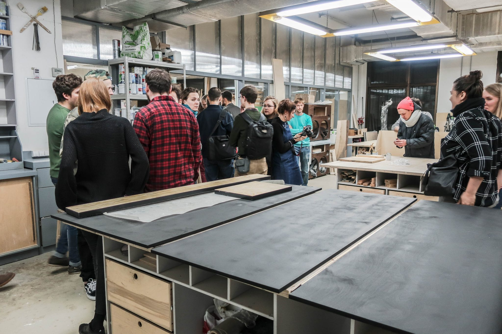

30 марта 2017 года перед началом долгожданного тёплого сезона в пространстве «Делай Вещь» состоялся день открытых дверей, где его основательница Екатерина Родионова и креативный директор Сергей Царёв не только провели краткие экскурсии по пространству и рассказали о ближайших воркшопах и курсах, но и поделились своим видением дальнейшего развития проекта и направления в целом. OOLEY делится тем, что мы узнали о жизни мастерской на этой встрече.

Московский проект «Делай Вещь» существует на рынке уже второй год. За это время спектр направлений его работы постоянно расширялся, подчас неожиданным даже для самой команды образом. Каждый новый клиент или партнёр привносит в процесс свои уникальные идеи, цели и задачи, которые быстро превращаются в новые компетенции сотрудников компании, расширяя список её возможностей.

За это время в мастерской сложилось чёткое зонирование пространства: первый зал за прозрачной стеной отведён под трансформируемую общественную зону, наполненную базовым инструментом и материалами, а второй зал с более серьезными станками предназначается для производства заказов. Дальняя комната превратилась в бэк-офис команды, а в покрасочной надстроили второй этаж. Но важнейшим местом, где переплетаются различные идеи и компетенции, придумываются новые проекты и обсуждаются смелые планы на будущее, остаётся просторное фойе со стойкой администратора, кухней и диванами.

Сергей и Екатерина рассказали о том, как проекту «Делай Вещь» со временем стало тесно в формате открытой столярной мастерской. Теперь это **Центр производственной культуры**, сочетающий в себе сразу несколько различных направлений. Команда выделила 5 основных сфер своей работы:

1. **DEV** — Экспериментальная лаборатория, где любой новый заказ и запрос — это основа для творческих поисков и инженерных разработок. Современная столярная мастерская видится в этом свете как пространство для разработки и прототипирования, где абстрактные идеи превращаются в осязаемые предметы или новые компетенции сотрудников компании. Увлекательные игры с технологиями рассматривается как основное средство познания и саморазвития современного умельца.
2. **EDU** — Образовательные курсы и воркшопы как по работе с деревом (дизайн мебели, отделка, токарное дело, лонгборды), так и другие (видеопроизводство для мейкеров, проектирование общественных пространств).
3. **MEDIA** — Агентство по информационному освещению творческих процессов с помощью современных коммуникационных технологий.
4. **EVENT** — Организация и проведение как корпоративных, так и общественных событий, направленных на вовлечение людей в активное совместное делание, что не только вносит разнообразие потребительский образ жизни, но и способствует формированию горизонтальных связей в сообществе.
5. **dBureu** — Создание эксклюзивных изделий из современных материалов. Фанера здесь рассматривается как технологичный композиционный материал, способный заменить массив дерева, куда более сложный в обработке и применении. Распил на точных станках, вакуумное и прессовое гнутьё фанеры в сочетании с использованием ЧПУ фрезерных и лазерных станков позволяет создавать самые разнообразные формы, из сочетания которых могут появиться не только эффектные предметы интерьера, но и крупноразмерные мобильные и стационарные конструкции. А благодаря сотрудничеству с компаниями-производителями разнообразных материалов для отделки и постоянно растущим компетенциям мастеров изделия из одной и той же фанеры никогда не будут однообразными.

Начав со столярки, команда проекта продолжает стремится расширить спектр своих возможностей. Появление в “Делай Вещь” ЧПУ-фрезера, а также обосновавшаяся по соседству мастерская лазерной резки **LaserBoy** позволили начать всерьез заняться исследованиями цифрового производства. От дизайна предметов интерьера «Делай Вещь» стремится перейти к полноценной архитектуре и конструированию, сочетая традиционную фанеру с модифицированными бетонами, металлом и другими материалами в проектах самого разного масштаба. В качестве перспективных направлений рассматриваются как электроника для умного дома, так и различные системы городского озеленения, в особенности «зелёнка» вообще без использования земли, которую заменяют различные автоматические гидро- и аэропонические системы.

Накопленный опыт в проведении образовательных событий преобразовался в систему из трёх уровней погружения:

1. **1хх - Открытые технологии**. Краткие вводные классы 101, 102 и так далее, в ходе которых можно получить базовые навыки использования общедоступного оборудования, которые могут пригодиться не только в рамках мастерской, но и в повседневной жизни.
2. **2хх - Цеховые навыки**. Это уже более основательные курсы, дающие не только умения в сфере производства, но также обучающие проектированию, дизайну, работе на современном рынке эксклюзивного производства. Выпускники таких курсов нередко остаются в мастерской надолго, образуя профессиональные артели, самостоятельно продвигающие себя на рынке. Набираясь сил, такие проекты отделяются в собственные мастерские, нередко располагаясь в том же здании газетной типографии,
3. **3хх - Дизайн-лаборатории**. Этот уровень меньше всего похож на привычный формат обучения, скорее напоминая увлекательную игру с новыми технологиями. Так, приглашая экспертов и желающих на практике познакомиться с той или иной техникой, здесь регулярно собирают экспериментальные лаборатории выходного дня.

Таким образом каждый новичок сначала проходит вводный двухдневный воркшоп, а затем либо продолжает посещать мастерскую как эдакий фитнес-зал для рук и мозга, либо переходит к более углубленному изучению интересующих его областей. Кто-то приходит чтобы сделать своими руками подарок близким, кто-то делает заказ или партию вещей на продажу, а многие приходят из высоко-конкурентных областей экономики чтобы найти совершенно новое применение своих сил и возможностей. Те, кто стремится полностью сменить сферу деятельности и заняться новым ремесленничеством всерьёз, могут пройти 2-3-месячную стажировку под началом одного из мастеров, в дальнейшем либо войдя в коллектив, либо образовав свою независимую артель, работающую как над собственными заказами, так и беря в специальной закрытой группе в фейсбуке заказы, поступающие в «Делай Вещь».

«Делай Вещь» связывает своё будущее с работой в области новой открытой городской культуры. Под общим девизом **«Давайте мы»**, предлагаемым в противовес привычному «пусть они», команда проекта выдвигает ряд приоритетных направлений, в которых рассчитывает найти новых партнеров и клиентов:

1. Развитие культуры добрососедства через организацию общественных событий с целью совместного самостоятельного улучшения городской среды.
2. Проведение различных воркшопов-“вторжений” на улицах города способствовующих налаживанию прочных горизонтальных связей между людьми, «связей деланием».
3. Наполнение смыслом «пустых» пространств (лес, парк, дворы, крыши, пустыри) в городе силами самих горожан.
4. Изготовление мобильных конструкций для самых разнообразных сфер применения.
5. Устройство обучающих событий в формате игры с технологиями.
6. Строительство детских площадок по примерам, почерпнутым в современных европейских кондоминиумах.
7. Проведение корпоративных творческих мероприятий, не только сплочающих коллектив сотрудников, но и служащих какой-нибудь благой цели вроде изготовления мебели для различных детских и медицинских учреждений. Умение организовать и настроить конвейерную работу в ходе таких событий позволяет за один раз произвести заметный объем полезных работ.
8. Использование технологий краудфандинга и краудсорсинга для активизации локальной «экономики места».

Создатели проекта видят «Делай Вещь» в первую очередь как продюсерский центр городских проектов, предоставляющий заинтересованным горожанам, сообществам и компаниям всё необходимое для самостоятельного изменения окружающей среды. Опираясь на опыт успешного создания открытой столярной мастерской в качестве средства продвижения компании-производителя инструмента, «Делай Вещь» запустила свою открытую мастерскую, а теперь предлагает своим клиентам и заказчикам организацию и запуск творческих пространств как ответ на растущие ожидания потребителей. Так, проведя пару воркшопов для сотрудников центрального офиса “Леруа Мерлен”, компания получила заказ на обустройство и оборудование пилотной открытой мастерской непосредственно в торговом зале крупного ТЦ на Рязанском проспекте. Наиболее интересен этот проект с юридической точки зрения, так как это будет первый российский прецедент мастерской с полностью проработанной правовой базой для предоставления посетителям доступа к электроинструментам и другому опасному оборудованию. Над этим вопросом трудится целый отдел торгового гиганта, в последствии планирующего масштабировать этот проект и на другие свои точки. Помимо этого у компании есть ещё пара амбициозных проектов: ремесленное пространство в центре Сочи и обустройство и наполнение нового парка в Москва-сити. Помимо этих крупных проектов «Делай Вещь» находит способы сотрудничества с местным детским садом, библиотекой и сообществами жителей района.

Организация открытой мастерской — настолько непредсказуемая затея, что сами её создатели порой не знают, как она будет трансформироваться в будущем. Команда проекта «Делай Вещь» сделав мастерскую, поняла, что хочет двигаться дальше и сделать целую открытую культуру. С большим интересом будем следить за дальнейшим развитием этой идеи и самого Центра производственной культуры.
