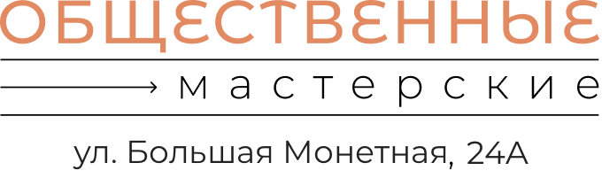
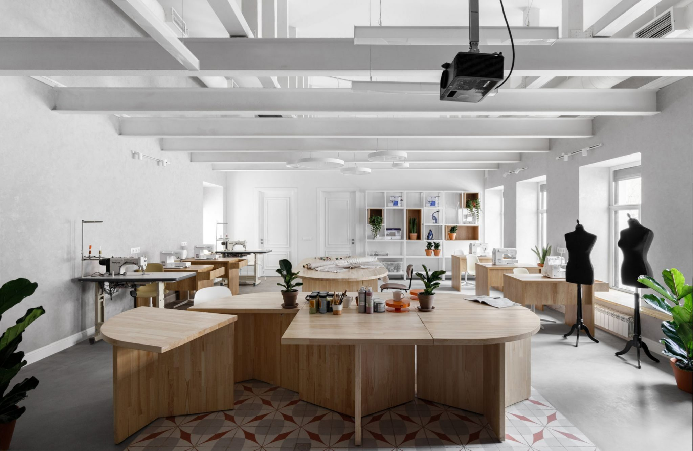
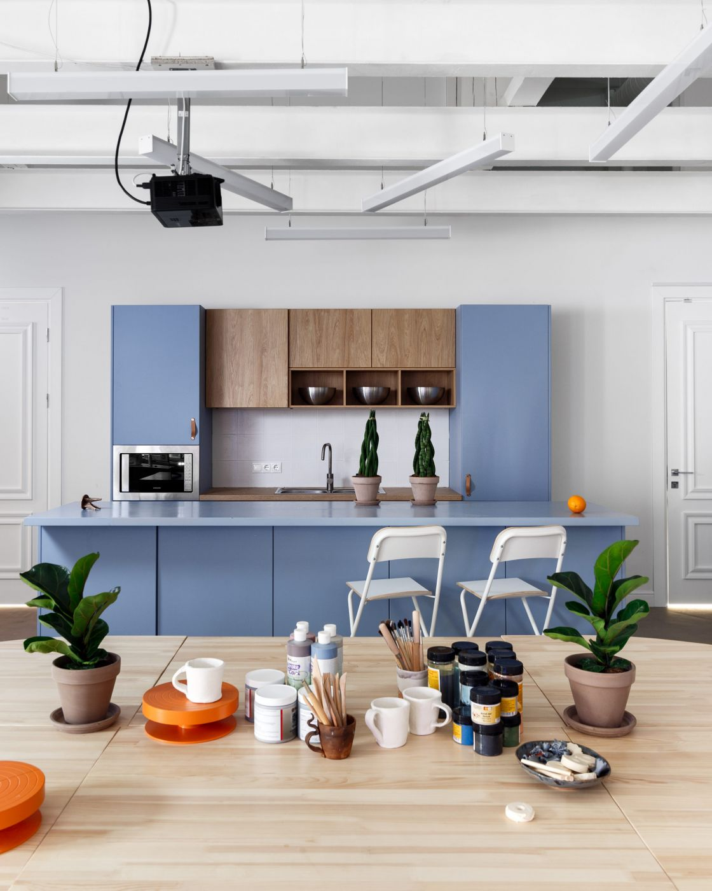
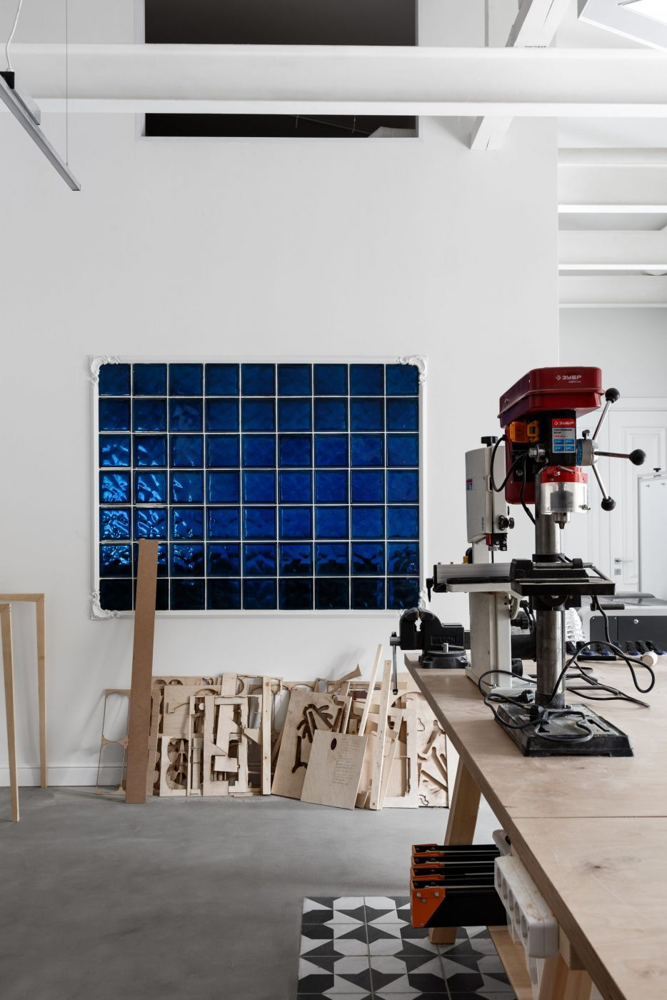
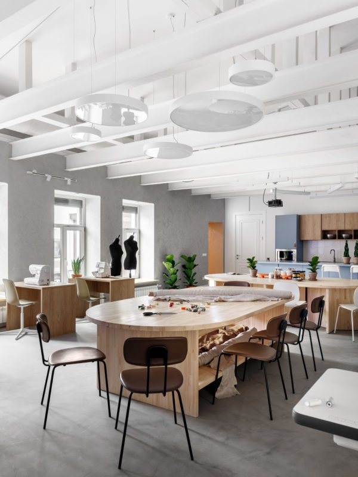
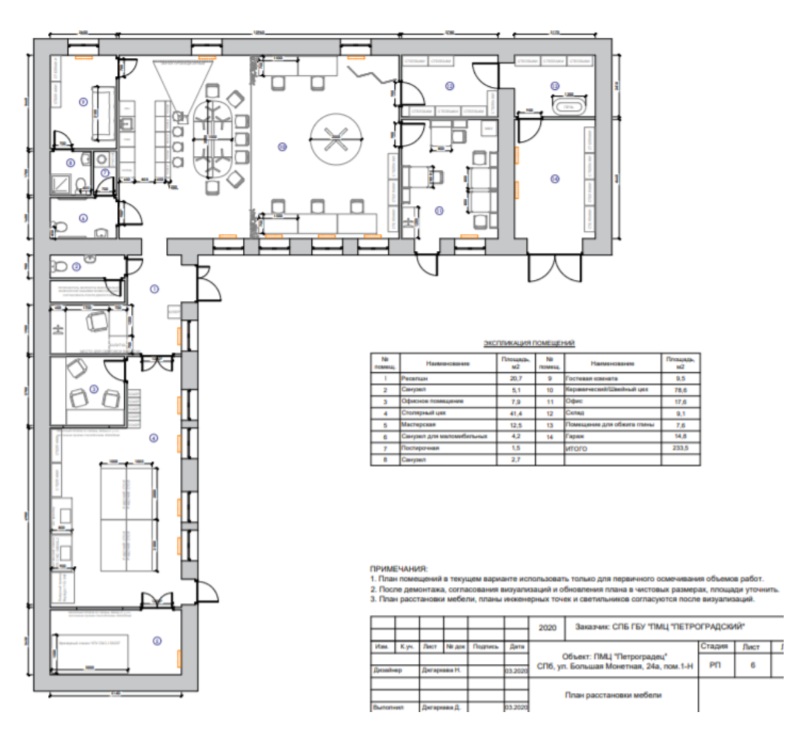

Мы несказанно рады увидеть крайне удачный пример создания общественных мастерских на основе государственных учреждений в России. Санкт-Петербург снова задает тренды, теперь со слоганом: «Ручной труд. Коворкинг и уют!»

На Петроградской стороне весной 2021 года открылся [Молодежный Центр «Общественные мастерские»](/workshop/catalog/privetangar/) или просто «Ангар». Вот, что они говорят о себе на сайте privet-angar.ru:

> Общественные мастерские — пространство на Петроградской стороне для доступного обучения ручному труду.
> Под одной крышей объединены столярная, швейная и керамическая мастерские со всем необходимым оборудованием, мастерами — наставниками и резидентами.
> У нас можно проходить курсы, посещать лекции и мастер-классы, а в свободные от занятий дни пользоваться возможностями в формате коворкинга.
> Также мы не забыли о дружелюбной атмосфере и уютной кухне, где вы сможете выпить чай и обсудить свои творческие проекты. Все форматы бесплатные.
> Общественные мастерские — это государственное бюджетное учреждение подростково-молодёжного центра «Петроградский», сектора молодежной политики и взаимодействия с общественными организациями Администрации Петроградского района.

Инициатор и куратор проекта Вероника Сединина создает и развивает это новое творческое пространство с командой из 2 администраторов, 2 кураторов, 1 дизайнера и более 6 мастеров разных направлений. Проект производит очень яркое впечатление по многим аспектам. Стоит отметить потрясающе выверенный стиль оформления пространства и общую продуманность всех аспектов его работы. А еще — удачное расположение: центр находится в одноэтажном здании со своим внутреннем двориком практически в центре города. А когда понимаешь, что все это богатство новых возможностей для горожан, еще и предоставляет свои услуги посетителям, резидентам и некоммерческим организациям бесплатно… Это просто великолепно!

Пока мы лишь изучили доступные материалы в сети. Мы обязательно постараемся поскорее побывать там в живую, чтобы сделать свой обзор «Общественных мастерских» и пообщаться с сотрудниками и посетителями пространства. Но даже из Москвы мы можем оценить тот огромный вклад, что сделала команда «Ангара» для развития всего направления открытых мастерских в России. Особого внимания заслуживает четко проработанная структура работы и внутренней организации проекта, а также сам факт того, что организаторы смогли пройти тернистый путь сотрудничества с государственными структурами и найти с ними общий язык.

## Направления и Оборудование

Пространство центра разделено на два блока — «чистый» и «столярный/грязный» блок. Оборудование позволяет работать с самыми разными материалами и технологиями. Базовый столярный инструментарий, сварочный аппарат, лазерный станок и все необходимое для работы с электроникой — да тут можно собрать хоть робота! А можно сшить себе одежду в швейной мастерской или слепить посуду в керамической. Комбинируя все эти возможности, возможно реализовать практически любую творческую задумку. А еще здесь есть большая общая кухня — эпицентр развития любого сообщества :).

## График и структура работы

К тому же пространство работает 7 дней в неделю с 10 до 22 часов, выделяя разное время для различных активностей. Так центр сочетает в себе одновременно несколько общественно значимых ролей, сменяя их и переплетая между собой.
Резиденция и поддержка НКО

С понедельника по пятницу днём в нем трудятся резиденты — начинающие мастера, которые в обмен на профессиональную помощь некоммерческим организациям города получают возможность создавать свои произведения или малые серии изделий для запуска собственного ремесленного бренда. В это время «Ангар» — акселератор творческих инициатив.

> Авторы молодых проектов в сфере ручного труда могут стать резидентами Общественных мастерских. Мы можем стать стартовой площадкой для запуска вашей первой коллекции одежды, керамики, мебели или других предметов дизайна. Резидент — начинающий мастер своего дела, который уже обладает знаниями и освоил необходимые навыки в своей сфере, но еще не вышел на профессиональный уровень, нуждается в определенном оборудовании или пространстве для работы. Резиденция в Мастерских подразумевает:

> - возможность пользоваться нашим пространством и оборудованием для развития своего проекта, получить поддержку сообщества и заявить о себе.
> - участие в реализации проекта для одной из наших партнерских НКО.

Но резидентами пространства могут стать не только отдельные мастера, но и сами общественные объединения, реализующие полезные некоммерческие проекты (как НКО, так и неформальные молодежные инициативы). Достаточно подать заявку и пройти отбор в очередной «сезон» — срок резиденции составляет 6 месяцев.

> Мастерские стремятся к инклюзии и открытости для самых разных людей. Мы можем быть полезны как ресурсная площадка, инфо-партнер или помощник в вопросах производства.

> Форматы проектов для сотрудничества:

> - разработка и изготовление сувенирной продукции
> - проведение занятий для благополучателей организации
> - проведение мастер-классов для сотрудников и волонтеров

> В реализации проектов участвуют резиденты мастерских, все форматы проводятся в утреннее и дневное время по будним дням.
> 

## Курсы и интенсивы

А вечером в мастерские приходят мастера и проводят курсы, мастер-классы и лекции для начинающих и интересующихся ручным творчеством представителей молодежи. Примечательно, что само это понятие претерпело трансформацию в духе современности — теперь это не дети и подростки, а люди от 18 и до 35 лет. Действительно, человеку, получившему права взрослого, требуется время на их полноценное освоение. Попробовать себя в нескольких направлениях деятельности, чтобы найти своё дело жизни — задача не на один год! И даже определившись с основным делом, еще годы могут уйти чтобы найти себе любимое хобби и сообщество по интересам. Мастера могут провести новичка в самое сердце своего ремесла и за короткий срок дать почувствовать себя в деле. Передать ключевые знания и навыки для дальнейшей самостоятельной работы и саморазвития.

> Все необходимые материалы предоставляем, изделия вы оставляете себе.
> а каждом интенсиве 8 мест.
> Продолжительность интенсива — от 2 до 5 занятий.
> Приоритет при зачислении отдаем людям от 18 до 35 лет.
> Регистрацию на интенсивы следующего месяца начинаем 20 числа текущего месяца.

## Коворкинг

На уикендах «Ангар» еще более открыт: каждый желающий может приходить и реализовывать свои проекты с использованием оборудования мастерских. Единственное, что необходимо сделать — пройти интенсив по выбранному направлению, либо доказать свои умения пользоваться необходимым оборудованием на установочных встречах. Отличный формат, чтобы подготовить и настроить человека с любым опытом на продуктивную и безопасную работу в общественной мастерской.

> Производственный коворкинг — формат для самостоятельной работы посетителей за оборудованием, доступный в пятницу с 12.00 до 18.00, в субботу и воскресенье с 10:00 до 22:00.
> Производственный коворкинг доступен к бронированию для горожан старше 18 лет, которые имеют практический опыт самостоятельной работы за необходимым оборудованием.
> Для допуска в коворкинг необходимо посетить установочную встречу или закончить один из наших интенсивов.
> В коворкинге можно заниматься разными видами работ: от ремонта бытовой техники, до воплощения творческого проекта.
> Все необходимые материалы для работы вам необходимо принести с собой.
> Важно: если опыта работы с оборудованием еще нет, ждем вас на наших интенсивах — мы будем рады вас всему научить!

## Открытое Положение об учреждении

Лаконично и понятно сформулированные принципы работы центра нашли своё выражение и в виде официально оформленного Положения о работе Молодежного Центра “Общественные мастерские”. Оно в свою очередь помогает понять то, как центр устроен и сформулирован изнутри, а также то, как можно с ним взаимодействовать горожанам. Такой формат однозначно востребован и вполне реализуем, а «Ангар» может служить отличным примером создания муниципальных творческих пространств для новой молодежи по всей стране. Во благо распространения этой практики работает требование об открытом доступе к учредительным положениям филиалов и подразделений государственных бюджетных учреждений (ГБУ). В данном случае это обособленное структурное подразделение без оформления юридического лица на которое выделяет свои ресурсы СПб ГБУ «Подростково-молодежный центр «Петроградский».

Настоящее Положение определяет цель, задачи, направления деятельности, целевую аудиторию, порядок посещения, условия посещения мастерских-коворкинга и участия в мероприятиях Молодежного Центра “Общественные мастерские”. Открытость этого документа для всего творческого сообщества неоценим — мы уверены, что благодаря этому опыту многие другие инициаторы и организации смогут пройти по этому пути и создать своё локальное творческое пространство в сотрудничестве с муниципальными учреждениями. Каждая строчка проработана и с самых разных сторон раскрывает целостное видение такого творческого пространства.

### [Положение о работе Общественных мастерских "Ангар" PDF](/pdf/angar/polozheniye.pdf)

### [Правила пребывания в пространстве PDF](/pdf/angar/pravila.pdf)

### [Согласие родителей PDF](/pdf/angar/soglasie.pdf)
