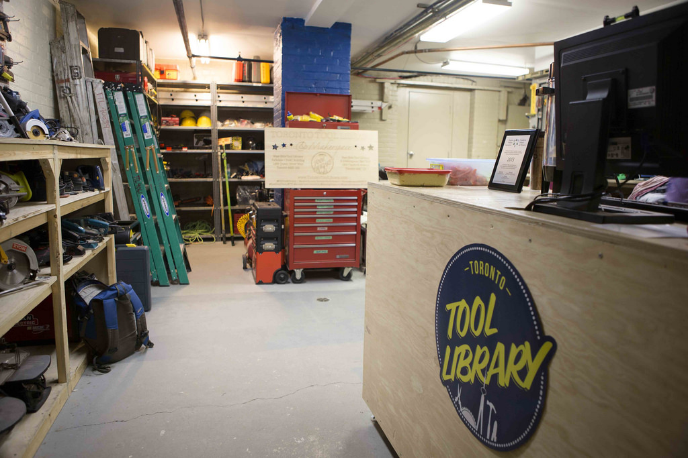
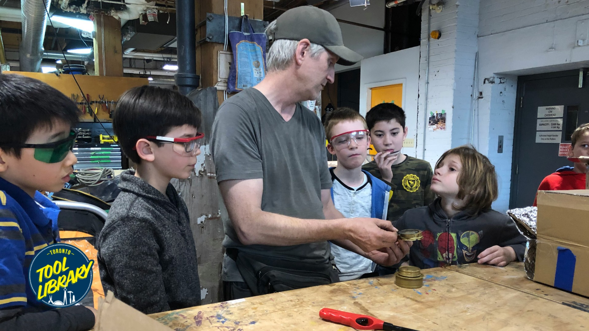
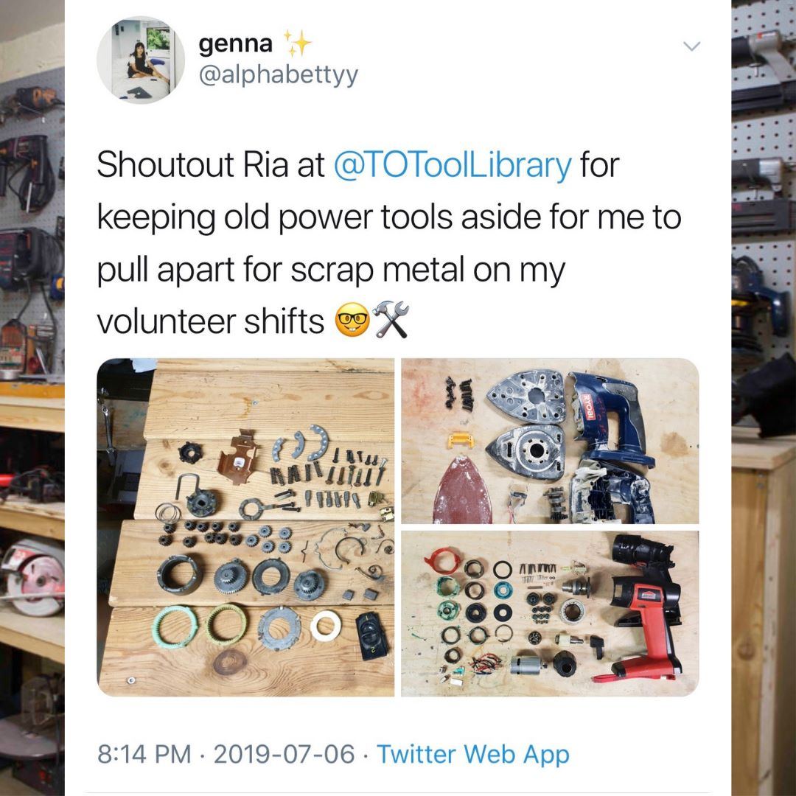

Перевод основных текстов сайта [torontotoollibrary.com](http://torontotoollibrary.com/).

## О проекте

> Библиотека инструментов Торонто начиналась так же, как и все остальное - группой друзей в подвале!

Два друга, Райан Даймент и Лоуренс Альварес, были активно вовлечены в экологический и экономический активизм, но хотели сделать что-то большее. В поиске идеи, которая будет создавать локальные изменения в сообществах, они обнаружили один из проектов совместного потребления — совместное использование инструмента. Первая библиотека инструментов появилась **в 1979 году в Беркли**, штат Калифорния, и с тех пор более 40 библиотек инструментов было запущено по всей Северной Америке. Хотя идея и не оригинальна, в городе Торонто никогда не было своей библиотеки инструментов, что открывает возможности локальных изменений. В самом начале работы, в 2012 году основатели получили свой первый грант от Центра социальных инноваций и начали некоммерческое предприятие под названием **Институт ресурсно-ориентированной экономики (IRBE).** Миссия IRBE состоит в запуске проектов, которые бросают вызов нынешней экономической модели с инициативами по совместному использованию ресурсов и связанному ним образованием, делая акцент на расширение прав и возможностей местных сообществ.

Вскоре после запуска некоммерческой организации они нашли в Паркдейл свое первое местоположение для размещения всех инструментов, которыми они хотели бы поделиться. **Паркдейлский центр активного отдыха (PARC)**, расположенный по адресу 1499 Queen Street West, стал партнером, предоставив место в своём подвале. С ремонтниками и большим количеством добровольцев, они превратили подвал в очаг активности общественного обмена инструментами. Но, прежде чем они открыли двери **в марте 2012 года**, местная газета опубликовала статью о Библиотеке инструментов Торонто и новости вирусно распространились через CBC News, Toronto Star, Torontoist, Reddit и многие другие СМИ. Вскоре после этого полились **пожертвования инструментов** с целью помочь набрать инвентарь, а новые участники записывались **каждый день**.

Успех первой библиотеки инструментов привел их к быстрому расширению. Они нашли второе местоположение в Данфорте (1803 Дэнфорт Восток) **в подвальном помещении 1900 кв. футов**. Больше, чем библиотека инструментов, это пространство является также первым **мэйкерспейсом** в этом районе с **мастерской по деревообработке, лазерным резаком, 3D-принтерами** и множеством **воркшопов**, а также общественных мероприятий. Пользуясь возможностью, команда запустила **краудфандинговую кампанию** на платформе **Центра катализации социальных инноваций** для привлечения средств на аренду и ремонт помещения. Поддержка превзошла все ожидания, достигнув максимальной цели в **$16 000** с наибольшим числом сторонников на среди всех проектов на платформе. Затем, **в октябре 2013 года** они открыли свои двери снова - на этот раз в новом мэйкерспейсе в восточной части города.

С тех пор наша команда расширилась **до семи сотрудников и семи членов совета директоров**, при участии десятков добровольцев, которые помогают в работе Библиотеки инструментов. Мы получили гранты от **Ontario Trillium Foundation** и **Ontario Catapult Microloan**, а также получили награду **Live Green Toronto** как **"Наиболее зелёная группа" в 2014 году**. Корпоративные партнёры поддержали нашу работу пожертвованиями инструментов, в том числе Canadian Tire, Home Depot, MEC и многие другие.

На сегодняшний день у нас есть **более 2200 пользователей**, и мы одолжили **более 25 000 инструментов** для наших сообществ. После шумихи вокруг Библиотеки инструментов Торонто, по всему миру возникло много проектов совместного использования инструмента (в том числе в Калгари, Галифаксе, Бельгии и много где ещё). Что касается нас, то мы стремимся расширить библиотеку инструментов в кондоминиумы и кооперативные здания в городе, для совместного использования ресурсов в большем количестве районов. Мы также помогли вырастить другие проекты по совместному использованию ресурсов, включая [Библиотеку кухонной утвари](http://thekitchenlibrary.ca/) и [Библиотеку семян](http://www.torontoseedlibrary.org/).

## Правила и политика выдачи инструмента в пользование

1. Использование библиотеки возможно для лиц в возрасте **от 18 лет и старше**. Посетителю должно быть 18 лет или более для того, чтобы стать пользователем Библиотеки инструментов Торонто (Toronto Tool Library – **TTL**).
2. **Только пользователи** библиотеки имеют право использовать инструменты TTL. Пользователи не должны разрешать использование инструментов TTL сторонними лицами. Если повреждение какого-либо инструмента происходит в результате использования кем-то, не являющимся пользователем, пользователь, который выписал инструмент, будет нести ответственность за расходы на ремонт или замену.
3. Для заимствования инструментов с кумулятивной стоимостью **более $200**, любой пользователь должен предоставить действительный **номер кредитной карты** или внести **возвращаемый депозит** в размере стоимости инструмента. Если инструмент(ы) не возвращены или получили повреждения, то TTL будет взимать полную сумму для ремонта или замены этих инструментов с указанной кредитной карты. Пользователь соглашается своевременно обновлять информацию о кредитной карте в случае, если она изменяется.
4. Инструменты могут быть заимствованы на **срок 4-5 дней** в зависимости от режима работы местной библиотеки. Все заимствованные инструменты, должны быть возвращены в TTL не позднее крайнего срока. Инструменты могут быть возвращены только в часы работы TTL и в тех же местах, в которых они были заимствованы.
5. Если инструмент возвращается с опозданием, пользователь будет нести ответственность за задержку в размере **$2 за инструмент в день** для большинства электроинструментов и **$1 за инструмент в день** для ручных инструментов. За задержку **особо ценных** инструментов взимается **$5 в день**. Сотрудник TTL укажет такие инструменты при оформлении заказа. Продлить инструмент нельзя. Штраф за просроченный инструмент ограничен **полной восстановительной стоимостью** инструмента плюс **$5 административный сбор** за каждый инструмент. Штрафы за задержку оборудования могут меняться.
6. TTL может заменить сильно просроченные инструменты **(30 дней)**, возлагая на пользователя выплату полной восстановительной стоимости плюс **$5 административный сбор**. Штрафы должны быть оплачены в полном объеме для возобновления заимствования инструментов.
7. TTL оставляет за собой право прибегнуть к соответствующим **мерам для получения просроченных инструментов или неоплаченных штрафов и сборов**, в том числе в форме обращения в агентства по сбору платежей или иных юридических действий, возлагая эти издержки на провинившегося пользователя. TTL также оставляет за собой **право прощать** сборы в силу особых обстоятельств.
8. Пользователь соглашается с тем, что TTL **не несет ответственности за дефекты** заемных инструментов, связанные с их производством, материалами или качеством изготовления.
9. Сотрудники TTL доступны для оказания **помощи в разъяснении принципов работы** инструментов. Однако, принимая во владение любой инструмент, пользователь удостоверяет, что он или она может использовать его **безопасно и надлежащим образом**.
10. Пользователь соглашается с тем, что если какой-либо заимствованный инструмент становится небезопасным или оказывается в неисправном состоянии, он или она должны немедленно **прекратить использование** инструмента и **уведомить TTL** об этом случае при его возврате, если не раньше.
11. Все инструменты должны быть возвращены в том же состоянии, как они были выданы, за исключением естественного износа. Все инструменты должны быть **возвращены в чистоте**. Участник соглашается заплатить за потерю или повреждение любого элемента и соглашается с тем, чтобы принять оценку TTL по состоянию предметов и оценку справедливой реституции за ущерб, неопрятность, задержку и/или частичную или полную потерю предметов. Эта сумма может равняться полной стоимости замены элемента плюс административный сбор в размере **$5**.
12. TTL **не будет резервировать инструменты заранее** или составлять списки ожидания. Инструменты выдаются по принципу **первый пришел, первый обслужен**.
13. TTL оставляет за собой **право отказать в выдаче** любого предмета по своему усмотрению.
14. TTL оставляет за собой **право вносить изменения** в политику инструмента в любой момент.

<youtube-embed link="https://youtu.be/_HmTXw9gDm8" />

