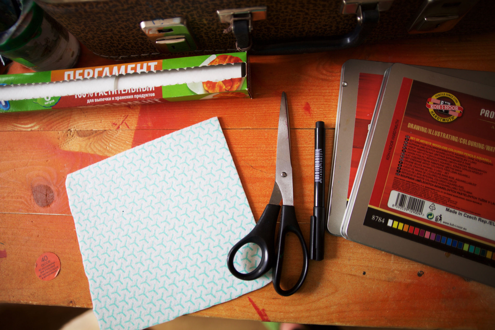
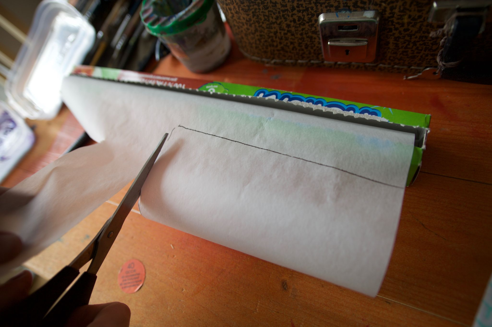
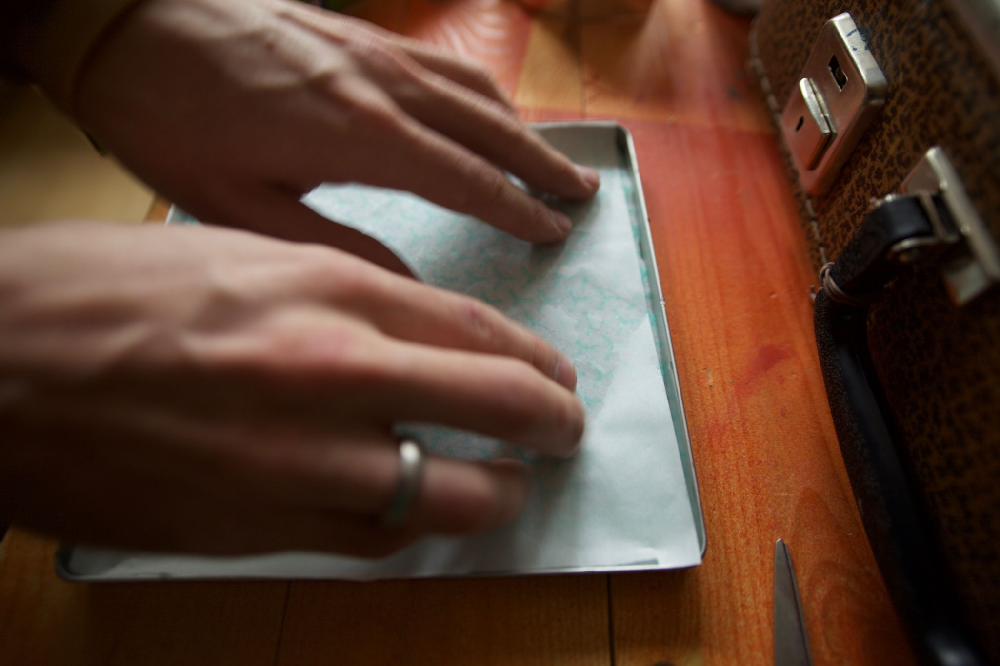

Акриловая краска – универсальный материал для художественного творчества. Плотная, яркая краска, которую можно наносить практически на любую поверхность. Есть у акрила, однако, одна досадная черта: краска быстро сохнет на палитре. Порой это становится проблемой, так как нужно раз за разом заново намешивать цвет, да и приходится торопиться рисовать, пока краска не засохла. Неоднократно сталкиваясь с этой особенностью акрила, мы решили разобраться, существует ли какой-нибудь способ замешивания цвета без таких больших потерь. Поиск в интернете вывел нас на довольно занятную разработку: палитра, сохраняющая краску влажной — запатентованные компанией Masterson [палитры серии Sta-wet](http://www.mastersonart.com/products/premier.htm). Это герметично закрывающийся плоский контейнер, в котором краска замешивается на влажной подложке. За счет этих двух свойств, краска может оставаться в рабочем состоянии дни и даже недели. Главное — не забывать закрывать крышку во время перерывов и по завершении рисования. Такие комплекты продаются в США по цене от 10 до 25 долларов, а в России их, похоже, просто нет.

Мы знаем, что DIY и свободные знания позволяют преодолеть практически любые препятствия, будь то расстояния, высокая стоимость и даже хитрые патенты. Мы продолжили поиски, которые привели нас к [многочисленным видео-урокам](https://www.youtube.com/results?q=stay+wet+palette), объясняющим, как самостоятельно изготовить "stay wet pallette". Действительно, принцип её действия довольно простой и можно повторить его с помощью самых простых и доступных материалов. Что ж, мы решили пробовать.

Для изготовления палитры нам понадобились:

- пластиковый контейнер с герметичной крышкой или любая другая закрывающаяся плоская ёмкость,
- пергаментная бумага (без пропитки),
- тряпка для пола из микроволокна (можно заменить на обычные бумажные полотенца),
- ножницы,
- вода.

Делай раз: вырезаем тряпку под размер дна контейнера. Уложив вырезанную тряпку на дно пластикового контейнера, пропитываем её водой так, чтобы она не выделяла излишней влаги. Однако не стоит её слишком сильно отжимать — именно «живительная» влага тряпки будет постепенно впитываться краской и сохранять все её свойства.

Делай два: из пергаментной бумаги вырезаем кусочек чуть шире, чем дно контейнера. Укладываем бумагу поверх тряпки и прижимаем к дну, давая бумаге пропитаться водой. Если бумага начинает скручиваться и топорщиться, нужно просто перевернуть её и хорошенько расправить на подложке, возможно добавив ещё немного воды.

Готово! Всего несколько простых операций и можно приступать к рисованию. Краска замешивается прямо на слегка влажной пергаментной бумаге. Бумагу можно заменять чистым листом каждый раз, когда на ней не остается свободного места или приходит время сменить палитру, заново смачивая водой влажную подложку на дне контейнера по мере необходимости. Герметичная крышка гарантирует, что акрил не высохнет даже в течение длительных перерывов в использовании. Во время хранения в контейнере устанавливается высокая влажность, не дающая образоваться даже плёнке на поверхности краски, сохраняя её свежей и всегда готовой для дальнейшего творчества. Однако берегитесь образования плесени и при длительном хранении лучше положите палитру в холодильник.

Влажная палитра — бесценная находка, кардинально меняющая процесс рисования любыми водорастворимыми красками. Теперь можно уделить достаточно времени и внимания проработке необходимых оттенков цвета на палитре, не спеша приступать к рисованию и иметь возможность делать любые перерывы в работе без каких-либо потерь. Хотите сохранить какой-нибудь особенный цвет для последующих слоёв? Не успели закончить картину, а нужно надолго отлучиться? Теперь это всё не проблема! С влажной палитрой работа с акриловой краской ещё больше похожа на рисование маслом, что, наверняка, оценят многие не только начинающие, но и опытные художники. Приятного творчества!

