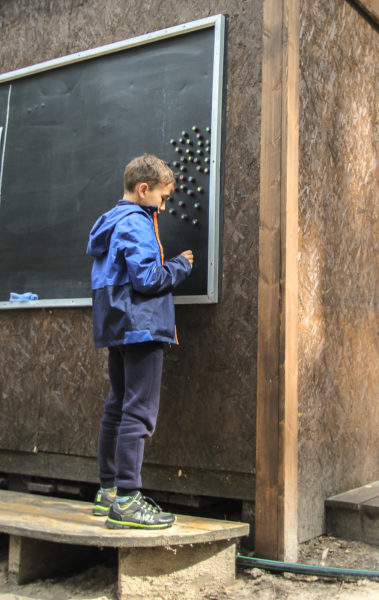

За три года проведения творческих выездов на природу мы столкнулись с множеством нетривиальных задач, решение которых приносит нам тот самый уникальный опыт, ради которого мы и устраиваем эти эксперименты.

Мы придумали новый формат отдыха для людей, интересующихся творчеством. Это недельные смены лагеря, в котором можно изучать новые техники и технологии, получать новые навыки и умения и применять их для творческой самореализации.

ЛОМ — это следующий шаг для человека, который попробовал себя на мастер-классах в городе или на фестивалях и хотел бы продолжать знакомство с различными направлениями творчества.

Мы поставили перед собой амбициозную задачу — собрать в одном месте все ключевые творческие технологии, чтобы участники лагеря могли попробовать себя в самых разных направлениях и осознанно определять приоритеты для дальнейшего изучения. Все пять стихий мы смогли поместить в двух больших крытых пространствах — шумном и пыльном Цехе и тихой чистой Студии.

Структура смены предусматривает:

- вводные мастер-классы для знакомства с техниками и преподавателями на выходных,
- последовательные курсы для погружения в тему в начале недели,
- работу над личными и совместными проектами во второй половине смены
- презентации, ярмарку и аукцион готовых произведений в конце.

Перед нами как организаторами проекта стоит задача ежедневной координации занятий десятков мастеров и умельцев на двух площадках на обширной территории лагеря.

Общий вид расписания лагеря мы прорабатываем за несколько месяцев до его начала. Определяем время подъема и приемов пищи, длительность перерывов и общую структуру дня. В условиях леса это всё ещё и нужно синхронизировать со световым днём и графиком включения электричества от генераторов.

Мастера заранее предоставляют свои учебные программы с описанием всех занятий и необходимых условий для них. С учётом их пожеланий и существующих рамок мы составляем уточненную таблицу расписания.

Каждый стол в каждой мастерской — отдельная колонка, в которую можно поместить то или иное занятие. Разные занятия рассчитаны на разное количество участников. Что правильно распределить всех, необходимо тщательное планирование. При этом нам важно оставить участникам возможность определиться со своими приоритетами непосредственно на месте.

Некоторые направления требуют от участников заранее определиться со своим выбором: мастера закупают материалы и заготовки с учётом личных запросов умельцев. В этом году мы утвердили размеры толстовок и обувных подошв ещё за месяц до начала лагеря. В то время как идеи совместных арт-объектов мы принимали и обсуждали до самого открытия.

Все эти факторы необходимо учитывать не только во время верстки таблицы, но и во время самого выезда, где непредсказуемая погода и вдохновение участников всегда готовы внести изменения даже в самый проработанный график.

Поэтому распечатать заранее в полиграфии итоговую программу всего лагеря — не самое оптимальное решение. Вносить изменения маркером и замазкой не слишком удобно и эстетично. Раньше мы просто печатали сетку расписания на ближайшие дни на цветном принтере и крепили листы А4 на стены. На одном листе удобно помещается весь день, но только мелким шрифтом и с сокращениями. Уже вторым летом мы поняли, что можно сделать иначе.

После завершения смен мы задержались в лагере, чтобы подготовить основу для расписания 2.0. На хозяйственном дворе Сёрфлагеря мы нашли большие железные листы и покрасили их грифельной краской собственного рецепта: в черную алкидную эмаль замешивается 10-30% мелкого цемента. Получились большие меловые магнитные доски. Мы повесили их рядом с инфоцентром и весь следующий сезон они передавали ценную информацию гостям и сотрудникам лагеря.

А у нас было время все хорошенько обдумать зимой, поэкспериментировать с материалами весной и в начале лета собрать все остальные элементы новой системы.

\[su_image_carousel source="media: 7544,7545,7546"\]

### Карточки и маркеры

В качестве носителей информации о занятиях обычная бумага нам не подоходила — доски были размещены на улице, открытые дождю и ветру. А прогноз погоды не обнадеживал.

Мы хотели сделать удобную модульную сетку, с отдельными карточками для каждого занятия. Чтобы эти карточки были многоразовыми и позволяли легко вносить исправления в текст. Для надписей отлично подошли сухостираемые маркеры для досок: доступные, контрастные и не боящиеся дождя.

В качестве носителя мы рассматривали магнитный винил, самоклеющиеся пленки и листовые пластики. А оптимальным решением оказалось сочетание напечатанных на плотной бумаге табличек формата А5 и плотной двухсторонней ламинации. Получилось четко, надежно и доступно.

Администраторам нужно было лишь раз переписать все занятия из онлайн-таблицы на карточки и затем размещать и перемещать их по доске в течение смены. А для крепления занятий к доске мы использовали второй ингредиент.

### Фишки и наклейки

Доски не зря были сделаны из железных листов. Так не нужны ни кнопки и ни скотч — все можно закрепить с помощью магнитов. С ними мы смогли сделать наше расписание по-настоящему интерактивным!

Мы закупили полсотни маленьких круглых ферритовых магнитов. Это такие черные матовые кружки, которые оказалось не только удобно снимать и переставлять по доске, но и легко персонализировать. Для этого мы изготовили большой набор круглых виниловых наклеек того же диаметра — по 10 каждого вида.

Итак, каждый участник лагеря, будь то умелец, мастер или сотрудник лагеря, получал свой набор фишек и наклеек, на которых были изображены самые разные овощи или фрукты. При регистрации каждый мог выбрать тот плод, что покажется ближе.

Одна наклейка была на книжке умельца, две он мог наклеить на свою чашку, палатку или куда угодно ещё. Одна наклейка была запечатана на стене инфоцентра в общей таблице участников. Остальные были наклеены на магниты и помещались на доску расписания.

На доске размечены колонки на три дня. Девочкам в инфоцентре нужно выписать на карточки названия и параметры занятий: место, время начала, длительность, имя мастера и число мест для участников. Затем эти карточки крепятся в соответсвующие столбцы магнитами преподавателей.

\[su_image_carousel source="media: 7538,7540,7539,7541"\]

### Процесс

Умельцы могут в любое удобное время подойти к доске и, изучив доступные возможности, переставить свои фишки из стопки сбоку в слоты выбранных занятий. 6 магнитов хватает, чтобы распределить свои приоритеты на сегодня и день вперед.

Когда один из детей участников лагеря возмутился, что у него так мало магнитов, взрослые с улыбкой заметили, что это не фишек мало, а времени в сутках. Ведь более 3-4 занятий в день сложно назвать отдыхом. А мы не забываем наш девиз — учиться творить, отдыхая!

Перед началом занятия его ведущий подходит к доске и видит список тех, кто собирается к нему прийти. В этот момент он делает фото расписания и карточки отдельного занятия — с этого момента запись считается закрытой, а преподаватель или куратор отправляется готовиться к приёму известного ему количества умельцев.

Вечером все актуальные карточки смещаются на один ряд влево, прошедшие занятия снимаем и стираем. Фишки участников возвращаются в стопки на краю доски.

\[su_image_carousel source="media: 7542,7549,7547,7536"\]

### Анализ

Масштабный эксперимент удался! Участники весело выбирали фишки на регистрации: спорили о названиях фруктов, ягода ли арбуз и какая на вкус репа. Мы записывали их имена и фамилии не в табличку на бумажке, а на большой фанерный щит, висящий на стене инфоцентра — так намного проще знакомиться и запоминать друг друга.

Многие вспоминали, что подобная система использовалась в детском саду для обозначения шкафчиков и кроваток. Игра с магнитными фишками была воспринята легко. По-началу, правда, случались ситуации, когда фишек на карточке занятий оказывалось больше, чем свободных мест и было сложно понять, кто поставил свой магнит раньше. Такие мелкие разногласия решались тем, что участники могли в любой момент сфотографировать расположение фишек на доске и использовать фото как аргумент.

Однако споров особенно не было. Места на самые востребованные и ограниченные по числу участников занятия мы распределили заранее, а на месте каждому участнику предоставлялся широкий выбор альтернатив. Шить одежду или обувь, лепить посуду и скульптуры, паять микросхемы или собирать мебель — глаза разбегаются!

И это важный момент. Мы увидели, что для неподготовленного и неискушенного творческими технологиями человека, такое количество вариантов — трудный выбор, полный компромиссов. Хочется и все попробовать и чему-то научиться по-настоящему. А это сложно совмещать.

Наша идея состояла о том, что в лагере обязательно собирать максимально широкие творческие возможности для того, чтобы их смело сочетать в своих проектах. Но практика показывает, что такие сочетания становятся возможны только со временем и с опытом. Поэтому вполне вероятно, что ЛОМ со временем станет многостадийным процессом погружения, где за специализированными сменами по отдельным ремёслам последует большой творческий слёт с широкими возможностями для тех, кто уже освоил одно или несколько направлений.

И там мы снова будем экспериментровать с интерактивным расписанием и игровой самоорганизацией участников творческого процесса.
