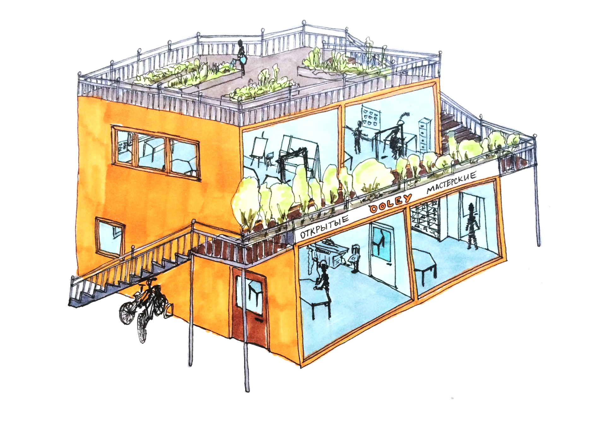

Конечно, большой универсальный творческий центр мог бы собрать множество мастеров в одном месте, но только широкое развитие и объединение самых разнообразных творческих площадок может дать человеку настоящую свободу выбора и действий. Небольшие локальные мастерские, пусть и не универсальные сами по себе, но дополняющие возможности друг друга, могут стать узлами распределенной творческой сети.

Представляем прообраз одного такого небольшого пространства,  чтобы обсудить его наполнение и оформление,  а также способы сделать доступ к его возможностям прозрачным и простым, но в то же время безопасным и предсказуемым.

Два громких и два тихих блока, соединенных лестницами и балконами. Декоративное и функциональное озеленение. Возможно даже собрать такое здание из стандартных морских контейнеров.

Это обобщенный и упрощенный пример того, как можно реализовать идеи OOLEY в виде небольшого модульного здания. В "громких" залах можно установить станки и другое оборудование для работы с деревом, металлом. Пиление, сверление, шлифование и фрезеровка — шумные и пыльные процессы и здесь нужно работать в защитных очках, респираторе и, возможно, наушниках. Тихие комнаты подойдут для проектирования, рисования, склеивания, лепки, шитья, вязания и прочих занятий, требующих тишины и продолжительной концентрации. Стеклянные фасады несут идею открытости мастерской и прозрачности доступа к оборудованию. Зеленые насаждения и, возможно, небольшие козырьки, смогут дать достаточную защиту от излишнего солнечного излучения и связанных с ним проблем. Отдельные входы в различные блоки дают возможность не создавать больших скоплений людей и оставить ощущение причастности и личной ответственности каждому участнику.

Эта модель — всего лишь прообраз и нужно еще многое продумать и учесть для того, чтобы образ открытой мастерской стал понятным и реализуемым в полной мере. Здесь еще не хватает места для общения и проведения открытых уроков и лекций. Душ и раздевалка, возможно, где-то здесь поместятся, но вот места для хранения запаса материалов явно не хватает. В любом случае такая небольшая мастерская сможет удовлетворить запросам лишь одного квартала, да и то не полностью. Но ведь это только начало!

Представьте себе взаимосвязанную сеть таких небольших открытых мастерских, объединенных системами обмена творческой информацией, а также инструментами, материалами и творческими результатами. В такой среде у каждого появится **возможность проявить себя в качестве свободного мастера, свободно включающегося в различные проекты и выражающего себя через творчество и обучение других**.

Это особенно важно в условиях экономического и культурного кризиса, когда многие люди теряют спокойствие и уверенность в себе. Только осознание широты своих способностей и наличие соответствующих возможностей могут принести людям уверенность в своих силах и достаточную свободу распоряжения ими. Для такого осознания каждому важно попробовать себя во множестве различных видов созидательной деятельности и обнаружить не только то, что у каждого человека есть талант, но что их у каждого целый букет! И он может ими пользоваться и делиться как пожелает. А для того, чтобы эту свободу реализовать,  нужен прозрачный доступ к инструментам и материалам.

**Мастера делают открытые мастерские.** **Открытые мастерские делают мастеров свободными.**

> Коллеги. OOLEY — открытая площадка для дискуссии, обсуждения и коллективного творчества. Здесь можно делиться соображениями и идеями, координировать усилия и совместно развивать открытые мастерские, а также выражать себя как свободного мастера. Комментируйте, рассказывайте, замечайте, размышляйте, делитесь,  предлагайте и сообщайте. А если вам нечего добавить, то хотя бы расскажите об OOLEY знакомым архитекторам, дизайнерам, художникам, а также тем, кто не знает, чем себя занять. Наверняка среди них найдутся люди, заинтересованные в этом открытом творческом проекте.
