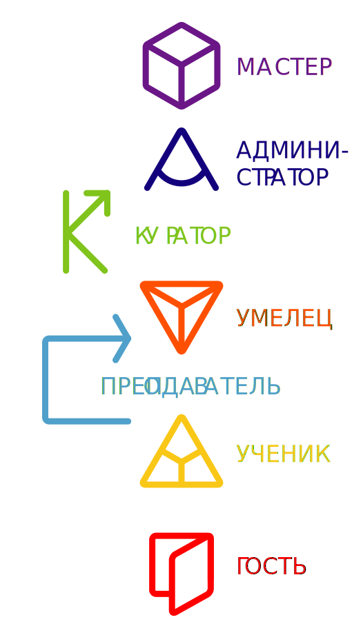

### Открытая мастерская — процесс совместного творчества, в который в подходящей роли может включиться каждый.

Роль участника открытой мастерской определяется его компетенциями и вкладом в поддержание и развитие пространства. Это чем-то похоже на игру или даже спектакль, на время которого каждый буквально примеряет на себя то или иное амплуа, надевая соответствующий именной бейдж.

Именно взаимодействие людей в различных качествах способствует прозрачности и эффективности работы пространства. В различных сессиях человек может принимать участие  в разных ролях.
