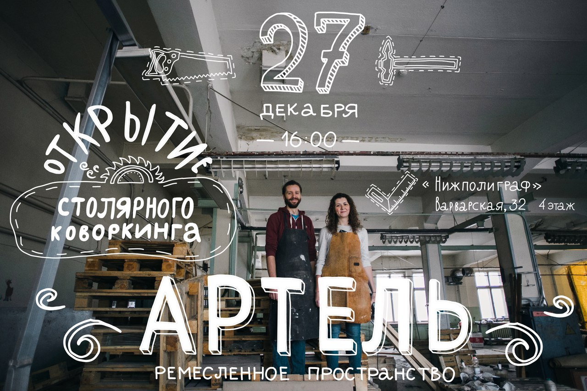
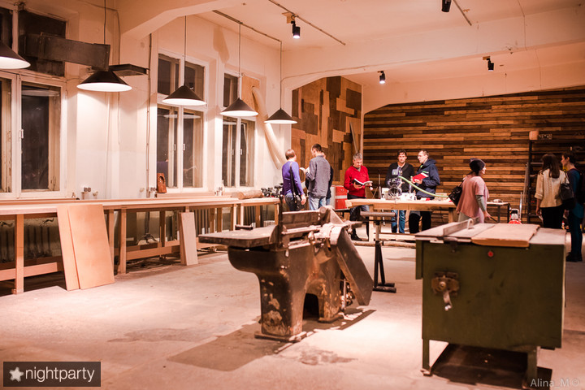
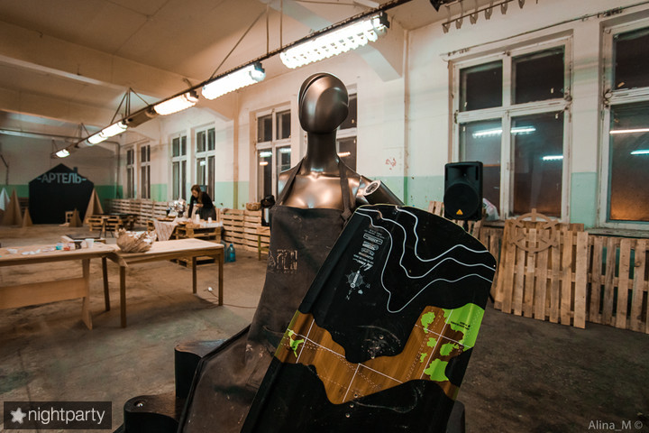
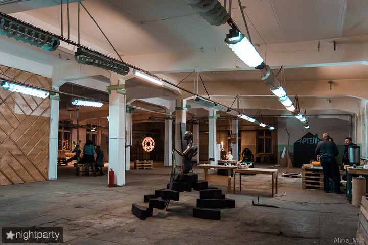
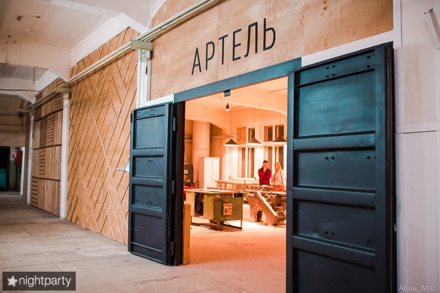

## Первый нижегородский ремесленный коворкинг в центре города.

### Столярная мастерская, увлеченные люди и удивительная творческая лофтовая атмосфера уже ждут мастеров!

#### Инструменты и оборудование

Фуговальный станок (ширина фугования 400 мм) Циркулярный станок Пресс для склейки мебельных щитов (максимальный размер 3х0,8 метра) Распиловочный стол 2,2х2 метра Погружная пила Festool с направляющими 1,4 и 3 метра Заточный станок Фрезерный стол Фрезер Makita Торцовочная пила Metabo Мультитул Bosch Шуруповерты Шлифмашинки Вакуумный насос с мешком для прессования

**Покрасочная камера** Компрессор Fubag 200 литров с набором распылителей и краскопультом Компрессор Fubag 25 литров Пневматический степлер

а также разнообразный ручной инструмент.

Также в мастерской работают резиденты со станками: - фрезерные станки с ЧПУ - лазерный станок с ЧПУ

#### Стоимость абонементов

Чтобы получить возможность работать в Столярной мастерской (общей площадью почти 200 кв метров) и пользоваться её инструментом необходимо приобрести абонемент:

- АБОНЕМЕНТ 1 ЧАС - 300 рублей/чел. - АБОНЕМЕНТ 1 ДЕНЬ - 1000 рублей/чел. (включает работу с 10:00 до 22:00 в течение 1 календарного дня) - АБОНЕМЕНТ 1 МЕСЯЦ - 6000 рублей/чел. (именной абонемент без права передачи, включает работу в мастерской без закрепления рабочего места в течение 1 месяца подряд)

АБОНЕМЕНТЫ час/день/месяц могут использоваться только 1 человеком. Предоставляется возможность работать в мастерской и пользоваться инструментом с 10:00 до 22:00.

- АБОНЕМЕНТ 10 ЧАСОВ - 2000 рублей (200 руб/час) - АБОНЕМЕНТ 20 ЧАСОВ - 3000 рублей (150 руб/час) - АБОНЕМЕНТ 30 ЧАСОВ - 4000 рублей (~134 руб/час)

АБОНЕМЕНТЫ 10/20/30 могут использоваться сразу несколькими людьми. Предоставляется возможность работать в мастерской и пользоваться инструментом с 10:00 до 22:00. Срок действия - 3 месяца с момента активации.

ДОПОЛНИТЕЛЬНЫЕ ОПЦИИ: - аренда шкафа для хранения личных вещей/инструментов - 1000 рублей в месяц

[Статья на РБК](https://www.rbc.ru/nn/22/02/2017/58ad3bf29a7947320a29f241)
