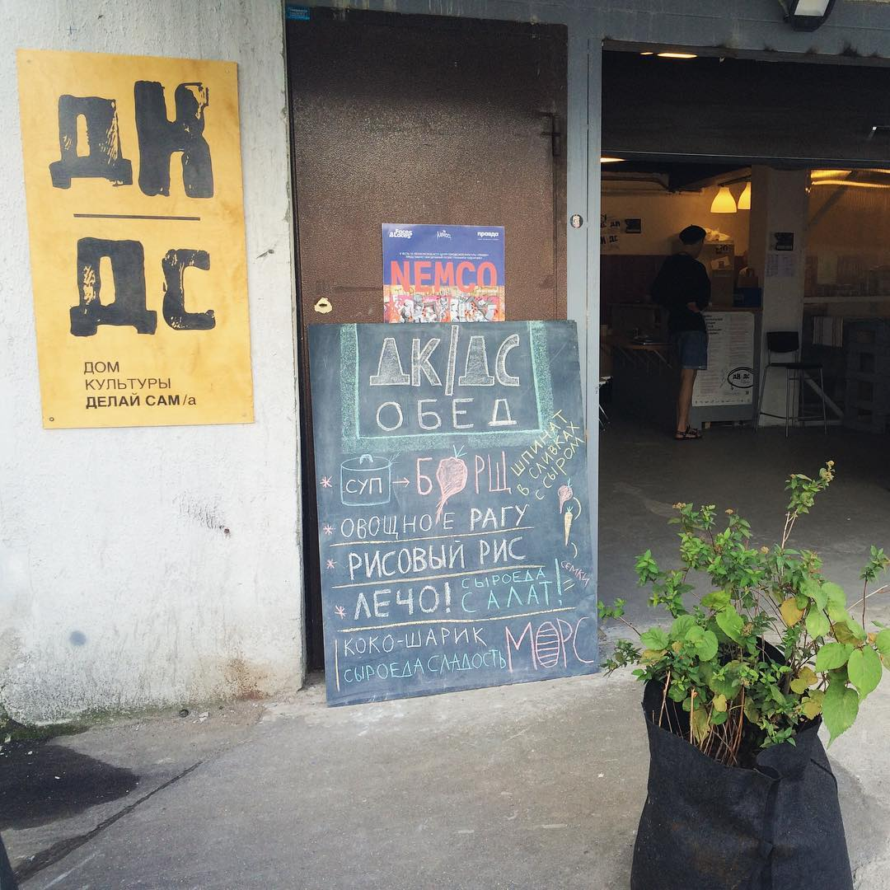
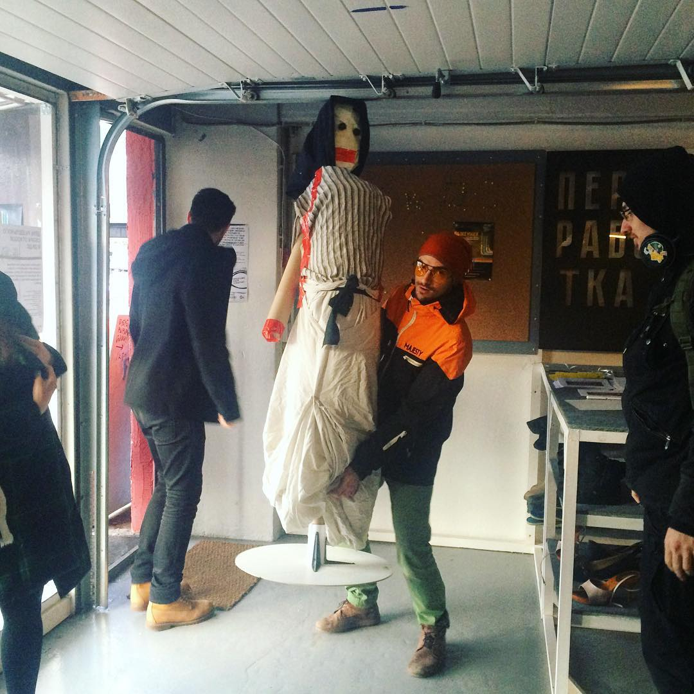

**ДК|ДС** — это независимое междисциплинарное пространство для всех альтернатив существующей городской культуре. ДК призван стать базой для активистов, художников, исследователей, дизайнеров, архитекторов, музыкантов, документалистов, театральных режиссеров, экспертов-практиков в разных профессиональных областях, экологов, представителей различных сообществ, движений и проектов — всех тех, кто своими действиями исследует, развивает, меняет, улучшает жизнь в городе.

### Дом Культуры «Делай Сам/а» - это 150 кв. м. пространства для ваших инициатив

#### Лекционное пространство

Вместительностью до 60 человек

#### Мастерская

Изолированная комната для переговоров или групповой работы для 8 человек

#### Переработка-центр

Шоу-рум DIY-вещей из вторичного сырья

**Wi-Fi, кухня, звуковое и проекционное оборудование**

Вы можете провести у нас событие любого формата: воркшоп, вечеринку, концерт, лекцию, кинопоказ и так далее.

