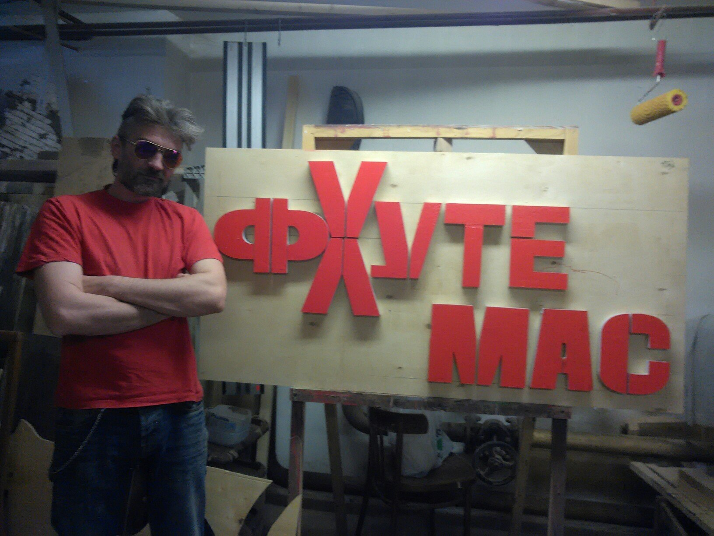
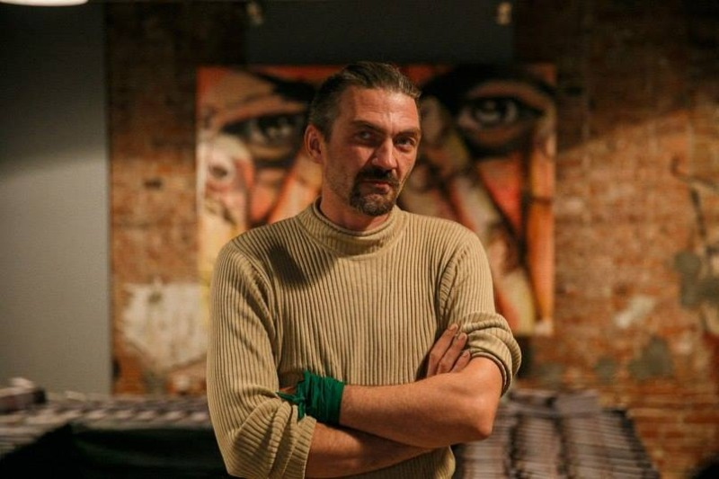

ФХУТЕМАС (Фроловские Художественно-Технические Мастерские) – это свободные художественные мастерские под руководством известного самарского художника [Фрола Весёлого](https://ru.wikipedia.org/wiki/%D0%A4%D1%80%D0%BE%D0%BB_%D0%92%D0%B5%D1%81%D1%91%D0%BB%D1%8B%D0%B9). ФХУТЕМАС является открытым пространством, как для проведения мастер-классов известных художников, так и для самостоятельной работы начинающих художников (и вообще любых желающих). Здесь Вы можете воплотить в реальность свои творческие идеи. Ведь у нас есть для этого все: место, инструменты и профессионалы, которые дадут дельный совет или научат Вас с нуля. Чему они Вас научат? Разному и многому! Например, некоторым видам ручного, электро - и ЧПУ-инструмента, созданию фантастической красоты скульптур и прочему.

Здесь можно заказать работу или сделать ее самостоятельно — коллектив мастерской поможет с выполнением и советами. Кроме того, по четвергам и пятницам планируется проведение мастер-классов.

Во «Фхутемас» есть столярная мастерская, инвентарь для варки и резки металла, изготовления макетов из пенопласта. Здесь даже можно создавать и программировать бытовых роботов на основе ARDUINO. Из дополнительных возможностей — высокая печать и 3D-макетирование. Кроме того, есть условия для ювелирного дела и работ в технике горячей и холодной эмали.

Да. В ФХУТЕМАСе есть небольшая мзда - **100 рублей в час**. Можно также купить месячный абонемент за **3000 рублей** и рукодельничать весь месяц до потери сознания!

### ФХУТЕМАС — это Фроловские ХУдожественно-ТЕхнические МАСтерские. По крайней мере, Самкульт предлагает назвать их так!

Известный самарский художник Фрол Веселый объявил о создании открытых мастерских для художников и не только. О том, что это будет, он рассказал в меморандуме на своей странице в Фейсбуке и так же ответил на несколько вопросов Самкульта, который счел проект очень важным и будет следить за его развитием.

### Проект «Открытые мастерские»

Цель проекта «открытые мастерские» состоит в том, чтобы облегчить задачу для художников, дизайнеров, архитекторов и просто людей интересующихся прикладным творчеством. Объединить станочный парк многих художников и научить тех людей которые заинтересованны в каких то навыках. Вывести художественные практики на новый технологический уровень.
Наша команда на данный момент состоит из: художника, скульптора, инженера-конструктора, программиста-робототехника, ювелира, столяра.
«Открытые мастерские» — это проект, объединяющий различных ремесленников, в основном мастеров столярного, слесарного, художественного дела и любых других творческих направлений. В каждой мастерской есть отдельный специалист, свободно разбирающийся в своем ремесле. Так что, любой гость или свободный художник, пришедший в мастерскую, может попросить помощи у любого мастера, руководящего мастерской.
Наша основная задача заключается в том, чтобы создать студию, как для самостоятельной работы художников, так и для проведения мастер-классов. Где под руководством опытных профессионалов свободные художники и любые желающие смогут научиться воплощать свои идеи в реальность. Также, большим преимуществом нашего проекта, является возможность арендовать в мастерской необходимые инструменты для работы.
Наряду с вышеперечисленным, мы планируем проводить обучение всех желающих работе с некоторыми видами ручного, электро — и чпу-инструмента. Другим выгодным аспектом «Открытых мастерских» является возможность стать прекрасной площадкой для проведения занятий с участием приглашенных мастеров и художников.
Таким образом «Открытые мастерские» смогут объединить в своем пространстве всех желающих научиться ручному труду, как взрослых, так и детей. Наш проект — это общественный эксперимент, открывающий новые возможности экономической, производственной и межличностной организации труда. А также, просто хороший шанс провести свободное время не только интересно, но и с пользой.
Не секрет, что в последнее время этот вид досуга набирает свои обороты. В основном, конечно, в крупных городах, таких как Москва или Санкт-Петербург практика «Открытых мастерских» давно известна и успешно реализуется. Однако в Самаре отсутствует хоть сколько-нибудь удобная площадка для проведения подобных мероприятий. И это является большой проблемой.
В связи с этим, нам необходимо помещение, в котором мы сможем разместить три мастерских для основных видов деятельности художников: столярную, художественную и слесарную. Также, нам будут необходимы: комната для бытовых нужд (раздевалка) и помещение для проведения мастер-классов с приглашенными мастерами.

Что мы можем предложить на первом этапе:

- столярная мастерская с полным набором инструмента.
- сварка и резка металла.
- макетирование пенопласта.
- создание и программирование бытовых роботов на основе ARDUINO
- работа на станках ЧПУ (фрейзер и пенорез), в ближайшее время планируется 3d принтер, плазморез, лазерный резак.
- 3D макетирование и создание программы для ЧПУ станка.
- офорт, «высокая печать».
- работа в ювелирной технике, горячая и холодная эмаль, ware wrap, гальванопластика, травление черных и цветных металлов..
- макетирование из пластилина, и создание объекта из стеклоткани.

### Самкульт: Зачем тебе это?

Фрол: Мне это, во-первых, затем, что интересно работать руками и изучать разные сферы в этом. Во-вторых, когда я вижу что большинство молодых художников губит свои проекты из-за того, что не умеет работать руками, мне хочется бить им по башке. Общую технологическую отсталость в художественном плане можно устранить, дав им в руки инструмент и поставив рядом инструктора. И это будет дешевле, чем заказывать в каких-то диких конторах. Я сам сталкивался с тем, что не все можно заказать в одном месте. Или заказать можно, но дико дорого. И тем более, зная архитекторов и дизайнеров, мне хочется чтобы они могли воплотить свои идеи на практике.

Так же и с художниками. Второе, у нас нет интереса заработать на этом, это скорее социальный проект чем комерческий. Это некий клуб юных техников для взрослых. Чтобы творческое начало в людях не пропадало. Ну, и тем более, скажем там можно будет придти и поучастврвать в пректе уже состоявшихся художников. Потому, что утверждение Саморукова о том, что «художник — это человек, который просто тусует по кафе, но в правильной компании» неверно на мой взгляд, и я когда это услышал, то лицо себе в кровь разбил от фейспалма.

### СК: Сколько денег надо на проект?

Ф: Насчет денег. Я вношу что то порядка 250-300 тысяч, в виде инструмента, станков и прочего. Еще два человека тысяч по 100, так же в виде инструмента, станков и прочего. Ну, и думаем собрать что-то около 300 через бумстартер.

Да! Этот проект, не рассчитан исключительно на художников и дизайнеров. Туда может придти любой и работать инструментом. Так что это, еще и своеобразный клуб для всякого рода рукожопов.