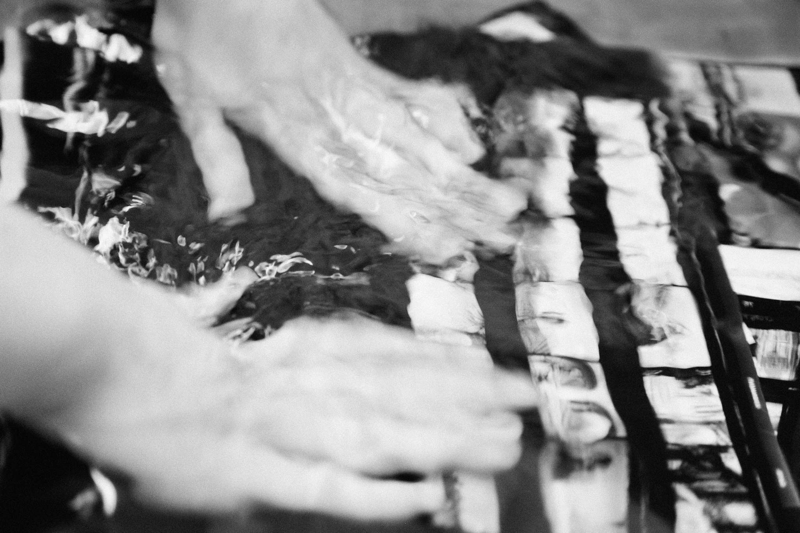

Институт создан на базе культурного проекта РУСС ПРЕСС ФОТО. Наши преподаватели - признанные мастера в области фотографии, ведущие отечественные фотожурналисты. Мы понимаем, что снимать и учить - это разные вещи. Поэтому все наши фотографы не только работают в крупнейших мировых СМИ, но и имеют значительный стаж преподавания.

К вашим услугам еженедельные лекции, мастер-классы, интенсивы, краткосрочные и длительные программы по фотографии.

Штаб-квартира культурного проекта "РУСС ПРЕСС ФОТО" — это большой светлый зал для проведения выставок и различных мастер-классов, огромная библиотека книг, посвященных фотографии и оснащенная высококачественным оборудованием и всеми необходимыми материалами фотолаборатория.

### Фотолаборатория

Впервые в Москве открыт свободный доступ к классической пленочной фотолаборатории. Профессиональное оборудование, фотоматериалы и консультации мастеров становятся залогом успешного освоения технологии пленочной фотографии. Воспользоваться фотолабораторией могут как любители, так и профессионалы. К вашим услугам проявка пленки, фотопечать и любая дополнительная обработка фотоматериалов самостоятельно или с помощью наших мастеров в удобное для вас время.

#### Оборудование

- Фотоувеличитель Agfa, формат негатива 24х36 мм – 6х9 см.
- Фотоувеличитель Fokomat Leitz, формат негатива24х36 мм / 6х6 см.
- Фотоувеличитель Крокус, формат негатива 24х36 мм – 6х9 см.
- Фотоувеличитель Крокус, формат негатива 24х36 мм – 6х6 см.
- Кюветы в ассортименте до 50х60.
- Фотохимия в ассортименте.
- Фотобумага в ассортименте.
- Ч/б проявка фотопленки в бачках 35мм / 120 мм.
- Ч/б фотопечать форматы от 10х15 см до 50х60 см.
- Профессиональный сушильный шкаф на 12 фотопленок (Германия), сушка 15 мин.
- Сушка фотоотпечатков на эл.глянцевателях форматом до 18х24.
- Сушка фотоотпечатков форматом до 50х60 на стекле (выставочное качество).
