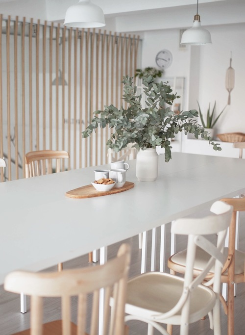

## Место человека и его дела

### СТУДИЯ ДЛЯ МАСТЕР-КЛАССОВ, КУРСОВ, ФОТО И ВИДЕО СЪЕМОК

#### Давайте знакомиться

Мы Аня и Даша. А это наше место - студия с тремя залами для мастер-классов, курсов, тренингов, фото и видеосъемок. В нашей команде два чудесных администратора - Саша и Ксюша. Они внимательные, обаятельные и энергичные. Это место мы создали для себя и для людей-единомышленников, у которых уже есть свое дело. Мы хотим, чтобы вы тоже почувствовали его своим. Чтобы могли растить здесь свой проект. Проводить предметные съемки своего продукта, снимать видео-истории, организовывать встречи, завтраки, презентации, воркшопы для своих гостей. Мы создавали его так, чтобы вы и ваши гости были в восторге от атмосферы, уюта и чистоты.

## В НАШЕЙ СТУДИИ 3 ЗАЛА

### ДУБОВЫЙ ЗАЛ

10 ЧЕЛОВЕК | 50 кв м
Хороший дневной свет, большие окна, фотозона с лавочкой и журнальным столиком. Вместимость 10 участников + 2 организатора. Подходит для мастер-классов, фото и видеосъемок без записи звука

	
### БЕЛЫЙ ЗАЛ

10 ЧЕЛОВЕК | 30 кв м
Расположен на втором ярусе студии. Вместимость 10 участников + 2 организатора. Удален от окна, поэтому для съемок не рекомендуем. Подходит для мастер-классов, тренингов, консультаций, рабочих встреч

### ДЕРЕВЯННЫЙ ЗАЛ

8 ЧЕЛОВЕК | 20 кв м
Хороший дневной свет, большие окна, изолирован. Вместимость 8 участников + 2 организатора. Подходит для предметных и портретных съемок, видеосъемок с записью звука, мастер-классов, курсов, занятий, требующих изоляции, с использованием шумных приборов или пахучих материалов

### ЧТО У НАС ПРОВОДЯТ

Мы принимаем только рабочие, творческие, спокойные форматы для взрослых гостей. Вечеринки и детские мероприятия у нас не проходят. Поддерживаем атмосферу в студии, чтобы всем нашим гостям было приятно и комфортно работать.

### Красота и порядок.

##### В жизни как на фото

Мы каждый день следим за чистотой и порядком. Стараемся поддерживать залы в идеальном состоянии. Для этого у нас есть чек-листы, по которым мы делаем уборку и ставим каждую кружку, книгу, свечу четко на свое место. В жизни все выглядит также как на фото, иногда немного меняем детали. Каждый месяц мы улучшаем интерьер. Добавляем деталей для красоты и удобства. Вы можете приехать на просмотр, чтобы увидеть всё своими глазами. Большинство наших гостей становятся постоянными и больше не ищут другие площадки, потому что у нас действительно все красиво, чисто, в команде приятные девочки, и мы четко работаем.

##### ВСЕ ДЛЯ КРАСИВОГО КОФЕ-БРЕЙКА

В каждом зале есть зона для кофе-брейка со всей необходимой посудой: стаканы для чая/кофе, тарелки, чаши для угощений, кулер с гор/хол водой. Для каждого мероприятия мы бесплатно предоставляем мини-набор для кофе-брейка: чай, сахар, палочки для размешивания, салфетки. В продаже есть хороший кофе, который вы можете заказать на группу или ваши гости могут приобрести его сами, по желанию. Вам остается только привезти угощения.
