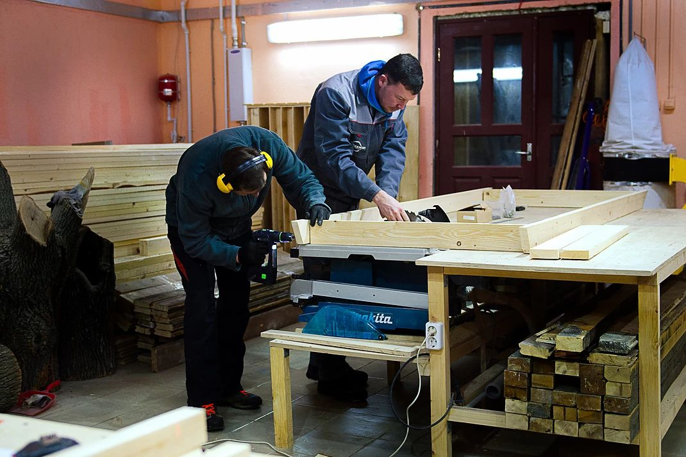

### Первый в Хабаровске ремесленный коворкинг

Мастерская открылась в январе 2016 года силами её основателя и руководителя Ивана Смирнова.

Просторное помещение и наличие достаточного количества рабочих поверхностей позволяет работать с заготовками больших размеров.

Работа в коворкинге возможна по дневному (от 1 часа), 2-х недельному (от 10 до 30 часов) и месячному абонементу. Месячный абонемент мастера позволяет хранить свои материалы и заготовки на время его действия, а также предусмотрен ночной абонемент для тех, кто любит творить в тишине.

В мастерской представлен широкий ассортимент деревообрабатывающего оборудования, в том числе:

- токарный станок
- распиловочный станок
- большой реймусовый станок «Металлург»
- торцовочная пила
- рейсмус JET
- сверлильный станок
- и множество ручного электроинструмента и столярных приспособлений

На регулярной основе проводится курс «Основы столярного дела», планируются также курсы по работе с ручным фрезером, резьбе по дереву и более глубокое погружение в классическую столярку. Также можно приобрести сертификаты на  разовые мастер-классы, например, по изготовлению подставки для смартфона, торцевой разделочной доски или деревянной посуды.

Мастерская принимает заказы на изготовление изделий не только из дерева, но и из бетона, которые изготавливаются по технологии вибролитья.

В собственном магазине мастерская продаёт готовые торцевые разделочные доски, садовую утварь и различные виды бетонной плитки.

