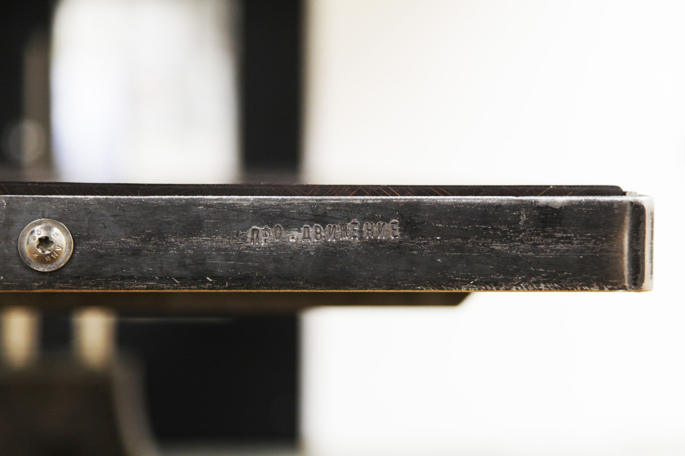
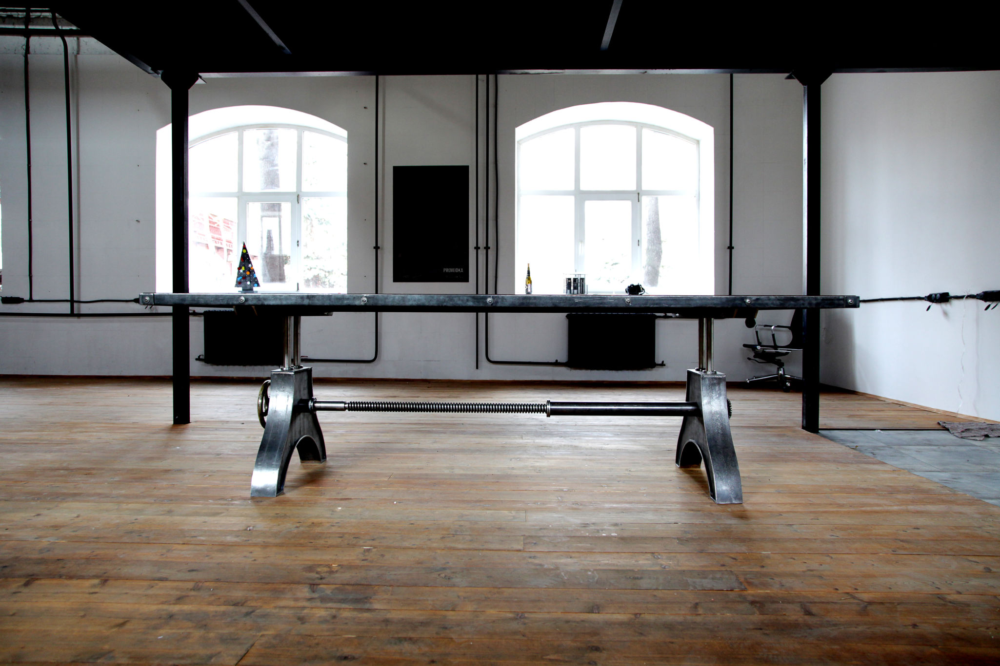
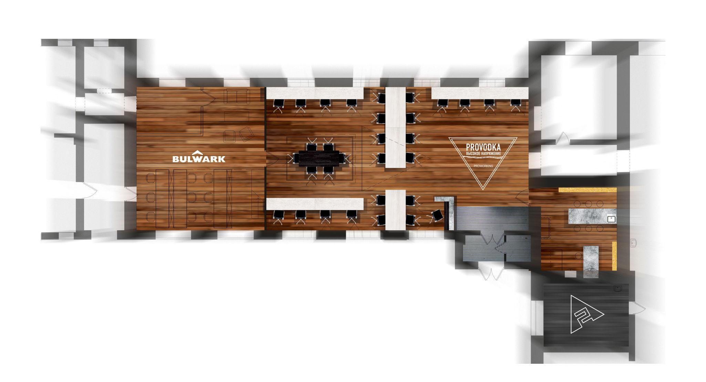

Первый проворкинг PROVODKA в Москве открылся 29 октября в строении №4 **московского завода «Кристалл»**. Инициатором создания проворкинга выступила команда **проекта Про.Движение>**, под руководством Петра Виноградова, известная своими архитектурными фестивалями в городах России и СНГ, Про.Ёлкой в городе Выкса и [мастерскими проекта Про.Движение, которые размещены в том же здании](/workshop/catalog/pro-dvizhenie/).

**Проворкинг** _[professional, productive working]_ PROVODKA – это максимально удобное пространство для талантливых и профессиональных людей желающих с нуля реализовать собственные художественные проекты.

Сейчас PROVODKA начинает свою работу как **общественный офис на 24 рабочих места**. Резиденты могут пользоваться **кухней**, **принт-центром** с возможностью печати до А0, **экраном и проектором** для презентации своих проектов, **переговорной зоной** с красивым столом ручной работы на 10-12 мест, **услугами** там же расположенных конструкторского бюро Bulwark, архитектурной мастерской «Проектная группа А2» и нескольких **дерево- и металлообрабатывающих художественных мастерских**.

> _«Здесь пространство людей, которые делают честные вещи. Наша концепция – зарабатывать не на людях, а вместе с ними, не на пространстве, а с помощью пространства.» Петр Виноградов_

В планах организаторов площадки запуск образовательных программ **по проектированию**, художественной **металлообработке**, истории русского искусства и созданию **кинетических скульптур**.

